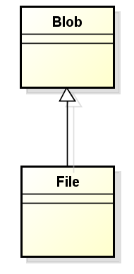

Sometimes, we want to download files from server, but when search about downloading file in Angular. There are so much chaos information that make me refused. So, after spending two days to find out about it, I must write something about this topic.

Let's get started.

<br>

## Table of contents
- [Understanding about Blob](#understanding-about-Blob)
- [Understanding about HttpClientModule and HttpModule](#understanding-about-httpclientmodule-and-httpmodule)
- [To prepare some modules for downloading excel file](#to-prepare-some-modules-for-downloading-excel-file)
- [Working with sample project](#working-with-sample-project)
- [Wrapping up](#wrapping-up)

<br>

## Understanding about Blob
According to [wikipedia.com](https://en.wikipedia.org/wiki/Binary_large_object), we have:

```html
A Binary Large Object (BLOB) is a collection of binary data stored as a single entity in a database management system. Blobs are typically images, audio, or other multimedia objects, though sometimes binary executable code is stored as a blob.
```

--> A blob has its size and MIME type. Blob data is stored in the memory or file system depending on the browser and blob size.

The File interface is based on Blob, inheriting blob functionality and expanding it to support files on the user's system.



So to download our file from server, we will create object of File that contains Blob object.

Below is the syntax for creating a Blob object:

```javascript
let blob = new Blob(array, [, options]);

```

- array: an Array of ```ArrayBuffer```, ```ArrayBufferView```, ```Blob```, ```DOMString``` objects, or a mix of any of such objects, that will be put inside the Blob.

- options: an BlobPropertyBag dictionary which may specify two attributes:

    - ```type```: default value is "", that represents the MIME type of the content of the array that will be put in the blob.

        If we want to know about the MIME type, we can refer this [link](https://developer.mozilla.org/en-US/docs/Web/HTTP/Basics_of_HTTP/MIME_types).

    - ```endings```: default value is "transparent", that specify how strings containing the line ending character ```\n``` are to be written out.

<br>

## Understanding about HttpClientModule and HttpModule
- In version 4.3.x, Angular releases the new ```HttpClient``` module has some changes when comparing with traditional ```Http``` module with the [link](https://stackoverflow.com/questions/45129790/difference-between-httpmodule-and-httpclientmodule).
    - Interceptors allow middleware logic to be inserted into the pipeline.
    - Immutable request / response objects.
    - Progress events for both request upload and response download.
    - Types, synchronous response body access, including support for JSON body types.
    - JSON is an assumed default and no longer need to be explicitly parsed.

        - Request JSON data

            ```javascript
            // Http module
            this.http.get(url)
                // extract the data in http response
                .map((response: Response) => response.json() as User)
                .subscribe((data: User) => {
                    console.log(data);
                });

            // HttpClient module
            this.http.get(url)
                .subscribe((data: User) => {
                    console.log(data);
                });
            ```

        - Request non-JSON data

            In ```HttpClient``` module, if we need to parse any other types of response like text or blob, then we need to add the ```responseType``` in the request.

            ```javascript
            // HttpClient module
            this.http.get(url, { responseType: 'blob' })
                .subscribe(data => {
                    console.log(data);
            });

            // Http module
            this.http.get(url)
                .map((response: Response) => {
                    // response.arrayBuffer()   // returns body as an ArrayBuffer
                    // response.blob()          // returns body as a Blob
                    return response.text();
                })
                .subscribe((data: string) => {
                    console.log(data);
            });
            ```

        - Reading Http response

            In ```Http``` module, the full response is sent to the client.

            ```javascript
            this.http.get(url)
                .subscribe((response: Response) => {
                    console.log(response);
                });
            ```

            In ```HttpClient``` module, we need to add ```observe``` option to specify which kind of data will be returned to the client. Some values of observe option:

            - ```body```: return parsed body.
            - ```response```: returns the full response. (Observable of HttpResponse)
            - ```events```: returns the full event stream. (Observable of HttpEvent)


    - Post-request verification and flush based testing framework.

- The new ```HttpClient``` module requires ```tslib``` in runtime, so we have to install it ```npm install tslib --save```, and update ```system.config.js``` if we use SystemJS:

    ```javascript
    map: {
        ...
        'tslib': 'npm:tslib/tslib.js'
    }
    ```

    And we need to another mapping if we use SystemJS:

    ```javascript
    '@angular/common/http': 'npm:@angular/common/bundles/common-http.umd.js',
    ```


<br>

## To prepare some modules for downloading excel file
- ```http``` module

    All methods in ```http``` module that return an RxJS Observable-based API, so, we need to subscribe.
    - If we do not subscribe to these observable, nothing will happen.

    - If we subscribe multiple times to these observalbes, multiple HTTP requests will be triggered.

    - This particular type of Observable are single value streams. If the Http request is successful, these observables will emit only one value and then complete.

    - These observables will emit an error if the Http request fail.


    ```javascript
    npm install @angular/http@latest

    // In service file
    import { Http } from ''@angular/http;
    ```


- ```file-saver``` module

    FileSaver.js is used to save files on the client side, and is perfect for web apps that generates files on the client. If the file is coming from the server, we should to use ```Content-Diposition``` attachement response header as it has more cross-browser compatibility.

    Disadvantages of file-saver module:
    - The size of RAM
    - The max blob size limitation

    --> So, we can use alternative way, it is [StreamSaver.js](https://github.com/jimmywarting/StreamSaver.js).

    Installation:

    ```javascript
    npm install file-saver --save

    // use for typescript
    npm install @types/file-saver --save-dev
    ```

<br>


## Working with sample project
The followings are the sample project about downloading excel file in Angular.

We can find some other ways to download file. And now, this is the first way to do it.

Below is the service file.

```javascript
// File.service.ts
import { Injectable } from '@angular/core';
import { Http, ResponseContentType, RequestOptions } from '@angular/http';


@Injectable({
    provideIn: 'root'
})
export class FileService {
    public url = '...';

    constructor(private http: Http) {
        // nothing to do
    }

    download() {
        const options = new RequestOptions({
            responseType: ResponseContentType.Blob
        });

        return this.http.get(url, options);
    }
}
```

And this is the component file.

```Javascript
import { Component, OnInit } from '@angular/core';
import { saveAs } from 'file-saver';


@Component({
    selector: 'app-parent',
    templateUrl: `
                    <button type="button" (click)="downloadFile();">Download</button>
                 `,
    styleUrls: ['./app.component.scss']
})
export class AppComponent implements OnInit {

    fileName = '...';

    constructor(private fileService: FileService) {
        // nothing to do
    }

    ngOnInit() {
        // do something
    }

    downloadFile() {
        // check something
        // ...

        // download file
        this.fileService.download().subscribe(
            res => {
                const blob = new Blob([res.blob()], { type : 'application/vnd.ms.excel' });
                const file = new File([blob], fileName + '.xlsx', { type: 'application/vnd.ms.excel' });
                saveAs(file);
            },
            res => {
                // notify error
            }
        );
    }

}
```

<br>

## Wrapping up


<br>

Refer:

[http://qnimate.com/an-introduction-to-javascript-blobs-and-file-interface/](http://qnimate.com/an-introduction-to-javascript-blobs-and-file-interface/)

[https://stackoverflow.com/questions/40996962/downloading-xlsx-file-in-angular-2-with-blob](https://stackoverflow.com/questions/40996962/downloading-xlsx-file-in-angular-2-with-blob)

[https://blog.hackages.io/angular-http-httpclient-same-but-different-86a50bbcc450](https://blog.hackages.io/angular-http-httpclient-same-but-different-86a50bbcc450)

[https://stackblitz.com/edit/angular-blob-file-download](https://stackblitz.com/edit/angular-blob-file-download)

[https://stackoverflow.com/questions/21628378/display-blob-pdf-in-an-angular-app](https://stackoverflow.com/questions/21628378/display-blob-pdf-in-an-angular-app)

[https://github.com/eligrey/FileSaver.js/wiki/Saving-a-remote-file#using-http-header](https://github.com/eligrey/FileSaver.js/wiki/Saving-a-remote-file#using-http-header)

[https://github.com/jimmywarting/StreamSaver.js](https://github.com/jimmywarting/StreamSaver.js)

[https://developer.mozilla.org/en-US/docs/Web/API/File/Using_files_from_web_applications](https://developer.mozilla.org/en-US/docs/Web/API/File/Using_files_from_web_applications)

**Http module**

[https://blog.angular-university.io/angular-http/](https://blog.angular-university.io/angular-http/)

[https://blog.angularindepth.com/insiders-guide-into-interceptors-and-httpclient-mechanics-in-angular-103fbdb397bf](https://blog.angularindepth.com/insiders-guide-into-interceptors-and-httpclient-mechanics-in-angular-103fbdb397bf)

[https://skryvets.com/blog/2017/11/26/simply-about-new-httpclient-in-angular/](https://skryvets.com/blog/2017/11/26/simply-about-new-httpclient-in-angular/)

[https://angular.io/guide/http#reading-the-full-response](https://angular.io/guide/http#reading-the-full-response)

[https://blog.fullstacktraining.com/angular-http-vs-httpclient/](https://blog.fullstacktraining.com/angular-http-vs-httpclient/)