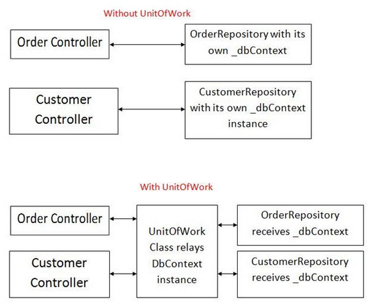

<br>

## Table of content
- [Given problem](#given-problem)
- [Solution of Unit of Work pattern](#solution-of-unit-of-work-pattern)
- [When to use](#when-to-use)
- [Source code](#source-code)
- [Benefits & Drawback](#benefits-and-drawbacks)
- [Application and Examples](#application-and-examples)
- [Wrapping up](#wrapping-up)


<br>

## Given problem

When we want to have some CRUD operations with domain model, we will have to use Repository pattern or Data Access Object pattern to interact with database. Then, obviously, we always have a lot of small database calls.

The cost of interacting with database is very high, because we have to create session for each user, and the time to access database in HDD. It takes so much time.

For example, in DDD architectural pattern of e-commercial site, we have an aggregate root Order that contains Address, and OrderItem.

- We want to persistent Order aggregate root to database. It means that Address, and OrderItem Domain Model are also persistented to database. If we have encountered some exceptions when pushing them into database, we need to revert all operations to make the consistency - one of the ACID properties in RDBMS, satisfied.

    But, normally, we will iterately insert each domain model into our database. It makes our data lack the consistency property when coping with some mistakes.

So, how do we overcome this problem?

<br>

## Solution of Unit of Work pattern

1. Solve the above problem

    To ensure the consistency property of database when we have all requests that are relevant together, we will use Unit of Work pattern.

    

2. Introduction to Unit of Work pattern

    According to website [https://martinfowler.com](https://martinfowler.com/eaaCatalog/unitOfWork.html), we have its definition:

    ```
    Maintains a list of objects affected by a business transaction and coordinatess the writing out of changes and the resolution of concurrency problems.
    ```

    And if we want to know about the position of ```Unit of Work``` pattern, we can refer to the following image:

    

    It means that we merge multiple operations of database into a single batch to improve the performance of system. This is one of the many ways to get the high performance in Data Access Layer with Hibernate.

<br>

## When to use

- Used in Domain Driven Design

- When we have a set of requests and we want all requests that have to be completed in one transaction. If one request is failed, all the rest of requests will be disactive.

<br>

## Source code


<br>

## Benefits & Drawback
1. Benefits

    - improve the performance of system when we are working with bulk of data, not iterately each record.

        Because this pattern reduces the amount of calls to the database, and the round-trip networks.

    - It's really suitable for DDD because our Aggregate object will contains multiple Domain Models. Then, we need to consider the persistence operations for this Aggregate object as one operation.


2. Drawbacks


<br>

## Application and Examples

- The concept of Unit of Work is a central concept of ORMs and has been described by Scott Ambler.

- Examples of Unit of Work pattern are: 

    - ```DbContext``` class represents a combination of the Unit of Work and Repository patterns such that it can be used to query from a database and group together changes that will then be written back to the store as a unit. And ```DbSet``` represents a Repository pattern.

    - ```ITransaction``` interface in ```NHibernate```

    - ```DataContext``` class in ```LINQ to SQL```

    - ```ObjectContext``` class in the ```Entity Framework```.

    - ```EclipseLink``` Transactions

    - ```UnitOfWork``` in ```TopLink```

    - ```PersistenceManager``` in ```JDO```

    - ```Session``` in ```Hibernate```

    - ```EntityManager``` in ```JPA```

<br>

## Wrapping up

- Use **Session-per-Request** is preferred than **Session-per-Operation**.

    It means that all database operations should be executed in the one session.

<br>

Refer:

[https://martinfowler.com/eaaCatalog/unitOfWork.html](https://martinfowler.com/eaaCatalog/unitOfWork.html)

[https://www.codeproject.com/Articles/581487/Unit-of-Work-Design-Pattern](https://www.codeproject.com/Articles/581487/Unit-of-Work-Design-Pattern)

[https://www.programmingwithwolfgang.com/repository-and-unit-of-work-pattern/](https://www.programmingwithwolfgang.com/repository-and-unit-of-work-pattern/)

<br>

**Patterns in Practice - The Unit Of Work Pattern And Persistence Ignorance**

[https://msdn.microsoft.com/en-us/magazine/dd882510.aspx](https://msdn.microsoft.com/en-us/magazine/dd882510.aspx)

[https://tedu.com.vn/lap-trinh-aspnet/ket-hop-unit-of-work-va-repository-pattern-trong-aspnet-mvc-37.html](https://tedu.com.vn/lap-trinh-aspnet/ket-hop-unit-of-work-va-repository-pattern-trong-aspnet-mvc-37.html)

[https://coding4food.net/2018/07/10/repository-va-unit-of-work-pattern/](https://coding4food.net/2018/07/10/repository-va-unit-of-work-pattern/)

[https://docs.microsoft.com/en-us/dotnet/api/system.data.entity.dbcontext?redirectedfrom=MSDN&view=entity-framework-6.2.0](https://docs.microsoft.com/en-us/dotnet/api/system.data.entity.dbcontext?redirectedfrom=MSDN&view=entity-framework-6.2.0)

<br>

**Documentation about ORMs**

[http://www.ambysoft.com/downloads/persistenceLayer.pdf](http://www.ambysoft.com/downloads/persistenceLayer.pdf)

[The Design of a Robust Persistence Framework for Relational Databases](http://www.ambysoft.com/essays/persistenceLayer.html)

[The Object-Relational Impedance Mismatchl](http://www.agiledata.org/essays/impedanceMismatch.html)

[Mapping Objects to Relational Databases: O/R Mapping In Detaill](http://www.agiledata.org/essays/mappingObjects.html)

[Choosing a Primary Key: Natural or Surrogate?](http://www.agiledata.org/essays/keys.html)