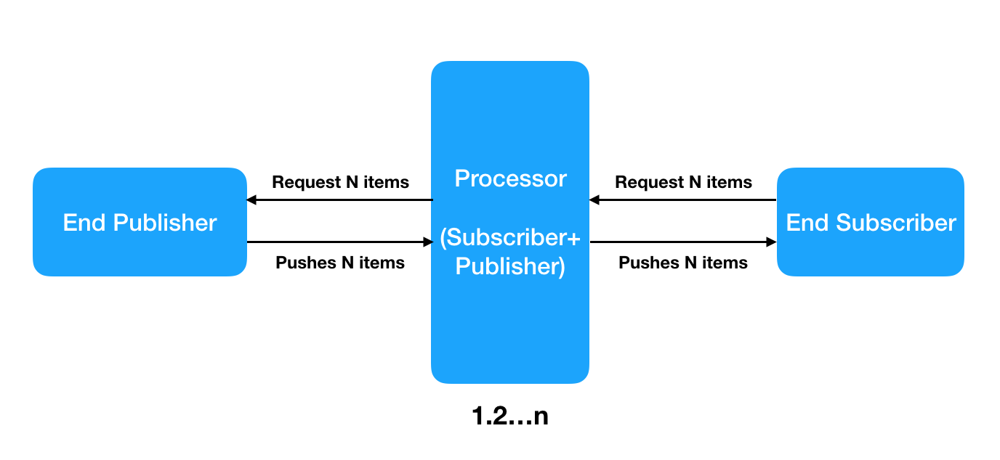
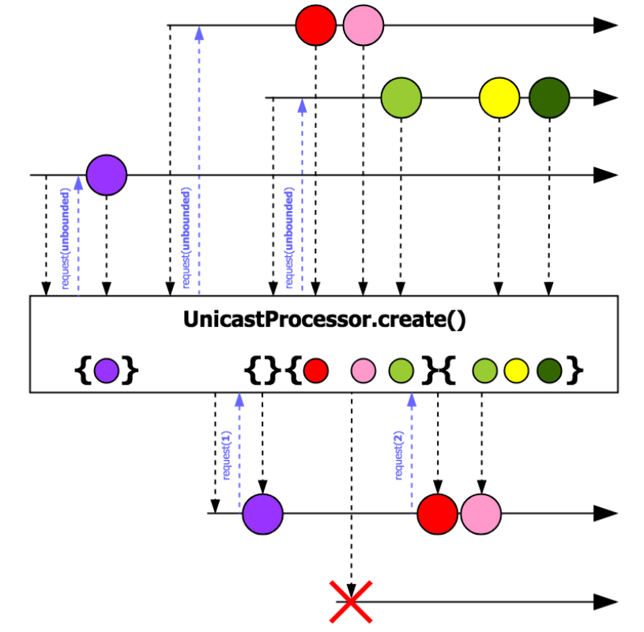
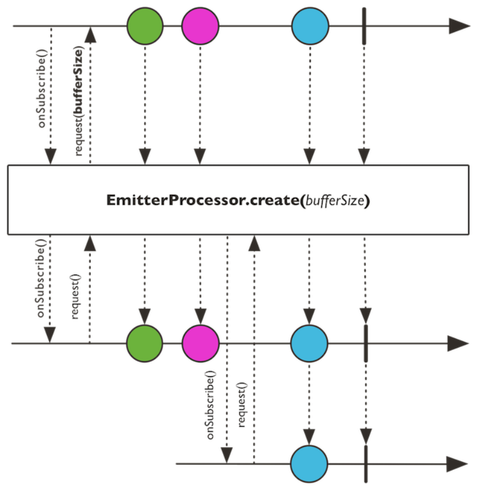
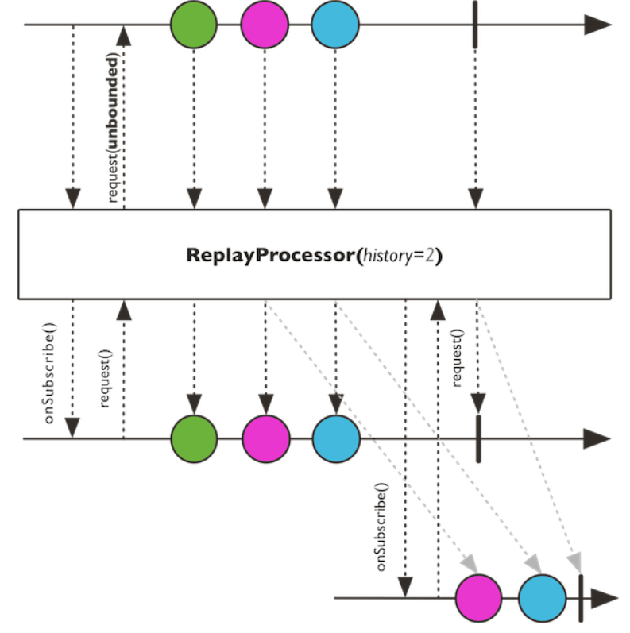
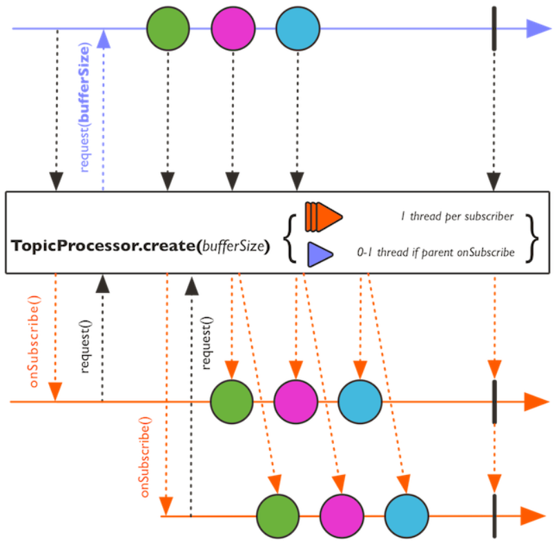
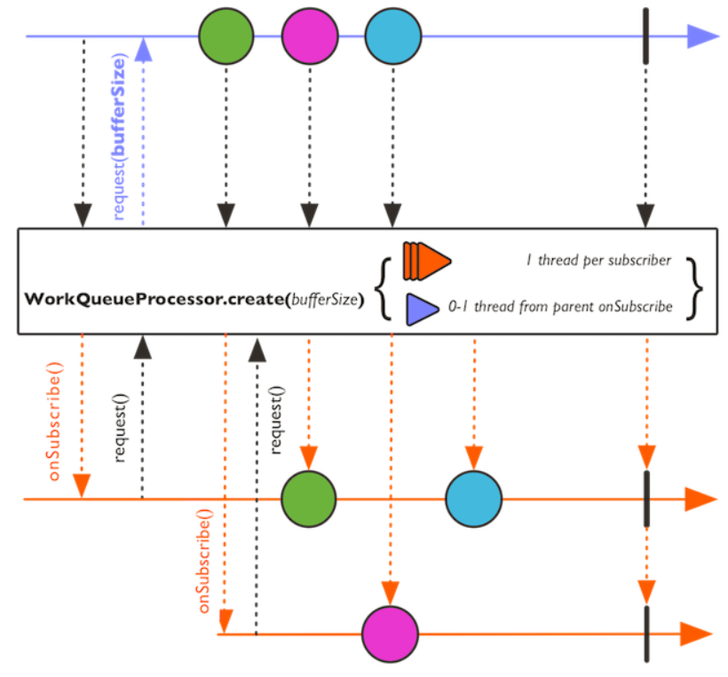

In this article, we will go through processors in reactor of java. In Reactive programming, or especially Spring webflux, to use Processor is important to do with it.

Let's get started.

<br>

## Table of contents
- [DirectProcessor](#directprocessor)
- [UnicastProcessor](#unicastprocessor)
- [EmitterProcessor](#emitterprocessor)
- [ReplayProcessor](#replayprocessor)
- [TopicProcessor](#topicprocessor)
- [WorkQueueProcessor](#workqueueprocessor)

<br>

## The background about Processor
A processor represents a state of data processing. It is therefore presented as both a publisher and a subscriber.

Since it is a publisher, we can create a processor and ```Subscribe``` to it. Most of the functions of a publisher can be performed using a processor, it can inject custom data, as well as generate errors and completion events.



In order to understand about processor deeper, we can refer to this [link](http://ducmanhphan.github.io/2019-10-01-What-is-Reactive-programming-in-Java).


<br>

## DirectProcessor

- ```DirectProcessor``` connects a processor to a subscriber, and then directly invokes the ```Subscriber.onNext()``` method. The processor does not offer any backpressure handling.

    ```java
    public final class DirectProcessor<T> extends FluxProcessor<T, T> {

        // static method
        static <E> DirectProcessor create();

        // other methods
        ...

    }
    ```

    

- ```DirectProcessor``` can have multiple consumers, and supports multiple producers. However, all producers must produce messages on the same Thread.

```java
DirectProcessor<Long> data = DirectProcessor.create();
data.subscribe(t -> System.out.println(t),
        e -> e.printStackTrace(),
        () -> System.out.println("Finished 1"));
data.onNext(10L);
data.onComplete();
data.subscribe(t -> System.out.println(t),
        e -> e.printStackTrace(),
        () -> System.out.println("Finished 2"));
data.onNext(12L);
```

<br>

## UnicastProcessor

- ```UnicastProcessor``` has the backpressure functionality. Internally, it creates a queue to hold undelivered events. We can provide an optional queue to buffer the events. After the buffer is full, the processor starts to reject elements. The processor also makes it possible to perform cleanup for every rejected element.

    ```java
    public final class UnicastProcessor extends FluxProcessor<T, T> implements Fuseable.QueueSubscription<T>, Fuseable{
        
        // static methods
        static <E> UnicastProcessor<E> create();

        static <E> UnicastProcessor<E> create(Queue<T> queue);

        static <E> UnicastProcessor<E> create(Queue<T> queue, Consumer<? super T> onOverflow, Disposable endCallback);

        static <E> UnicastProcessor<E> create(Queue<T> queue, Disposable endCallback);

        void onComplete();

        void onError(Throwable t);

        void onNext(T t);

        // ...

    }
    ```

    

- ```UnicastProcessor``` allows multiplexing of the events which means that it supports multiple producers

- ```UnicastProcessor``` accepts only one subscriber that will work with it. If we add one more subscriber to UnicastProcessor, program will throw an exception.

For example:

```java
UnicastProcessor<Long> data = UnicastProcessor.create();
data.subscribe(t -> {
    System.out.println(t);
});
data.sink().next(10L);
```

<br>

## EmitterProcessor

- ```EmitterProcessor``` is a processor that can be used with several subscribers.
    
    Multiple subscribers can ask for the next value event, based on their individual rate of consumption.

    The processor provides the necessary backpressure support for each subscriber.

    

- The processor is also capable of publishing events from an external publisher. It consumes an event from the injected publisher and synchronously passes it to the subscribers.

For example:

```java
EmitterProcessor<Long> data = EmitterProcessor.create(1);
data.subscribe(t -> System.out.println(t));
FluxSink<Long> sink = data.sink();
sink.next(10L);
sink.next(11L);
sink.next(12L);
data.subscribe(t -> System.out.println(t));
sink.next(13L);
sink.next(14L);
sink.next(15L);
```

```java
EmitterProcessor<String> emitter = EmitterProcessor.create();
FluxSink<String> sink = emitter.sink();
emitter.publishOn(Schedulers.single())
       .map(String::toUpperCase)
       .filter(s -> s.startsWith("HELLO")) 
       .delayElements(Duration.of(1000, MILLIS))
       .subscribe(System.out::println);

sink.next("Hello World!");
sink.next("Goodbye World");
sink.next("Again");
Thread.sleep(3000);
```

<br>

## ReplayProcessor

- ```ReplayProcessor``` is a special-purpose processor, capable of caching and replaying events to its subscribers.

    The processor also has the capability of publishing events from an external publisher.
    
    It consumes an event from the injected publisher and synchronously passes it to the subscribers.

    

- ```ReplayProcessor``` can cache events for some scenarios:

    - All events
    - A limited count of events
    - Events bounded by a specified time period
    - Events bounded by a count and a specified time period
    - The last event only

- Once cached, all events are replayed when a subscriber is added.

For example:

```java
ReplayProcessor<Long> data = ReplayProcessor.create(3);
data.subscribe(t -> System.out.println(t));
FluxSink<Long> sink = data.sink();
sink.next(10L);
sink.next(11L);
sink.next(12L);
sink.next(13L);
sink.next(14L);
data.subscribe(t -> System.out.println(t));
```

<br>

## TopicProcessor
```TopicProcessor``` is a processor capable of working with multiple subscribers, using an event loop architecture. 

The processor delivers events from a publisher to the attached subscribers in an asynchronous manner, and honors backpressure for each subscriber by using the ```RingBuffer``` data structure.

The processor is also capable of listening to events from multiple publishers.



Unlike the processors that deliver events in an ordered manner, ```TopicProcessor``` is capable of delivering events to subscribers in a concurrent manner. This is governed by the number of threads created in the processor.

For example:

```java
TopicProcessor<Long> data = TopicProcessor.<Long>builder()
                                          .executor(Executors.newFixedThreadPool(2)).build();
data.subscribe(t -> System.out.println(t));
data.subscribe(t -> System.out.println(t));
FluxSink<Long> sink= data.sink();
sink.next(10L);
sink.next(11L);
sink.next(12L);
```

<br>

## WorkQueueProcessor
The ```WorkQueueProcessor``` type is similar to the TopicProcessor, in that it can connect to multiple subscribers. However, it does not deliver all events to each subscriber. The demand from every subscriber is added to a queue, and events from a publisher are sent to any of the subscribers. The model is more like having listeners on a JMS queue; each listener consumes a message when finished. The processor delivers messages to each of the subscribers in a round-robin manner. The processor is also capable of listening to events from multiple publishers.



For example:

```java
WorkQueueProcessor<Long> data = WorkQueueProcessor.<Long>builder().build();
data.subscribe(t -> System.out.println("1. "+t));
data.subscribe(t -> System.out.println("2. "+t));
FluxSink<Long> sink= data.sink();
sink.next(10L);
sink.next(11L);
sink.next(12L);
```

<br>

## The difference between a hot publisher and a cold publisher
- In a hot publisher, it publishes old data for every new subscriber.
- In a cold publisher, it keeps emitting data, when a new subscriber arrives, it receives only newly emitted data.

<br>

## Wrapping up
- Each processor provides a ```sink()``` method. A ```Sink``` is the preferred way of publishing events to the subscriber. It provides methods to publish next, error, and complete events. ```Sink``` provides a thread-safe manner of handling these events, instead of directly publishing them by using the ```Subsciber.OnNext()``` method calls.


<br>

Thanks for your reading.

<br>

Refer:

[Hands on Reactive Programming with Reactor](https://subscription.packtpub.com/book/application_development/9781789135794)

[https://www.reactive-streams.org/](https://www.reactive-streams.org/)

[https://www.concretepage.com/java/java-9/java-reactive-streams](https://www.concretepage.com/java/java-9/java-reactive-streams)

<br>

**AutoConnect**

[https://projectreactor.io/docs/core/release/reference/#advanced-broadcast-multiple-subscribers-connectableflux](https://projectreactor.io/docs/core/release/reference/#advanced-broadcast-multiple-subscribers-connectableflux)