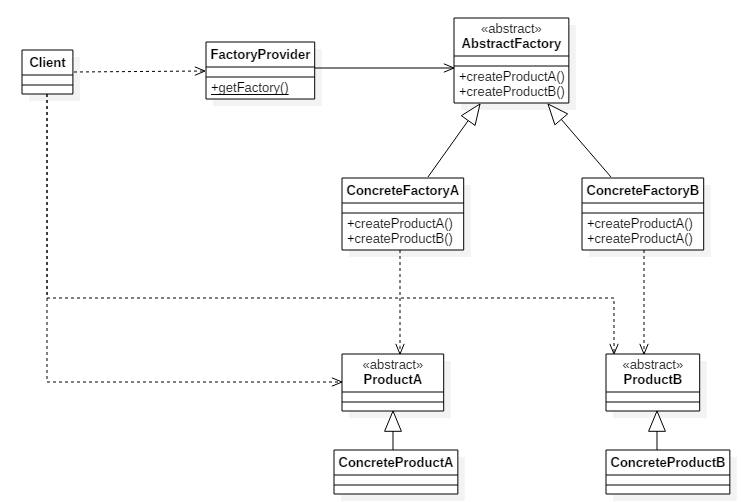

In Creational pattern, abstract factory pattern is at higher lever than the other pattern such as factory method pattern, ... It is always used in our system, because it makes our system consistency, and loose coupling between our system and concrete something.

Today, we will find something out about this useful pattern. Let's get started.

<br>

## Table of contents
- [Given Problem](#given-problem)
- [Analysis Problem](#analysis-problem)
- [Definition of Abstract factory Pattern](#definition-of-abstract-factory-pattern)
- [When to use](#when-to-use)
- [Benefits & Drawback](#benefits-&-drawback)
- [Code C++ /Java / Javascript / Python](#code-c++-java-javascript-python)
- [Application & Examples](#application-&-examples)
- [Relations with other design patterns](#relations-with-other-design-patterns)
- [Wrapping up](#wrapping-up)

<br>

## Given Problem 
Assuming that we have to create application with multiple plugin with it, or application that depends on its configuration such as color theme, operating system version, ... So, in these case, normally, we will create 
separated code for each case.

Is this way effective for creating your application?

<br>

## Analysis Problem
When we cope with the above problem, some drawbacks happened if we code for each case:
- It's difficult to maintain and reuse because when we need to add a products or families of products to our application, we have to change existing code.
- mock test

Therefore, to prevent all these disadvantages, we should use Abstract factory pattern.

<br>

## Definition of Abstract factory Pattern
According to [wikipedia.com](https://en.wikipedia.org/wiki/Abstract_factory_pattern), we have the definition of abstract factory pattern:

```
The abstract factory pattern provides an interface for creating families of related or dependent objects without specifying their concrete classes.
```

So, with the above definition of abstract factory pattern, we have an image to describe the concise content of this pattern:



Some notes in this pattern:
- create families of related objects to be used together within their implementation.
- allows multiple families of objects to be switched between easily.

<br>

## When to use
- If we want to ```create a collection of related products that are designed to be used together```. The pattern allows us to do so by enforcing the desired family of products to be at the same time.

- If we want ```our system to have independence between the creation, composition and representation of its products```. The pattern provides this by decoupling the implementation of each of these operations.

- If we want to ```hide the implementations of our products, only revealing the required interface to provide access to their use```.

- Our application should ```only require a single instance of the ConcreteFactory class per product family```. Because this is the case, we can implement our factory as a Singleton so it can be persisted and reused throughout the lifecycle of our application, instead of instantiating a new instance every time we need to access its method.

- The ConcreteProduct subclasses in our design have the responsibility of actually creating our products, which we can do by using the Factory Method design pattern to allow our ConcreteFactory class to override each factory method from our product classes in order to declare them - this approach if we have a small collection of product families, otherwise the Prototype design may be more applications. This pattern allows us to begin by initializing our ConcreteFactory with prototypical instances of every product from the family, which can then be cloned to easily create a new instance of a product - essentialy providing us with a template for simply creating a new instance.

<br>

## Benefits & Drawback
1. Benefits
- Loose coupling between concrete products and client code.

- The client need not be aware of the class that creates the object which, in turn, is utilized by the client. It is only necessary to know the interface, methods and parameters that need to be passed to create objects of the desired type. This simplifies implementations for the client.

- Adding another class to the factory to create objects of another type can be easily done without the client changing the code. At a minimum, the client needs to pass just another parameter.

- The factory can also reuse the existing objects. However, when the client does direct object creation, this always creates a new object.

- Assume that we have an application which contains multiple plugins. So, when use abstract factory pattern for these plugins, we can easily switched easily plugins together, because we can only change concrete plugin that is being use.

2. Drawbacks
- The code may become more complicated than it should be, since a lot of new interfaces and classes are introduced along with the pattern.

<br>

## Code C++ /Java / Javascript / Python
Assumed that we have an application have two light theme and dark theme, we want to switch between them easily depends on the choice of user. 


Utilizing abstract factory pattern for this problem we have:

By C++, we can refer to this [link](https://github.com/DucManhPhan/Design-Pattern/tree/master/Creational-Pattern)

<br>

## Application & Examples
- Abstract factory pattern is a very central design pattern for Dependency Injection (DI).

<br>

## Relations with other design patterns
- Abstract factory and Bridge pattern.

- Abstract factory and Factory Method pattern.

    If we want to combine Abstract factory pattern and factory method pattern, refer [link](https://github.com/DucManhPhan/Design-Pattern/tree/master/Creational-Pattern).

<br>

## Some real concerns of abstract factory pattern
- [Is there a pattern for initializing objects created via a DI container?](https://stackoverflow.com/questions/1943576/is-there-a-pattern-for-initializing-objects-created-via-a-di-container/1945023#1945023)

- [Can't combine Factory / DI](https://stackoverflow.com/questions/1926826/cant-combine-factory-di/1927167#1927167)

- [WCF Dependency Injection and abstract factory](https://stackoverflow.com/questions/2168704/wcf-dependency-injection-and-abstract-factory/2168882#2168882)

- [How to setup IoC when a key class needs Session (or other context-specific-variable)](https://stackoverflow.com/questions/1890341/how-to-set-up-ioc-when-a-key-class-needs-session-or-other-context-specific-varia/1890463#1890463)

- [How to Resolve type based on end-user configuration value?](https://stackoverflow.com/questions/2180276/how-to-resolve-type-based-on-end-user-configuration-value/2182775#2182775)

- [Strategy Pattern and Dependency Injection using Unity](https://stackoverflow.com/questions/1706056/strategy-pattern-and-dependency-injection-using-unity/1706352#1706352)

- [Abstract factory pattern on top of IoC?](https://stackoverflow.com/questions/1993397/abstract-factory-pattern-on-top-of-ioc/1994455#1994455)

- [Is this the correct way to use and test a class that makes use of the factory pattern?](https://stackoverflow.com/questions/1892532/is-this-the-correct-way-to-use-and-test-a-class-that-makes-use-of-the-factory-pat/1892636#1892636)

- [DDD Book, Eric Evans: Please explain what is meant by "The FACTORY should be abstracted to the type desired rather than the concrete class(es) created."](https://stackoverflow.com/questions/2194629/ddd-book-eric-evans-please-explain-what-is-meant-by-the-factory-should-be-abst/2198504#2198504)

- [DI container, factory, or new for ephemeral objects?](https://stackoverflow.com/questions/2060767/di-container-factory-or-new-for-ephemeral-objects/2060840#2060840)

- [How to unit test instance creation?](https://stackoverflow.com/questions/1900358/how-to-unit-test-instance-creation/1900446#1900446)

- [What is the best strategy for Dependency Injection of User Input?](https://stackoverflow.com/questions/1682925/what-is-the-best-strategy-for-dependency-injection-of-user-input/1686403#1686403)

<br>

## Wrapping up
- Provides an interface for creating families of related or dependent objects without specifying their concrete classes.


<br>

Thanks for your reading.

<br>

Refer:

[https://www.oodesign.com/abstract-factory-pattern.html](https://www.oodesign.com/abstract-factory-pattern.html)

[https://thinkinginobjects.com/2012/09/05/abstract-factory-in-domain-modelling/](https://thinkinginobjects.com/2012/09/05/abstract-factory-in-domain-modelling/)

[Learning Python Design Patterns](https://www.amazon.com/Learning-Python-Design-Patterns-Second/dp/178588803X)

