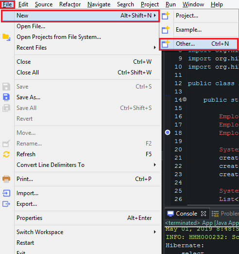
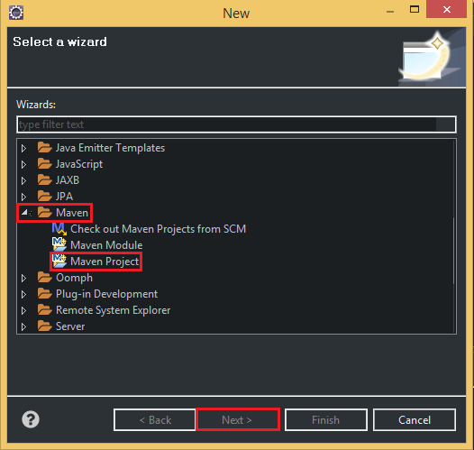
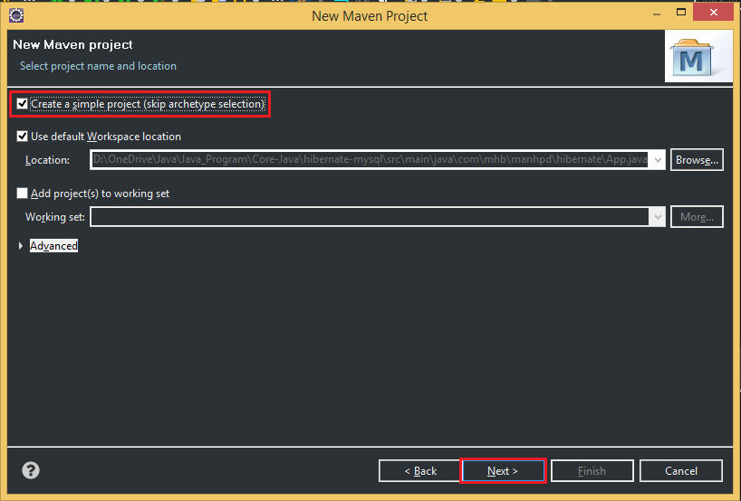
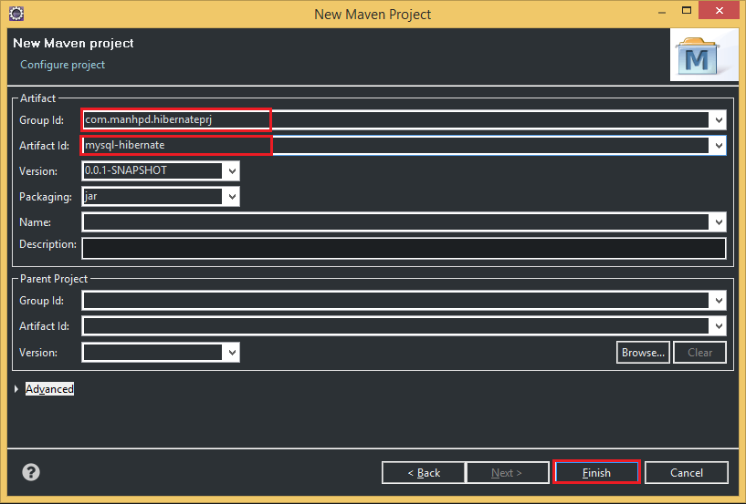
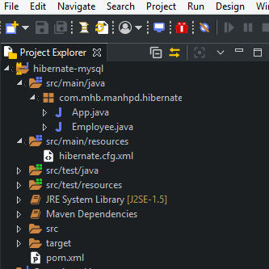
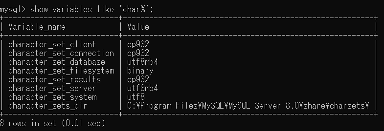

In this article, we will learn how to configure Hibernate in our Java project with Maven. There are some problems when doing with Hibernate, and we will solve them to know more about configuration in Hibernate.

Let's get started.

<br>

## Table of content
- [Creating project using Maven](#creating-project-using-maven)
- [Preparing database in MySQL](#preparing-database-in-MySQL)
- [Add dependencies of Maven to pom.xml file](#add-dependencies-of-maven-to-pom.xml-file)
- [Configuring xml file for Hibernate](#configuring-xml-file-for-Hibernate)
- [Creating entity that is corresponding to a table in MySQL](#creating-entity-that-is-corresponding-to-a-table-in-mysql)
- [Creating CRUD operations to MySQL](#creating-crud-operations-to-mysql) 
- [Fix some problems](#fix-some-problems)
- [Wrapping up](#wrapping-up)


<br>

## Creating project using Maven
Belows are some steps that we need to create project with Maven:









So, after passing all above steps, we have a project that is managed by Maven. When we want to add libraries, we can fill in ```pom.xml``` file.

Finally, we will have the structure of Maven project like the below image:




<br>

## Preparing database in MySQL
In order to implement the communication between MySQL and Hibernate, we need to create our own database in MySQL. The following is the content of sql file that is used to create database and table ```Employee```.

```sql
CREATE DATABASE java_sql;

USE java_sql;

CREATE TABLE `EMPLOYEE` (
    ID INT NOT NULL AUTO_INCREMENT, 
    FULL_NAME VARCHAR(20) DEFAULT NULL,
    AGE INT DEFAULT NULL,

    PRIMARY KEY (ID)
);

INSERT INTO `employee` (ID, FULL_NAME, AGE) 
VALUES 
    (1, "John", 56), 
    (2, "Bill Adam", 45), 
    (3, "Mary Smith", 78);

SELECT * FROM `employee`;
```

<br>

## Add dependencies of Maven to pom.xml file

```xml
<dependencies>
    <dependency>
        <groupId>org.hibernate</groupId>
        <artifactId>hibernate-core</artifactId>
        <version>4.3.6.Final</version>
    </dependency>

    <dependency>
        <groupId>mysql</groupId>
        <artifactId>mysql-connector-java</artifactId>
        <version>5.1.6</version>
    </dependency>

    <dependency>
        <groupId>org.javassist</groupId>
        <artifactId>javassist</artifactId>
        <version>3.18.0-GA</version>
    </dependency>

    <dependency>
        <groupId>org.projectlombok</groupId>
        <artifactId>lombok</artifactId>
        <version>1.18.6</version>
        <scope>provided</scope>
    </dependency>
</dependencies>
```


<br>

## Configuring xml file for Hibernate
All information about configurations of Hibernate is contained in a standard Java properties file called ```hibernate.properties```, or an XML file named ```hibernate.cfg.xml```.

In this article, we will use the ```hibernate.cfg.xml``` file. It is located in ```src/main/resouces``` folder.

The content of ```hibernate.cfg.xml``` file like that:

```xml
<!DOCTYPE hibernate-configuration SYSTEM
"http://www.hibernate.org/dtd/hibernate-configuration-3.0.dtd">

<hibernate-configuration>
	<session-factory>
		<property name="hibernate.dialect">org.hibernate.dialect.MySQLDialect</property>
		<property name="hibernate.connection.driver_class">com.mysql.jdbc.Driver</property>
		<property name="hibernate.connection.url">jdbc:mysql://localhost:3306/java_sql</property>
		<property name="hibernate.connection.useUnicode">true</property>
        <property name="hibernate.connection.characterEncoding">UTF-8</property>
	    <property name="hibernate.connection.username">root</property>
	    <property name="hibernate.connection.password">12345</property>
	    <property name="hibernate.current_session_context_class">thread</property>
        <property name="hibernate.hbm2ddl.auto">update</property>
        <property name="hibernate.show_sql">true</property>
        <property name="hibernate.format_sql">true</property>
	    <mapping class="com.mhb.manhpd.hibernate.Employee"/>
	</session-factory>
</hibernate-configuration>
```

In MySQL, we should note that when we remove two properties such as ```hibernate.connection.useUnicode```, and ```hibernate.connection.characterEncoding```. In Eclipse, we have an error like ```Exception in thread main org.hibernate.exception.JDBCConnectionException: Error calling Driver#connect```.

When we find DDL for ```employee``` table, we have:

```sql
CREATE TABLE `employee` (
    `id` int(11) NOT NULL AUTO_INCREMENT, 
    `name` varchar(20) DEFAULT NULL, 
    `age` int(11) DEFAULT NULL, 

    PRIMARY KEY (`id`)
)ENGINE=InnoDB AUTO_INCREMENT=13 DEFAULT CHARSET=utf8mb4 COLLATE=utf8mb4_0900_ai_ci;
```

Therefore, in our table, it uses charset that is utf8mb4 - UTF8 Unicode. In order that hibernate can communicate with MySQL succesfully, we have to set value for ```hibernate.connection.useUnicode``` is ```true```, and set value for ```hibernate.connection.characterEncoding``` is ```UTF-8```.

To show the MySQL default character set, we have to login to the MySQL console and execute ```SHOW VARIABLES LIKE 'char%';```.



If we want to change it, for example, to utf8, we have to add this:

```sql
default-character-set = utf8
```

to the client, ```mysqld_safe```, ```mysqld``` and ```mysqldump``` section (may differ depending on configuration) in your my.cnf and restart the mysql daemon.

We can go to this [link](https://docs.jboss.org/exojcr/1.12.13-GA/developer/en-US/html/ch-db-configuration-hibernate.html) to refer some information about configuration in Hibernate.

When we want to connect with the other RDBMSs, we will have some values of ```hibernate.dialect```, ```hibernate.connection.driver_class```, and ```hibernate.connection.url```.
1. MySQL

    ```xml
    <property name="hibernate.dialect">org.hibernate.dialect.MySQL57Dialect</property>
    <property name="hibernate.connection.driver_class">com.mysql.jdbc.Driver</property>
    <property name="hibernate.connection.url">jdbc:mysql://localhost:3306/database_name</property>
    ```

2. Oracle

    ```xml
    <property name="hibernate.dialect">org.hibernate.dialect.Oracle12cDialect</property>
    <property name="hibernate.connection.driver_class">oracle.jdbc.OracleDriver</property>
    <property name="hibernate.connection.url">jdbc:oracle:thin:@localhost:1521/database_name</property>
    ```

3. PostgreSQL

    ```xml
    <property name="hibernate.dialect">org.hibernate.dialect.PostgreSQL95Dialect</property>
    <property name="hibernate.connection.driver_class">org.postgresql.Driver</property>
    <property name="hibernate.connection.url">jdbc:postgresql://localhost:5432/database_name</property>
    ```

4. SQL Server

    ```xml
    <property name="hibernate.dialect">org.hibernate.dialect.SQLServer2012Dialect</property>
    <property name="hibernate.connection.driver_class">com.microsoft.sqlserver.jdbc.SQLServerDriver</property>
    <property name="hibernate.connection.url">jdbc:sqlserver://localhost;instance=SQLEXPRESS;databaseName=java_sql</property>
    ```

5. MariaDB

    ```xml
    <property name="hibernate.dialect">org.hibernate.dialect.MariaDB53Dialect</property>
    <property name="hibernate.connection.driver_class">org.mariadb.jdbc.Driver</property>
    <property name="hibernate.connection.url">jdbc:mariadb://127.0.0.1:port_number/java_sql</property>
    ```

<br>

## Creating entity that is corresponding to a table in MySQL
We will generate entity that is mapped to data types of ```employee``` table in MySQL.

```java
import lombok.Data;

import javax.persistence.*;
import java.io.Serializable;

@Entity
@Table(name = "employee")
@Data
public class Employee implements Serializable {

    private static final long serialVersionUID = 1L;

    @Id
    @GeneratedValue(strategy = GenerationType.IDENTITY)
    @Column(name = "ID")
    private int id;

    @Column(name = "FULL_NAME")
    private String name;

    @Column(name = "AGE")
    private int age;

    public Employee() {
        // nothing to do
    }

    public Employee(int id, String name, int age) {
        this.id   = id;
        this.name = name;
        this.age  = age;
    }

    public Employee(String name, int age) {
        this.name = name;
        this.age  = age;
    }

    @Override 
    public String toString() {
        return "Employee: " + this.id + ", " + this.name + ", " + this.age;
    }
}
```
We have some rules for persistent class that we can apply to our own cases.
- ```All Java classes that will be persisted need a default constructor.```

- All classes should contain an ID in order to allow easy identification of our objects within Hibernate and the database. This property maps to the primary key column of a database table.

- All attributes that will be persisted should be declared private and have ```getXXX()``` and ```setXXX()``` methods defined in the JavaBean style.

- A central feature of Hibernate, proxies, depends upon the peristent class being either non-final, or the implementation of an interface that declares all public methods.

- All classes that do not extend or implement some specialized classes and interface required by the EJB framework.


<br>

## Creating CRUD operations to MySQL


<br>

## Fix some problems
- If we modify Hibernate from EclipseLink, with one-to-one relationship or one-to-many relationship, we have error such as:

    ```
    Multiple writable mappings exist for the field []. Only one may be defined as writable, all others must be specified read-only.
    ```

    Source code for this problem:

    ```java
    public class User implements Serializable {
        private static final long serialVersionUID = 1L;

        @Id
        @GeneratedValue(strategy=GenerationType.AUTO)
        private int id;

        private String email;

        private String password;

        private int reputation;

        @OneToOne(mappedBy="user", cascade={CascadeType.ALL})
        private Company company;

         @OneToOne(mappedBy="user")
        private Person person;

        ...
    }

    @Entity
    public class Person implements Serializable {
        private static final long serialVersionUID = 1L;

        @Id
        @GeneratedValue(strategy=GenerationType.AUTO)
        @Column(name="id_user")
        private int idUser;

        @Temporal( TemporalType.DATE)
        private Date birthdate;

        private String gender;

        private String name;

        private String surname;

        @OneToOne
        @JoinColumn(name="id_user", insertable=false, updatable=false)
        private User user;
    }

    public class Company implements Serializable {
        private static final long serialVersionUID = 1L;

        @Id
        @GeneratedValue(strategy=GenerationType.AUTO)
        @Column(name="id_user")
        private int idUser;

        private String email;

        private String name;

        @ManyToOne
        @JoinColumn(name="area")
        private Area areaBean;

        @OneToOne(cascade={CascadeType.ALL})
        @JoinColumn(name="id_user", insertable=false, updatable=false)
        private User user;
    }
    ```

    The reason for this error: we have the ```id_user``` column mapped twice, once using a basic ```@Id``` mapping, and once using the ```@ManyToOne```. We need to make one of them readonly, such as ```insertable=false```, ```updatable=false``` in ```@JoinColumn``` annotation. Or better just remove the basic id, and put the ```@Id``` on the ```@ManyToOne```.

    So, we have two way to solve this error:
    - Replace ```@JoinColumn(name="area")``` as ```@PrimaryKeyColumn(name = "area", referencedColumnName = "id")```.
    - Placing the ```insertable=false```, ```updatable=false``` in the ```@JoinColumn``` annotation in both classes, ```Person``` and ```Company```.

    We can reference to this [link](https://en.wikibooks.org/wiki/Java_Persistence/Identity_and_Sequencing#Primary_Keys_through_OneToOne_and_ManyToOne_Relationships).
<br>

## Wrapping up


<br>

Refer: 

[https://examples.javacodegeeks.com/enterprise-java/hibernate/hibernate-annotations-example/](https://examples.javacodegeeks.com/enterprise-java/hibernate/hibernate-annotations-example/)

[https://stackoverflow.com/questions/44248528/what-is-the-maven-dependency-for-java-ee7-and-cdi-2-0](https://stackoverflow.com/questions/44248528/what-is-the-maven-dependency-for-java-ee7-and-cdi-2-0)

[https://www.baeldung.com/ejb-session-beans](https://www.baeldung.com/ejb-session-beans)

[https://dzone.com/articles/in-practice-dependency-injection-with-java-ee](https://dzone.com/articles/in-practice-dependency-injection-with-java-ee)

[https://stackoverflow.com/questions/7297565/javassist-what-is-the-main-idea-and-where-real-use](https://stackoverflow.com/questions/7297565/javassist-what-is-the-main-idea-and-where-real-use)

<br>

**Problem about encoding in database**

[https://stackoverflow.com/questions/13063372/hibernate-mysql-how-to-set-the-encoding-utf-8-for-database-and-tables](https://stackoverflow.com/questions/13063372/hibernate-mysql-how-to-set-the-encoding-utf-8-for-database-and-tables)

[https://makandracards.com/makandra/2529-show-and-change-mysql-default-character-set](https://makandracards.com/makandra/2529-show-and-change-mysql-default-character-set)

[https://vladmihalcea.com/jdbc-driver-connection-url-strings/](https://vladmihalcea.com/jdbc-driver-connection-url-strings/)