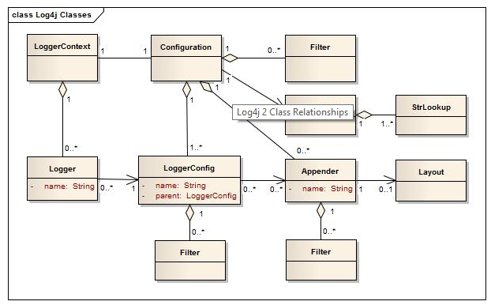

In Java web applications, logging is an important feature that we need to understand and use frequently. Because logging will help us easy to detect bug like at runtime, we do not use debug mode, so, defenitely, we have to use logging functionality to play.

In this article, we will introduce to Log4j 2.x with many functionalities that we want to use them. Let's get started.

<br>

## Table of contents
- [The structure of Log4j 2.x](#the-structure-of-log4j-2.x)
- [Some packages that need for Log4j 2.x](#some-packages-that-need-for-log4j-2.x)
- [Configure Log4j 2.x with XML file](#configure-log4j-2.x-with-xml-file)
- [Configure Log4j 2.x with properties file](#configure-log4j-2.x-with-properties-file)
- [Wrapping up](#wrapping-up)

<br>

## The structure of Log4j 2.x
To code quickly with Log4j 2.x, we need to understand about architecture of Log4j 2.x deeply. Below is an image that describe the background of Log4j 2.x:



In the above image, we need to find something outstanding:
- LoggerContext
- Configuration
- Logger

	In order to get the root logger, we can do like this:

	```java
	Logger logger = LogManager.getLogger(LogManager.ROOT_LOGGER_NAME);

	// or
	Logger logger = LogManager.getRootLogger();
	```

	All other Loggers can be got by using the ```LogManager.getLogger()``` static method with the name of the desired Logger.

- LoggerConfig
- Appender
- Layout

<br>

## Some packages that need for Log4j 2.x
When we want to use log4j2 for our Java application project or Spring boot, we need to insert some dependencies into our pom.xml file:

```xml
<dependency>
	<groupId>org.apache.logging.log4j</groupId>
	<artifactId>log4j-api</artifactId>
	<version>2.12.1</version>
</dependency>

<dependency>
	<groupId>org.apache.logging.log4j</groupId>
	<artifactId>log4j-core</artifactId>
	<version>2.12.1</version>
</dependency>
```

In Spring Boot, we can use directly its log4j2 that follows:

```xml
<dependency>
   <groupId>org.springframework.boot</groupId>
   <artifactId>spring-boot-starter</artifactId>
   <exclusions>
      <exclusion>
         <groupId>org.springframework.boot</groupId>
         <artifactId>spring-boot-starter-logging</artifactId>
      </exclusion>
   </exclusions>
</dependency>

<dependency>
   <groupId>org.springframework.boot</groupId>
   <artifactId>spring-boot-starter-log4j2</artifactId>
</dependency>
```

<br>

## Configure Log4j 2.x with XML file

```xml
<?xml version="1.0" encoding="UTF-8"?>
<Configuration status="WARN">
	<Properties>
		<Property name="LOG_PATTERN">[%-5level] %d{yyyy-MM-dd HH:mm:ss.SSS} [%t] %L %c{1} - %msg%n</Property>
		<Property name="APP_LOG_ROOT">./logs</Property>
	</Properties>
	<Appenders>
		<!-- Console appender -->
		<Console name="consoleLogger" target="SYSTEM_OUT">
			<PatternLayout pattern="${LOG_PATTERN}"/>
		</Console>

		<!-- File appender for debug mode -->
		<RollingFile name="debugLogger" fileName="${APP_LOG_ROOT}/debug-log/app-debug.log" filePattern="${APP_LOG_ROOT}/debug-log/app-debug-%d{yyyy-MM-dd}-%i.log.gz">
			<LevelRangeFilter minLevel="DEBUG" maxLevel="DEBUG" onMatch="ACCEPT" onMismatch="DENY"/>
			<PatternLayout>
				<pattern>${LOG_PATTERN}</pattern>
			</PatternLayout>
			<Policies>
				<SizeBasedTriggeringPolicy size="20MB" />
				<TimeBasedTriggeringPolicy interval="1" modulate="true" />	<!-- interval = 1 means one day -->
			</Policies>
			<DefaultRolloverStrategy max="10" />
		</RollingFile>

		<!-- File appender for error mode -->
		<RollingFile name="errorLogger" fileName="${APP_LOG_ROOT}/error-log/app-error.log" filePattern="${APP_LOG_ROOT}/error-log/app-error-%d{yyyy-MM-dd}-%i.log" >
				<LevelRangeFilter minLevel="ERROR" maxLevel="ERROR" onMatch="ACCEPT" onMismatch="DENY"/>
				<PatternLayout pattern="${LOG_PATTERN}"/>
				<Policies>
						<SizeBasedTriggeringPolicy size="10MB" />
				</Policies>
				<DefaultRolloverStrategy max="10"/>
		</RollingFile>

		<!-- File appender for per mode -->
		<RollingFile name="perfLogger" fileName="${APP_LOG_ROOT}/perf-log/app-perf.log" filePattern="${APP_LOG_ROOT}/perf-log/app-perf-%d{yyyy-MM-dd}-%i.log" >
				<PatternLayout pattern="${LOG_PATTERN}"/>
				<Policies>
						<SizeBasedTriggeringPolicy size="30MB" />
				</Policies>
				<DefaultRolloverStrategy max="1"/>
		</RollingFile>

		<RollingFile name="traceLogger" fileName="${APP_LOG_ROOT}/trace-log/app-trace.log" filePattern="${APP_LOG_ROOT}/trace-log/app-trace-%d{yyyy-MM-dd}-%i.log" >
				<PatternLayout pattern="${LOG_PATTERN}"/>
				<Policies>
						<SizeBasedTriggeringPolicy size="30MB" />
				</Policies>
				<DefaultRolloverStrategy max="1"/>
		</RollingFile>
	</Appenders>
	<Loggers>
		<Root level="warn">
			<AppenderRef ref="consoleLogger"/>
		</Root>

		<!-- Should have additivity = false for named loggers -->
		<Logger name="com.manhpd.app.repository" additivity="false" level="trace">
			<AppenderRef ref="debugLogger" />
			<AppenderRef ref="errorLogger" />
		</Logger>

		<Logger name="com.manhpd.app" additivity="false" level="debug">
			<AppenderRef ref="debugLogger" />
			<AppenderRef ref="traceLogger" />
			<AppenderRef ref="perfLogger" />
			<AppenderRef ref="consoleLogger" />
		</Logger>
	</Loggers>
</Configuration>
```

We can use System properties into Log4j configuration files using the format ```${sys:property_name}```.

For example:

```xml
<File name="file" fileName="${sys:path}/app.log" />
```

Some information of project that we need to insert into Log4j configuration file is at [here](https://logging.apache.org/log4j/2.x/manual/lookups.html)


<br>

## Configure Log4j 2.x with properties file
With the above configuration of log4j2.xml file, in this section, we will translate it to the log4j2.properties file.

```Java
status = error
name = PropertiesConfig

property.APP_LOG_ROOT = ./logs
property.LOG_PATTERN = <[%-5level] %d{yyyy-MM-dd HH:mm:ss.SSS} [%t] %c{1} - %msg%n

filters = threshold
 
filter.threshold.type = ThresholdFilter
filter.threshold.level = debug
 
appenders = console, debug, error, trace, perf

# Configure for Console appender
appender.console.type = Console
appender.console.name = consoleLogger
appender.console.layout.type = PatternLayout
appender.console.layout.pattern = ${LOG_PATTERN}

## Configure for debug appender
appender.debug.type = RollingFile
appender.debug.name = debugLogger
appender.debug.fileName = ${APP_LOG_ROOT}/debug-log/app-debug.log
appender.debug.filePattern = ${APP_LOG_ROOT}/debug-log/app-debug-%d{yyyy-MM-dd}-%i.log.gz
appender.debug.layout.type = PatternLayout
appender.debug.layout.pattern = ${LOG_PATTERN}

# TimeBasedTriggeringPolicy
appender.debug.policies.type = Policies
appender.debug.policies.time.type = TimeBasedTriggeringPolicy
appender.debug.policies.time.interval = 1
appender.debug.policies.time.modulate = true

# SizeBasedTriggeringPolicy
appender.debug.policies.size.type = SizeBasedTriggeringPolicy
appender.debug.policies.size.size = 20MB

appender.debug.strategy.type = DefaultRolloverStrategy
appender.debug.strategy.max = 20

# Delete files older than 30 days
appender.debug.strategy.delete.type = Delete
appender.debug.strategy.delete.basePath = ${APP_LOG_ROOT}
appender.debug.strategy.delete.maxDepth = 1
appender.debug.strategy.delete.ifLastModified.type = IfLastModified
appender.debug.strategy.delete.ifLastModified.age = 30d

## Configure for error, trace, perf appender
# They are as same as configuring for debug appender

# List of all loggers
loggers = console, debug, error, trace, perf

# Configure logger for console
logger.console.name = com.manhpd.app
logger.console.level = debug
logger.console.additivity = false
logger.console.appenderRefs = console
logger.console.appenderRef.console.ref = consoleLogger

# Configure logger for debug
logger.debug.name = com.manhpd.app.repository
logger.debug.level = trace
logger.debug.additivity = false

# It means: logger."name_logger".appenderRef."name_appenderRef".ref = "name_appender"
logger.debug.appenderRef.debug.ref = debugLogger

logger.debug.name = com.manhpd.app
logger.debug.level = debug
logger.debug.additivity = false
logger.debug.appenderRef.debug.ref = debugLogger

# Configure logger for error
logger.error.name = com.manhpd.app.repository
logger.error.level = trace
logger.error.additivity = false
logger.error.appenderRef.error.ref = errorLogger

# Configure logger for trace
logger.trace.name = com.manhpd.app
logger.trace.level = debug
logger.trace.additivity = false
logger.trace.appenderRef.trace.ref = traceLogger


# Configure logger for perf
logger.trace.name = com.manhpd.app
logger.trace.level = debug
logger.trace.additivity = false
logger.trace.appenderRef.trace.ref = perfLogger


# Configure logger for rootLogger
rootLogger.level = warn
rootLogger.appenderRefs = root
rootLogger.appenderRef.root.ref = consoleLogger
```

To understand more about Log4j 2.x, we can refer to this [linkLog4J 2 Configuration: Using Properties File](https://springframework.guru/log4j-2-configuration-using-properties-file/).

AppenderRef: This element defines a reference to an element from the Appenders section. Therefore the attribute ```ref``` is linked with an appenders ```name``` attribute.

<br>

## Understanding some symbol

- ```%d{HH:mm:ss.SSS}``` – Used to output the date of the logging event.

- ```[%thread]```– outputs the name of the thread that generated the logging event

- ```%-5level``` – means the level of the logging event should be left justified to a width of five characters

- ```%logger{36}```  – outputs the name of the logger at the origin of the logging event. It takes an integer as parameter. This specifies the length the converter’s algorithm  will shorten the logger name to.

- ```%msg``` – outputs the application-supplied message associated with the logging event.

- ```%n``` – outputs the platform dependent line separator character or characters.

- ```%relative``` – outputs the number of milliseconds elapsed since the start of the application until the creation of the logging event

<br>

## Common problems when using Log4j
1. Please initialize the log4j system properly warning

	When running our project, we can encounter these messages:

	```
	log4j:WARN No appenders could be found for logger (com.manhpd...).
	log4j:WARN Please initialize the log4j system properly.
	```

	This problem occurs when the default configuration files ```log4j.properties``` and ```log4j.xml``` can not be found and the application performs no explicit configuration. ```log4j``` uses ```Thread.getContextClassLoader().getResource()``` to locate the default configuration files and does not directly check the file system. Knowing the appropriate location to place ```log4j.properties``` or ```log4j.xml``` requires understanding the search strategy of the class loader in use. ```log4j``` does not provide a default configuration since output to the console or to the file system may be prohibited in some environments.

	We can control which file will be used to initialize by setting system properties as the following:

	```bash
	# Log4j will look for a file called customName on the classpath.
	java -Dlog4j.configuration=customName
	```

	If we are having problems I find it helpful to turn on the log4j.debug:

	```bash
	# It will print to System.out lots of helpful information about which file it used to initialize itself, which loggers / appenders got configured and how etc.
	-Dlog4j.debug
	```

	If we want to dig deeper this problem, read this [link](http://logging.apache.org/log4j/1.2/manual.html).

<br>

## Wrapping up
- Log4j always takes the default path that is the path of project.

   ```xml
   <File name="file" fileName="./target/logs/app.log">
   ```

- In order to configure about logger and appender for properties file or xml files, we can refer to this [link](https://logging.apache.org/log4j/2.x/manual/configuration.html#Properties).

- Every configuration must have a root logger.

	The main differences between the root logger and other loggers are:
	- The root logger does not have a name attribute.
	- The root logger does not support the additivity attribute since it has no parent.

- The reason why we should set ```additivity = false``` in Logger, we can refer to this [link](https://logging.apache.org/log4j/2.x/manual/configuration#Additivity.html).

<br>

Thanks for your reading.

<br>

Refer:

[https://dzone.com/articles/log4j-2-configuration-using-properties-file](https://dzone.com/articles/log4j-2-configuration-using-properties-file)

[https://www.journaldev.com/7128/log4j2-example-tutorial-configuration-levels-appenders](https://www.journaldev.com/7128/log4j2-example-tutorial-configuration-levels-appenders)

[https://www.programering.com/a/MTO0MjMwATc.html](https://www.programering.com/a/MTO0MjMwATc.html)

[https://howtodoinjava.com/log4j2/log4j2-properties-example/](https://howtodoinjava.com/log4j2/log4j2-properties-example/)

[https://stackify.com/log4j2-java/](https://stackify.com/log4j2-java/)

[https://logging.apache.org/log4j/log4j-2.1/manual/appenders.html#FileAppender](https://logging.apache.org/log4j/log4j-2.1/manual/appenders.html#FileAppender)

[https://stackoverflow.com/questions/39650949/how-to-append-multiple-appender-references-in-log4j2](https://stackoverflow.com/questions/39650949/how-to-append-multiple-appender-references-in-log4j2)

<br>

**Architecture of Log4j 2.x**

[https://logging.apache.org/log4j/2.x/manual/architecture.html](https://logging.apache.org/log4j/2.x/manual/architecture.html)

[https://stackify.com/log4j2-java/](https://stackify.com/log4j2-java/)

[https://www.alibabacloud.com/blog/exploring-the-secrets-of-java-logs-log4j-2-log-system_594821](https://www.alibabacloud.com/blog/exploring-the-secrets-of-java-logs-log4j-2-log-system_594821)

<br>

**How to use SL4J with Log4j 2.x**

[https://springframework.guru/using-log4j-2-spring-boot/](https://springframework.guru/using-log4j-2-spring-boot/)

<br>

**Mark number line in log file**

[https://stackoverflow.com/questions/53807429/is-there-way-to-specify-current-line-number-in-log4j-pattern](https://stackoverflow.com/questions/53807429/is-there-way-to-specify-current-line-number-in-log4j-pattern)