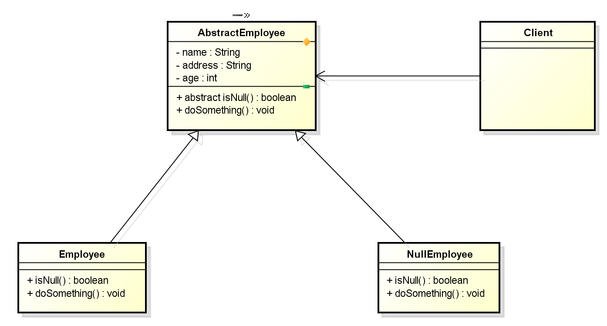

In this article, we will find something out about Null object pattern. It is a behavior pattern, and it makes our program smoothly, do not use overchecking null for objects.

Let's get started.

<br>

## Table of contents
- [Given problem](#given-problem)
- [Solution](#solution)
- [When to use](#when-to-use)
- [Sampe code with Java/C++/Javascript/Python](#sample-code-with-java-c++-javascript-python)
- [Relations with other design patterns](#relations-with-other-design-patterns)
- [Wrapping up](#wrapping-up)


<br>

## Given problem
Normally, before calling method of an object, we usually check null for this object or we can return null if we have weird state in our methods.

Then the amount of if statement for null check get high, the code may become ugly, hard to read and error-prone.

<br>

## Solution
In order to reduce the number of null checks, we can use Null object pattern. Instead of checking null for our objects, we will consider null reference as an normal object.

So, we do not check null for each object before calling methods. Then, we can call them directly. Because of the method's null object will do nothing.

To null object pattern, we should implement null objects as Singleton, because we do not need to create multiple null objects.

<br>

## When to use
- When we do not want to check null references multiple times.
- When we want to provide default behavior for null object.

<br>

## Benefits and Drawbacks
1. Benefits
    - We do not have to check null for every object. So, the number of if statement get low. Our code becomes clean, easy to read. We will easily follow our flow code.

    - Reduce ```NullPointerException``` chances.

    - The Null Object pattern replaces nulls with objects implement

        - A default behavior
        - A do-nothing behavior

        This allows us to avoid null checks.

2. Drawbacks
    - Can be difficult to implement if various clients do not agree on how the null object should do nothing as when your ```AbstractEmployee``` interface is not well defined.

    - Can necessitate creating a new NullObject class for every new ```AbstractEmployee``` class.

    - An incorrect implementation can make bugs harder to detect.

        - Null object can fail slowly.
        - Do not implement it just to avoid null checks.
        - Best suited when a default value can be assigned or a default action can be taken.

    - Creating a proper Null Object may not be easy.

        - Should it do nothing? Or should it fail with an exception?
        - What if we still have to check for the null object?
        - What if the parent class if final? Then we can not create a null object for it. But if we are working with an external library or legacy code, this could happen.

<br>

## Sampe code with Java/C++/Javascript/Python

In this section, we will consider the problem about abstraction of employee, such as:




About source code of Null Object Pattern, you can reference to this [link](https://github.com/gamethapcam/Design-Pattern/tree/master/Behavioral-Pattern/null-object).

<br>

## Relations with other design patterns
- Null object pattern can be regarded as a special case of the ```State pattern``` and the ```Strategy pattern```.

- Null object pattern may be confused with Proxy pattern. But a null object does not work like a proxy. Proxy acts as the objects they are proxying, and they may also provide some behaviors.

<br>

## Applications and examples
- Use with collections in Java

    Assuming that we have DAO pattern for User model, it can be like that:

    ```Java
    public interface UserDao {

        Collection<User> getListOfUsers();

        void deleteUser();

        User getUserById(String id);
    }
    ```

    In order to apply Null object pattern, we should return ```Collections.emptyList()``` in implementation of ```getListofUsers()``` method if we do not have User object in database.

- In Java 8 or above, we can use ```java.util.Optional``` package.

    ```Java
    public Optional<User> findUserById() {
        User user = ...
        return Optional.ofNullable(user);
    }
    ```

- Prior to Java 8, we can use ```com.google.common.base.Optional``` from Google Guava.

- In Eclipse and Intellij, they offer compile time annotations ```@Nullable```, ```@NonNull``` which give compiler warnings when accessing potential null objects.

<br>

## Wrapping up


<br>

Thanks for your reading.

<br>

Refer:

[https://martinfowler.com/eaaCatalog/specialCase.html](https://martinfowler.com/eaaCatalog/specialCase.html)

[https://stackoverflow.com/questions/271526/avoiding-null-statements?rq=1](https://stackoverflow.com/questions/271526/avoiding-null-statements?rq=1)

[https://dzone.com/articles/java-8-optional-avoid-null-and](https://dzone.com/articles/java-8-optional-avoid-null-and)