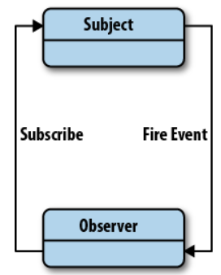
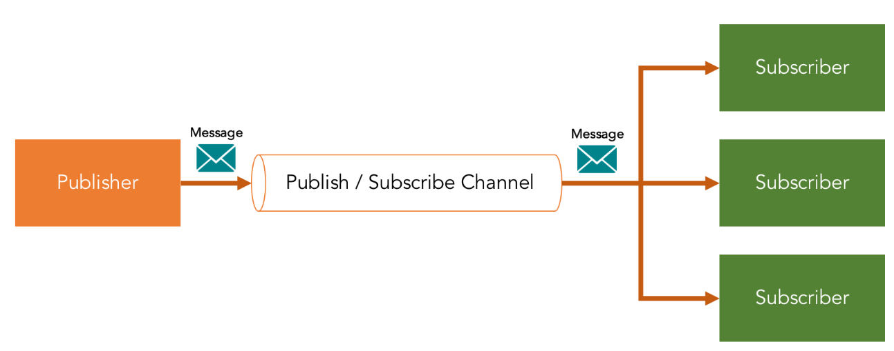

 

## Table of contents
- [Given the problem](#given-the-problem)
- [Solution with publisher-subscriber patter](#solution-with-publisher-subscriber-pattern)
- [When to use](#when-to-use)
- [Benefits and Drawbacks](#benefits-and-drawbacks)
- [The difference between Observer pattern and Publisher/Subscriber pattern](#the-difference-between-observer-pattern-and-publisher/subscriber-pattern)
- [Wrapping up](#wrapping-up)

 

## Given the problem

Before jumping directly into the Publisher/Subscriber pattern, we need to understand the similar pattern that is Observer pattern.

Based on an above image, we can have some notes about it:
- When Subject class's instance changed something, it will notify changes to Observer class's instances immediately.

    So, Subject and Observer are two classes in the same components or packages, ... This pattern was not used in distributed systems.

- The Subject class will maintain a list of Observer class instances by using interface IObserver. But it means that Subject class still know what it contains.

- To update Observer class's instances, the synchronous programming will be applied. It means that the performance of our application can be degraded if the update process takes so much times.

Belows are some drawbacks of Observer patterns when applied in the distributed system:
- Slow

    Because the communication between Subject and Observer utilizes the synchronous programming. So, it will use RESTful API or SOAP. But the time to send messages from Subject to Observers and wait for Observer process completely is large.

- Costly

- Unreliable

-- Limited capacity

Therefore, we need to have some improvements for Observer pattern by answer some questions.
1. How does Observer pattern work in the distributed system?
2. How can apply the asynchronous programming in Observer pattern?
3. How to remove the list of Observer class's instances in Subject class but Observer class's instances still can be updated changes from Subject class's instance.

 

## Solution with publisher-subscriber pattern

All above questions is answered by Publisher/Subscriber pattern. Below is an image that describes how Publisher/Subscriber pattern works.

This pattern have some traits that we need to know:
- A publisher that sends messages but do not send directly to the specific subscribers.

- A subscriber will receive messages from publishers through the other component.

- To communicate between publishers and subscribers, we use a component called **message broker** or **channel** or **event bus**. All Publishers and Subscribers know about it.

- So based on the message broker component, we can apply the asynchronous programming, improve an application's performance.

 

## When to use

- An application needs to broadcast information to a significant number of consumers.

- An application needs to communicate with one or more independently-developed applications or services, which may use different platforms, programming languages, and communication protocols.

- An application can send information to consumers without requiring real-time responses from the consumers.

- The systems being integrated are designed to support an eventual consistency model for their data.

- An application needs to communicate information to multiple consumers, which may have different availability requirements or uptime schedules than the sender.

 

## Benefits and Drawbacks

1. Benefits

    - This effectively could be used to break down an application into smaller, more loosely coupled blocks to improve code management and potential for reuse.

    - Dynamic relationships provide a great deal of flexibility that may not be as easy to implement when disparate parts of our application are tightly coupled.

    - When we can split our system into the smaller systems, our system can be scaled easily.

    - It improves reliability. Asynchronous messaging helps applications continue to run smoothly under increased loads and handle intermittent failures more effectively.

    - It provides separation of concerns for your applications. Each application can focus on its core capabilities, while the messaging infrastructure handles everything required to reliably route messages to multiple consumers.

2. Drawbacks

    - Subscribers are quite ignorant to the existence of each other and are blind to the cost of switching publishers. Due to the dynamic relationship between subscribers and publishers, the update dependency can be difficult to track.

    - By decoupling publishers from subscribers, it can sometimes become difficult to obtain guarantees that particular parts of our applications are functioning as we may expect.

 

## The difference between Observer pattern and Publisher/Subscriber pattern

1. In the Observer pattern, the observers are aware of the observable. But, in Pub-Sub pattern, publishers and subscribers don’t need to know each other. They simply communicate with the help third component.

2. In Pub-Sub pattern components are loosely coupled. But in Observer pattern components are tightly coupled.

3. Observer pattern is mostly implemented in a synchronous way, i.e. the observable calls the appropriate method of all its observers when some event occurs. The Pub-Sub pattern is mostly implemented in an asynchronous way (using message queue).

4. Observer pattern are implemented in single application address where as pub-sub pattern are implemented in cross application.

 

## Wrapping up

- Understanding about publisher/subscriber pattern.

 

Thanks for your reading.

 

Refer:

[https://www.oreilly.com/library/view/learning-javascript-design/9781449334840/ch09s05.html](https://www.oreilly.com/library/view/learning-javascript-design/9781449334840/ch09s05.html)

[https://www.agilecaterpillar.com/blog/observer/](https://www.agilecaterpillar.com/blog/observer/)

[https://www.oreilly.com/library/view/learning-javascript-design/9781449334840/ch09s05.html](https://www.oreilly.com/library/view/learning-javascript-design/9781449334840/ch09s05.html)

[https://docs.microsoft.com/en-us/azure/architecture/patterns/publisher-subscriber](https://docs.microsoft.com/en-us/azure/architecture/patterns/publisher-subscriber)

[http://circe.di.unipi.it/~gervasi/DSDL10/DSDL-07.pdf](http://circe.di.unipi.it/~gervasi/DSDL10/DSDL-07.pdf)