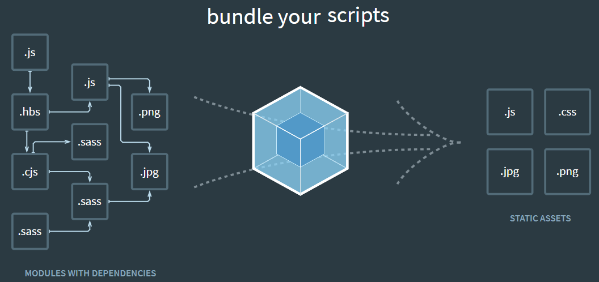

In this article, we will learn how to configure a project that use Webpack and Babel in front-end. It is a first step to work with larger project in the future. So, let's get started.


<br>

## Table of contents
- [What is Webpack ?](#what-is-webpack-?)
- [What is Babel ?](#what-is-babel-?)
- [Setup some packages Webpack and Babel](#setup-some-packages-webpack-and-babel)
- [Wrapping up](#wrapping-up)

<br>

## What is Webpack ?
- Definition of Webpack

  Webpack is a ```Module bundle```. It takes a bunch of assets such as source, images, css, ... to turn them into something that we will send to client. It means that it will package all dependencies into bundles that browser can understand.

  By default, Webpack only knows how to process ```.js``` or ```.json``` files. To do with other format files, we need to use ```Loader``` such as ```HtmlWebPackPlugin``` for html file, ...

  

- Some functionalities in webpack

  - Hot module reloading: updates React component without refresh website.
  - Lazy loading
  - Bundle splitting
  - Hashing
  - Source maps: debug minified version.

- Folder structure of Js application that use Webpack and Babel

  ```js
  - node_modules
  - dist/
  - index.html
  - src/
  - index.js
  - package.json
  - webpack.config.js
  ```

  When Webpack run, Javascript files in source folder ```/src``` will be bundled into a single Javascript file which will be placed automatically into the ```/dist``` folder.

  ```/dist``` will be used to serve our applicatioin to the browser.

- Some modes in Webpack

  There are two modes:
  - development: This mode will remain the structure of file, so, we can easily read source code.

    In order to use development mode, we can configure in package.json file:

    ```json
    "scripts": {
      "start": "webpack-dev-server --mode development --open --hot",
      "build": "webpack --mode development"
    }
    ```

  - production:

    To production mode, all files will be minified. So, these files will be reduced the files's size.

  

<br>

## What is Babel ?

[Babel](https://babeljs.io/docs/en/) is a toolchain that is mainly used to convert ECMAScript 2015+ code into a backwards compatible version of JavaScript in current and older browsers or environments.

<br>

## Setup some packages Webpack and Babel
1. For webpack

    To work with Webpack easily, we need to install some additional packages.

    - webpack

      ```js
      npm install --save-dev webpack
      ```

      Webpack does not compile anything. It simply bundles all things together.

      ```--save-dev``` will saves these packages to devDependencies of package.json, which means these are development packages and user may avoid installing these packages.

    - webpack-dev-server

      ```js
      npm install --save-dev webpack-dev-server
      ```

      Under the hood, ```webpack-dev-server``` is a mini Node.js Express server. It uses a library called SockJS to emulate a web socket.

      ```webpack-dev-server``` is a localhost server which we will use to preview how our web application works. The server will automatically send reload events to the browser to refresh the pages as soon as we make changes to the code. This should be used for development only.

      To run our project with ```webpack-dev-server```, we need to configure in package.json file:

      ```json
      "script": {
        "start:dev": "webpack-dev-server --config ./webpack.config.js --mode development",
        "build": "webpack --config ./webpack.config.js --mode production"
      }
      ```

      And run the following command in our terminal/console:

      ```js
      npm run start:dev
      ```

    - webpack-cli

      ```js
      npm install --save-dev webpack-cli
      ```

      It provides a flexible set of commands for developers to increase speed when setting up a custom webpack project.

      We can refer the [link of Webpack CLI](https://webpack.js.org/api/cli/)

    - webpack-merge

      ```js
      npm install --save-dev webpack-merge
      ```

      Assuming that we have two modes such as: production and development, we want that each mode will have corresponding webpack configuration file. So, we need ```webpack-merge``` package to do that.

2. Webpack plugin

    - uglifyjs-webpack-plugin

      ```js
      npm install --save-dev uglifyjs-webpack-plugin
      ```

      It will be used to minify Javascript bundle made by Webpack.

    - ```html-webpack-plugin``` and ```html-loader```

      ```html-loader``` is used to process ```html``` file.
      
      ```html-webpack-plugin``` will inject js, css into html files, and it is reponsible for create output files in ```./dist``` folder. And ```html-webpack-plugin``` is needed by webpack-dev-server to launch a web preview of our plugin.

      ```js
      npm install --save-dev html-webpack-plugin html-loader
      ```

      If we want to remove the ```/dist``` folder with every Webpack build, it means that the automatic generated ```dist/bundle.js``` file should be removed, and ```dist/index.html``` file will be added automatically. We do not want to create ```dist/index.html``` file manually for every Webpack build again, so, we can use ```html-webpack-plugin```.

      It will simplify creation of HTML files to serve our webpack bundles. This is especially useful for webpack bundles that include a hash in the filename which changes every compilation.

      We can refer [link about html-webpack-plugin](https://github.com/jantimon/html-webpack-plugin).

      Update some plugins in webpack.config.js file:

      ```js
      const HtmlWebPackPlugin = require("html-webpack-plugin");
      
      module.exports = {
        module: {
          rules: [
            ...
          },
          plugins: [
            new HtmlWebPackPlugin({
              template: "./src/index.html",
              filename: "./index.html"
            })
          ]
      };
      ```

    - clean-webpack-plugin

      Because of automatically generating ```dist/index.html``` and ```dist/bundle.js``` files, we can delete the content of our ```/dist``` folder with every Webpack build. So, we need to install ```clean-webpack-plugin```.

      ```js
      npm install --save-dev clean-webpack-plugin
      ```

3. For hot reload

- react-hot-loader

  If we want to use hot loading module when we have changes in our files, we should use ```react-hot-loader```.

  ```js
  npm install --save-dev react-hot-loader
  ```

  Add this plugin into webpack.config.js file:

  ```js
  plugins: [
    new webpack.HotMoudleReplacementPlugin()
  ],
  devServer: {
    contentBase: './dist',
    hot: true
  }
  ```

  In ```src/index.js``` file, we need to define that hot reloading is available:

  ```js
  import React from 'react';
  import ReactDOM from 'react-dom';
  const title = 'React with Webpack and Babel';

  ReactDOM.render(
    <div>{title}</div>,
    document.getElementById('app')
  );

  module.hot.accept();
  ```

4. For Resource

  - file-loader

    ```js
    npm install --save-dev file-loader
    ```

    The ```file-loader``` resolves ```import / require()``` on a file into a url and emits the file into the output directory.
    
    To know more information about ```file-loader```, we can refer [link](https://webpack.js.org/loaders/file-loader/).

    For example:

    In other-file.js, we have:

    ```js
    // It means we will import or require the target files in one of the bundle's file
    import img from './file.png';
    ```

    Then, we have to add ```file-loader``` into webpack.config.js file.

    ```js
    rules: [
      {
        test: /\.(png|jpe?g|gif)$/i,
        loader: 'file-loader',
        options: {
          name: '[name].[ext],
          outputPath: 'assets/images'
        }      
      }
    ]
    ```

    With the above configuration, images will be emitted to ```dist/assets/images/file.png```.

5. CSS loader and plugin

    - ```css-loader``` and ```style-loader```

      ```js
      npm install --save-dev css-loader style-loader
      ```

      We will use ```css-loader``` and ```style-loader``` to import ```.css``` file into Javascript file (which ```sass-loader``` generates) and finally inject into DOM in ```style``` tag.

    - ```sass-loader``` and ```node-sass```

      ```js
      npm install --save-dev sass-loader node-sass
      ```

      To load ```.scss``` files into Javascript file using ES6 import syntax and compile them to CSS, we need to install ```sass-loader``` and ```node-sass``` which will do actual compilation.

    - ```postcss-loader```, ```cssnano```, and ```autoprefixer```

      ```js
      npm install --save-dev postcss-loader cssnano autoprefixer
      ```

      To minify and add prefixes to CSS (for browser compatibility) we need to use ```postcss-loader``` and some its dependencies such as ```cssnano```, ```autoprefixer``` to do its actual works.

      In webpack, we can use postcss-loader with autoprefixer and other PostCSS plugins. So, in webpack.config.js or webpack.prod.js or webpack.dev.js, we have:

      ```js
      module.exports = {
        module: {
          rules: [
            {
              test: /\.css$/,
              use: ["style-loader", "css-loader", "postcss-loader"]
            }
          ]
        }
      }
      ```

      Then, we have to ```create postcss.config.js``` file:

      ```js
      module.exports = {
        plugins: [
          require('autoprefixer')
        ]
      }
      ```

      To know more information about configuration of css plugin, we can reference to [link](https://github.com/postcss/autoprefixer).

    - mini-css-extract-plugin

      ```js
      npm install --save-dev mini-css-extract-plugin
      ```

      This plugin extracts CSS into separate files. It creates a CSS file per JS file which contains CSS. It supports On-Demand-Loading of CSS and SourceMaps.

      It builds on top of a new webpack v4 feature (module types) and requires webpack 4 to work.

      Compared to the extract-text-webpack-plugin:
      - Async loading
      - No duplicate compilation (performance)
      - Easier to use
      - Specific to CSS

      Refer to [link](https://github.com/webpack-contrib/mini-css-extract-plugin).

    - optimize-css-assets-webpack-plugin

      ```js
      npm install --save-dev optimize-css-assets-webpack-plugin
      ```

      This plugin will search for CSS assets during the Webpack build and optimize / minimize the CSS (by default it uses ```cssnano``` package).

      We can refer this [link](https://github.com/NMFR/optimize-css-assets-webpack-plugin).

6. For Babel

    - babel-loader

        It is the Webpack loader responsible for taking in the ES6 code and making it understandable by the browser. It will load ES6 modules in node.js using import syntax (node.js does not support ```import``` syntax). So, we need to install ```babel-loader``` and ```@babel/core```.

        ```js
        npm install --save-dev babel-loader @babel/core
        ```

        A loader has basic three parts:
        - test - use regex to determine the type of files
        - exclude - the folders that we want Webpack omits
        - use: loader - the loader that we want to Webpack use to process files.

    - @babel/preset-env

        It is used to compile Javascript ES6 down to ES5. And ```babel-preset-es2015``` package is deprecated.

        With ES6 arrow function, ```@babel/preset-env``` will convert arrow function to traditional function.

        ```js
        npm install --save-dev @babel/preset-env
        ```

    - @babel/preset-react

        In order that the syntax of React will be understood by other browsers, so we need Babel to transpile React code ```JSX``` to Javascript.

        ```js
        npm install --save-dev @babel/preset-react
        ```

        Then, we will find ```.babelrc``` file to add some configuration lines:

        ```json
        {
          "presets": [
            "@babel/preset-env",
            "@babel/preset-react"
          ]
        }
        ```

        Finally, let's inform Webpack in webpack.config.js file about files with JSX extension to make sure that they run through the transpiling step:

        ```js
        module.exports = {
          entry: './src/index.js',
          module: {
            rules: [
              {
                test: /\.(js|jsx)$/,
                exclude: /node_modules/,
                use: ['babel-loader']
              }
            ]
          },
          resolve: {
            extensions: ['*', '.js', '.jsx']
          },
          output: {
            path: __dirname + '/dist',
            publicPath: '/',
            filename: 'bundle.js'
          },
          devServer: {
            contentBase: './dist'
          }
        };
        ```

    - babel-preset-transform-object-rest-spread

      ```js
      npm install --save-dev babel-preset-transform-object-rest-spread
      ```

      It is a plugin to support Object rest/spread syntax if our babel preset doesn't support it.

7. For React.js

    Install some packages for react.js:

    ```js
    // Use must-downloaded react, react-dom packages
    npm install --save react react-dom

    // if we want to use typescript with react
    npm install --save-dev @types/react @types/react-dom

    // use Prop-types to document our React components
    // https://reactjs.org/docs/typechecking-with-proptypes.html
    npm install --save-dev prop-types
    ```

8. For Redux

We will install some packages for redux, like that:

```js
// Use redux
npm install --save redux react-redux react-router-dom

// If we want to program asynchronous with redux, use redux-thunk
npm install --save redux-thunk

// we can use typescript versions of above packages
npm install --save-dev @types/react-redux @types/react-router-dom
```


<br>

## Wrapping up
- Understanding how Webpack works, we can easily configure all project that use Webpack and Babel.

- Remember that all above plugins or loaders that are necessary to work.

- Below is the content of ```webpack.config.js``` file that we need to know:

  ```js
  const webpack = require("webpack");
  const path = require('path');
  const HtmlWebPackPlugin = require('html-webpack-plugin');
  const FaviconsWebpackPlugin = require('favicons-webpack-plugin');
  const CopyWebpackPlugin = require('copy-webpack-plugin');
  
  const assets = [{
      from: 'assets',
      to: 'assets'
    }
  ];

  module.exports = {
    // Where to start bundling
    entry: {
      app: "./src/index.js",
      home: './src/home.js',
      contact: './src/contact.js'
    },

    // Where to output
    output: {
      // Output to the same directory or use dist child directory
      path: path.resolve(__dirname, 'dist'),  // __dirname
      publicPath: '/',
      // Capture name from the entry using a pattern
      filename: "bundle.js"
    },

    // How to resolve encountered imports
    module: {
      rules: [
        {
          test: /\.css$/,
          use: ["style-loader", "css-loader"],
        },
        {
          test: /\.(ts|tsx|js|jsx)$/,
          exclude: /node_modules/,
          use: "babel-loader" // or we can use awesome-typescript-loader
        },
        {
          test: /\.html$/,
          use: [
            {
              loader: "html-loader",
              options: {
                minimize: true
              }
            }
          ]
        },
        {
          test: /\.scss$/,
          use: [
            'style-loader',
            'css-loader',
            'postcss-loader',
            'sass-loader'
          ]
        },
        {
          test: /\.(woff(2)?|ttf|eot|svg)(\?v=\d+\.\d+\.\d+)?$/,
          use: [{
              loader: 'file-loader',
              options: {
                  name: '[name].[ext]',
                  outputPath: 'assets/fonts/'
              }
          }]
        },
        {
          test: /\.ico?$/,
          use: [{
              loader: 'file-loader',
              options: {
                  name: '[name].[ext]',
                  outputPath: './'
              }
          }]
        },
      ]
    },

    // What extra processing to perform
    plugins: [
      new FaviconsWebpackPlugin('./assets/images/logo.png'),
      new webpack.DefinePlugin({
        SUBDIRECTORY: JSON.stringify(require("./package.json").subdirectory)
      }),
      new uglifyJsPlugin(),
      new HtmlWebPackPlugin({
          template: "./src/index.html",
          filename: "./index.html"
      }),
      new CleanWebpackPlugin(),
      new webpack.HotModuleReplacementPlugin(),
      new CopyWebpackPlugin(assets)
    ],

    // Adjust module resolution algorithm
    resolve: {
      extensions: ['.ts', '.tsx', '.js', '.jsx', '.json']
    },
    devServer: {
      colors: true,
      contentBase: './dist',
      historyApiFallback: true,
      hot: true,
      inline: true,
      port: 3000,
      progress: true,
      stats: {
        cached: false
      }
    }
  };
  ```

<br>

Refer:

[https://blog.linguinecode.com/post/how-to-setup-webpack-dev-server-react-babel](https://blog.linguinecode.com/post/how-to-setup-webpack-dev-server-react-babel)

[https://gaearon.github.io/react-hot-loader/getstarted/](https://gaearon.github.io/react-hot-loader/getstarted/)

[https://www.valentinog.com/blog/babel/](https://www.valentinog.com/blog/babel/)

[https://www.valentinog.com/blog/webpack/](https://www.valentinog.com/blog/webpack/)

[https://levelup.gitconnected.com/what-is-webpack-4fdb624597ae](https://levelup.gitconnected.com/what-is-webpack-4fdb624597ae)

[https://tech.3si.vn/2017/11/24/meo-toi-uu-hoa-webpack-bundle/](https://tech.3si.vn/2017/11/24/meo-toi-uu-hoa-webpack-bundle/)

[https://www.robinwieruch.de/webpack-setup-tutorial](https://www.robinwieruch.de/webpack-setup-tutorial)

[https://survivejs.com/webpack/what-is-webpack/](https://survivejs.com/webpack/what-is-webpack/)

[https://www.robinwieruch.de/webpack-advanced-setup-tutorial](https://www.robinwieruch.de/webpack-advanced-setup-tutorial)

[https://www.robinwieruch.de/minimal-react-webpack-babel-setup](https://www.robinwieruch.de/minimal-react-webpack-babel-setup)

[https://www.robinwieruch.de/minimal-react-webpack-babel-setup#react-webpack](https://www.robinwieruch.de/minimal-react-webpack-babel-setup#react-webpack)

[https://www.robinwieruch.de/webpack-babel-setup-tutorial](https://www.robinwieruch.de/webpack-babel-setup-tutorial)

[http://vuilaptrinh.com/2018-05-25-huong-dan-viet-code-javascript-tot-hon-voi-webpack/](http://vuilaptrinh.com/2018-05-25-huong-dan-viet-code-javascript-tot-hon-voi-webpack/)