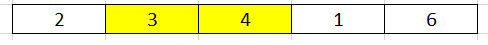
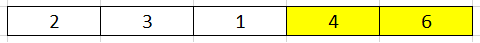
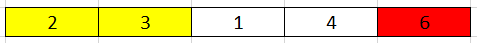

<br>

## Table of contents
- [Given problem](#given-problem)
- [Introduction to Bubble sort](#introduction-to-bubble-sort)
- [Steps of Bubble sort](#steps-of-bubble-sort)
- [Source code](#source-code)
- [When to use](#when-to-use)
- [Benefits and Drawbacks](#benefits-and-drawbacks)
- [Wrapping up](#wrapping-up)


<br>

## Given problem

Given an array nums = {3, 2, 4, 1, 6}. How to use Bubble sort for this array.

How to optimize for the case - sorted array.


<br>

## Introduction to Bubble sort

According to [wikipedia.com](https://en.wikipedia.org/wiki/Bubble_sort), we have the definition of Bubble sort:

```
Bubble sort, sometimes referred to as sinking sort, is a simple sorting algorithm that repeatedly steps through the list, compares adjacent elements and swaps them if they are in the wrong order.

The pass through the list is repeated until the list is sorted. The algorithm, which is a comparison sort, is named for the way smaller or larger elements "bubble" to the top of the list.

This simple algorithm performs poorly in real world use and is used primarily as an educational tool. More efficient algorithms such as timsort, or merge sort are used by the sorting libraries built into popular programming languages such as Python and Java.
```

<br>

## Steps of Bubble sort

The main idea of the bubble sort is to swap two adjacent elements. Then each loop, we can find the kth largest element of this array.

Let's see the original array.


Belows are som steps to sort elements.

1. First outer loop

    

    

    

    

    Then, after first loop, the larget number will be put into the last index of an array.

    

2. Second outer loop

    In the second loop, we do not touch to the last element because it is the largest element. So, we only take care about elements in range **(0, n - 2)**, with n is the length of an array.

    

    

    

    After the second loop, we will find the 2nd largest element.

    

3. Third outer loop

    Now, the last index of this third loop is **n - 3**.

    

    

    So, we will have the 3rd largest element.

    

4. Forth outer loop

    

    After this final swap, we have a sorted array.

    


<br>

## Source code

Below is the original bubble sort.

```java
public void sort(int[] nums) {
    int len = nums.length;

    for (int i = 0; i < len; ++i) {
        for (int j = 0; j < len - i - 1; ++j) {
            if (nums[j] > nums[j + 1]) {
                int tmp = nums[j];
                nums[j] = nums[j + 1];
                nums[j + 1] = tmp;
            }
        }
    }
}
```

The complexity of this bubble sort is:
- Time complexity: O(n^2)
- Space complexity: O(1)

The problem of an above solution is that it sorts an array even if an array is sorted, the swapping operation is redundancy.

So, to optimize an above solution, we can use boolean isSwapped to check whether an array is sorted or not.

```java
public void sort(int[] nums) {
    int len = nums.length;
    boolean isSwapped;

    for (int i = 0; i < len; ++i) {
        isSwapped = false;
        for (int j = 0; j < len - i - 1; ++j) {
            if (nums[j] > nums[j + 1]) {
                int tmp = nums[j];
                nums[j] = nums[j + 1];
                nums[j + 1] = tmp;

                isSwapped = true;
            }
        }

        if (!isSwapped) {
            break;
        }
    }
}
```

The complexity of this solution:
- Time complexity: Worst case - O(n^2), Best case - O(n)
- Space complexity: O(1)

Some conclusion for the implementation of Bubble sort:
- the index of outter loop is used to set the length of array that is scanned.

    With above array, the inner loop will scan the array's length from n - 1 to 0.

    Because the length of an array in inner loop is calculated by expression: **len - i - 1**.

<br>

## When to use

- When the number of array's elements is small.

- When the order of its array is partialy sorted.


<br>

## Benefits and Drawbacks

1. Benefits

    - sort array elements in-place.

    - uses less storage space.

    - The only significant advantage that bubble sort has over most other implementations, even quicksort, but not insertion sort, is that the **ability to detect that the list is sorted efficiently is built into the algorithm.** When the list is already sorted (best-case), the complexity of bubble sort is only O(n).

    - It's stable sort because after sorted, the relative order of equal elements is remained.

2. Drawbacks

    - In large collection, we should not use Bubble sort.

    - Bubble sort also interacts poorly with modern CPU hardware. It produces at least twice as many writes as insertion sort, twice as many cache misses, and asymptotically more branch mispredictions.

<br>

## Wrapping up
- Bubble sort is asymptotically equivalent in running time to insertion sort in the worst case, but the two algorithms differ greatly in the number of swaps necessary.

    Experimental results such as those of Astrachan have also shown that insertion sort performs considerably better even on random lists. For these reasons many modern algorithm textbooks avoid using the bubble sort algorithm in favor of insertion sort.


