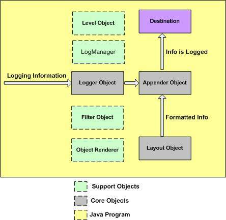

In our application, logging is a vital functionality that we will import when creating project. It makes us to detect bugs, problems in logging file when program runs at runtime mode.

So, in this article, we will learn how to configure log4j 1.x framework in our project.

Let's get started.

<br>

## Table of contents
- [The structure of Log4j](#the-structure-of-log4j)
- [Some packages that need for Log4j 1.x](#some-packages-that-need-for-log4j-1.x)
- [Configure Log4j 1.x with properties file](#configure-log4j-1.x-with-properties-file)
- [Wrapping up](#wrapping-up)

<br>

## The structure of Log4j

Below is an image that describe Log4j 1.x's architecture. It's very important because understanding its architecture will help us to configure correctly.



- Logger Object

    It is topmost level layer of Log4j 1.x. It is used to contain logging information to write some places that we want.

- Appender Object

    It is a lower-level layer of Log4j 1.x. It delivers the ```Appender``` objects which is responsible for publishing the logging information to the several desired destinations such as a plain file on a hard disk, a database (i.e. Oracle, MySQL, etc.), and a log management system (LMS), a console, UNIX filesystem, etc.

- Layout Object

    This layer is used to formatting all our logging information what we want.

- Level Object

    - ```FATAL```: shows messages at a FATAL level only.

    - ```ERROR```: Shows messages classified as ERROR and FATAL.

    - ```WARNING```: Shows messages classified as WARNING, ERROR, and FATAL.
    
    - ```INFO```: Shows messages classified as INFO, WARNING, ERROR, and FATAL.

    - ```DEBUG```: Shows messages classified as DEBUG, INFO, WARNING, ERROR, and FATAL.

    - ```TRACE``` : Shows messages classified as TRACE,DEBUG, INFO, WARNING, ERROR, and FATAL.

    - ```ALL``` : Shows messages classified as TRACE,DEBUG, INFO, WARNING, ERROR, and FATAL.

    - ```OFF``` : No log messages display.

    In the log4j framework, the following is order of the levels.
    
    ALL < DEBUG < INFO < WARN < ERROR < FATAL < OFF

- Log Manager

    LogManager is responsible for managing all information in ```log4j.properties``` by reading it at the first time.

<br>

## Some packages that need for Log4j 1.x
Below is some packages of Log4j 1.x that we need to install. All of them is put into ```pom.xml``` file in Maven project.

```xml
<dependency>
    <groupId>log4j</groupId>
    <artifactId>log4j</artifactId>
    <version>1.2.17</version>
</dependency>

<dependency>
    <groupId>log4j</groupId>
    <artifactId>apache-log4j-extras</artifactId>
    <version>1.2.17</version>
</dependency>
```

<br>

## Configure Log4j 1.x with properties file
Below is an log4j.properties file that we need to configure when utilizing Log4j 1.x.

```python
# The following properties set the logging levels and log appender.
# The log4j.rootCategory variable defines the default log level and one or more appenders.
# For the console, use 'S'.  For the daily rolling file, use 'R'.
# For an HTML formatted log, use 'H'.
# Possible Log Levels : FATAL, ERROR, WARN, INFO, DEBUG
log4j.rootCategory = INFO, S

# Define the root logger with logging's level and appender files: file, console
log4j.rootLogger=INFO, file, console

# Define the file appender
log4j.appender.file=org.apache.log4j.RollingFileAppender
#log4j.appender.file.datePattern='.'yyyy-MM-dd-HH-mm

# Set the append to false, overwrite
#log4j.appender.file.Append=false

# Set the name of the file
log4j.appender.file.File=${log}/sample.log

# Set the maximum file size before rollover
#log4j.appender.file.MaxFileSize=10KB

# Set the the backup index
#log4j.appender.file.MaxBackupIndex=20

log4j.appender.file.rollingPolicy=org.apache.log4j.rolling.TimeBasedRollingPolicy
log4j.appender.file.rollingPolicy.FileNamePattern=worker-.%d{yyyy-MM-dd'T'HH:mm:ss.SSS}.gz

# Define the layout for file appender
log4j.appender.file.layout=org.apache.log4j.PatternLayout
log4j.appender.file.layout.ConversionPattern=%d{yyyy-MM-dd HH:mm:ss,SSS} %-5p - %m%n

# Define encoding for output file
log4j.appender.file.encoding=UTF-8

# Configure logger with name = "com.manhpd". It is also associated with appenders: file, console
log4j.logger.com.manhpd=DEBUG, console, file
log4j.additivity.com.manhpd=false

log4j.logger.nameLogger=nameLoggingLevel, appender_1, appender_2
log4j.additivity.nameLogger=false
```

Then, it is an test file for using log4j.properties file.

```java
public class App 
{
    private static Logger logger = LogManager.getLogger(App.class);

    public static void main( String[] args ) throws InterruptedException {
        for(int i = 0; i < 2000; i++) {
            System.out.println("Logging.\n");
            logger.info("This is the " + i + " time I say 'Hello World'.");
            Thread.sleep(100);
        }
    }
}
```

<br>


## Wrapping up
- Understanding configurations of Log4j 1.x such as all parts of Log4j, functionality of each part, ...
- Configure xml or properties file easily.
- In order to use Log4j 1.x in Spring boot, we can do like this [link](https://stackoverflow.com/questions/29225777/log4j-properties-in-spring-boot).


<br>

Refer:

[https://stackoverflow.com/questions/4933707/what-does-these-properties-in-log4j-properties-mean](https://stackoverflow.com/questions/4933707/what-does-these-properties-in-log4j-properties-mean)

[https://huongdanjava.com/overview-about-log4j-1-x.html](https://huongdanjava.com/overview-about-log4j-1-x.html)

[https://github.com/eugenp/tutorials/tree/master/logging-modules](https://github.com/eugenp/tutorials/tree/master/logging-modules)

[https://www.mkyong.com/logging/log4j-log4j-properties-examples/](https://www.mkyong.com/logging/log4j-log4j-properties-examples/)

[https://www.dev2qa.com/how-to-configure-log4j-in-java-project-examples/](https://www.dev2qa.com/how-to-configure-log4j-in-java-project-examples/)

[https://jazz.net/help-dev/clm/index.jsp?topic=%2Fcom.ibm.jazz.repository.web.admin.doc%2Ftopics%2Ft_customizing_log_file.html](https://jazz.net/help-dev/clm/index.jsp?topic=%2Fcom.ibm.jazz.repository.web.admin.doc%2Ftopics%2Ft_customizing_log_file.html)

[https://www.codejava.net/coding/common-conversion-patterns-for-log4js-patternlayout](https://www.codejava.net/coding/common-conversion-patterns-for-log4js-patternlayout)

[https://www.tutorialspoint.com/log4j/log4j_patternlayout.htm](https://www.tutorialspoint.com/log4j/log4j_patternlayout.htm)

[https://www.tutorialspoint.com/log4j/log4j_logging_files.htm](https://www.tutorialspoint.com/log4j/log4j_logging_files.htm)

[http://2min2code.com/articles/log4j_intro/rolling_archiving_file_per_day_prop](http://2min2code.com/articles/log4j_intro/rolling_archiving_file_per_day_prop)

[https://examples.javacodegeeks.com/enterprise-java/log4j/log4j-date-format-example/](https://examples.javacodegeeks.com/enterprise-java/log4j/log4j-date-format-example/)

[https://logging.apache.org/log4j/2.x/manual/layouts.html](https://logging.apache.org/log4j/2.x/manual/layouts.html)

<br>

**Mark number line in log file**

[https://stackoverflow.com/questions/53807429/is-there-way-to-specify-current-line-number-in-log4j-pattern](https://stackoverflow.com/questions/53807429/is-there-way-to-specify-current-line-number-in-log4j-pattern)