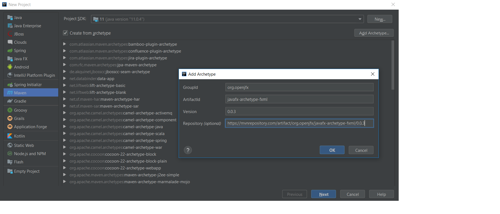
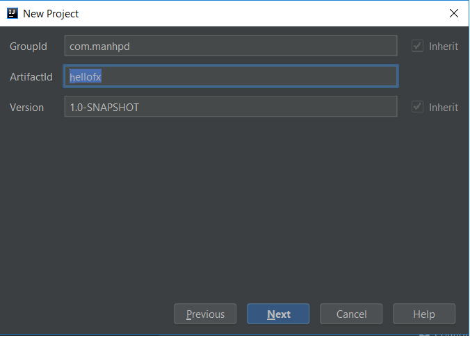
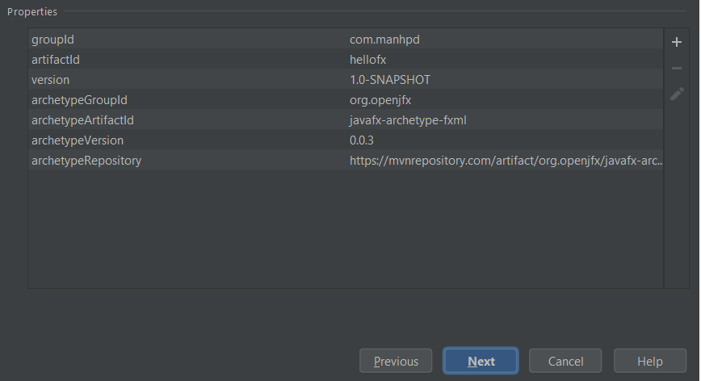
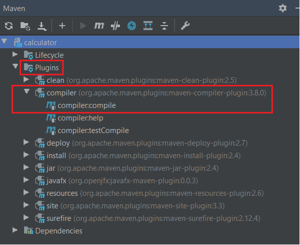
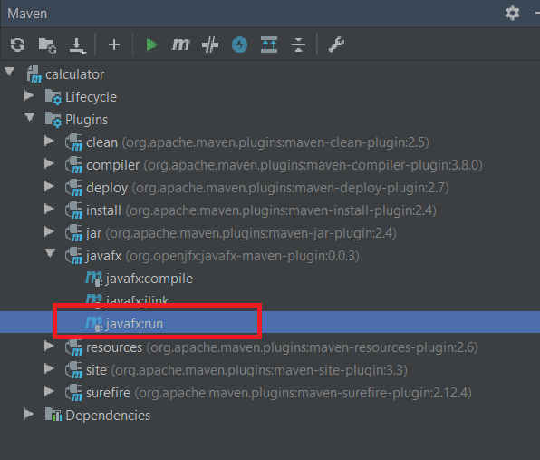
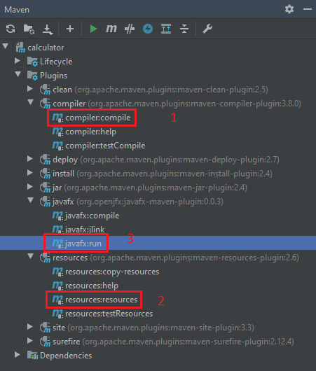
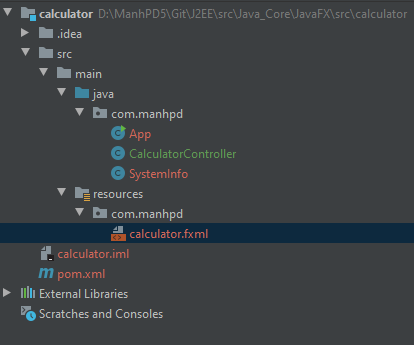
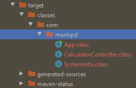
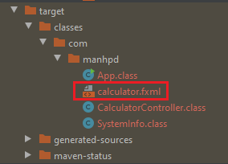
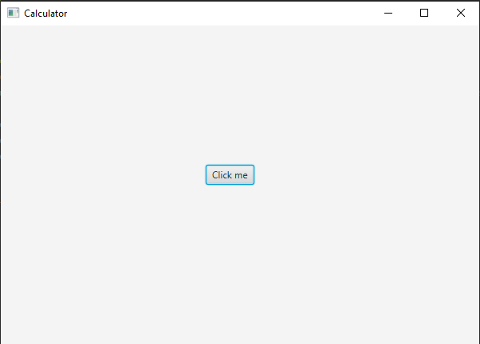

In this article, we will find something out about how to create JavaFX project with Maven. It will help us improving productivity, performance when we can program automatically small task with desktop applications.

Let's get started.

<br>

## Table of contents
- [What is JavaFX](#what-is-javafx)
- [Creating JavaFX Project with Maven](#creating-javafx-project-with-maven)
- [Wrapping up](#wrapping-up)


<br>

## What is JavaFX

According to [wikipedia.com](https://en.wikipedia.org/wiki/JavaFX), we have:

```
JavaFX is a software platform for creating and delivering desktop applications, as well as rich Internet applications that can run across a wide variety of devices.

JavaFX is intended to replace Swing as the standard GUI library for Java SE, but both will be included for the foreseeable future. JavaFX has support for desktop computers and web browsers on Microsoft Windows, Linux, and macOS. Since the JDK 11 release in 2018, JavaFX is part of the open-source OpenJDK, under the OpenJFX project.

Oracle 'Premier Support' for JavaFX is also available, for the current long-term version (Java JDK 8), through March 2022.
```

<br>

## Creating JavaFX Project with Maven
1. Use ```archetype``` in maven to create project

    When we refer to this [link](https://mvnrepository.com/artifact/org.openjfx), we can find that there are so many packages for JavaFX. But in this section, we need to focus on two archetypes that are supported by Maven.
    
    They include: 
    - [FXML JavaFX Maven Archetype](https://mvnrepository.com/artifact/org.openjfx/javafx-archetype-fxml)

        ```xml
        <dependency>
            <groupId>org.openjfx</groupId>
            <artifactId>javafx-archetype-fxml</artifactId>
            <version>0.0.3</version>
        </dependency>
        ```

    - [Simple JavaFX Maven Archetype](https://mvnrepository.com/artifact/org.openjfx/javafx-archetype-simple)

        ```xml
        <dependency>
            <groupId>org.openjfx</groupId>
            <artifactId>javafx-archetype-simple</artifactId>
            <version>0.0.3</version>
        </dependency>
        ```

    Both archetypes for JavaFX have three version, from ```0.0.1``` to ```0.0.3```.

    So, in our project, we find that ```javafx-archetype-fxml``` does not belong to current archetypes of Maven. So, we need to add ```javafx-archetype-fxml``` in our Maven.

    First, select ```File -> New -> Project -> Maven```, and enable ```Create from archetype```.

    If the JavaFX ```javafx-archetype-fxml``` has not installed yet, select ```Add archetype ...```, and fill information to follow a below dialog:

    

    Once installed, select this artifact, and Next button.

2. Create groupId, artifactId, version for our project and confirm again

    

    

3. After finishing to creat javafx project, move on ```pom.xml``` file.

    First, we can see the structure of javafx project with Maven:

    

    Second, content of ```pom.xml``` file:

    ```xml
    <project xmlns="http://maven.apache.org/POM/4.0.0" xmlns:xsi="http://www.w3.org/2001/XMLSchema-instance"
  xsi:schemaLocation="http://maven.apache.org/POM/4.0.0 http://maven.apache.org/maven-v4_0_0.xsd">
        <modelVersion>4.0.0</modelVersion>
        <groupId>com.manhpd</groupId>
        <artifactId>hellofx</artifactId>
        <version>1.0-SNAPSHOT</version>
        <properties>
            <project.build.sourceEncoding>UTF-8</project.build.sourceEncoding>
            <maven.compiler.source>11</maven.compiler.source>
            <maven.compiler.target>11</maven.compiler.target>
        </properties>
        <dependencies>
            <dependency>
                <groupId>org.openjfx</groupId>
                <artifactId>javafx-controls</artifactId>
                <version>13</version>
            </dependency>
            <dependency>
                <groupId>org.openjfx</groupId>
                <artifactId>javafx-fxml</artifactId>
                <version>13</version>
            </dependency>
        </dependencies>
        <build>
            <plugins>
                <plugin>
                    <groupId>org.apache.maven.plugins</groupId>
                    <artifactId>maven-compiler-plugin</artifactId>
                    <version>3.8.0</version>
                    <configuration>
                        <release>11</release>
                    </configuration>
                </plugin>
                <plugin>
                    <groupId>org.openjfx</groupId>
                    <artifactId>javafx-maven-plugin</artifactId>
                    <version>0.0.3</version>
                    <configuration>
                        <mainClass>com.manhpd.App</mainClass>
                    </configuration>
                </plugin>
            </plugins>
        </build>
    </project>
    ```

    Finally, we also insert some dependencies such as ```javafx-graphics```, and ```javafx-media```.

4. Run our project

    In Maven tab, we choose ```Plugins```, then ```compiler``` parent in hierarchy project. Select ```compiler:compile```.

    

    After compiling , we need to run ```Plugins -> javafx -> javafx:run```.

    

5. Common problems when creating JavaFX project

    - ```Location is required```

        Solution: 
        - First way, we can specify the path of our ```fxml``` file such as:

            ```java
            URL url = new File("src/main/resources/fxml/calculator.fxml").toURI().toURL();
            Parent root = FXMLLoader.load(url);
            ```

        - Second way, we will do the following steps:

            - Assuming that our project have structure and some plugins:

                

                

                We created ```com.manhpd``` in ```resources``` folder to put all ```.fxml``` files  into the same folder with our source ```.class``` files.

                So, in our code, we only need to use relative path in segment code:

                ```java
                getClass().getResource("calculator.fxml");
                ```

            - Run ```mvn compiler:compile```

                It belongs to ```maven-compiler-plugin```.

                After run this command, we have:

                

                It does not have ```calculator.fxml``` file. So, after run command ```mvn javafx:run```, our program do not find this file, it will throw an exception ```Location is required``` or ```NullPointerException``` in ```getClass().getResource("calculator.fxml");```.

                So, to solve this problem, we will move on the next steps.

            - Run ```mvn resources:resources```

                It belongs to ```maven-resources-plugin```. 

                Refer to this [link](https://maven.apache.org/plugins/maven-resources-plugin/).
                
                The Resources Plugin handles the copying of project resources to the output directory. 
                
                There are two different kinds of resources: main resources and test resources. The difference is that the main resources are the resources associated to the main source code while the test resources are associated to the test source code.

                ```resources:resources``` copies the resources for the main source code to the main output directory.

                This goal usually executes automatically, because it is bound by default to the process-resources life-cycle phase. It always uses the ```project.build.resources``` element to specify the resources, and by default uses the ```project.build.outputDirectory``` to specify the copy destination.

                After running ```mvn resources:resources```, our built folder can have:

                

            - Run ```mvn javafx:run```

                We have result:

                

    - ```Command execution failed.```

        After run all above steps, we can encounter error like a below image:

        ```
        Error: Could not create the Java Virtual Machine.
        Error: A fatal exception has occurred. Program will exit.
        Unrecognized option: --module-path
        [ERROR] Command execution failed.
        ```

        ```Unrecognized option: --module-path``` means that you are running with **Java 1.8**. We need to set JDK 11/12 before running ```mvn javafx:run```.

        To fix this problem, we should insert ```<configuration><executable>/path/to/jdk-11-12/bin/java</executable></configuration>``` into **javafx-maven-plugin** of **pom.xml** file.

        ```xml
        <plugin>
            <groupId>org.openjfx</groupId>
            <artifactId>javafx-maven-plugin</artifactId>
            <version>0.0.3</version>
            <configuration>
                <mainClass>org.openjfx.App</mainClass>
                <executable>C:\Program Files\Java\jdk-11.0.4\bin\java</executable>
            </configuration>
        </plugin>
        ```


    Note:
    - ```getClass().getClassLoader().getResource(...)``` will load a resource from a path relative to the classpath. Since you placed the FXML file in the ```application``` pacakge, you need:

        ```java
        Parent root=FXMLLoader.load(getClass().getClassLoader().getResource("application/Main.fxml"));
        ```

        If you just use ```getClass().getResource(...)```, and do not prefix the path with ```/```, it will load from a path relative to the current class. So,

        ```java
        Parent root=FXMLLoader.load(getClass().getResource("Main.fxml"));
        ```

        Make sure that our FXML file is being exported to the build folder, along with the ```.class``` files.
        
<br>

## Wrapping up
- Understanding about how to create our javafx project.


<br>

Refer:

[https://gluonhq.com/products/javafx/](https://gluonhq.com/products/javafx/)

[https://openjfx.io/openjfx-docs/#maven](https://openjfx.io/openjfx-docs/#maven)

[https://github.com/openjfx/samples](https://github.com/openjfx/samples)

[https://github.com/openjfx/javafx-maven-plugin](https://github.com/openjfx/javafx-maven-plugin)

[https://stackoverflow.com/questions/52906773/intellij-idea-error-javafx-runtime-components-are-missing-and-are-required-t](https://stackoverflow.com/questions/52906773/intellij-idea-error-javafx-runtime-components-are-missing-and-are-required-t)

[https://mvnrepository.com/artifact/org.openjfx](https://mvnrepository.com/artifact/org.openjfx)