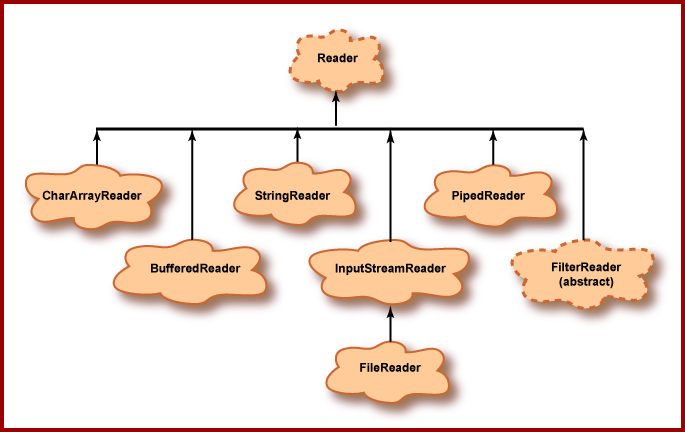
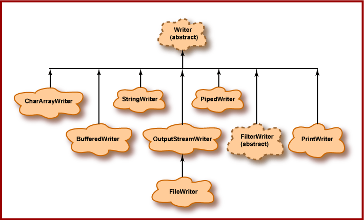

In this article, we will go through CharacterStream in java.io package, how to use each class in this package efficiently.

Let's get started.

<br>

## Table of contents
- [Background about character stream](#background-about-character-stream)
- [Benefits of Character streams](#benefits-of-character-streams)
- [InputStreamReader](#InputStreamReader)
- [OutputStreamWriter](#OutputStreamWriter)
- [BufferedReader](#BufferedReader)
- [BufferedWriter](#BufferedWriter)
- [FileReader](#FileReader)
- [FileWriter](#FileWriter)
- [Wrapping up](#wrapping-up)

<br>

## Background about character stream
JDK's version 1.1 supported for character streams to the ```java.io``` package. Prior to JDK 1.1, the standard I/O facilities support only byte streams, via InputStream and OutputStream and subclasses.

The difference between character streams and byte streams is that Character streams contains 16-bit Unicode characters, Byte streams only contain 8-bit bytes.

Class Diagram of Character stream:





The most important concrete subclasses of Reader and Writer are the ```InputStreamReader``` and ```OutputStreamWriter``` classes.

The ```InputStreamReader``` and ```OutputStreamWriter``` classes act as decorators on top of input and output streams that change the interface from a byte-oriented interface to a character-oriented character.

In addition to these two classes, the ```java.io``` package also includes several raw reader and writer classes that read characters ```without directly requiring an underlying input stream```. These include:
- File Reader/Writer
- String Reader/Writer
- CharArray Reader/Writer

--> File Reader/Writer works with files, and String/CharArray Reader/Writer work internally to Java.

<br>

## Benefits of Character streams
- easy to write programs that are not dependent upon a specific character encoding, and therefore easy to internationlize.

- Character streams are potentially much more efficient then Byte streams.

    The implementations of many of Java's original byte streams are oriented around ```byte-at-a-time``` read and write operations. The character-stream classes, in contrast, are oriented around ```buffer-at-a-time``` read and write operations. 
    
    This difference, in combination with a more efficient locking scheme, allows the character stream classes to make up for the added overhead of encoding conversion in many cases.

<br>

## InputStreamReader
An ```InputStreamReader``` contains ```an underlying input stream``` from which it reads raw bytes. It translate these bytes into Unicode characters according to a specified encoding.

Its constructors specify the input stream to read and the encoding to use:

```java
public InputStreamReader(InputStream in);

public InputStreamReader(InputStream in, String encoding) throws UnsupportedEncodingException;
```

<br>

## OutputStreamWriter
An ```OutputStreamWriter``` receives Unicode characters from a running program. It then translates those characters into bytes using a specified encoding and writes the bytes onto an underlying output stream.

Its constructor specifies the output stream to write and the encoding to use:

```java
public OutputStreamWriter(OutputStream out, String encoding) throws UnsupportedEncodingException;

public OutputtStreamWriter(OutputStream out);
```

For example:

```java
OutputStreamWriter osw = new OutputStreamWriter(new FileOutputStream("data.txt", "Cp1253"));
... 
```

<br>

## BufferedReader
A ```BufferedReader``` reads text from a character-input stream, buffering characters so as to provide for the efficient reading of characters, arrays, and lines.

Its constructors specify the ```Reader``` to read and the buffer size may be specified:

```java
public BufferReader(Reader in);

public BufferReader(Reader in, int sz);
```

In general, each read request made of a ```Reader``` causes a corresponding read request to be made of the underlying character or byte stream. It is therefore advisable to wrap a ```BufferedReader``` around any ```Reader``` whose ```read()``` operations may be costly, such as ```FileReader``` and ```InputStreamReader```.

```java
// Without buffering, each invocation of read() or readLine() could cause bytes to be read from the file, converted into characters, and then returned, which can be very inefficient.
BufferReader in = new BufferReader(new FileReader("test.txt"));
```

<br>

## BufferedWriter
A ```BufferedWriter``` writes text to a character-output stream, buffering characters so as to provide for the efficient writing of single characters, arrays, and strings.

Its constructors specify the ```Writer``` to read and the buffer size may be specified:

```java
public BufferedWriter(Writer out);

public BufferedWriter(Writer out, int sz);
```

In general, a ```Writer``` sends its output immediately to the underlying character or byte stream. Unless prompt output is required, it is advisable to wrap a ```BufferedWriter``` around any ```Writer``` whose ```write()``` operations may be costly, such as ```FileWriter``` and ```OutputStreamWriter```.

```java
// Without buffering, each invocation of a print() method would cause characters to be converted into bytes that would then be written immediately to the file, which can be very inefficient.
PrintWriter out = new PrintWriter(new BufferedWriter(new FileWriter("text.txt")));
```

<br>

## FileReader
A ```FileReader``` is a subclass of ```InputStreamReader``` class, and it will directly read character files.

```java
public FileReader(File file);

public FileReader(FileDescriptor fd);

public FileReader(String fileName);
```

```FileReader``` is usually wrapped by ```BufferedReader``` to improve performance and provide more convenient ways to process data.

<br>

## FileWriter
A ```FileWriter``` class will write character files.

```java
public FileWriter(File file);

public FileWriter(File file, boolean append);

public FileWriter(FileDescriptor fd);

public FileWriter(String fileName);

public FileWriter(String fileName, boolean append);
```

As ```FileReader``` is dependent on the default system character encoding, so when we need to use different character set, buffer size, input stream, we need to use ```InputStreamReader```.

<br>

## Wrapping up
- Understand about how to use each class of character stream, when to use.


<br>

Thanks for your reading.

<br>

Refer:

[https://web.mit.edu/java_v1.5.0_22/distrib/share/docs/guide/io/io.html](https://web.mit.edu/java_v1.5.0_22/distrib/share/docs/guide/io/io.html)

[https://docs.oracle.com/javase/7/docs/api/java/io/BufferedWriter.html](https://docs.oracle.com/javase/7/docs/api/java/io/BufferedWriter.html)

[https://docs.oracle.com/javase/7/docs/api/java/io/CharArrayWriter.html](https://docs.oracle.com/javase/7/docs/api/java/io/CharArrayWriter.html)

[https://docs.oracle.com/javase/7/docs/api/java/io/OutputStreamWriter.html](https://docs.oracle.com/javase/7/docs/api/java/io/OutputStreamWriter.html)