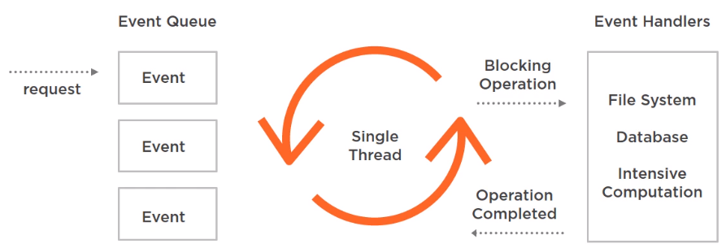

In this article, we will learn how to use Spring Webflux, and other concepts that relevant to the Reactive programming.

Let's get started.

<br>

## Table of Contents
- [Given problem](#given-problem)
- [Solution of Reactive programming](#solution-of-reactive-programming)
- [Introduction to Reactive programming](#introduction-to-reactive-programming)
- [Non-blocking programming](#non-blocking-programming)
- [Asynchronous programming](#asynchronous-programming)
- [Functional and Declarative programming](#functional-and-declarative-programming)
- [Introduction to Spring Webflux](#introduction-to-spring-webflux)
- [How Spring Webflux works](#how-spring-webflux-works)
- [When to use](#when-to-use)
- [Benefits and Drawbacks](#benefits-and-drawbacks)
- [Wrapping up](#wrapping-up)


<br>

## Given problem

Assuming that we have source code that describes the traditional Imperative model:

```java
int a = 2;
int b = 5 * a;

System.out.println("b = " + b);

// change value of a
a = 3;

System.out.println("b = " + b);
```

We can easily find that when we change the value of a, b does not react to this change, 10 is still printed.

How can we reflect the changes from a to b?


<br>

## Solution of Reactive programming

To achieve the reactive effect for above problem, we have to implement it explicitly. One option is the observer pattern. In this pattern, we have something that is meeting events and one or more consumers of those events. The problem with this pattern is that if the consumer cannot keep up with all the events iterated by the producer, there's no mechanism to signal the producer to send the events at a different rate.

The ability of the consumer to request items at a different rate or only when it's ready to process them is called backpressure.


In addition to backpressure, Reactive programming also involves three concepts:
- Non-blocking programming
- Asynchronous programming
- Functional / Declarative programming 

<br>

## Introduction to Reactive programming

Before talking about Reactive programming, we will talk about what reactive system is. A reactive system is about the big picture, the whole puzzle.


In this context, we can think of reactive as a set of the same principles or an architectural style that allows an application to react to changes by being able to scale up and down or recover from failures. It is possible to write a part of the application using reactive programming, but that is just one piece of the puzzle.


Using a reactive library or a reactive programming style doesn't make a whole application reactive under this perspective. What makes an application or system reactive from the same perspective are the traits defined in the Reactive Manifesto.


A reactive system has to be responsive, which means it has to respond quickly to all users under all conditions.
- Responsiveness is achieved through resilience. A resilient system takes into account all conditions, good or bad, to stay responsive.

- Responsiveness is also achieved because the system is scalable, which means resources allocated to the system can increase or decrease based on the demand.

- As a foundation of all these traits, we have a message-driven architecture. Reactive system are driven by messages to ensure that the components of the system can be scaled independently and loosely couple.

    Sometimes, messages are also called events, but messages and events are no the same thing. Unlike events, messages have an explicit destination. When events happen, there are listeners listening to those events.
    
Reactive programming is event-driven and it focues on the flow of the data. Events propagate changes forming a stream of data that is propagated to everyone listening to those changes.


<br>

## Non-blocking programming

Blocking is another word for synchronous execution. Below is a piece of code that describes the blocking or synchronous code.

```java
Product p = db.getProduct(id);
show(p);
```

When program reaches the first line, the execution is blocked and the program retrieves the product from the database, and it waits and waits without doing anything else until the information finally comes and the execution is resumed.


In a threaded server where a thread handles one request, the server does not wait until the first request finishes to handle a new request. Another thread from the pools of threads take care of that new request and this happens until either all requests are handled or there are no more free threads. Each thread has its own stack space in memory, so if the initial size of the thread pool is 500 and each thread uses 1MB of memory, the server would need 500 MB in order to start.

If the pool grows to handle more requests, the memory consumption will increase accordingly.


That's without taking into account the memory needed to perform additional tasks required by the requests. So this blocking approach results in efficient use of memory, but also in an inefficient use of CPU cycles because the program does nothing while it's waiting for other resources.

In contrast, reactive web applications adopt non-blocking servers generally based on the event-loop model. In this model, we have a small number of threads handling requests. When a request is handled by a thread, it is divided into events, which are smaller pieces of work involved in handling the whole request, like parsing the request body.



These events wait for their turn to be processed, but the important thing here is that this waiting time is very small because if there's a blocking operation like calling the file system, database, or any intensive computation is performed by another worker threads.

When it's done, a new event is generated to signal that the operation is completed and the result can be processed. This way, an evented web server can handle more requests than a threaded server and is more scalable.

However, the thing that limits these web servers is a Servlet API because it is a blocking API. But there's a non-blocking Servlet API available from version 3.1 that can use the non-blocking capabilities of the web server. This way, it can process a request asynchronously and get the result at a later time. 

<br>

## Asynchronous programming

When an application executes an operation asynchronously, it means that it executes the operation in parallel or in the background, so it can execute other things without waiting for the operation to finish.

```java
Product p = db.getProduct(id);
show(p);
```

When working with a synchronous operation, we have to wait until the operation completes to get the result and start working with it. But this does not work with an asynchronous operation that will complete at some future point.

A popular solution to the problem of getting the result at some point in the future is using a callback. A callback can be a class, function, or an expression that will be executed automatically when the asynchronous operation is completed.

```java
db.getProduct(id, (p, error) -> {
    show(p);
});
```

The result of the operation and a Boolean indicating if there was an error passed as parameters of the callbacks. So the code that used the result now goes inside the callback.

The problems with callbacks is something known as callback hell where the nesting of two or more callbacks can make our code repetitive and very hard to read and maintain.

```java
db.getProduct(id, (p, error) -> {
    if (error) {
        // do something
    } else {
        show(p);
        db.getProductDetails(p, (d, error) -> {
            if (error) {
                // do something
            } else {
                // do something
            }
        });
    }
});
```

Event loops and callbacks are popularized by Node.js, but in Java if we want to implement asynchronous operations we can do it with thread pools or the fork/join framework at a lower level of extraction or parallel streams or CompletableFuture at a higher level of extraction.

For example, we can use CompletableFuture in this way to execute the method processOperation() asynchronously, an event composed at chain of operations in a very declarative way.

```java
CompletableFuture.supplyAsync(this::processOperation)
                 .thenApply(this::sendEmail)
                 .thenAccept(this::completeOperation);
```

Something is similar to **Promises** in Javascript. But the problem with **CompletableFuture** and the other identities in Java is that if we don't use them correctly in some situations they can still block the execution when one operation waits for another to finish. So we need something else. For example, after callbacks and promises in the latest version of Javascript, we can use **async** function with **await** expressions to simplify our asynchronous code. It looks like a traditional synchronous function but it's asynchronous.

```javascript
async function getProductDetail(id) {
    const p = await db.getProduct(id);
    const d = await db.getProductDetail(id);

    return d;
}
```

In Java, we don't have something like that yet, but we can use reactive libraries that implement a variation of the server pattern in terms of a publisher and subscriber to make the code asynchronous.

```java
Publisher<Product> p = db.getProduct(id);
```

In this case, the method **getProduct()** does not return a real product object, but a publisher that will publish product objects to its subscribers. And backpressure is also implemented through a subscription object.


As an additional advantage, these libraries also allow us to program in a functional and declarative style.

<br>

## Functional and Declarative programming

Reactive libraries use concepts of functional programming to address the disadvantages of the asynchronous approaches.


Functional programming is based on concepts such as pure functions, lambda expressions, and immutability, and it makes the code more testable, declarative, and maintainable. Java is not really a functional language, but these concepts can be applied to create a reactive API.

For example, in imperative programming, we have to explicitly tell the program what to do and how to do it.

```java
List prices = productService.getHistoricalPrices(productId);
Iterator iterator = prices.iterator();

while (iterator.hasNext()) {
    ProductPrice price = (ProductPrice) iterator.hasNext();
    List details = productService.getDetails(price);
    if (details == null) {
        details = historyService.getDetail(productId);
        // ...
    }

    // ...
}
```

Imperative code is verbose because we have to tell the program what to do and how to do it.

Below is the source code of declarative programming.

```java
productService.getHistoricalPrices(productId)
                .flatMap(productService::getDetails)
                .switchIfEmpty(historyService.getDetails(productId))    // if list of details is null, switch to use getDetails() of historyService object
                .take(2)
                .timeout(Duration.ofMillis(200))
                .onErrorResume(this::getDummyPrices)
                .publishOn(Schedulers.parallel())
                .subscribe(this::graph);
```

It looks more readable and composable.

We are working with publishers, subscribers, and a sequence of events. This sequence of events is known as a stream. And the initiative to standardized libraries that process the streams in an asynchronous, non-blocking way with backpressure capabilities is called Reactive Streams. This has no relationship with the Java Stream API. And even though they both have a declarative API and similar operators, they work in different ways.

The Stream API connects to a source, generally a list. It pulls values out of it and it can be used only once.


In a Reactive Stream, values are not pulled. They are pushed through the pipeline of operators when we subscribe to the publisher and therefore, get the backpressure mechanism, which is only present in Reactive Stream.


<br>

## Introduction to Spring Webflux

Spring Webflux is the new reactive web framework that comes with Spring 5. Webflux does not replace Spring MVC. We can even use both modules for building different parts of the same web application. However, it does offer an alternative programming model.

Below is the comparison between Spring Webflux and Spring MVC.

|                    Spring MVC                |                       Spring Webflux                   |
| -------------------------------------------- | ------------------------------------------------------ |
| Servlet API                                  | Reactive Streams                                       |
| Blocking API                                 | Non-blocking API (Servlet 3.1+)                        |
| Synchronous programming model                | Asynchronous programming model                         |
| One request per thread                       | evented model where many concurrent connections are handled by only a few threads. |

In Spring 5, we have two web models: 
- spring-web-mvc

    Spring web MVC run on top of the Servlet API. The Servlet API can runs on any servlet container like Tomcat.

- spring-web-reactive

    Spring Web Reactive runs on top of Reactive Streams, creating a reactive version of the HttpServerRequest and HttpServerResponse. The reactive stack runs by default on Netty, but we can also use Tomcat, Jetty, Undertow as web servers.

In most cases, the Servlet API is what forces us to use a blocking model, not the server. At the higher level, Spring MVC works with annotations like RestController and RequestMapping, but the reactive web model also supports an annotation-based model, basically with the same annotations used by Spring MVC. And it also works with a functional programming model.


One important thing we need to know and understand about the reactive stack is that all the components or layers of the stack have to be non-blocking and asynchronous. We have to use a non-blocking server, a reactive web framework, and a reactive database layer, which in Spring is provided by the reactive extensions of Spring Data. And if we use Spring Security for authentication or authorization, we also have to use the reactive extensions of Spring Security.

Spring Boot supports Webflux since version 2, but in the same way we have to use the reactive starters to configure a Webflux application. The normal web starters are now only for Spring MVC. So there's no point in using Spring Webflux if at some level, something is going to block the execution. And since a non-blocking server does not use a lot of threads, if we block, it can bring the whole server down. So we have to be careful, especially with database access.

With database access, Spring Data only has reactive support for MongoDB, Cassandra, Redis, and Couchbase. All of these are NoSQL databases. But reactive is not something that is exclusive to NoSQL databases. The thing is that reactive support comes from the driver. It means that the driver has to support asynchronous operations. And for now, an asynchronous JDBC driver for relational database does not exist.

And Spring Webflux is based on the Reactive Stream specification, an initiative to standardize reactive programming on the JVM. The specification includes set of a interfaces that libraries have to implement. With this adapter class, ReactiveAdapterRegistry, Spring Webflux supports many implementation libraries like:
- Reactor
- RxJava
- RxJava2
- CompletableFuture
- Java 9 Flow API

However, Project Reactor is the default and preferred reactive library to work with Webflux. It's a powerful library and we need to know use it before jump into Spring Webflux.

<br>

## How Spring Webflux works

All incoming requests come with a event handler and call back information. Request thread delegates the incoming requests to a thread pool (generally small number of threads) which delegate the request to it’s handler function and immediately start processing other incoming requests from request thread.

When the handler function is complete, one of thread from pool collect the response and pass it to the call back function.

To understanding about event loop, we can read about article [Understanding about Event Loop in Node.js](https://gamethapcam.github.io/2020-01-12-Understanding-about-event-loop-in-Node.js/).

In Spring WebFlux, we call reactive APIs/functions that return monos and fluxes and your controllers will return monos and fluxes. When you invoke an API that returns a mono or a flux, it will return immediately. The results of the function call will be delivered to you through the mono or flux when they become available.


<br>

## When to use

- When we want to work with asynchonous programming, non-blocking to improve performance of system.


<br>

## Benefits and Drawbacks

1. Benefits

    - With low cost about computer, we can receive multiple request at the same time.

    - Improve performance of system without deadlock, ...

    - Easily scale our system.


2. Drawbacks


<br>

## Wrapping up


<br>

Refer:

[https://dzone.com/articles/spring-webflux-eventloop-vs-thread-per-request-mod](https://dzone.com/articles/spring-webflux-eventloop-vs-thread-per-request-mod)

[Web on Reactive Stack with version 5.2.6.RELEASE](https://docs.spring.io/spring/docs/current/spring-framework-reference/web-reactive.html)

[https://howtodoinjava.com/spring-webflux/spring-webflux-tutorial/](https://howtodoinjava.com/spring-webflux/spring-webflux-tutorial/)