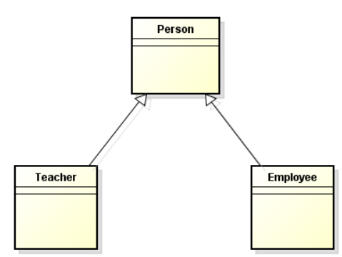

<br>

## Table of Contents
- [Given Problem](##given-problem)
- [Solution of Factory Method Pattern](##solution-of-factory-method-pattern)
- [When to use](##when-to-use)
- [Benefits and Drawbacks](##benefits-and-drawbacks)
- [Source code](##source-code)
- [Relations with other design patterns](##relations-with-other-design-patterns)
- [Application & Examples](##application-&-examples)
- [Differences between Abstract factory pattern and Factory method pattern](##differences-between-abstract-factory-pattern-and-factory-method-pattern)
- [Wrapping up](##wrapping-up)

<br>

## Given Problem

Suppose we have a class diagram about classes such as Person, Teacher and Employee.



Normally, when we want to create an instance of the one of classes, we will do like the below code.

```java
Teacher t = new Teacher();
Employee e = new Employee();
```

The drawback of this way:
- Inflexible
- Difficult to test
- Violates the Dependency Inversion Principle in SOLID.

So how do we improve the above code better?

<br>

## Solution of Factory Method Pattern
According to [wikipedia.com](https://en.wikipedia.org/wiki/Factory_method_pattern), we have:

```
The factory method pattern is a creational pattern that uses factory methods to deal with the problem of creating objects without having to specify the exact class of the object that will be created.

This is done by creating objects by calling a factory method—either specified in an interface and implemented by child classes, or implemented in a base class and optionally overridden by derived classes—rather than by calling a constructor.
```

Some traits in Factory method pattern:
- Client knows about abstract base class but not concrete class.
- Client does not know which subclass or concrete class is used to create the object. This creation of its subclass is deferred to runtime.
- Subclasses create objects.

Below is an image that describe how factory method pattern works


<br>

## When to use

- When the client does not know the actual class from which subclass to create the object.

- When the client wants to delegate the decision of choosing the concrete class to create the object to one of the subclasses.

- When the client wants the subclass to specify the concrete class name from which to create an object.

- When subclasses do not need to know how they are created.

- When we have to create an object of any one of subclasses depending on the data provided.

- When we have less types of classes.

<br>

## Benefits and Drawbacks

1. Benefits

    - reduce maintenance

    - complexity is hidden through better encapsulation.

2. Drawbacks

    - If we add some types of classes, normally we will add some cases into the method of Factory method pattern. But it will violate the Open-Close principle.

        The solution for this problem is that we can use abstract factory pattern.

    - When our problem that has multiple classes and their derived classes, normally, we will use Factory Method to create them. But having to write all that factory code is tedious.

        Solution for this case is that using DI pattern such as CDI, Spring IoC, Guice, ...

<br>

## Source code

In this section, we will refer to the Shape class, and some its inherited classes such as Square, Circle, Rectangle. We will use Factory method pattern to do this problem.


About sample code, we can refer to [github](https://github.com/DucManhPhan/Design-Pattern/tree/master/Creational-Pattern/factory-method).

<br>

## Relations with other design patterns

- The Factory method pattern is closely related to Abstract factory pattern and Prototype pattern.


<br>

## Differences between Abstract factory pattern and Factory method pattern

- The main difference between factory method pattern and abstract factory pattern is that the factory method is a single method, and an abstract factory is an object.

- The factory method is just a method, it can be overriden in a subclass, whereas the abstract factory is an object that has multiple factory methods on it.

- The factory method pattern use inheritance and relies on a subclass to handle the desired object instantiation.

- Abstract factory provides one more level of abstraction.

<br>

## Wrapping up

- Factory method is called with other name that is Virtual Constructor.


<br>

Thanks for your reading.

<br>

Refer:

[https://en.wikipedia.org/wiki/Factory_method_pattern#:~:text=In%20class%2Dbased%20programming%2C%20the,object%20that%20will%20be%20created.](https://en.wikipedia.org/wiki/Factory_method_pattern#:~:text=In%20class%2Dbased%20programming%2C%20the,object%20that%20will%20be%20created.)

[https://refactoring.guru/design-patterns/factory-method](https://refactoring.guru/design-patterns/factory-method)