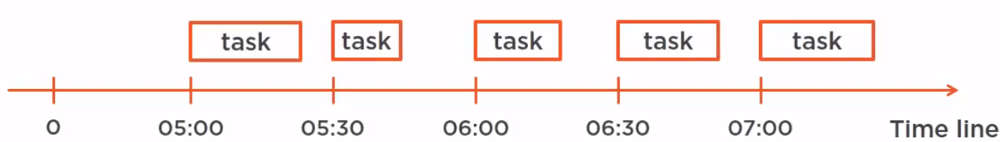
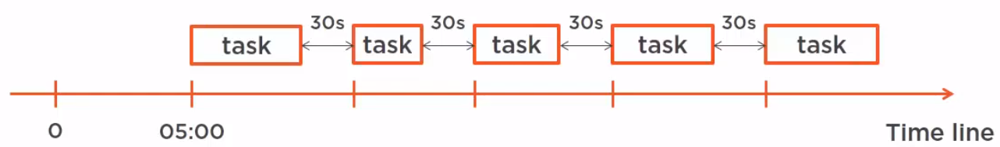

In this article, we will learn how to create ExecutorService, advantages and disadvantages of it. It provides a simple way to do some operations with Thread.

Let's get started.

<br>

## Table of contents
- [Some ways to create ExecutorService](#some-ways-to-create-executorservice)
- [Use shutdown() or shutdownNow() methods to terminate thread](#use-shutdown()-or-shutdownNow()-methods-to-terminate-thread)
- [Use back-off strategy for running thread forever](#use-back-off-strategy-for-running-thread-forever)
- [Benefits of Executors framework](#benefits-of-executors-framework)
- [Comparison between Fork-Join and Executor framework](#comparison-between-fork-join-and-executor-framework)
- [Comparison between Executor pattern and Runnable pattern](#comparison-between-executor-pattern-and-runnable-pattern)
- [Wrapping up](#wrapping-up)

<br>

## Some ways to create ExecutorService
1. Use ```newCachedThreadPool()``` method

    It creates an executor having an expandable thread pool.

    ```java
    Runnable task = () -> {
        System.out.println("This task is working");
    };

    ExecutorService cachedThreadPool = Executors.newCachedThreadPool();
    IntStream.range(0, 10).forEach(item -> cachedThreadPool.execute(task));

    cachedThreadPool.shutdown();
    ```

    Whenever a thread is needed, a cached thread pool will return a thread from cache and if not available, a new thread is created for a short time.

    When that thread is finished completely, it will be vanished.

    The CachedThreadPools differed from the FixedThreadPools in a way that
    - Those executors create threads on demand.

        The FixedThreadPools, if created with four threads, will create those four threads immediately. The CachedThreadPools create those threads on demand.

    - The CachedThreadPools will keep threads for a certain amount of time. Now if the thread created are not used for 60 seconds by default, then this thread pool will destroy them. This kind of pool is very efficient if we have from time to time an important number of tasks to execute, but it turns out that we do not have to do that very often, for instance, once in several hours. So we can create the thread pool. It will not consume many resources since most of the time it will not have any threads at all, but when we need those threads, it will create them for us.

2. Use ```newFixedThreadPool()``` method

    It will create a thread pool that reuses a fixed the number of threads.

    ```java
    ExecutorService fixedThreadPool = Executors.newFixedThreadPool(5);
    IntStream.range(0, 10).forEach(item -> fixedThreadPool.execute(task));

    fixedThreadPool.shutdown();
    ```

    With above code, we want to run 10 threads, but we only have 5 threads to do this. So, after the first 6 threads finished completely, the next 5 threads will run.


3. Use ```newSingleThreadExecutor()``` method

    It will creates a single thread.

    ```java
    ExecutorService singleThreadPool = Executors.newSingleThreadExecutor();
    IntStream.range(0, 10).forEach(item -> singleThreadPool.execute(task));

    singleThreadPool.shutdown();
    ```

    Because in thread pool, we only have only 1 thread, but we want to run 10 threads. So, after the first thread finished completely, the next thread will run.

    It is versy useful for reactive programming when we just want to execute a single task in another thread.
    
    Belows are some problems that we need to know when using **newSingleThreadExecutor()** method.

    Suppose we run this code:

    ```java
    Executor executor = Executors.newSingleThreadExecutor();
    Runnable task1 = () -> someReallyLongProcess();
    Runnable task2 = () -> anotherReallyLongProcess();

    executor.execute(task1);
    executor.execute(task2);
    ```

    Obviously, task2 will have to wait for task1 to complete. So to handle this case, an Executor, whether it is single threaded or not, has to waiting queue.
    
    Now this waiting queue is precisely specified.
    - First, a task is added to the waiting queue when no threads is available.

        So suppose we have an ExecutorService built on full thread and all the threads are busy. If a new task is submitted, it will be added to this waiting queue.

    - The tasks are executed in the order of their submission.

        In our example, we have guarantee that task1 will be executed before task2. This is very important in ordering our tasks.

    But we can have some questions to need to answer:
    - Can we know if a task is done or not?

        No, we cannot know if a task is done or not. In fact, in this case, when we are using Runnable, it is not possible to query the Executor to know if a given task is executed or not.

    - Can we cancel the execution of a task?

        Yes, in the certain way, we can. In fact, what we can do is remove a task from the waiting queue. If the task has been started by the thread, it is not possible to cancel.

4. use ```newScheduledThreadPool()``` method

    - Understanding about ScheduledExecutorService

        The newScheduledThreadPool() method will:
        - create a pool of threads
        - return a ScheduledExecutorService

        The ScheduledExecutorService does three things:
        - we can schedule a task somewhere in the future by passing this task and a delay, which is a special amount of time.

            ```schedule(task, delay);```
        
        - we can call ```scheduleAtFixedRate(task, delay, period)``` method will execute the task after a certain delay and then execute it again and again after a certain period of time.

            So this task will be executed indefinitely starting in 5 minutes, and for instances, every 30 seconds.
            
            

        - we can call ```scheduleWithFixedDelay(task, initialDelay, delay)``` method

            At the first glimpse, it works the same as the previous method. It takes an initialDelay and then a second delay which acts as a period. In fact, it does not work exactly the same. This task will be first executed after the initial delay and then executed again after a certain delay. The second delay is measured between the end of the execution of this task and the beginning of the next execution of this task.

            


    - Run task at once time

        ```java
        <V> ScheduledFuture<V> schedule(Callable<V> callable, long delay, TimeUnit unit);

        ScheduledFuture<?> schedule(Runnable command, long delay, TimeUnit unit);
        ```

        For example:

        ```java
        Runnable taskAtOnce = () -> {
            System.out.println("Running this task at once time.");
        };

        ScheduledExecutorService scheduleService = Executors.newScheduledThreadPool(1);
        scheduleService.schedule(taskAtOnce, 5, TimeUnit.SECONDS);
        System.out.println("Running immediately.");

        scheduleService.shutdown();
        ```

    - Run task repeatedly after the given delay time

        ```java
        // Creates and executes a periodic action that becomes enabled first after the given initial delay, and subsequently with the given delay between the termination of one execution and the commencement of the next. If any execution of the task encounters an exception, subsequent executions are suppressed. Otherwise, the task will only terminate via cancellation or termination of the executor.
        ScheduledFuture<?> scheduleWithFixedDelay(Runnable command, long initialDelay, long delay, TimeUnit unit);
        ```

        For example:

        ```java
        Runnable taskRepeatedlyDelayTime = () -> {
            System.out.println("Running this task repeatedly,");
            try {
                Thread.sleep(100);
            } catch (InterruptedException e) {
                e.printStackTrace();
            }
        };

        ScheduledExecutorService executorService = Executors.newScheduledThreadPool(1);
        executorService.scheduleWithFixedDelay(taskRepeatedlyDelayTime, 10, 100, TimeUnit.SECONDS);
        System.out.println("Running");
        ```

    - Run task repeatedly after the periodic time

        ```java
        // Creates and executes a periodic action that becomes enabled first after the given initial delay, and subsequently with the given period; that is executions will commence after initialDelay then initialDelay+period, then initialDelay + 2 * period, and so on. If any execution of the task encounters an exception, subsequent executions are suppressed. Otherwise, the task will only terminate via cancellation or termination of the executor. If any execution of this task takes longer than its period, then subsequent executions may start late, but will not concurrently execute.
        ScheduledFuture<?> scheduleAtFixedRate(Runnable command, long initialDelay, long period, TimeUnit unit);
        ```

        For example:

        ```java
        Runnable taskRepeatedlyDelayTime = () -> {
            System.out.println("Running this task repeatedly.");
            try {
                Thread.sleep(10);
            } catch (InterruptedException e) {
                e.printStackTrace();
            }
        };

        ScheduledExecutorService scheduledExecutor = Executors.newScheduledThreadPool(1);
        scheduledExecutor.scheduleAtFixedRate(taskRepeatedlyDelayTime, 5, 1, TimeUnit.SECONDS);
        System.out.println("Running immediately.");
        ```

    - Note:
        - ```newSingleThreadScheduledExecutor()``` is wrapped by a delegate, we can see it in ```Executors.java```.

            ```java
            public static ScheduledExecutorService newSingleThreadScheduledExecutor() {
                return new DelegatedScheduledExecutorService(new ScheduledThreadPoolExecutor(1));
            }
            ```
<br>

## Use shutdown() or shutdownNow() methods to terminate thread
1. ```shutdown()``` method

    It will tell the executor service that it can not accept new tasks, but the already submitted tasks continue to run. Once all threads have finished current tasks, the ExecutorService shuts down.

    ```java
    void shutdown();
    ```

    So we can have concluded about shutdown() method works:
    - continue to execute all sumitted tasks
    - execute waiting tasks in the waiting queue
    - do not accept new tasks
    - then shutdown properly by destroying and cleaning up all the threads that have been created.

    This is the soft way of closing an ExecutorService.


2. ```shutdownNow()``` method

    If we need to shutdown ExecutorService quickly, we might not be able to wait for all the tasks to complete. So we will use shutdownNow() method.

    It will do the same thing with ```shutdown()``` method and try to cancel the already submitted tasks by interrupting the relevant threads.

    If our tasks ignore the interruption, ```shutdownNow()``` will behave exactly as same as ```shutdown()``` method.

    ```java
    List<Runnable> shutdownNow();
    ```

    Belows are some steps of shutdownNow() method:
    - interrupting the threads that are executing them.
    - it will do not execute any waiting tasks. Of course, it will not allow any new submission.
    - then it will shutdown.

    The shutdownNow() method is the hard way of shutting down an ExecutorService. It is not respectful of the running tasks since it will hold them immediately.

3. Example for ```shutdown()``` and ```shutdownNow()```

    ```java
    public static void main(String[] args) throws InterruptedException {
        ExecutorService executor = Executors.newFixedThreadPool(1);
        executor.submit(new Runnable() {

            @Override
            public void run() {
                while (true) {
                    if (Thread.currentThread().isInterrupted()) {
                        System.out.println("interrupted");
                        break;
                    }
                }
            }
        });

        executor.shutdown();
        if (!executor.awaitTermination(100, TimeUnit.MICROSECONDS)) {
            System.out.println("Still waiting after 100ms: calling System.exit(0)...");
            System.exit(0);
        }
        System.out.println("Exiting normally...");
    }
    ```

    The description about the above code segment:
    - with ```shutdown()```, the output is ```still waiting after 100ms: calling System.exit(0)...``` because the running task is not interrupted and continues to run.

    - with ```shutdownNow()```, the output is ```interrupted``` and ```Exiting normally...``` because the running task is interrupted, catches the interruption and then stops what it is doing (breaks the while loop).

    - with ```shutdownNow()```, if you comment out the lines within the while loop, you will get ```still waiting after 100ms: calling System.exit(0)...``` because the interruption is not handled by the running task any longer.

3. Use **awaitTermination()** method to terminate threads

    The **awaitTermination()** method takes a timeout as a parameter. Some steps of this method:
    - First, it will issue a **shutdown()** method, so it will prevent the submission of any new tasks
    - Then, it will wait for the given timeout. During this timeout, it gives the chance of all the executing tasks to complete and all the waiting tasks to be executed
    - And at the end of this timeout, if there are still remaining tasks, it will halt everything and cleanup the waiting queue if it is not empty.

<br>

## Use back-off strategy for running thread forever

In order to implement with this aim, we can have some points that need to remember:
- In the infinite loop, catch Errors too, not just exceptions. Sometimes unexcepted things happen and Java throws an Error at you, not an Exception.

- Use a back-off switch, so if something goes wrong and is non-recoverable, you don't escalate the situation by eagerly starting another loop. Instead, you need to wait until the situation goes back to normal and then start again.

For example:

```java
class Test1 implements Runnable {
  public void run() {
    boolean backoff = false;
    while(true) {
      if (backoff) {
        Thread.sleep (TIME_FOR_LONGER_BREAK);
        backoff = false;
      }

      System.out.println("I'm test class 1");
      try {
        // do important stuff here, use database and other critical resources
      } catch (SqlException se) {
       // code to delay the next loop
       backoff = true;
      } catch (Exception e) {
          // nothing to do
      } catch (Throwable t) {
          // nothing to do
      }
    }
  }
}
```

<br>

## Benefits of Executors framework
1. It's easier to program concurrent applications because we do not have to worry to create threads.

2. It's easier to control the resources used by the executor and your application. You can create an executor that only uses a predefined number of threads. If you send more tasks, the executor stores them in a queue until a thread is available.

3. Executors reduce the overhead introduced by thread creation reusing the threads. Internally, it manages a pool of threads that reuses threads to execute multiple tasks.

4. abstracts away many of the complexities associated with the lower-level abstsractions like raw ```Thread```.

5. It provides mechanism for safely starting, submitting, executing, and blocking on the successful or abrupt termination of tasks.

6. Help us focus on structring tasks, dependencies, potential parallelism.

7. Developers are likely to already understand the standard library classes, so there is no need to learn the API and behavior of ad-hoc concurrent components. Additionally, concurrent applications are far simpler to debug when they are built on reliable, well-tested components.

<br>

## Comparison between Fork-Join and Executor framework
- Fork-Join allows us to easily divide and conquer jobs, which have to implemented manually if we want to execute it in ```ExecutorService```.

- Executors framework is usually used to process many independent request concurrently. Fork-Join when we want to accelerate one coherent job.

- Optimize performance of big computation of recursive tasks, use ```ForJoinPool``` or ```newWorkStealingPool```.

<br>

## Comparison between Executor pattern and Runnable pattern

```java
// Executor pattern
executor.execute(task);

// Runnable pattern
new Thread(task).start();
```

Let's compare the two patterns:
- The Executor pattern does not create a new thread.
- The behavior is the same: both calls return immediately, the task is executed in another thread.


<br>

## Wrapping up

- Building an Executor is more efficient than creating threads on demand. Creating an Executor or ExecutorService will create a pool of thread when this Executor is created and those threads will remain alive as long as the executor is alive. So, one given thread can execute as many tasks as we need.

- We can pass instances of Runnable to an Executor. The Executor has a waiting queue to handle the fact that it can have more requests than available threads. If we want, we can ask the Executor to remove a task from the waiting queue. So using Executor pattern is more efficient than using the basic Runnable pattern.

- Understanding about some ways to create ExecutorService.

- Fork-Join and ExecutorService.

<br>


Refer: 

[https://stackoverflow.com/questions/2104676/java-executor-best-practices-for-tasks-that-should-run-forever](https://stackoverflow.com/questions/2104676/java-executor-best-practices-for-tasks-that-should-run-forever)

[https://myshadesofgray.wordpress.com/2014/04/13/java-executor-framework/](https://myshadesofgray.wordpress.com/2014/04/13/java-executor-framework/)

[https://javarevisited.blogspot.com/2013/07/how-to-create-thread-pools-in-java-executors-framework-example-tutorial.html](https://javarevisited.blogspot.com/2013/07/how-to-create-thread-pools-in-java-executors-framework-example-tutorial.html)

[http://jcip.net/](http://jcip.net/)

[https://www.developer.com/java/data/using-the-executor-framework-to-deal-with-java-threads.html](https://www.developer.com/java/data/using-the-executor-framework-to-deal-with-java-threads.html)