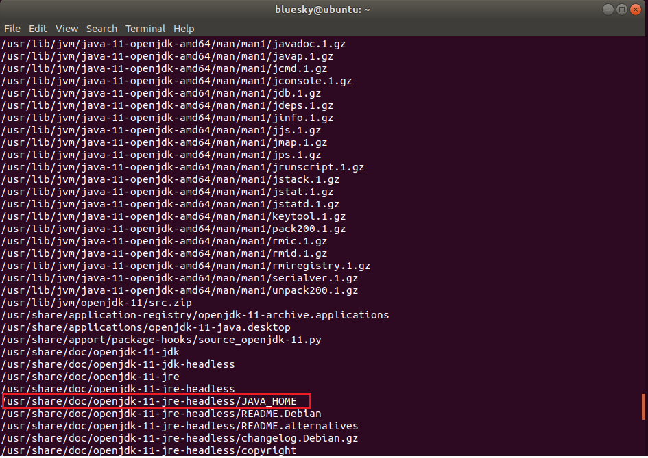
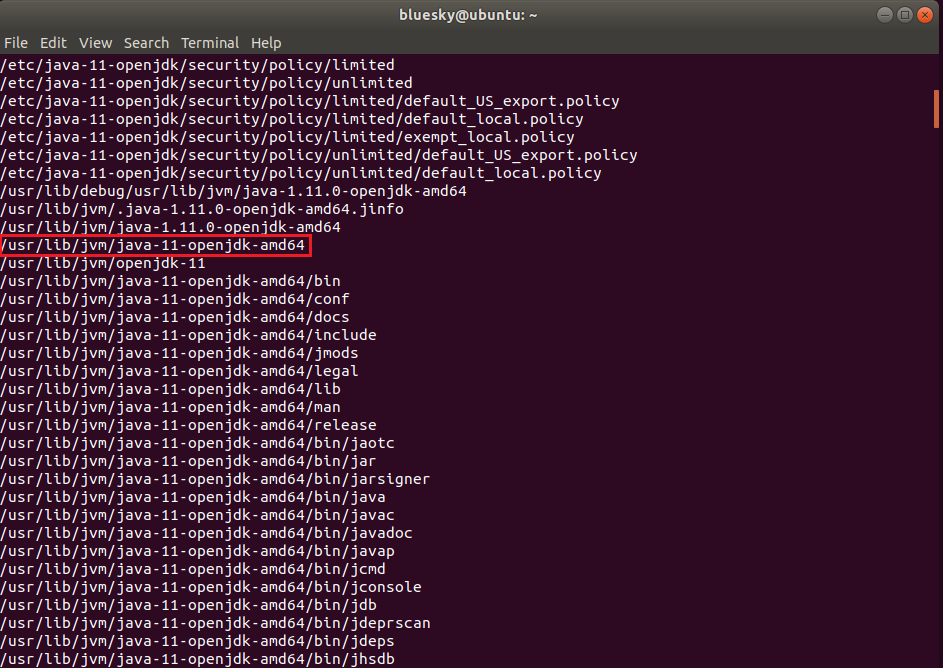

In this article, we will introduce some basic commands that we need to know when programming with bash script. Practice fluently all this commands makes us to be possible to write scripting in a large project.

Let's get started.

<br>

## Table of contents
- [Open command line interface](#open-command-line-interface)
- [Understanding about user's level in Linux](#understanding-about-user's-level-in-linux)
- [Running bash file](#running-bash-file)
- [Comment something](#comment-something)
- [Commands with File system](#commands-with-file-system)
- [Redirecting output](#redirecting-output)
- [Some useful command-line tricks](#some-useful-command-line-tricks)
- [Wrapping up](#wrapping-up)


<br>

## Open command line interface
- First way, click Terminal icon that is at the bottom of sidebar.

- Second way, use shorcut key ```Ctrl + Alt + T```.

<br>

## Understanding about user's level in Linux
- normal user

    Normal users has limited permission such as they do not install software, ...

- ```sudo```

    The purpose of ```sudo``` is to enable us to use our user account to do things that normally only ```root``` would have been able to do.

    When we use ```sudo```, we'll be aksed for our user'password for confirmation, and then the command will execute.

- ```root```

    The ```root``` user account exists on all Linux distributions and is the most powerful user account on the planet.

    ```root``` user account can be used to do anything:
    - create files or directories.
    - install software.
    - destroy entire installation with one typo or ill-conceived command.
    - delete all files on hard disk.
    - ...

    --> There is often not so much as a confirmation prompt while executing any commands as ```root```.

    It's for these reasons that it's generally recommended that we should not use ```root``` account unless we absolute have to.

<br>

## Running bash file
- Open Terminal 

    ```js
    Ctrl + Alt + T
    ```

- In Terminal, use nano editor to create the file and file's name.

    ```js
    nano fist.sh
    ```

    In bash fist.sh, we type our commands such as:

    ```js
    #!/bin/bash
    echo "Hello, world!"
    ```

- Run ```first.sh``` bash file

    - First way, using bash command

        ```js
        bash fist.sh
        ```

    - Second way, setting execute permission to bash file and run this file.

        ```js
        chmod a+x firsh.sh
        ./first.sh
        ```

<br>

## Comment something

- Single comment

    ```bash
    #!/bin/bash

    # Use "#" symbol to create single line comment.
    echo "single line comment"
    ```

- Multi-line comment

    ```bash
    #!/bin/bash
    :'
    Using multi-line comment in this file
    testfile.sh
    '
    echo 'hello, world'
    ```

<br>

## Commands with File system
- Create folder

    ```bash
    mkdir folder_path_name
    ```

- List all files in directory

    ```bash
    ls

    # or

    dir
    ```


- Delete file

    Use ```rm``` command to remove a file with specific path.

    ```bash
    rm [-f|i|I|q|R|r|v] file
    ```

    | Options |                   Description                |
    | ------- | ---------------------------------------------|
    | ```-f```| deletes read-only files immediately without any confirmation. |
    | ```-i```| prompts for confirmation before deleting every files before entering a sub-directory if used with ```-R``` or ```-r```. |
    | ```-q```| suppresses all the warning messages, however error messages are still displayed. |
    | ```-R```| delete recursively files and folders in parent folder. |
    | ```-r```| as same as ```-R```. |
    | ```-v```| display the file names on the output. |
    | ```-I```| prompts everytime when an attempt is made to delete for than 3 files at a time or while removing recursively. |

- Move files/folder


- Copy files/folder

- Rename file

    If we have a file with ```mistake-test.txt```, we want to rename this file to ```test.txt```.

    ```bash
    mv mistake-text.txt test.txt
    ```

<br>

## Packages command
- List all installed packages

    ```bash
    sudo apt list --installed

    # or
    dpkg --get-selections > list.txt

    # list a specific installed package
    dpkg --get-selections | grep postgres
    ```
- Set PATH for JDK

    - First, we can install our latest jdk.

        ```bash
        sudo apt install default-jdk
        sudo apt install default-jre
        ```

        If we encounter the problem such as ```E: Could not get lock /var/lib/dpkg/lock-frontend - open (11: Resource temporarily unavailable)```, we can solve the problem with [https://askubuntu.com/questions/1109982/e-could-not-get-lock-var-lib-dpkg-lock-frontend-open-11-resource-temporari](https://askubuntu.com/questions/1109982/e-could-not-get-lock-var-lib-dpkg-lock-frontend-open-11-resource-temporari).

    - Then, we need to find our jdk path.

        ```bash
        # update databse of ubuntu
        sudo updatedb

        # determine whether jdk is installed
        locate openjdk
        ```

        So, we have:

        

        If most of the return outputs are "/usr/lib/jvm/java-11-openjdk-amd64", we would use this path to set the Java_Home path.

        

    - Check all version of JDK in our computer

        ```bash
        sudo update-java-alternatives --list
        ```

    - Open ```.bashrc``` file

        ```.bashrc``` file is a hidden file inside our home directory.

        ```bash
        ls -la ~/ | more

        # Then, use cd command to go to our user directory
        cd <user_name>

        # Finally, use nano to open .bashrc file
        nano .bashrc
        ```

    - Update ```.bashrc``` file

        Add the following commands to ```.bashrc``` file:

        ```
        export JAVA_HOME="usr/lib/jvm/java-11-openjdk-amd64"
        export PATH=$PATH:$JAVA_HOME/bin
        ```

        Now, apply all the changes into current running system.

        ```bash
        source ~/.bashrc
        ```

    - Check current JDK's version

        ```bash
        java -version
        ```

- Install Netbeans

    ```bash
    # download netbeans
    cd /tmp && wget -c http://download.netbeans.org/netbeans/8.2/final/bundles/netbeans-8.2-linux.sh

    # run netbeans
    chmod +x netbeans-8.2-linux.sh
    sudo ./netbeans-8.2-linux.sh
    ```

- Install python

    ```bash
    # refreshing the repositories
    sudo apt update
    # its wise to keep the system up to date!
    # you can skip the following line if you not
    # want to update all your software
    sudo apt upgrade
    # installing python 2.7 and pip for it
    sudo apt install python2.7 python-pip
    # installing python-pip for 3.6
    sudo apt install python3-pip

    # NOTE: Do not try to remove python 3.6 as it will screw up your system
    ```

- Install git

    ```bash
    sudo apt update 
    sudo apt install git

    # check git's version
    git --version
    ```

<br>

## Service commands
- List Ubuntu service with systemctl

    Services are managed by ```systemd``` since Ubuntu 15. In order to list all services, use ```systemctl``` command.

    ```bash
    systemctl list-units -a

    # list inactive unit
    systemctl list-units -a --state=inactive
    ```

- List Ubuntu services with service command

    ```bash
    service --status-all

    # or
    service --status-all | grep '\[ + \]'

    # or
    service --status-all | grep '\[ - \]'
    ```

- Remove services that have failed status

    ```bash
    systemctl reset-failed

    # or specific units
    systemctl reset-failed kafka.service zookeeper.service

    # other ways
    systemctl stop [service_name]
    systemctl disable [service_name]
    rm /etc/systemd/system/[service_name]
    rm /etc/systemd/system/[service_name] symlinks that might be related
    systemctl daemon-reload
    ```

- Start/Stop service

    ```bash
    # start
    sudo systemctl start application.service

    # stop
    sudo systemctl stop application.service
    ```

- Restarting/Reloading service

    ```bash
    sudo systemctl restart application.service

    sudo systemctl reload application.service

    sudo systemctl reload-or-restart application.service
    ```

- Starting automatically service

    ```bash
    sudo systemctl enable application.service
    ```

    This will create a ```symbolic link``` from the system's copy of the service file (usually in ```/lib/systemd/system``` or ```/etc/systemd/system```) into the location on disk where ```systemd``` looks for autostart files (usually ```/etc/systemd/system/some_target.target.wants```)

    To disable the service from starting automatically, you can type:

    ```bash
    sudo systemctl disable application.service
    ```

    This will remove the symbolic link that indicated that the service should be started automatically.

<br>

## Network commands
- Check whether process is running on specific port

    ```bash
    # 1st - install net-tools package
    sudo apt-get install net-tools

    sudo netstat --tulpen | grep 2181

    # 2nd - if we do not have permission, we can check from other computer
    telnet target_ip_addr port
    ```


<br>

## Process commands
1. 


2. 


<br>

## Computer commands
- Restart Ubuntu

    ```bash
    sudo reboot
    ```

- Shutdown Ubuntu

    ```bash
    # 1st way - shutdown immediately system
    sudo power off

    # 2nd way
    shutdown -h now

    # 3rd way - shutdown that asks for a password
    sudo poweroff

    # 4th way - shutdown after n minutes
    shutdown -h <time_in_minutes>

    shutdown +<time_in_minutes>

    # Cancel shutdown
    shutdown -c

    # shutdown at the specific time
    # Ex: shutdown -h 20:3
    shutdown -h HH:MM
    ```

<br>

## File commands
1. Search for patterns in each file

    ```bash
    grep "something" file
    ```

    With some options:
    - ```-i```: search for a string case-insensitively in the given file.
    - ```-c```: find the number of lines that matches the given string/pattern with the -c (count) flag.
    - ```-v```: invert match - find all lines that do not match.
    - ```-r```: recursive - search all the files in a directory.
    - ```-l```: only show the file names of the files that matched.
    - ```-f```: do not treat the match string as a regex.
    - ```-o```: only print the matching part of the line (not the whole line).
    - ```-a```: search binaries - treat binary data like it's text instead of ignoring it.


## Redirecting output

    It is used to take the output of one command and redirect it into the input of another command.

- Output to other commands

    ```python
    cat /var/log/syslog | grep apache2
    ```

    The above code mean that ```cat``` command is used to print the contents of the system log stored at ```/var/log/syslog```. Using the pipe symbol ```|```, we're redirecting the output of that command and feeding it into ```grep```, which is looking for the string ```apache2```.

    When used together, we're able to fetch lines from the system log that reference ```apache2```. This is useful if we're troubleshouting some sort of issue with the ```apache``` service, and we'd like to look at the log file but ignore any lines that aren't relevant to our investigation.

- Output to text file

    ```
    echo "Hello, world!" >> ~/test-file.txt
    ```

    echo command normally outputs to the Terminal, but instead telling it to direct its output to a file named ```test-file.txt```, stored in our home directory. 
    
    ```>>``` that is used in the above command means that it will continue to append this string to the file.

    If ```>``` is used in the above command, it will actually wipe out the content of ```test-file.txt```.

- Output errors into Standard Error file descriptor

    Normally, we're working with a File Descriptor called Standard Output - stdout with commands that produce output. File descriptors are numbers that refer to open files, and these numbers are integers.

    Standard output is a special file descriptor, with an integer of ```1```. It is our Terminal.

    Standard error - stderr also is file descriptor to be produce in error, with an integer of ```2```.

    ```
    find /etc -name *apache* 2>/dev/null
    ```

    It means that we're redirecting output from the find command with ```2>```, instead of ```>```, to ```/dev/null```. ```/dev/null``` is a special device that anything enters it is never seen or hear from again.

<br>

## Some useful command-line tricks
- Repeat our command that we last used.

    ```java
    !!
    ```

    As same as ```two exclamation marks```, we can press the up arrow key and press Enter to recall the previous commmand and execute it.

    In order to run previous command with sudo privilege, we can type in terminal like below:

    ```java
    sudo !!
    ```

- Search in terminal

    Use ```Ctrl + R``` shortcut key to search our previous command.

- Edit a command that we've previously typed in a text editor.

    Assume we pressed the up arrow key, we have a very long command, and we just want to edit part of it without having to execute the entire thing, perhaps a command like this:

    ```
    sudo apt update && sudo apt install apache2
    ```

    Let's assume you want to install ```nginx``` instead of ```apache2```, but the rest of the command is right. If you hold ```Ctrl``` and then press ```X``` followed by ```E```, which will open the command in a text editor. There, you can change the command. Once you're done making your changes, the command will execute once you save the file. Admittedly, this is usually only useful when you have a very long command and you need to just change part of it.

- Chain command

    We can use the double ampersand - AND operator to do this.

    ```
    sudo apt update && sudo apt install apache2
    ```

    It means that the second command will run if the first was successful.

    Another way to chain commands is to use semicolon.

    ```
    sudo apt update; sudo apt install apache2
    ```

    With using semicolon, we will execute the second command regardless of whether the fist command was successful.

- Command alias

    It allows us to create a command that is just another name for another command. This allows us to simplify commands down to just one word or a few letters.

    ```java
    alias install="sudo apt install"

    // or
    alias i="sudo apt install"

    // View the top ten CPU consuming processes
    alias cpu10='ps auxf | sort -nr -k 3 | head -10'

    // View the top ten RAM consuming processes
    alias mem10='ps auxf | sort -nr -k 4 | head -10'

    // View all amounted filesystems, and present the information in a clean tabbed layout
    alias lsmount='mount | column -t'

    // Clear the screen by simply typing c
    alias c=clear
    ```

    In the fact, when we exit Terminal window, our aliases are wiped out. In order to retain them, we need to edit our ```.bashrc``` file. This file is present in our home directory and is read every time we start a new Terminal session.

- Change our working directory back to the previous directory we were in

    ```java
    cd -
    ```

<br>

## Wrapping up
- Normally, we should use confidently some basic commands such as file system, ...
- Remember to use some command-line tricks efficiently.

<br>

Refer:

[https://help.ubuntu.com/lts/serverguide/backup-shellscripts.html](https://help.ubuntu.com/lts/serverguide/backup-shellscripts.html)

[https://linuxhint.com/100_essential_linux_commands/](https://linuxhint.com/100_essential_linux_commands/)

[https://www.digitalocean.com/community/tutorials/how-to-use-systemctl-to-manage-systemd-services-and-units](https://www.digitalocean.com/community/tutorials/how-to-use-systemctl-to-manage-systemd-services-and-units)

[https://vitux.com/how-to-shut-down-ubuntu/](https://vitux.com/how-to-shut-down-ubuntu/)

[https://medium.com/better-programming/here-are-11-console-commands-every-developer-should-know-54e348ef22fa](https://medium.com/better-programming/here-are-11-console-commands-every-developer-should-know-54e348ef22fa)