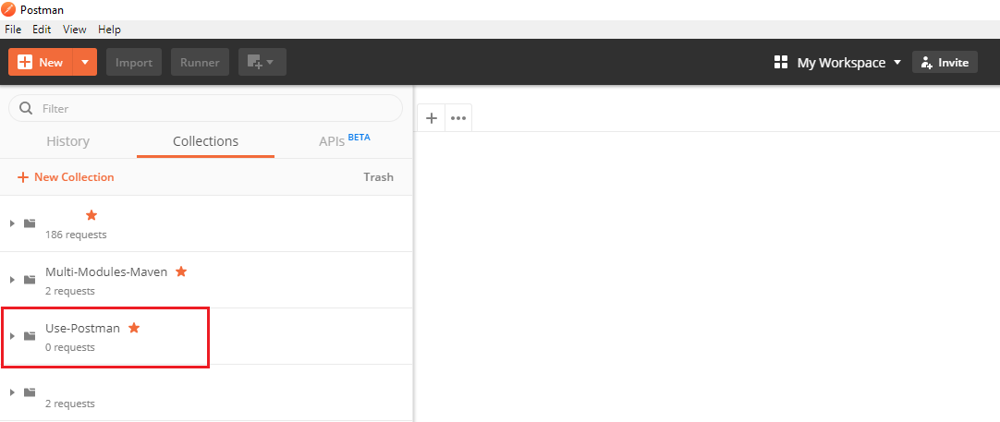

In this article, we will introduce about some useful tips for testing with postman. It will help us automatically testing for much data.

Let's get started.

<br>

## Table of contents
- [Create new collection](#create-new-collection)
- [Define variables in Environment](#define-variables-in-environment)
- [Define request body as variable](#define-request-body-as-variable)
- [Use Runner Collection in Postman](#use-runner-collection-in-postman)
- [Wrapping up](#wrapping-up)


<br>

## Create new collection
1. Open our Postman 

2. At Home window, click ```New Collection``` button in the left side.

    

    Then, we have our New Collection dialog:

    

    At this dialog, we should do some steps:
    - ```(1)``` - type collection's name that we want. For example: Use-Postman
    - ```(2)``` - Click ```Create``` button

- After create new collection, we have:

    

- If we use Authorization for all requests such as Bearer token or something else, we can set Authorization in this collection.

    And in each request, we will use ```Inherit auth from parent```. With this approach, we do not take care of changes that we have.

    

<br>

## Define variables in Environment
1. Create our own environment.

    

2. Then, we have ```Manage Environments``` dialog.

    

    We have to fill some below fields such as:
    - ```(1)``` - Environment's name
    - ```(2)``` - declare some variables that we will use in our collections.
    - ```(3)``` - Click ```Add``` button to save all environment's variable.

3. Fill data to environement's variables.

    

    Click ```Add``` button, we can see our result.

    

4. Use environement's variables in each request.

    

    First, we should select which environment to apply for our collection or requests.

    Second, use symbol ```\{\{env_variable_name\}\}``` to get environment's variables. In the above image, we use ```\{\{local-address\}\}```.

    Also, we can apply environment's variables for ```headers```, ```request body``` of Postman.

<br>

## Define request body as variable
In our login request, we want to use ```post``` method to push json data that contains ```username``` and ```password``` to server. In this section, we will do below some steps:
- Prepare data for this case.

    We can refer to this [link](https://github.com/gamethapcam/Learn-Nodejs/tree/master/pratice-common-node-modules/src/file/template-file) in github.

    After creating json data, we have the format of this file:

    ```json
    [
        {
            "username": "username0",
            "password": "password0"
        },
        {
            "username": "username1",
            "password": "password1"
        },
        {
            "username": "username2",
            "password": "password2"
        }
        ...
    ]
    ```

- In ```Body``` tab of request, we should type:

    ```javascript
    \{\{requestBody\}\}
    ```

- In ```Pre-request Scripts``` tab, define JSON object to be sent in the folder (or collection).

    ```javascript
    let obj = {
        "username": "{{username}}",
        "password": "{{password}}"
    };

    pm.environment.set("requestBody", JSON.stringify(obj));
    ```

<br>

## Use Runner Collection in Postman
1. Open Collection Runner dialog

    

    Then, click button.

    

- Select fields

    ```(1)``` - select our collection.

    ```(2)``` - select ```Login_Env``` environment.

    ```(3)``` - choose json data file with the above format.

    ```(4)``` - click button ```Start``` to run all request.

<br>

## Wrapping up
- Understand about how to use configuration in Postman.
- Automatically iterate all our data in json file.

<br>

Refer:

[https://stackoverflow.com/questions/49631323/how-to-save-a-postman-request-body-in-one-place-and-pass-when-run](https://stackoverflow.com/questions/49631323/how-to-save-a-postman-request-body-in-one-place-and-pass-when-run)

[https://www.postmanlabs.com/postman-collection/RequestBody.html](https://www.postmanlabs.com/postman-collection/RequestBody.html)