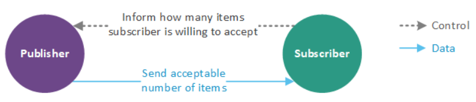
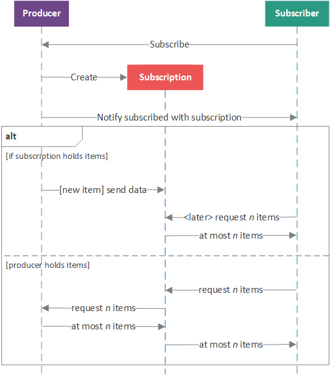
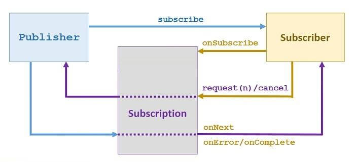

In this article, we will dive into Reactive programming in Java, especially we have to understand about its architecture. Based on it, we can easily apply them into utilizing some frameworks such as RxJava, Reactor, ...

Let's get started.

<br>

## Table of contents
- [What is Reactive programming ?](#what-is-reactive-programming-?)
- [Reactive architecture](#reactive-architecture)
- [How does Java implement Reactive programming ?](#how-does-java-implement-reactive-programming-?)
- [Benefits and Drawbacks](#benefits-and-drawbacks)
- [Some interview questions](#some-interview-questions)
- [Wrapping up](#wrapping-up)

<br>

## What is Reactive programming ?

In a modern web application, response speed or the latency proprety is an important property to make user come back with your website, beside UI - User Interface, UX - User Experience.

When a user send a request to server such as get all cell phones's information for specific type, we have two ways to deal with it:
- Synchronous approach: Keep the user waiting util the result has not been processed to find the list of the cell phones that will be fetched from the database.

- Asynchronous approach: Allow the user to proceed further and use other stuff in the application, such as finding cell phone details, availability of items, and so on.

So, easily our reactive programming will be using asynchronous approach.

<br>

## Reactive architecture
In Reactive concept, we use a publisher - subscriber mechanism. It can be described with the following ideas:

- A ```subscriber``` informs a ```publisher``` that it is willing to accept a given number of items (requests a given number of items), and if items are available, the ```publisher``` pushes the maximum receivable number of items to the ```subscriber```. 

    It is important to note that this is a two-way communication, where the subscriber informs the publisher how many items it is willing to handle and the publisher pushes that number of items to the subscriber.

- The process of restricting the number of items that a ```subscriber``` is willing to accept (as judged by the ```subscriber``` ifself) is called ```backpressure``` and is essential in prohibiting the overloading of the ```subscriber``` (pushing more items that the ```subscriber``` can handle).

    

    The two-way connection between a ```publisher``` and a ```subscriber``` is called a ```subscription```. This ```subscription``` binds a single ```publisher``` to a single ```subscriber``` (one-to-one relationship) and may be unicast or multicast.

    A single ```subscriber``` subscribe to a ```publisher```, the ```publisher``` notifies the ```subscriber``` of the subscription that was created, allowing the ```subscriber``` to store a reference to the ```subscription``` (if desired). Once this notification process is completed, the ```subscriber``` can inform the ```publisher``` that it is ready to receive some n number of items.

- When the ```publisher``` has items available, it then sends at most n number of items to the ```subscriber```. If an error occurs in the ```publisher```, it signals the ```subscriber``` of the error. If the ```publisher``` is permanently finished sending data, it signals the ```subscriber``` that it is complete. If the ```subscriber``` is notified that either an error occurred or the ```publisher``` is complete, the ```subscription``` is considered canceled and no more interactions between the ```publisher``` and ```subscriber``` (or the ```subscription```) will take place.

    This ```subscription``` workflow will be illustrated in the figure below.

    

    It is important to note that there are two theoretical approaches to streaming data to a ```subscriber```.

    1. The ```subscription``` holds the items

        The ```publisher``` pushes items to the ```subscription``` when they become available; when, at a later time, the ```subscriber``` requests n items, the ```subscription``` provides n or fewer items it has previously been given by the ```publisher```. This may be used when the ```publisher``` manages queued items, such as incoming HTTP requests.

    2. The ```publisher``` holds the items.

        The ```subscriber``` forwards requests to the ```publisher```, which pushes n or fewer items to the ```subscription```, which in turn pushes those same items to the ```subscriber```. This scenario may be more suitable for instances were items are generated as needed, such as with a prime number generator.

    It is also important to note that items do not have to be present before a request can be made. If a ```subscriber``` makes a request for n items and no items are available, the ```subscriber``` will wait until at least one item is available and is pushed to the ```subscriber```. If there are i items available when the ```subscriber``` makes a request for n items, where i is less than n, the i items are pushed to the ```subscriber```. Once j more items are available, n - i items of the j items are also pushed to the ```subscriber``` until n number of total items have been pushed to the ```subscriber``` (i + j = n), or the ```subscriber``` has requested m more items; in this case, all j number of items may be pushed to the ```subscriber``` so long as i + j is less than or equal to n + m. The number of items that a ```subscriber``` can accept at any given time (which may or may not be equal to n, depending on the number of items already pushed to the ```subscriber```) is called the ```outstanding demand```.

    For example, suppose a ```subscriber``` requests 5 items and 7 are currently available items in the ```publisher```. The outstanding demand for the subscriber is 5 so 5 of the 7 items are pushed to the ```subscriber```. The remaining 2 items are maintained by the ```publisher```, awaiting the ```subscriber``` to request more items. If the ```subscriber``` then requests 10 more items, the 2 remaining items are pushed to the ```subscriber```, resulting in an outstanding demand of 8. If 5 more items become available in the ```publisher```, these 5 items are pushed to the ```subscriber```, leaving an outstanding demand of 3. The outstanding demand will remain at 3 unless the ```subscriber``` requests n more items, in which case the outstanding demand will increase to 3 + n, or more i items are pushed to the ```subscriber```, in which case the outstanding demand will decrease to 3 - i (to a minimum of 0).

<br>

## How does Java implement Reactive programming ?
In Reactive programming, Reactive Stream is a center concept, it completely boosts the performance of the stream of java.

There are many libraries that implement the Reactive Stream specification. They support Reactive programming such as:
- Akka
- Reactor
- RxJava
- Streams
- Ratpack
- Vert.x.

Because of Spring that is utilizing Reactor library to implement reactive streams, so we will see Reactor will contain which elements in it.

Below is some parts of Reactor library:



- Publisher

    According to [http://www.reactive-streams.org](http://www.reactive-streams.org/reactive-streams-1.0.0-javadoc/org/reactivestreams/Publisher.html) about Publisher, we have:
    - A Publisher is a provider of a potentially unbounded number of sequenced elements, publishing them according to the demand received from its Subscribers.
    - A Publisher can serve multiple Subscribers subscribed 

    ```Java
    public interface Publisher<T> {
        // request Publisher to start streaming data
        // This is a factory method, and can be called multiple times, each time starting a new Subscription.
        // Each Subscription will work for only a single Subscriber.
        void subscribe(Subscriber<? super T> s);
    }
    ```

- Subscriber

    According to [http://www.reactive-streams.org](http://www.reactive-streams.org/reactive-streams-1.0.0-javadoc/org/reactivestreams/Subscriber.html) about Subscriber, we have:
    -  Will receive call to ```onSubscribe(Subscription)``` once after passing an instance of Subscriber to ```Publisher.subscribe(Subscriber)```.
    - No further notifications will be received until ```Subscription.request(long)``` is called.

    ```Java
    public interface Subscriber<T> {
        // successful terminal state
        void onComplete();

        // failed terminal state
        void onError(Throwable t);

        // data notification sent by the Publisher in response to requests to Subscription.request(long)
        void onNext(T t);

        // invoked after calling Publisher.subscribe(Subscriber)
        void onSubscribe(Subscription s);
    }
    ```

- Subscription

    According to [http://www.reactive-streams.org](http://www.reactive-streams.org/reactive-streams-1.0.0-javadoc/org/reactivestreams/Subscription.html#request-long-), we have:
    - A Subscription represents a one-to-one lifecycle of a Subscriber subscribing to a Publisher.
    - It can only be used once by a single Subscriber.
    - It is used to both signal desire for data and cancel demand (and allow resource cleanup).


    ```Java
    public interface Subscription {
        // request the Publisher to stop sending data and clean up resources
        void cancel();

        // no events will be sent by a Publisher until demand is signaled via this method
        void request(long n);
    }
    ```

<br>

## Benefits and Drawbacks
1. Benefits

    - It increases the performance of the application.
    - It increases the utilization of computing resources on a multicore.
    - It provides a more maintainable approach to deal with asynchronous programming.
    - It includes back pressure, which plays a vital role to avoid over-utilization of the resources.

    Because:
    - Reactive system supports parallel programming to avoid blocking of the resources in order to utilize the hardware to its fullest.

<br>

## Some interview questions

1. ```Flux<T>``` finite collection or infinite stream?

    It depends on media type to decide.
    - ```application/json``` --> finite collection (JSON array)

        No back-pressure, Flux#collectToList (request all + buffer)

    - ```text/event-stream```, ```application/stream+json``` --> infinite stream

        Back-pressure with request(n), write, flush, repeat.


<br>

## Wrapping up
- Before Java 8, asynchronous non-blocking behavior was not obvious to implement for at least two reasons.

    - Callback based API required verbose anonymous classes and are not easy to chain.
    - ```Future``` type is asynchronous but blocks the current thread until the computation completes when we try to get the result with the ```get()``` method.

- Netty server

    - Monolithic: 200-300 requests/sec/host
    - Reactive: 10-20k requests/sec/host

- Reactor project allows building high performance (low latency, high throughput) non-blocking asynchronous applications on JVM.

    Reactor is desgined to be extraordinarily fast and can sustain throughput rates on order of 10's of millions of operations per second.

    Make uses of the concept of Mechanical Sympathy built on top of Disruptor / RingBuffer.

<br>

[https://www.lightbend.com/blog/understand-reactive-architecture-design-and-programming-in-less-than-12-minutes](https://www.lightbend.com/blog/understand-reactive-architecture-design-and-programming-in-less-than-12-minutes)

[https://dzone.com/articles/reactive-streams-in-java-9](https://dzone.com/articles/reactive-streams-in-java-9)

[https://www.slideshare.net/InfoQ/servlet-vs-reactive-stacks-in-five-use-cases](https://www.slideshare.net/InfoQ/servlet-vs-reactive-stacks-in-five-use-cases)