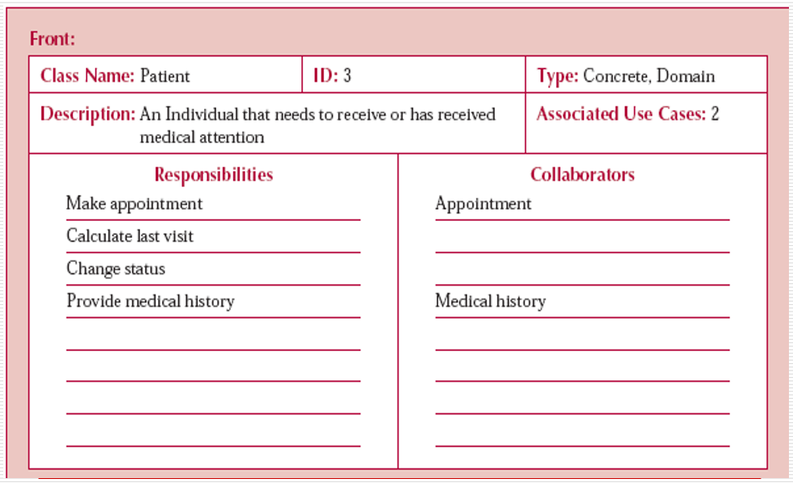
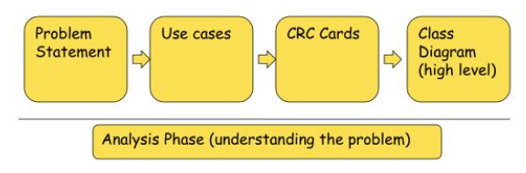

<br>

## Table of contents
- [Given problem](#given-problem)
- [Solution with Encapsulation](#solution-with-encapsulation)
- [Some replacement ways for Encapsulation](#some-replacement-ways-for-encapsulation)
- [Benefits and Drawbacks](#benefits-and-drawbacks)
- [CRC process to avoid violating encapsulation](#crc-process-to-avoid-violating-encapsulation)
- [Wrapping up](#wrapping-up)


<br>

## Given problem

In procedural programming such as C, Pascal, we usually define some global variables to share states between functions. It can be looked like:

```java
int results[10];

int main() {
    // do something with results variable

    return 0;
}

void process1() {
    // do something with results variable
    // ...
}

void process2() {
    // do something with results variable
    // ...
}
```

When our system can become complex, the changes of state will make us difficult to track. Belows are some problems:
- share mutable variables
- side effects
- hard to parallel
- in the complex system, there are enormous share states, so it's really difficult to change.

So how do we solve this problem?

<br>

## Solution with Encapsulation

1. The meaning of Encapsulation

    Encapsulation is the process of protecting data from the outside changes directly. It is related to the security in OOP. From these points of view, we can see them that appears in multiple documents, websites. But we need to ask lots of question to make these points clearer.
    - What does using **public** access specifier for all fields happen?

        For example:

        ```java
        public class Student {
            public String name;
            public String age;
            public String address;
            
            public Student() {}
        }
        ```

        From the outside, we can access directly to its fields. It looks like the below source code:

        ```java
        public static void main(String[] args) {
            Student student = new Student();
            student.name = "something";
            student.age = 12;
        }
        ```

        From the above code, it is easy to find that Student instance's fields can be changed implicitly. When we know the address of their fields, other people can be get its value. It violates the security rules. And it can make our object inconsistent, for example, the **name** field of **Student** object can be null, empty, but **age** field can still be exist.

        Solution for this problem is that using **private** access specifier.

    - Using **private** access specifier and providing **public** services of these objects, can it violate encapsulation?

        It depends on our situations.
        - If we use DTO pattern or Entity in the persistence layer, we can use getter/setter methods. Because this class simply contains data without behaviors.
        - Otherwise, we should use getter/setter methods properly.

            For example:

            ```java
            public class Rectangle {
                private int height;
                private int width;

                public Rectangle() {}

                public int getHeight() {
                    return this.height;
                }

                public int setHeight(int height) {
                    this.height = height;
                }

                public int getWidth() {
                    return this.width;
                }

                public int setWidth(int width) {
                    this.width = width;
                }

                public static void main(String[] args) {
                    Rectangle rect = new Rectangle(); // (1)
                    rect.setHeight(0);      // (2)
                    rect.setWidth(2);

                    int area = rect.getHeight() * rect.getWidth();  // (3)
                }
            }
            ```

            In the above example, we can find that:
            - At step **(1)**, creating a rectangle without parameters. So, its fields will receive the default values.

            - At step **(2)**, using setter methods for its fields to set values. But the height's value is 0, and the width's value is 2. It does not make sense. Because there is no exist any rectangle with these values.

                Solution for this case is that we need to provide the guard clause in each setter method.

                For example:

                ```java
                public int setHeight(int height) {
                    if (height <= 0) {
                        throw new RuntimeException();
                    }

                    this.height = height;
                }

                public int setWidth(int width) {
                    if (width <= 0) {
                        throw new RuntimeException();
                    }

                    this.width = width;
                }
                ```

                But using setter methods will make our objects inconsistent. So, we will remove setter methods, and our fields are not reference types, then we do not remove getter methods.

            - At step **(3)**, calculating the area of that rectangle.

                Using **CRC process**, we can easily look at that the calculating area of the rectange should be a responsibility of a **Rectangle**. So, we need to define it in **Rectangle** class.


            So, the Rectangle class will look like:

            ```java
            public class Rectangle {
                private int height;
                private int width;

                public Rectangle(int height, int width) {
                    if (height <= 0) {
                        throw new RuntimeException();
                    }

                    if (width <= 0) {
                        throw new RuntimeException();
                    }

                    this.height = height;
                    this.width = width;
                }

                public int calculateArea() {
                    return this.height * this.width;
                }

                public int getHeight() {
                    return this.height;
                }

                public int getWidth() {
                    return this.width;
                }
            }
            ```

            Benefits of this approach:
            - Our objects will always in a consistent states. It's really useful when we have to cope with the null value of arguments. It is one of the ways in defense programming.
            - Using **calculateArea()** method in Rectangle class is a presentation of Rich Domain Model.

    - When our system becomes complex, which benefits does encapsulation provide?

        The primary benefit of using encapsulation is that loose coupling. Because it does not expose the object's data, the implementation detail, it only show its neccessary behaviors. And the internal state is hidden through **private** access specifier, there is less dependency of external elements to that internal state. Less dependency is loose coupling. According to Alan Kay about OOP, the interaction between objects is about passing message.

        Based on that, when any system becomes complex, it can easily scale up.

        To sum up the above ideas, the benefits of encapsulate are:
        - Loose coupling
        - Improve scalability
        - Enhance security
        - isolation complexity

2. How to implement encapsulation in OOP

    Belows are some strategies about implementing encapsulation right away.
    - Using **private** access specifier for all fields.
    - Provide getter/setter methods properly.
    - Using CRC process when designing classses.

<br>

## Some replacement ways for Encapsulation

1. Modularisation

    Grouping elements with higher internal coupling and lower external coupling.

2. Local simplicity

    Each element should have only one responsibility.

<br>

## Benefits and Drawbacks

1. Benefits

    - By using encapsulation properly, it can make our application easy to maintain, scalability, having less bug because isolating other objects from local state changes, so we do not change states of lots of objects from the outside. And if code changes can be made independently without effecting other classes.

    - Loose coupling between components/classes.

    - Encapsulation protects the data integrity.

    - It isolates the complexity of our program.

2. Drawbacks

    - It's diffcult for a beginner when trying to learn some new concepts of OOP.

<br>

## CRC process to avoid violating encapsulation

CRC word is acronym of **Class Responsibility Collaboration**, this CRC process will be used to describe:
- The responsibilities of a class
- Other classes that interact with it

Belows is the elements of CRC card.
- Class 

    - Class Name: describes the name of class that we want to define.
    - Superclass: a class which another class inherits.
    - Subclass: a class that inherits from other classes.

- Responsibility

    To list all responsibilities of this class, we need to answer some questions:
    - What does it know?
    - What does it do?
    - What does it decide?

- Collaboration

    This element will list all subjects that interact with it.

To know more about CRC card, we can see the below images:




And then it is the process for OOAD.




<br>

## Wrapping up

- Don't ask for the information you need to do the work; ask for the object that has the information to do the work for you.

- Encapsulation is an act of protecting the data integrity. It means that encapsulation prevents clients of a class from setting the internal data into an invalid or consistent state.

    So, **to archive the data integrity, we need to bundle data and operation together**.

<br>

Refer:

[https://martinfowler.com/bliki/GetterEradicator.html](https://martinfowler.com/bliki/GetterEradicator.html)

[https://www.infoworld.com/article/2073723/why-getter-and-setter-methods-are-evil.html](https://www.infoworld.com/article/2073723/why-getter-and-setter-methods-are-evil.html)

[http://www.cems.uwe.ac.uk/~jsa/UMLJavaShortCourse09/CGOutput/Unit3/unit3(0809)/page_09.htm](http://www.cems.uwe.ac.uk/~jsa/UMLJavaShortCourse09/CGOutput/Unit3/unit3(0809)/page_09.htm)

[https://www.quora.com/What-is-the-primary-benefit-of-Encapsulation](https://www.quora.com/What-is-the-primary-benefit-of-Encapsulation)

[http://www.cems.uwe.ac.uk/~jsa/UMLJavaShortCourse09/CGOutput/Unit3/unit3(0809)/page_12.htm](http://www.cems.uwe.ac.uk/~jsa/UMLJavaShortCourse09/CGOutput/Unit3/unit3(0809)/page_12.htm)

[https://www.slideserve.com/jerom/object-oriented-analysis-powerpoint-ppt-presentation](https://www.slideserve.com/jerom/object-oriented-analysis-powerpoint-ppt-presentation)