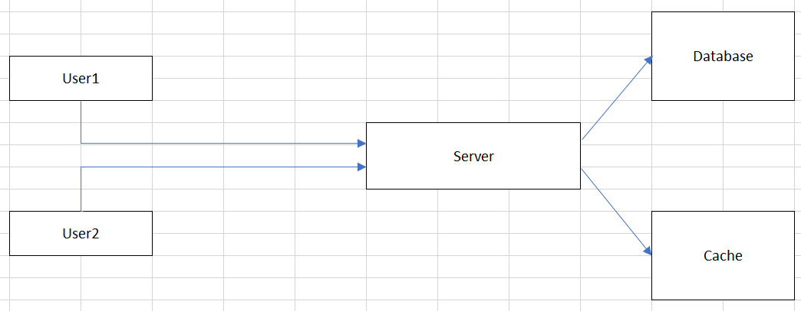
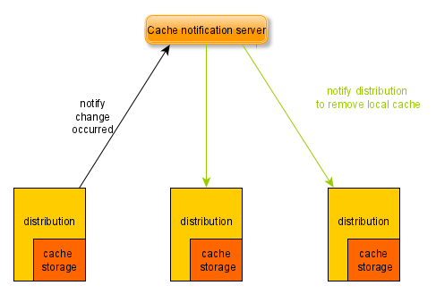

 

## Table of contents
- [Given problem](#given-problem)
- [Solution of using Caching](#solution-of-using-caching)
- [Some types of caching](#some-types-of-caching)
- [Some caching writing policies](#some-caching-writing-policies)
- [Some caching eviction policies](#some-caching-eviction-policies)
- [When to use](#when-to-use)
- [Benefits and Drawbacks](#benefits-and-drawbacks)
- [Wrapping up](#wrapping-up)

 

## Given problem

Assuming that we have our distributed system can be looked like the below image:

From the above image, we can find that we have:
- When a User1 want to retrieve information from our Server, User1 sends that request to Server, then Server will take so much time to calculate, and access to Database to find records that satisfy User1's conditions.

- Then, a User2 also want to get the same information, our Server also need to process again, and access to Database.

Belows are some drawbacks of the above system design:
- If there are many users that require the same information that is calculated for a long time, it makes us recomputation.
- Otherwise, we also need to access the other external system, so it will increases the round-trip of network calls and the database load.

Therefore, how do we deal with it?

 

## Solution of using Caching

1. Introduction to Caching

    Caching is a ways that we save the frequent used data in memory without disk. Caching is really an important way to improve hugely the performance of a system.

2. Some essential concepts of Caching

    - Cache hit
    
        Cache hit is a case that our application access cache and find it.

    - Cache miss

        Cache miss is a case that our application doesn't find a data in a cache.

    - Thrashing 

 

## Some types of caching

1. Local cache

    A local cache means that we will use available memory in our current application server to store data.

    For example:
    - JCache
    - EhCache
    - Guava Cache
    - Spring Caching

    In local cache, there are two common types:
    - On-heap local cache

        On-heap caching refers to storing data in a Java heap, where it's managed automatically by GC.

    - Off-heap local cache

        Off-heap caching refers to storing the data outside the heap. This data is not automatically handled by GC. Since it's stored outside the Java heap, the data needs to be stored as an array of bytes. Hence, there's an additional overhead of serializing and de-serializing the data.

    To expand the local caches that are suitable for the distributed system, these local caches need to communicate together like the below image:

    

    Benefits of this approach:
    - It improve hugely the performance of our system, simply because of accessing data in its memory.

    Drawbacks of this approach:
    - Building this local cache system is difficult, redundant because we also need to take care about the availability of cache notification server, select the most suitable protocol for updating data in local cache.
    - the consistency problem between these local caches.
    - The local caches can take more resources such as CPU, RAM of the application servers. However, the vertical horizontal for each application server is limited.

2. Distributed cache

    A distributed cache is a seperated server that uses in-memory stores.

    Belows are some distributed caches that we can usually use to design a system.
    - Redis

    - Memcached

    - EhCache

    - Riak

    - Hazelcast

    Benefits of this approach:
    - Utilize some distributed caches will make a system that satisfies some non-functional requirements such as scalability, reliability, availability.

        For example:
        - Using redis sentinel and redis cluster.

    - We can use these distributed caches for the distributed locking to coordinate between multiple tasks.

    Drawbacks of this approach:
    - It takes the round-trip time between the application server and the distributed cache.

 

## Some caching reading policies

1. Read-through cache

    If cache miss happens, fetch the data from the data source and save it into the cache before returning the new value.

    Drawbacks:
    - higher latency on cache read misses.

 

## Some caching writing policies

    These policies are called as cache validation policies. Belows are some policies that we need to know.

1. Write-through cache

    A write-through cache means that updating data on both cache and database synchronously. It means that systems have to wait for the database or cache complete their writes before moving to the next tasks of cache or database. So, if one of their writes fail, we will consider their operations as fail.

    Some trade-off characteristics of Write-through cache:
    - Benefits
    
        - This policy will improve the data consistency between cache and database.
        - It's easy to recover data when the cache and database cope with problems accidently such as crash, power failure, ...

    - Drawbacks

        - It's time-consuming task when we need to wait for the updating cache and database completely.

            It means that it has the high latency of write operations.

    When to use:
    - It's suitable for an application that has read-heavy operations.

2. Write-back cache

    To reduce the time-consuming problem of write-through cache, the write-back cache was created. Instead of using synchronous ways for the writing of database and cache, we will utilize asynchronous ways. It means that first, update data to the cache. Then, after a few of times, our application will read which data isn't persisted in the database, then writing it to the database.

    A write-back cache is also called as write-behind cache and copy-back cache.

    Some trade-off characteristics of Write-back cache:
    - Benefits

        - Improve the writing performance of the write-through cache with low latency and high throughput.
            
            This way is suitable for write-heavy workloads.

    - Drawbacks

        - It provides the complex tasks to keep track of the data which isn's still to implement writing data to the database.
        - Because of pushing data to the memory of the either caching system or the local cache in the application server, it can be lost update. 

3. Write-around cache

    This policy will only write directly data to the data source without cache. This can reduce the cache being flooded with write operations that will not subsequently be re-read. And this policy will usually combine with the read-through cache.

    Some trade-off characteristics of Write-around cache:
    - Benefits

        - If our data isn't frequently used, applying this policy will reduce the redundancy of writing operations to cache.

    - Drawbacks

        - Sometimes, we encounter the cache miss problem, we need to access the data source to get that data. Then, it's high latency, and low throughput. But is's a rare case.

 

## Some caching eviction policies

A caching eviction algorithm is a way of deciding which element to evict when the cache is full.

1. LRU - Least Recently Used

    Remove the least recently used items first.

2. LFU - Least Frequently Used

    Remove the least frequently used items first.

    For example:
    - Used in caffeine

3. MRU - Most Recently Used

    Remove the most recently used items first.

4. FIFO - First In First Out

5. LIFO - Last In First Out

6. RR - Random Replacement

    Randomly selects a candidate item and discards it to make space when necessary.

 

## When to use

- When data is frequently access by the multiple users.

    It means that caching should be used in the read-heavy case, not write-heavy case.

    For example: Google will cache the result of some hot search.

- When the computation for that data is CPU-intensive.

 

## Benefits and Drawbacks

1. Benefits

    - If using the suitable strategies for caching, it will improve hugely performance for our application.

2. Drawbacks

 

## Wrapping up

- Understanding about some cache invalidation policies, cache eviction policies.

- Always wonder ourself about the rate of read operations and write operations in our application, then choosing the best policies that fit our problems.

 

Refer:

[https://www.8bitmen.com/distributed-cache-101-the-only-guide-youll-ever-need/](https://www.8bitmen.com/distributed-cache-101-the-only-guide-youll-ever-need/)

[https://lethain.com/introduction-to-architecting-systems-for-scale/](https://lethain.com/introduction-to-architecting-systems-for-scale/)

[What is Distributed Caching? Explained with Redis!](https://www.youtube.com/watch?v=U3RkDLtS7uY)

[Understanding write-through, write-around and write-back caching (with Python)](https://shahriar.svbtle.com/Understanding-writethrough-writearound-and-writeback-caching-with-python)

[https://dzone.com/articles/database-caching-with-redis-and-java](https://dzone.com/articles/database-caching-with-redis-and-java)

[https://towardsdatascience.com/system-design-interview-prep-should-you-put-the-data-in-cache-56936697ee54](https://towardsdatascience.com/system-design-interview-prep-should-you-put-the-data-in-cache-56936697ee54)

[https://betterprogramming.pub/introduction-and-strategies-to-handle-challenges-in-caching-c619d51882c0](https://betterprogramming.pub/introduction-and-strategies-to-handle-challenges-in-caching-c619d51882c0)

[https://docs.oracle.com/cd/E15357_01/coh.360/e15723/cache_rtwtwbra.htm#COHDG5181](https://docs.oracle.com/cd/E15357_01/coh.360/e15723/cache_rtwtwbra.htm#COHDG5181)

[https://shahriar.svbtle.com/Understanding-writethrough-writearound-and-writeback-caching-with-python](https://shahriar.svbtle.com/Understanding-writethrough-writearound-and-writeback-caching-with-python)

[https://medium.com/rtkal/distributed-cache-design-348cbe334df1](https://medium.com/rtkal/distributed-cache-design-348cbe334df1)

[https://dzone.com/articles/using-read-through-amp-write-through-in-distribute-2](https://dzone.com/articles/using-read-through-amp-write-through-in-distribute-2)

[https://dzone.com/articles/using-read-through-amp-write-through-in-distribute](https://dzone.com/articles/using-read-through-amp-write-through-in-distribute)

[https://comdy.vn/software-architecture/cache-trong-distributed-system/](https://comdy.vn/software-architecture/cache-trong-distributed-system/)

[https://online.grokking.org/articles/28/phan-chia-du-lieu-cache-tren-cum-server-voi-consistent-hashing](https://online.grokking.org/articles/28/phan-chia-du-lieu-cache-tren-cum-server-voi-consistent-hashing)

[https://codeahoy.com/2017/08/11/caching-strategies-and-how-to-choose-the-right-one/](https://codeahoy.com/2017/08/11/caching-strategies-and-how-to-choose-the-right-one/)

[https://www.techtalksbyanvita.com/post/caching-strategies-for-distributed-systems](https://www.techtalksbyanvita.com/post/caching-strategies-for-distributed-systems)

[https://dev.to/tharindu/a-quick-introduction-to-distributed-caching-48e3](https://dev.to/tharindu/a-quick-introduction-to-distributed-caching-48e3)

[https://igotanoffer.com/blogs/tech/caching-system-design-interview](https://igotanoffer.com/blogs/tech/caching-system-design-interview)

[https://programmingsharing.com/caching-in-the-distributed-system-c5dce8a41321](https://programmingsharing.com/caching-in-the-distributed-system-c5dce8a41321)

[https://www.slideshare.net/HARIHARANANANTHARAMA1/caching-in-java-best-practises](https://www.slideshare.net/HARIHARANANANTHARAMA1/caching-in-java-best-practises)

 

**Cache Thrashing**

[https://searchsoftwarequality.techtarget.com/definition/cache-thrash](https://searchsoftwarequality.techtarget.com/definition/cache-thrash)

[https://www.quora.com/What-is-cache-thrashing](https://www.quora.com/What-is-cache-thrashing)

[https://www.geeksforgeeks.org/techniques-to-handle-thrashing/](https://www.geeksforgeeks.org/techniques-to-handle-thrashing/)

[https://www.cs.utexas.edu/users/dahlin/Classes/UGOS/lectures/lec16.pdf](https://www.cs.utexas.edu/users/dahlin/Classes/UGOS/lectures/lec16.pdf)