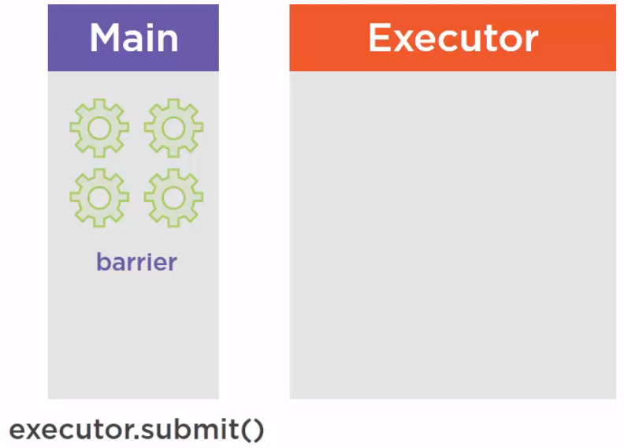
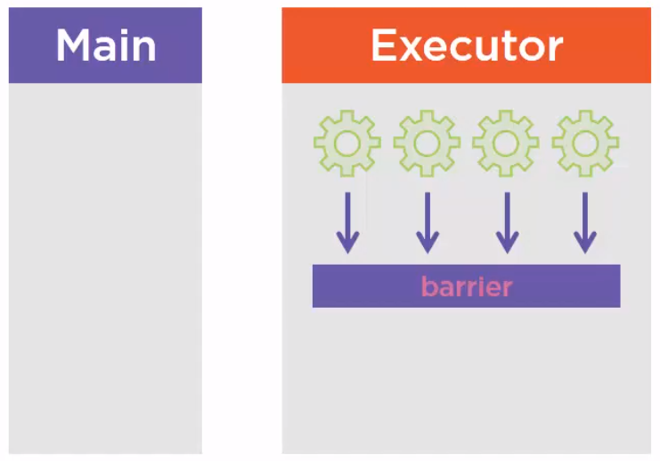
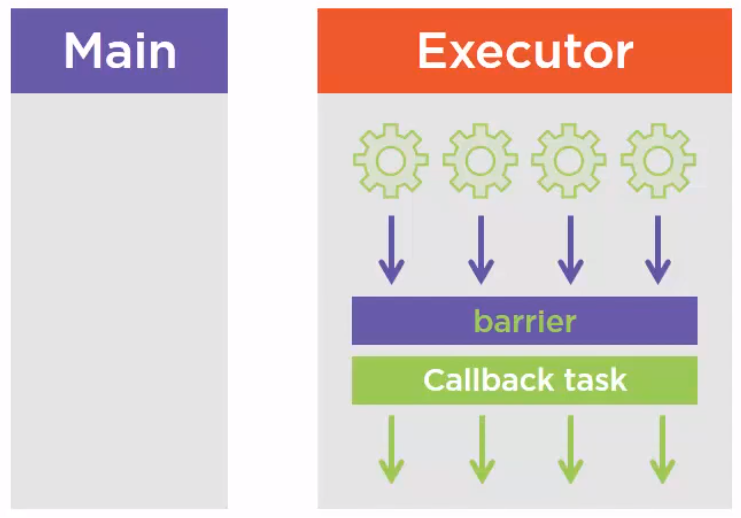

<br>

## Table of contents
- [Given problem](#given-problem)
- [Solution of CyclicBarrier](#Solution-of-CyclicBarrier)
- [When to use](#when-to-use)
- [Benefits and Drawbacks](#benefits-and-drawbacks)
- [The difference between CountDownLatch and CyclicBarrier](#the-difference-between-countdownlatch-and-cyclicbarrier)
- [Wrapping up](#wrapping-up)


<br>

## Given problem

1. Basic problem

    Suppose we need to compute something that is a heavy computation and we want to share this computation among several threads. This is a very classical use case. What we could do is divide our data set among several threads. Each thread is given a subtask and what we expect is that each thread will be executed on a given call of our CPU. When all the threads are done, what we need to do is to gather all the results of the computations and merge them, so we need some subsequent task to be triggered to do this merging operation.

2. The drawback of CountDownLatch

    Before jumping into **CyclicBarrier** - how it works, we need to read about the article [CountDownLatch in Java's Multithreading](https://gamethapcam.github.io/2020-02-12-CountDownLatch-in-Java's-multithreading/).

    The drawback of **CountDownLatch** is the reusable property. Because when the current count of **CountDownLatch** is equal to zero, the current count does not reset again.

    And **CountDownLatch.await()** will be called in the main thread, to continue the main thread's tasks. It's difficult to use when we need to do the other task, not in the main thread, if the remained threads finished.

    The **CountDownLatch.await()** method will block the main thread to wait for all other threads completely finishes. Sometimes we do not need this situation, we want do the other task without blocking the main thread.

    So how does reduce these drawbacks?

<br>

## Solution of CyclicBarrier

To solve all above issues, Java provides CyclicBarrier. **CyclicBarrier** was introduced in Java 5 that is acompanied with CountDownLatch, Semaphore, ... 

Belows are some steps to describe how **CyclicBarrier** works.
- First, we need to construct **CyclicBarrier** with the number of threads and (optional) the barrier action will be implemented after all threads reach barrier.

    ```java
    int numThreads = 5;
    Runnable barrierAction = () -> System.out.println("Barrier action will be implemented when other threads finished.");
    CyclicBarrier barrier = new CyclicBarrier(numThreads, barrierAction);

    // ...
    ```

    From the document of CyclicBarrier on [docs.oracle.com](https://docs.oracle.com/javase/8/docs/api/java/util/concurrent/CyclicBarrier.html), we have:

    ```java
    // Creates a new CyclicBarrier that will trip when the given number of parties (threads) are waiting upon it,
    // and which will execute the given barrier action when the barrier is tripped,
    // performed by the last thread entering the barrier.
    public CyclicBarrier(int parties, Runnable barrierAction);

    // Creates a new CyclicBarrier that will trip when the given number of parties (threads) are waiting upon it,
    // and does not perform a predefined action when the barrier is tripped.
    public CyclicBarrier(int parties)
    ```

- Second, pass our **CyclicBarrier**'s instance to the threads. In each thread, we need to call **CyclicBarrier.await()** method. It will wait until all parties have invoked await() on this barrier.

    ```java
    public class CyclicBarrierWorker implements Runnable {

        private CyclicBarrier cyclicBarrier;

        private int workerId;

        private Random random;

        public CyclicBarrierWorker(CyclicBarrier cyclicBarrier, int workerId) {
            this.cyclicBarrier = cyclicBarrier;
            this.workerId = workerId;
            this.random = new Random();
        }

        @Override
        public void run() {
            System.out.println("Starting worker ID " + this.workerId);
            try {
                Thread.sleep(random.nextInt(4000));
                System.out.println("Worker " + workerId + " Completed it's work, Reducing  count of cyclicBarrier " );
                cyclicBarrier.await();

                System.out.println("Worker " + workerId + " process again.");
            } catch (InterruptedException | BrokenBarrierException e) {
                e.printStackTrace();
            }
        }
    }

    // In main thread
    // ...
    ExecutorService newFixedThreadPool = Executors.newFixedThreadPool(10);
    IntStream.range(1,6)
            .forEach(cnt->{newFixedThreadPool.submit(new CyclicBarrierWorker(cyclicBarrier, cnt));
            });
    System.out.println("All Task Submited");
    newFixedThreadPool.shutdown();
    ```

    Then, we have result:

    ```
    All Task Submited
    Starting worker ID 2
    Starting worker ID 3
    Starting worker ID 4
    Starting worker ID 1
    Starting worker ID 5
    Worker 4 Completed it's work, Reducing  count of cyclicBarrier 
    Worker 5 Completed it's work, Reducing  count of cyclicBarrier 
    Worker 3 Completed it's work, Reducing  count of cyclicBarrier 
    Worker 2 Completed it's work, Reducing  count of cyclicBarrier 
    Worker 1 Completed it's work, Reducing  count of cyclicBarrier 
    Barrier point reach ::: All Task Completed
    Worker 1 process again.
    Worker 5 process again.
    Worker 3 process again.
    Worker 2 process again.
    Worker 4 process again.
    ```

    So, we can have some conclusion:
    - When all threads reach the barrier point, the barrier action will be called first. Then all threads will continue processing the remained work on it.

- Finally, after all threads waited on the barrier, then the barrier action will be called if it is declared in the constructor of **CyclicBarrier**.

<br>

## How CyclicBarrier works

Suppose that we have four callables created in the main thread and a barrier object.



All these callables are passed to the **executor.submit()** method. They are going to be executed in the ExecutorService and the barrier for the moment is closed, which is its default state when it is created. All those tasks are going to compute the data set and we call the await() method on this barrier object.



Now this barrier object is going to count how many times this await() method has been called and when this number of call matches the number of which this barrier has been created, it will open and let the threads continue their execution. After that, we can setup a callback task that will be triggered when the barrier is open.



<br>

## Understanding about await() and reset() methods

1. await() method

    Below is the information of **await()** method we need to know:

    The **await()** method call is a blocking call. In fact, we have two versions of this **await()** method.

    ```java
    public int await() throws InterruptedException, BrokenBarrierException;

    public int await(long timeout, TimeUnit unit) throws InterruptedException, BrokenBarrierException, TimeoutException;
    ```

    If the current thread is not the last thread, but it called **CyclicBarrier.await()** method, then the current thread will be pushed into the waiting queue by the thread scheduler.

    It will works again when satisfies one of situations:
    - The last thread arrives
    - The specified timeout elapses
    - Some other thread interrupts the current thread
    - Some other thread interrupts one of the other waiting threads
    - Some other thread times out while waiting for barrier
    - Some other thread invokes **reset()** on this barrier.

    If the **current thread is the last thread** to arrive, and **a non-null barrier action was supplied in the constructor**, then **the current thread runs the action before allowing the other threads to continue**. **If an exception occurs during the barrier action then that exception will be propagated in the current thread and the barrier is placed in the broken state**.

    Once opened, a barrier is normally reset, that is it will open, let the thread go through, and then close again.

2. reset() method

    We can reset manually on the barrier. It will open the barrier, but open it exceptionally. So all the waiting threads on this barrier are going to throw a BrokenBarrierException in that case.

    A **BrokenBarrierException** is raised if:
    - a thread is interrupted while waiting.
    - the barrier is reset while some threads are waiting.

<br>

## When to use

- When multiple thread carry out different sub-tasks and the output of these sub-tasks need to be combined to form the final output.

- Because we can reuse CyclicBarrier, so CyclicBarrier is often used when a task is repeated.

- CyclicBarrier can be used in case of the recurrent event. E.g. concurrently calculating a solution of the big problem.

<br>

## Benefits and Drawbacks

1. Benefits over CountDownLatch

    - CyclicBarrier can reset its count and is ready for immediate reuse.
    - Once the barrier is met, we could break the barrier.
    - Kind of split-merge (however merge will need to wait till all splitters are done).


<br>

## The difference between CountDownLatch and CyclicBarrier

|                CountDownLatch                 |              CyclicBarrier               |
| --------------------------------------------- | ---------------------------------------- |
| Main thread waits for other threads to complete their execution | Each worker threads wait for each other to complete their execution |
| We can not reuse the same CountDownLatch instance once the count reaches to zero and latch is opened | CyclicBarrier can be reused by resetting Barrier, once the barrier is broken. |
| No such action can be provided with CountDownLatch | We can provide barrier action that is run once per barrier point, after the last thread arrives, but before any threads are released. |


<br>

## Applications and Examples

- Used CyclicBarrier in unit test when we need to calculate the number of pass/fail test case.

- The barrier action is useful for updating shared-state before any of the parties continue.

- To implement multi player game which can not begin until all player has joined.

- CyclicBarrier is useful for parallel computations.

<br>

## Wrapping up

- CyclicBarrier is a tool to synchronize several threads between them, and let them continue when they reach a common point.

- A CyclicBarrier is closed when created and will open when all the threads have reached this common point, and then will close again allowing for cyclic computations. It can also be reset manually, but in this case, the waiting thread on the barrier will throw a BrokenBarrierException.

- It is also possible to set timeouts on the threads that are waiting for a barrier to open. So if something goes wrong in our computation, the system is not blocked, the threads can still be freed with an InterruptedException.

- We can use CyclicBarrier wherever we want to use CountDownLatch, but the opposite is not possible because we can not reuse the latch once the count reaches to zero.

- CyclicBarrier is useful in parallel algorithms in which a computation is decomposed into parts, and each part is handled by a separate thread. In such algorithm, the threads must typically rendezvous so that their partial solutions can be merged into a complete solution. To facilitate this, the CyclicBarrier constructor allows us to specify a Runnable object to be executed by the last thread that calls **await()** before any of the other threads are woken up and allowed to resume. This Runnable can provide the coordination required to assemble a solution from the threads' computations or to assign a new computation to each of the threads.

<br>

Refer:

[https://codepumpkin.com/cyclicbarrier-java-concurrency-utilities/](https://codepumpkin.com/cyclicbarrier-java-concurrency-utilities/)

[https://www.java67.com/2012/08/difference-between-countdownlatch-and-cyclicbarrier-java.html](https://www.java67.com/2012/08/difference-between-countdownlatch-and-cyclicbarrier-java.html)

[https://javarevisited.blogspot.com/2012/07/cyclicbarrier-example-java-5-concurrency-tutorial.html](https://javarevisited.blogspot.com/2012/07/cyclicbarrier-example-java-5-concurrency-tutorial.html)

[Java in a nutshell ebook]()