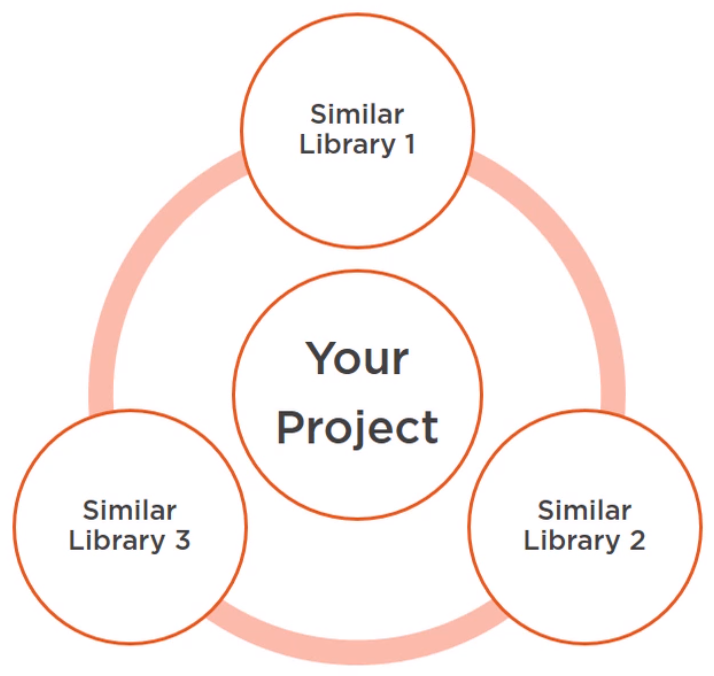
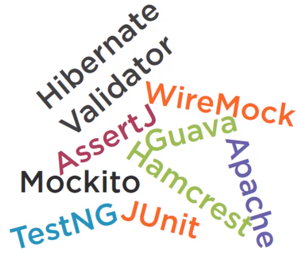

In this article, we will focus on using frameworks to validate our input parameters of methods in our project.

Let's get started.

<br>

## Table of contents
- [Summary information about frameworks](#summary-information-about-frameworks)
- [Native Java](#native-java)
- [Utility Libraries - Guava & Apache framework](#utility-libraries---guava-&-apache-framework)
- [Test libraries - Hamcrest & AssertJ](#test-libraries---hamcrest-&-assertj)
- [How to manage libraries in our project](#how-to-manage-libraries-in-our-project)
- [Wrapping up](#wrapping-up)


<br>

## Summary information about frameworks
- Use native Java

    In Java 1.7 and version later, we are supported to validate method's inputs based on [Objects](https://docs.oracle.com/javase/8/docs/api/java/util/Objects.html) class.

- Use Guava & Apache

    To use Google guava and Apache package, we should insert ```dependency``` into pom.xml file.

    ```xml
    <dependency>
        <groupId>com.google.guava</groupId>
        <artifactId>guava</artifactId>
        <version>28.0-jre</version>
    </dependency>

    <dependency>
        <groupId>org.apache.commons</groupId>
        <artifactId>commons-lang3</artifactId>
        <version>3.9</version>
    </dependency>
    ```

- Use Hamcrest & AssertJ

    ```xml
    <dependency>
        <groupId>org.hamcrest</groupId>
        <artifactId>hamcrest-all</artifactId>
        <version>1.3</version>
        <scope>test</scope>
    </dependency>

    <dependency>
        <groupId>org.assertj</groupId>
        <artifactId>assertj-core</artifactId>
        <version>3.13.2</version>
        <scope>test</scope>
    </dependency>

    <dependency>
        <groupId>org.junit.jupiter</groupId>
        <artifactId>junit-jupiter-api</artifactId>
        <version>5.5.1</version>
        <scope>test</scope>
    </dependency>
    ```

<br>

## Native Java
```Objects``` class provides some useful methods for us to validate method's inputs.
1. For object

    - equals() method

        ```java
        public static boolean equals(Object a, Object b);
        ```

        - Return true if two arguments are equal, otherwise, return false.
        - Both arguments are null, return true.
        - If one of them is null, return false.
        - Correspond to this code:

            ```java
            public static boolean equals(Object a, Object b) {
                // Check conditions

                return a.equals(b);
            }
            ```


    - deepEquals() method

        ```java
        public static boolean deepEquals(Object a, Object b);
        ```

        - Both arguments are deeply equal, then return true, otherwise false.
        - Both arguments are arrays, use ```Arrays.deepEquals()``` method to determine quality.

    - isNull() method

        ```java
        // 1.8
        public static boolean isNull(Object o);
        ```

        - Return true if the argument is null, otherwise false.

    - nonNull() method

        ```java
        // 1.8
        public static boolean nonNull(Object o);
        ```

        - Return true if the argument is non-null, otherwise false.

    - requireNonNull() method

        ```java
        public static <T> T requireNonNull(T obj);

        public static <T> T requireNonNull(T obj, String message);
        ```

        - This method is designed primarily for doing parameter validation in methods and constructors.
        - Throw ```NullPointerException``` exception when the argument is null.

    - requireNonNullElse() method

        ```java
        // 9
        public static <T> T requireNonNullElse(T obj, T defaultObj);

        // 9
        public static <T> T requireNonNullElseGet(T obj, Supplier<? extends T> supplier);
        ```

        - Return the first argument if it is non-null.
        - Otherwise returns ```defaultObj``` or ```supplier``` the non-null second arguement.
        - Throws ```NullPointerException``` exception when both ```obj``` and ```defaultObj``` or ```suplier``` or ```supplier.get()``` value is null.

2. For array

    - checkIndex() method

        ```java
        // 9
        public static int checkIndex(int index, int length);
        ```

        - Checks if the ```index``` is within the bounds of the range from 0 (inclusive) to ```length``` (exclusive).
        - Throws ```IndexOutOfBoundsException``` - if the index is out-of-bounds.

    - checkFromToIndex() method

        ```java
        // 9
        public static int checkFromToIndex(int fromIndex, int toIndex, int length);
        ```

        - Checks if the sub-range from ```fromIndex``` (inclusive) to ```toIndex``` (exclusive) is within the bounds of range from 0 (inclusive) to ```length``` (exclusive).
        - Throws ```IndexOutOfBoundsException``` - if the sub-range is out-of-bounds.

    - checkFromIndexSize() method

        ```java
        public static int checkFromIndexSize(int fromIndex, int size, int length);
        ```

        - Checks if the sub-range from ```fromIndex``` (inclusive) to ```fromIndex + size``` (exclusive) is within the bounds of range from 0 (inclusive) to ```length``` (exclusive).
        - Throws ```IndexOutOfBoundsException``` - if the sub-range is out-of-bounds.

<br>

## Utility Libraries - Guava & Apache framework

Below is the table to compare between Native Java, Guava and Apache about validation.

|                Java              |                    Guava                 |          Apache Commons      |
| -------------------------------- | ---------------------------------------- | ---------------------------- |
| Objects                          | Preconditions                            | Validate                     |
| requireNotNull()                 | checkNotNull()                           | notNull()                    |
|                                  | checkArgument()                          | isTrue()                     |
|                                  | checkState()                             | validState()                 |

<br>

## Test libraries - Hamcrest & AssertJ
1. Hamcrest

    - ```is()```

    - ```anyOf()```

    - ```greaterThan()```

    - ```startWith()```


2. AssertJ

    - ```containsAnyOf()```

    - ```isNotSameAs()```

    - ```isStrictlyBetween()```

    - ```isZero()```

<br>

## How to manage libraries in our project

Assuming that we are working in the project that utilize Spring framework. Spring also has its own verification utils, which is not as powerful as Hamcrest or AssertJ. Furthermore, we can see that the assertion methods are similar to what we have seen.



But this tells us that we should first look up and use those validations instead of importing yet another library. It can actually get a bit out of control. If everyone has their own favorite toy libraries to the project, it can become difficult to manage. This is what some Java project actually look like.



It costs time and money to learn a new API, and get confused to near identical classes and near identical methods.

So, belows are some notes that we want to manage the consistency of dependencies in our project:
- Check if you already have something and consider using that.

- If not, do careful research, discuss and implement.

- Use consistency and prevent further dependency creep.

<br>

## Wrapping up
- Try not to mix Objects and Preconditions APIs.

- Use libraries whatever your project already has.

- Hamcrest and AssertJ are competing, not complementary libraries.

- Do not reinvent the wheel.

<br>

Thanks for your reading.

<br>

Refer:

[Defensive coding in Java](https://app.pluralsight.com/library/courses/defensive-programming-java/table-of-contents)