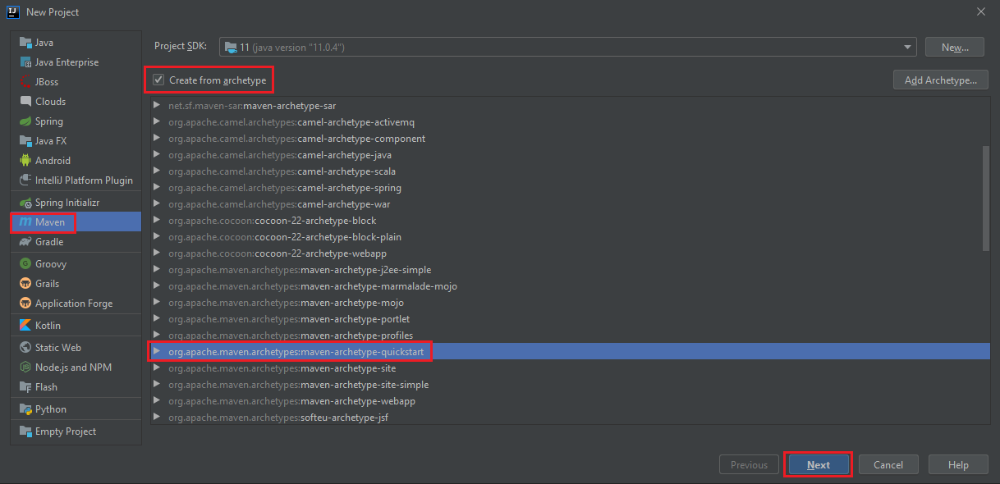
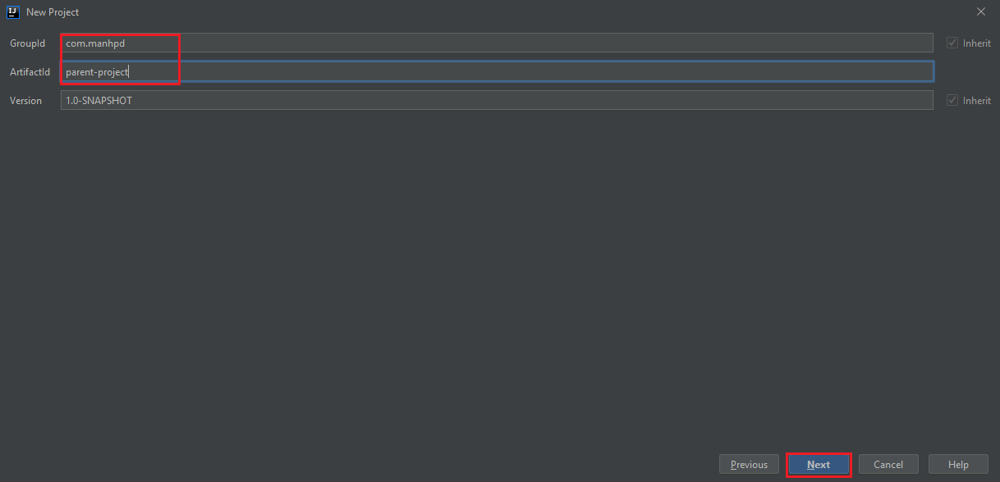
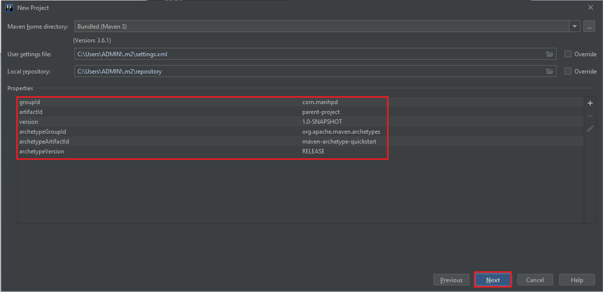
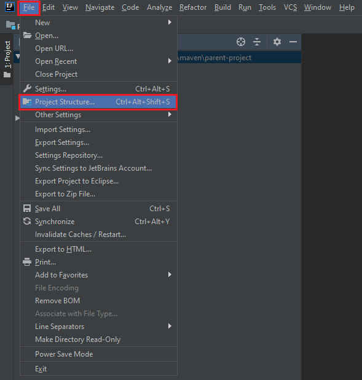
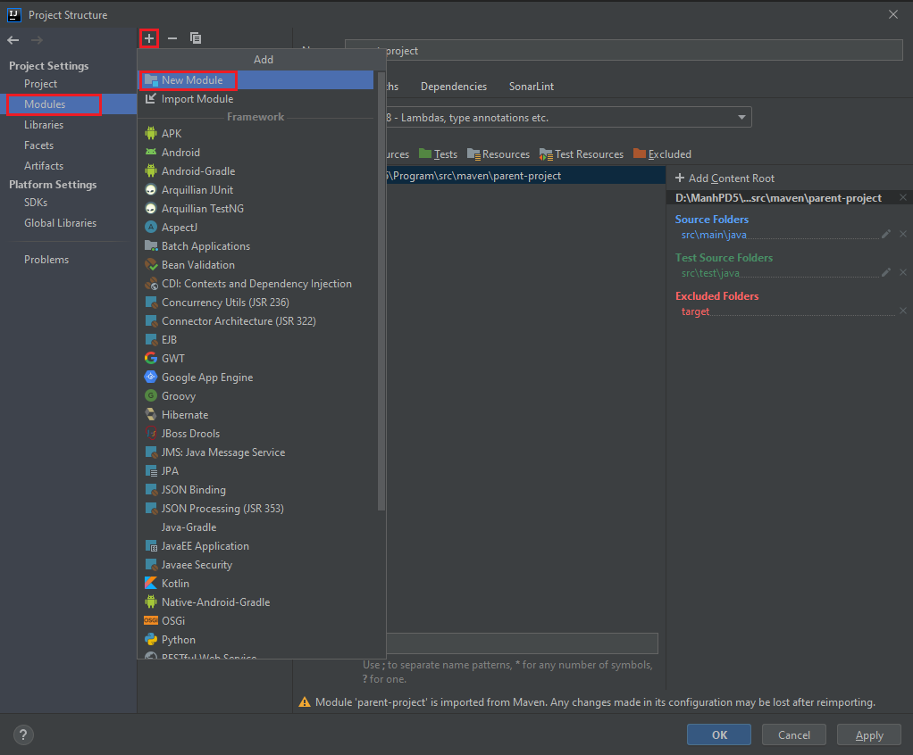
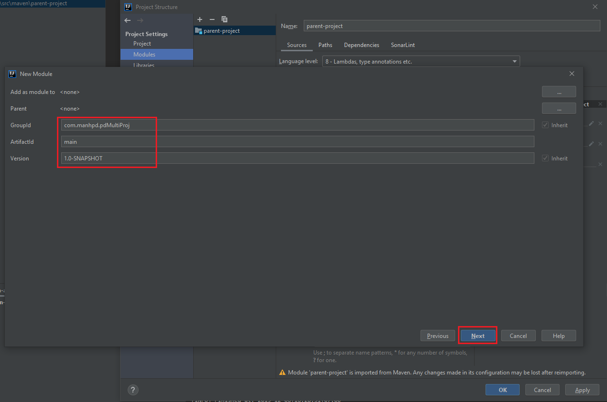
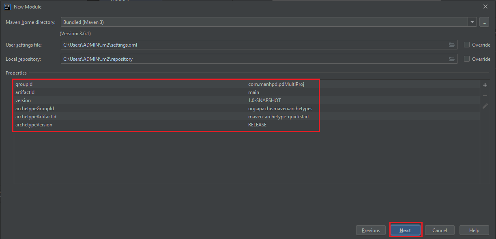
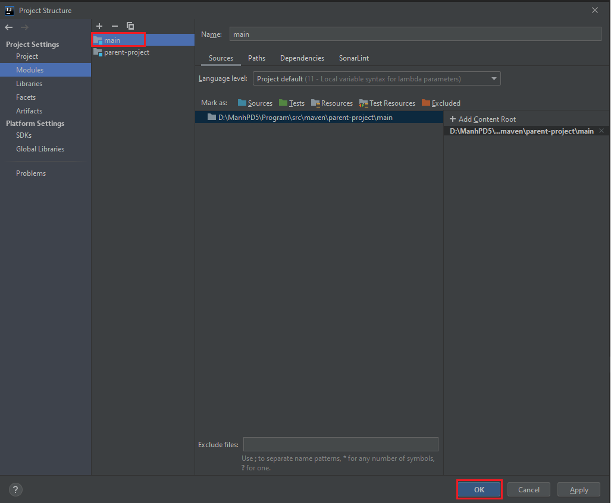
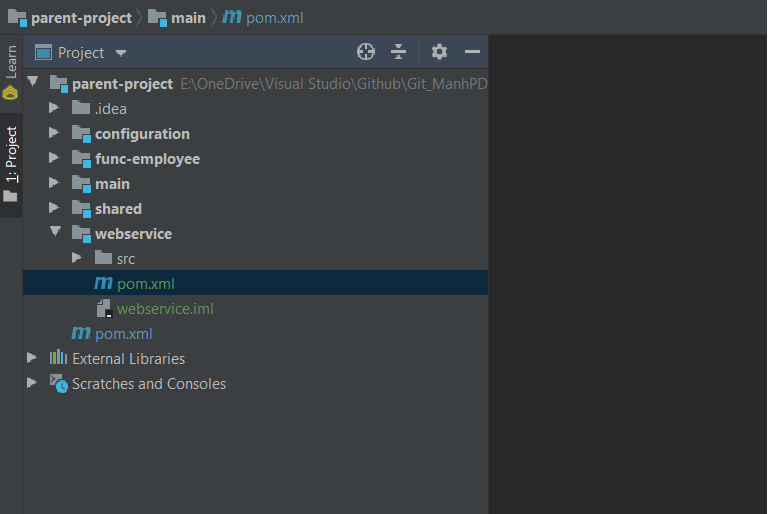

In this article, we will learn how to configure multi-modules project in Spring with the support of Maven build tool. Using this approach makes our code better structure, easily maintain.

Let's get started.

<br>

## Table of contents
- [Create multi-modules project](#create-multi-modules-project)
- [Benefits and drawbacks](#benefits-and-drawbacks)
- [Some problems that we configure multi-modules projec](#some-problems-that-we-configure-multi-modules-project)
- [Deploy multi-module project](#deploy-multi-module-project)
- [Wrapping up](#wrapping-up)

<br>

## Create multi-module project
1. Structure of multi-module project

    - Parent project will configure with ```packing``` tag with ```pom```. It will consist of version for all child projects, dependencies management, plugin management for building project.

    - Child project ```main``` will contain ```static main method```. It will have all dependencies that are child projects, and we will configure it to build jar file.

    - Child project ```configuration``` will contain all configurations of program such as configurations of Spring MVC, or Webflux, and some beans ...

    - Child project ```shared``` will consist of some utility classes such as StringUtils, JsonUtils, CollectionUtils, ...

    - Child project ```webservice``` will contain all interfaces to communicate with client through Restful Api.

    - Child project ```func-employee``` will contain implementation of controller, and other services, or repositories, or dao layer, and entities for mapping between objects and records in database.

2. We will create multi-module project with two ways:
    - Use command line prompt with maven.

        - First, we have to create parent project with the ```packaging```'s value is ```pom```.

            ```bash
            mvn archetype:generate -DgroupId=com.manhpd -DartifactId=parent-project
            ```

            In ```pom.xml``` file of ```parent-project```, we will fill it with ```<packaging>pom</packaging>```. It means that ```parent-project``` will serve as a parent or an aggregator – it will not produce further artifacts.

            In ```parent-project```, we will define all version of our packages for sub-modules.

        - Next, we will ```cd parent-project``` to create sub-modules.

            ```bash
            mvn archetype:generate -DgroupId=com.manhpd.pdMultiProj  -DartifactId=main
            mvn archetype:generate -DgroupId=com.manhpd.pdMultiProj  -DartifactId=configuration
            mvn archetype:generate -DgroupId=com.manhpd.pdMultiProj  -DartifactId=shared
            mvn archetype:generate -DgroupId=com.manhpd.pdMultiProj  -DartifactId=webservice
            mvn archetype:generate -DgroupId=com.manhpd.pdMultiProj  -DartifactId=func-employee
            ```

            Open ```pom.xml``` file of ```parent-project```, we will find that:

            ```xml
            <modules>
                <module>main</module>
                <module>configuration</module>
                <module>shared</module>
                <module>webservice</module>
                <module>func-employee</module>
            </modules>
            ```

        - Finally, we will configure for sub-modules with ```pom.xml``` file

            ```xml
            <parent>
                <groupId>com.manhpd</groupId>
                <artifactId>parent-project</artifactId>
                <version>1.0</version>
            </parent>
            ```

        - Note

            - All submodules can have only one parent.

    - Use GUI with support of ```Intellij IDEA``` or ```Eclipse```.

        - Create parent project

            Based on Maven, we will create parent project.

            

            Then, we have:

            

            

            Click Next button, we will have a parent project.

        - Create our submodules

            Similarly, we will continue to create our child modules.

            

            Open ```Project Structure``` of current parent-project, we have:

            

            

            Next, fill some desired information about child modules.

            

            

            Finally, we have main project with the following structure:

            

            As same as with other child modules, we have:

            

        - Refer sample:

            [https://github.com/DucManhPhan/J2EE/tree/master/src/libs/multi-modules-project/parent-project](https://github.com/DucManhPhan/J2EE/tree/master/src/libs/multi-modules-project/parent-project)

<br>

## Benefits and drawbacks
1. Benefits
- Reduce duplication.
- Share a vast amount of configuration with other modules.
- One single maven command to build all your modules at once.
- Conveniene to reuse code

2. Drawbacks
- understanding deeper project to work with it.


<br>

## Some problems that we configure multi-modules project
- In Intellij IDEA, usually cope with the error about "java: packages do not exists"


- Create life cycle between dependencies

    We are utilizing two modules that are dependency together. Solution for this problem is to remove uneccessary dependency in another module.

- RestController/Controller/Service/Component was not called when each controller/service/component in one modules.

    We should use ```@ComponentScan``` to solve this problem.

    For example:

    ```java
    @SpringBootApplication
    @ComponentScan(basePackages = { "com.manhpd.pdMultiProj.*" })
    public class MainApplication {
        
        private static Logger logger = (Logger) LogManager.getLogger(MainApplication.class);
        
        public static void main(String[] args) throws Exception {
            SpringApplication app = new SpringApplication(MainApplication.class);
            app.run(args);
        }
    }
    ```


<br>

## Deploy multi-module project
1. There are some multiple ways to build multi-modules project into one fat jar file.
    - Use ```maven-shade-plugin```

        ```xml
        <properties>
            <version.root>0.1</version.root>
            <start-class>com.manhpd.vcs-lol.Application</start-class>
            <application-name>vcs-lol</application-name>
        </properties>

        <build>
            <plugins>
                <plugin>
                    <groupId>org.apache.maven.plugins</groupId>
                    <artifactId>maven-shade-plugin</artifactId>
                    <version>3.2.1</version>
                    <executions>
                        <execution>
                            <id>create-fat-jar</id>
                            <phase>package</phase>
                            <goals>
                                <goal>shade</goal>
                            </goals>
                            <configuration>
                                <transformers>
                                    <transformer implementation="org.apache.maven.plugins.shade.resource.ManifestResourceTransformer">
                                        <mainClass>${start-class}</mainClass>
                                    </transformer>
                                </transformers>
                                <finalName>${application-name}</finalName>
                            </configuration>
                        </execution>
                    </executions>
                </plugin>
            </plugins>
        </build>
        ```

        We can refer this [link](https://stackoverflow.com/questions/50976412/create-jar-file-as-aggregation-in-maven-multi-module-package).

    - Use ```spring-boot-maven-plugin```

        This plugins will be used in main module that in its ```pom.xml``` file, it has all declarations of the rest of modules.

        ```xml
        <properties>
            <version.root>0.1</version.root>
            <class.main>com.manhpd.vcs-lol.Application</class.main>
            <name.application>vcs-lol</name.application>
        </properties>

        <build>
            <finalName>${vcs-lol}</finalName>
            <plugins>
                <plugin>
                    <groupId>org.springframework.boot</groupId>
                    <artifactId>spring-boot-maven-plugin</artifactId>
                    <executions>
                        <execution>
                            <goals>
                                <goal>repackage</goal>
                            </goals>
                            <configuration>
                                <mainClass>${class.main}</mainClass>
                            </configuration>
                        </execution>
                    </executions>
                </plugin>
            </plugins>
        </build>
        ```

        This way is working like a charm.

2. Running

    ```bash
    cd parent-project
    mvn clean install
    mvn exec:java -pl main -Dexec.mainClass=main.com.manhpd.pdMultiProj.MainApplication
    ```

<br>

## Wrapping up
- Understanding about the POM file and the meaning of them.

- Create hierarchical project with [hierarchical project](https://www.codetab.org/tutorial/apache-maven/multi-module/hierarchical-project/), [inheritance project](https://www.codetab.org/tutorial/apache-maven/multi-module/inheritance/), and [dependency management](https://www.codetab.org/tutorial/apache-maven/multi-module/dependency-management/).

<br>

Thanks for your reading.

<br>

Refer:

[https://www.baeldung.com/maven-multi-module](https://www.baeldung.com/maven-multi-module)

[https://books.sonatype.com/mvnex-book/reference/multimodule-sect-running-web.html](https://books.sonatype.com/mvnex-book/reference/multimodule-sect-running-web.html)

[https://stackoverflow.com/questions/37133210/springboot-doesnt-recognize-restcontroller-from-another-module-in-multi-module](https://stackoverflow.com/questions/37133210/springboot-doesnt-recognize-restcontroller-from-another-module-in-multi-module)

[https://github.com/NABEEL-AHMED-JAMIL/pdftest/tree/master/multi-mudule](https://github.com/NABEEL-AHMED-JAMIL/pdftest/tree/master/multi-mudule)

[https://github.com/spring-projects/spring-boot/issues/12969](https://github.com/spring-projects/spring-boot/issues/12969)

[https://www.roytuts.com/spring-boot-multi-module-project/](https://www.roytuts.com/spring-boot-multi-module-project/)

[http://www.miredot.com/docs/manual/general/project-organization/](http://www.miredot.com/docs/manual/general/project-organization/)

[https://stackoverflow.com/questions/52167511/controller-restcontroller-and-component-not-working-in-child-package-in-spr](https://stackoverflow.com/questions/52167511/controller-restcontroller-and-component-not-working-in-child-package-in-spr)

[https://stackoverflow.com/questions/37133210/springboot-doesnt-recognize-restcontroller-from-another-module-in-multi-module](https://stackoverflow.com/questions/37133210/springboot-doesnt-recognize-restcontroller-from-another-module-in-multi-module)

[https://www.mkyong.com/maven/maven-how-to-create-a-multi-module-project/](https://www.mkyong.com/maven/maven-how-to-create-a-multi-module-project/)

[http://www.rationaljava.com/2015/02/maven-tip-all-about-executable-jars.html](http://www.rationaljava.com/2015/02/maven-tip-all-about-executable-jars.html)

[https://www.codetab.org/tutorial/apache-maven/multi-module/multi-module-project/](https://www.codetab.org/tutorial/apache-maven/multi-module/multi-module-project/)