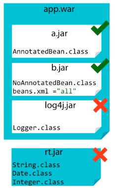

Until now we've seen how CDI can inject bean into other beans that are valuable in the bean archive. The problem is that when we integrate third-party frameworks, their classes are not packaged in bean archives and, therefore, are not discovered by CDI, and can't be injected.

In this section, we will learn how CDI can be used to inject third-party frameworks. Through producers, CDI is able to create any data type, so it can be managed. And CDI allows us to create any Java class and turn it into a CDI bean, so it becomes managed by the container. Once managed, we can use ```alternatives```.

Then, ```alternatives``` can also be used with perusers. 

With ```disposers```, we will learn how a produced bean can be destroyed.

Befor, we get into this section, we can read up on some previous sections.
- [How to use CDI in JavaEE]()
- [How to use Interceptors, Decorators and Events in CDI]()

<br>

## Table of contents
- [Producers](#producers)
- [Producer Methods](#producer-methods)
- [Injection point API](#injection-point-api)
- [Disposers](#disposers)
- [Alternatives and Producers](#alternatives-and-producers)
- [Wrapping up](#wrapping-up)

<br>

## Producers

1. Problems

    Let's assume that we package our web application in war file. This war file contains two bean archives, a.jar, which contains CDI annotated beans, and b.jar containing a beans.xml with ```bean-discovery-mode="all"```.

    

    Both are bean archives. CDI can then discover, manage, and inject those beans. But what's common in a web application is to bundle third-party frameworks that are not bean archives.

    For example, this web application needs log4j, a third-party logging framework and, of course, the Java APIs such as String, Date, or Integer, which packaged in the rt.jar. This rt.jar contains the Java runtime environment classes and does not have a beans.xml deployment descriptor. These classes can not be discovered nor managed by CDI, therefore cannot be injected as they are. They need to be produced.

2. Solution

    Basically a Producer is used to provide CDI capabilities to any POJO or any data type, or better said turn a POJO or data type into a CDI bean.

    What would we do that for?

    Because there are plenty of cases where we need additional control. What if we need to decide at runtime which implementation of type to instantiate and inject? That's why producers are beneficial to enable third-party frameworks to be used with CDI by exposing their objects as CDI beans. For that we can declare a field or a method to be produced by annotating it with ```@Produces```. 

    For example:

    ```java
    public class BookService {

        private String prefix;

        private String random;

        private long postfix;

        public Book createBook(String title) {
            String number = prefix + "-" + random + "-" + postfix;
            return new Book(title, number);
        }

    }
    ```

    These attributes such as prefix, random, postfix are part of the BookService class, and are not initiliazed. The idea is to ask CDI to inject the values of these attributes. But String, int, long data types are part of the Java runtime environment and therefore cannot be injected.

    The only way for this to work is to produce them.

    ```java
    public class NumberProducer {

        @Produces
        private String pre = "7";

        @Produces
        private int random = Math.abs(new Random().nextInt());

        @Produces
        private long post = Math.abs(new Random().nextLong());
        
    }
    ```

    We declared some attributes in NumberProducer, initialize them with some values, and ask CDI to produce them with the ```@Produces``` annotation. This means that all produced data types can now be injected with ```@Inject``` anywhere in our application. Notice that the name of the class and the name of the attributes are not used by CDI to do the binding.
    
    CDI does not use the name, but the type. CDI knows that one attribute is of type String, the other long, and the other int. That's why CDI is said to be strongly type.

    Coming back to the BookService class, the important information for CDI is the data type. Being strongly typed, CDI will inject the right value to the right data type. This eliminates lookup using string-based names or XML for wiring so that compiler will detect any errors.

    But as we might have guessed, data types are not enough. What if we need to inject another attribute of type long with a completely different value in ```private long millis```. If we just inject a long like this, the same value will be injected in ```postfix``` and ```millis``` because they both have the same data type, same qualifier.

    ```java
    public class BookService {

        @Inject
        private String prefix;

        @Inject
        private int random;

        @Inject
        @Default
        private long postfix;

        @Inject
        @Default
        private long millis;

        ...
    }
    ```

    If we need different values to be injected for the same data type, we use qualifiers. We qualify postfix and ask CDI to inject a ThirteenDigits postfix, and with a different qualifier, CurrentTime, tell CDI to inject the current time in millisecond.

    ```java
    public class BookService {

        @Inject
        private String prefix;

        @Inject
        private int random;

        @Inject
        @ThirteenDigits
        private long postfix;

        @Inject
        @CurrentTime
        private long millis;

        ...
    }
    ```

    For this to work, we need to go back to the ```NumberProducer``` class and add the right qualifier on the ```@Produces```.

    ```java
    public class NumberProducer {

        @Produces
        private String pre = "7";

        @Produces
        private int random = Math.abs(new Random().nextInt());

        @Produces
        @ThirteenDigits
        private long post = Math.abs(new Random().nextInt());

        @Produces
        @CurrentTime
        private long millis = new Date().getTime();

        ...
    }
    ```

## Producer Methods

In the previous section, we've just seen field producers. The idea behind field producers is that we produce a field that becomes an injectable object. But fields are limited as we can just initialize them with simple values. What if we need to produce a more complex object? That's where we can use method producers instead.

Method producers have the same idea. Take a method, do whatever we need to od, simple or complex, and produce the return value. This return value becomes managed by CDI. Another difference between producer methods and field is that methods can have an injection point API as a parameter. This API provides access to Metadata about an injection point.

```java
public class NumberProducer {

    @Produces
    public String getPrefix() {
        return "7";
    }

    @Produces
    public int random() {
        return Math.abs(new Random().nextInt());
    }

    @Produces
    @ThirteenDigits
    public long postfix() {
        return Math.abs(new Random().nextLong());
    }
}
```

Notice that the postfix() method is qualified with ThirteenDigits. A producer method is declared by annotating a method with producers annotation and can be qualified. This means that all the produce return values can now be injected with @Inject, so on the client side, the BookService class, we can inject the prefix of type String, the random number of type int, and the postfix number of type long called ThirteenDigits.

```java
public class BookService {

    @Inject
    private String prefix;

    @Inject
    private int random;

    @Inject
    @ThirteenDigits
    private long postfix;

    public Book createBook(String title) {
        String number = prefix + "-" + random + "-" + postfix;
        return new Book(title, number);
    }
}
```

Let's take a complex producer methods.

```java
public class FileProducer {

    @Produces
    public Path produceFile() throws IOException {
        Path directory = FileSystems.getDefault().getPath("store");

        if (Files.notExists(directory)) {
            Files.createDirectory(directory);
        }

        Path file = directory = directory.resolve("file.txt");

        if (Files.notExists(file)) {
            Files.createFile(file);
        }

        return file;
    }
}
```

An above producer method lets the application take full control of the bean instantiation process. It acts as a factory. The return file can now be injected anywhere.

Take this FileService bean. It has a single method that writes some UTF-8 text to a given file. Instead of going through the long process of creating a file, we just inject it. The injected file has already been created by a producer and just needs to be injected so it can be used.

```java
public class FileService {

    @Inject
    //@Temp
    //@BLOB
    private Path file;

    public void write() throws Exception {
        Files.write(file, "Text to write".getBytes("utf-8"));
    }

}
```

Our system could then produce several files just by using qualifiers. For example, we could create temporary files by qualifying the injection point with ```@Temp``` or injecting files used to store large binary objects.

With an above example, we can see that producer methods are very valuable, but producers are themselves CDI beans in their own right, so producers can use injection and other CDI features.

Let's go back to the FileProducer bean and slightly change the file creation algorithm.

```java
public class FileProducer {

    @Inject
    @Root
    private Path directory;

    @Inject
    @CurrentTime
    private long millis;

    @Produces
    public Path produceFile() throws IOException {
        if (Files.notExists(directory)) {
            Files.createDirectory(directory);
        }

        Path file = directory.resolve("file-" + millis + ".txt");

        if (Files.notExists(file)) {
            Files.createFile(file);
        }

        return file;
    }

}
```

## Injection point API

Until now, the produced attributes and return values that we've seen did not need any information about where they were injected, but there are certain cases where produced objects need to know something about the injection point into which they are injected. This can be a way of configuring or changing the producers's behavior, or depdending on the injection point.

CDI has an injection point API that provides access to metadata about an injection point. Thus we can create a producer method that has an injection point as a parameter. Let's take the creation of a Logger with external Log4j library.

```java
public class BookService {

    private Logger logger = LogManager.getLogger(BookService.class.getName());

}
```

If instead we wanted to inject the Logger, we would need to produce it. For that we take a separate LoggingProducer class, add a producer method that returns a Logger. Now we can inject it simple as that.

```java
public class BookService {
    @Inject
    private Logger logger;

    ...
}

public class LoggingProducer {
    @Produces
    public Logger produceLogger() {
        return LogManager.getLogger(BookService.class.getName());
    }
}
```

But what if we need to reuse this Logger in other classes? All the Loggers will be named BookService, and that's not what we want. Because if BookService needs a Logger called BookService, that means that FileService needs its own Logger, as well as ItemService. The only parameter that changes is the name of the Logger.

How would we produce a Logger that needs to know the class name of the injection point? By using the injection point API, we can solve this issue.

```java
public class LoggingProducer {

    @Produces
    public Logger produceLogger(InjectionPoint ip) {
        return LogManager.getLogger(ip.getMember().getDeclaringClass().getName());
    }
}
```

The injection point API has several methods to return the bean type of the injection point, its qualifiers, or the object itself. To use this produced parameterized Logger in any bean is very simple. We just inject it and use it as usual.

The Logger's category class name will then be automatically set to the InjectionPoint API.

```java
public class BookService {
    @Inject
    private Logger logger;
}

public class FileService {
    @Inject
    private Logger logger;
}
```

Writing that simple parameterized producer has saved us a lot of time. We do not need to retrieve the class name to set it on the Logger in every class that we want to use it.


## Disposers

In the some previous section, we use producers to create data types or POJOs, so they could be managed by CDI. Producers has @Factories. They create manageable objects. With created objects, we did not destroy or close them because we didn't need to, but some producers's method can return objects that require explicit destruction such as:
- JDBC connection
- JMS session
- Entity manager.

For creation, CDI uses producers, and for destruction, use disposers. A disposer method allows the application to perform customized cleanup of an object returned by a producer method. Let's take the example of a JDBC connection.

```java
public class JDBCConnectionProducer {

    @Produces
    @UserDatabase
    private Connection createConnection() {
        Class.forName("apache.derby.Driver").newInstance();
        Connection conn = DriverManager.getConnection("jdbc:derby:memory:db");

        return conn;
    }

    private void closeConnection(@Disposers @UserDatabase Connection conn) {
        conn.close();
    }
}

public class JDBCPingService {

    @Inject
    @UserDatabase
    private Connection conn;

    public ping() throws SQLException {
        conn.createStatement().executeQuery(
            "SELECT 1 FROM SYSIBM.SYSDUMMY1");
    }
}
```

Note that JDBCConnectionProducer class have two private methods and can't be invoked by other classes. Only CDI can manage them. 

So to be able to automatically invoke this method, it has to be annotated with ```@Disposes```. Destruction is performed by a matching disposer method. **Each disposer method must have exactly one dispose parameter of the same type as the corresponding producer method**. The disposer method, closeConnection(), is called automatically when the client context ends.

On the above example, we qualify the JDBCConnection by specifying that it's the UserDatabase. If we want this UserDatabase connection to be disposed, we also need to qualify the disposer method. For a given producer method, there can only be one disposer method that matches the bean type and the qualifier.

Notice that a disposer method must be declared within the same class as the producer.

## Alternatives and Producers

In the previous section, we talked about the benefits of alternatives, which is mostly changing the behavior of an application at deployment time.

Let's take example to illustrate alternatives on producers.

```java
public class NumberProducer {
    @Produces
    @Vat
    private Float vatRate = 0.055F;

    @Produces
    @Discount
    private Float discountRate = 0.0225f;
}

public class PurchaseOrderService {

    @Inject
    @Vat
    private Float vatRate;

    @Inject
    @Discount
    private Float discountRate;

    public PurchaseOrder createOrder(Float subTotal) {
        PurchaseOrder order = new PurchaseOrder(subTotal);
        order.setVatRate(vatRate);
        order.setDiscountRate(discountRate);
        order.setTotal(subTotal + (subTotal * vatRate)
                                - (subTotal * discountRate));

        return order;
    }

}
```

If we have to deploy the application in a different environment or country, and we need to change the values of both rates. The idea is produce another vatRate and make sure it's annotated with ```@Alternative```. We do the same for the discountRate. We end up with a single class, NumberProducer, producing a vatRate and an altVatRate within the same bean.

```java
public class NumberProducer {
    @Produces
    @Vat
    private Float vatRate = 0.055F;

    @Alternative
    @Produces @Vat
    private Float altVatRate = 0.078F;

    @Produces
    @Discount
    private Float discountRate = 0.0225f;

    @Alternative
    @Produces @Discount
    private Float discountRateAlt = 0.125f;
}
```

To enable this produced alternative, we just need to add the  NumberProducer to the beans.xml deployment descriptor.

```xml
<?xml version="1.0" encoding="UTF-8"?>
<beans xmlns="http://xmlns.jcp.org/xml/ns/javaee"
    xmlns:xsi="http://www.w3.org/2001/XMLSchema-instance"
    xsi:schemaLocation="http://xmlns.jcp.org/xml/ns/javaee 
                        http://xmlns.jcp.org/xml/ns/javaee/beans_1_1.xsd"
    version="1.1" bean-discovery-mode="all">
    <alternatives>
        <class>com.manhpd.cdi.NumberProducer</class>
    </alternatives>
</beans>
```

<br>

## Wrapping up


<br>

Refer:

[Context and Dependency Injection (CDI 1.1)]()
