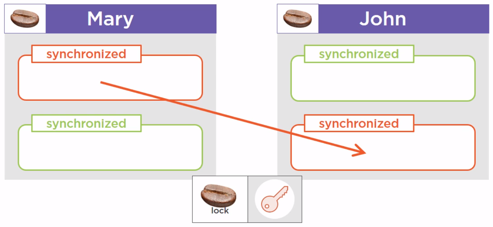
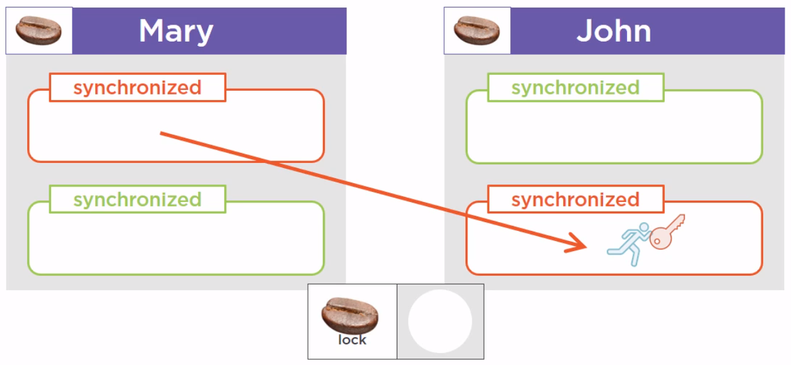
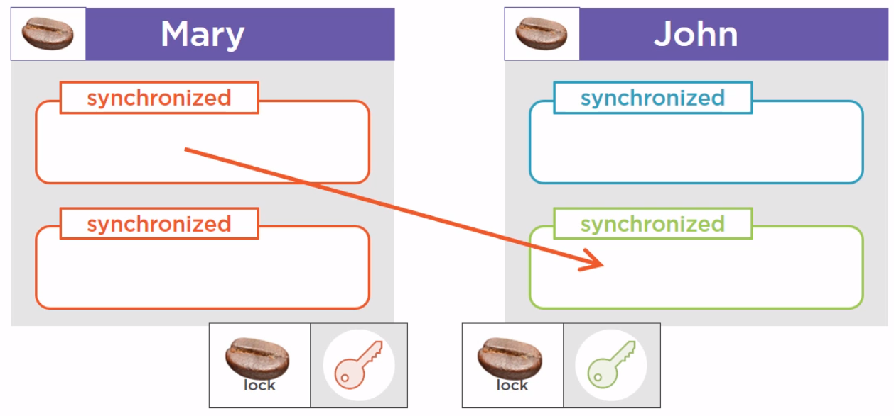
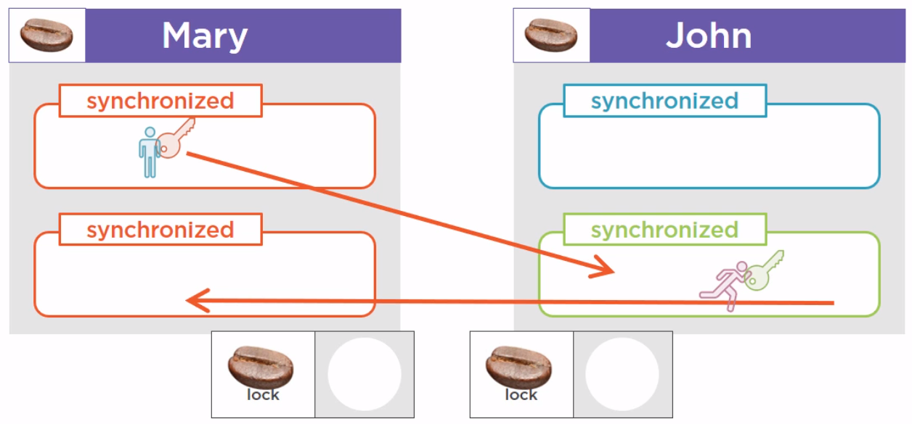
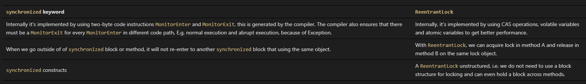

In this article, we will understand how to use reentrant lock in Java. Let's get started.


<br>

## Table of contents
- [Reentrant lock](#reentrant-lock)
- [Deadlock](#deadlock)
- [Some methods of Reentrant lock](#some-methods-of-reentrant-lock)
- [When to use Reentrant lock](#when-to-use-reentrant-lock)
- [Benefits and drawbacks](#benefits-and-drawbacks)
- [Different between Reentrant lock and synchronized keyword](#different-between-reentrant-lock-and-synchronized-keyword)
- [Wrapping up](#wrapping-up)

<br>

## Reentrant lock
Assuming that we have two instances of Person class - Mary and John, and we have a bunch of synchronized method in those instances. Now it turns out that the first synchronized method from the Mary instance, calls another synchronized method of the John instance, that happens to be synchronized with the same lock object.



Here our methods are guarded with red fences, and to enter this method, we need the red key. So, a thread that is running this method from the Mary object will take the key, and at some point will need to enter the synchronized method from the John instance. The red key needs to be available for this thread enter this method. It turns out that this key is not available. But the thread holding that key is precisely the thread that is asking for it. So this is an exception to the rule called reentrance. And this thread, since it is already holding the right key, will be allowed to run the other method.



This rule is quite natural to understand, but it still has to be stated.

```
When a thread holds a lock, it can enter a block synchronized on the lock it is holding.
```

<br>

## Deadlock

We still have two Mary and John instances of Person class. And we have a synchronized method that is calling another synchronized method. Now we are not in the same case as the previous [Reentrant lock](#reentrant-lock) section that is the first method is synchronized using a red key, and the method called by this method is synchronized using a green key.



And for some reasons, this green protected method calls another method, the third one, protected also by the red key. What is going to happen in this case?



The blue thread is going to take the red key and begin to run the first method. And at the same time, the purple thread is going to take the green key, and to run the other method. 

At some point, the blue thread will need the green key to enter the green method, but the purple thread has it. 

So this blue thread has to wait. And the purple thread will arrive at the point of code where it needs the red key to continue to run. And unfortunately the red key is available, because it is held by the blue thread. And this case is a deadlock, that is, the green key will never be released by the purple thread.

So because of that, the blue thread is blocked. And since it is holding the red key needed by the purple thread, the purple thread will never continue to advance, nor the blue thread.

--> A deadlock is a situation where a thread T1 holds a key needed by a thread T2, and T2 holds the key needed by T1.

So as long as no thread releases its key, the situation is blocked, and called a deadlock.

Fortunately, the JVM is able to detect deadlock situations, and can log information to help debug the application.

But there is not much we can do if a deadlock situation occurs, beside rebooting the JVM.

<br>

## Some methods of Reentrant lock
1. ```lock()``` method

    ```java
    public void lock()
    ```

    - Acquires the lock if it is not held by another thread and returns immediately, setting the lock hold count to one.
    - If the current thread already holds the lock then the hold count is incremented by one and the method returns immediately.
    - If the lock is held by another thread then the current thread becomes disabled for thread scheduling purposes and lies dormant until the lock has been acquired, at which time the lock hold count is set to one.

2. ```unlock()``` method

    ```java
    public void unlock()
    ```

    - Attempts to release this lock.
    - If the current thread is the holder of this lock then the hold count is decremented. If the hold count is now zero then the lock is released. If the current thread is not the holder of this lock then IllegalMonitorStateException is thrown.

3. ```tryLock()``` method

    ```java
    public boolean tryLock()
    ```

    - Acquires the lock if it is not held by another thread and returns immediately with the value true, setting the lock hold count to one. Even when this lock has been set to use a fair ordering policy, a call to ```tryLock()``` will immediately acquire the lock if it is available, whether or not other threads are currently waiting for the lock. This "barging" behavior can be useful in certain circumstances, even though it breaks fairness. If you want to honor the fairness setting for this lock, then use ```tryLock(0, TimeUnit.SECONDS)``` which is almost equivalent (it also detects interruption).

    - If the current thread already holds this lock then the hold count is incremented by one and the method returns ```true```.

    - If the lock is held by another thread then this method will return immediately with the value ```false```.

4. ```tryLock(long timeout, TimeUnit unit)``` method

    ```java
    public boolean tryLock(long timeout, TimeUnit unit) throws InterruptedException
    ```

    - The thread waits for a certain time period as defined by arguments of the method to acquire the lock on the resource before exiting.

5. ```lockInterruptibly()``` method

    ```java
    public void lockInterruptibly() throws InterruptedException
    ```

    - If the lock is held by another thread then the current thread becomes disabled for thread scheduling purposes and lies dormant until one of two things happens:

        - The lock is acquired by the current thread; or
        - Some other thread interrupts the current thread.

    - If the current thread:

        - has its interrupted status set on entry to this method; or
        - is interrupted while acquiring the lock,

        then ```InterruptedException``` is thrown and the current thread's interrupted status is cleared.

    - It means that if the current thread is waiting for lock but some other thread requests the lock, then the current thread will be interrupted and return immediately without acquiring lock.

6. ```getHoldCount()``` method

    ```java
    public int getHoldCount()
    ```

    - Queries the number of holds on this lock by the current thread.
    - A thread has a hold on a lock for each lock action that is not matched by an unlock action.
    - The hold count information is typically only used for testing and debugging purposes.

7. ```isHeldByCurrentThread()``` method

    ```java
    public boolean isHeldByCurrentThread()
    ```

    - Queries if this lock is held by the current thread.
    - This method is typically used for debugging and testing.
    - It can also be used to ensure that a reentrant lock is used in a non-reentrant manner, for example:

        ```java
        class X {
            ReentrantLock lock = new ReentrantLock();
            // ...

            public void m() {
                assert !lock.isHeldByCurrentThread();
                lock.lock();
                try {
                    // ... method body
                } finally {
                    lock.unlock();
                }
            }
        }
        ```

<br>

## When to use Reentrant lock
- use it when we actually need something it provides that ```synchronized``` doesn't, like timed lock waits, interruptible lock waits, non-block-structured locks, multiple condition variables, or lock polling.

- ```ReentrantLock``` also has scalability benefits, and we should use it if we actually have a situation that exhibits high contention, but remember that the vast majority of synchronized blocks hardly ever exhibit any contention, let alone high contention. We would advise developing with synchronization until synchronization has proven to be inadequate, rather than simply assuming **the performance will be better** if we use ```ReentrantLock```.

<br>

## Benefits and drawbacks
1. Benefits
- ```Reentrant Lock``` provides explicit locking that is much more granular and powerful than ```synchronized``` keyword.

    For example:
    - The scope of lock can range from one method to another but scope of ```synchronized``` keyword can not go beyond one method.

- Lock framework also supply ```Condition variables``` that are instances of ```Condition``` class, which provides inter thread communication methods similar to ```wait()```, ```notify()``` and ```notifyAll()``` such as ```await()```, ```signal()``` and ```signalAll()```.

    So, if one thread is waiting on a condition by calling ```condition.await()```, then once that condition changes, second thread can call ```condition.signal()``` or ```condition.signalAll()``` method to notify that its time to wake up, condition has been changed.

2. Drawbacks
- Difficult to use, understand for the novice programmers.


<br>

## Different between Reentrant lock and synchronized keyword
[comment]: <> (|                    ```synchronized``` keyword                   |                            ```ReentrantLock```                                |)
[comment]: <> (| --------------------------------------------------------- | ----------------------------------------------------------------------- |)
[comment]: <> (| Internally it's implemented by using two-byte code instructions ```MonitorEnter``` and ```MonitorExit```, this is generated by the compiler. The compiler also ensures that there must be a ```MonitorExit``` for every ```MonitorEnter``` in different code path, E.g. normal execution and abrupt execution, because of Exception. | Internally, it's implemented by using CAS operations, volatile variables and atomic variables to get better performance. |)
[comment]: <> (| When we go outside of of ```synchronized``` block or method, it will not re-enter to another ```synchronized``` block that using the same object. | With ```ReentrantLock```, we can acquire lock in method A and release in method B on the same lock object. |)
[comment]: <> (| ```synchronized``` constructs  | A ```ReentrantLock``` unstructured, i.e. we do not need to use a block structure for locking and can even hold a block across methods. |)



For example:

```java
private ReentrantLock lock;

public void foo() {
  ...
  lock.lock();
  ...
}

public void bar() {
  ...
  lock.unlock();
  ...
}
```

<br>

## Some interesting question for Reentrant lock

1. How does the ```ReentrantLock``` avoid deadlock?

    In general, the ```ReentrantLock``` does not.

    In the case of reentrant locking (i.e. in the case where a thread attempts to acquire ```lock A``` while holding ```lock A```), the ```ReentrantLock``` implementation notices that the thread holding the lock is the thread acquiring the lock. A counter is incremented, so that the implementation knows that the lock must be released twice.

2. How can we avoid deadlock in this situation using ```ReentrantLock```?

    - Ensure that all threads acquire the locks in the same order. (Deadlocks occur when threads attempt to acquire two or more threads in a different order.)

    - If ```tryLock()``` fails while holding a different lock, release the lock, wait a bit, and try again.


<br>

## Wrapping up

- One can forget to call the ```unlock()``` method in the ```finally``` block leading to bugs in the program. Ensure that the lock is released before the thread exits.

- The ```fairness``` parameter used to construct the lock object decreases the throughput of the program.

- There are two implementations of ```Lock``` interface - ```ReentrantLock``` and ```ReentrantReadWriteLock```.

- If a thread already holds the lock on a monitor object, it has access to all blocks synchronized on the same monitor object. This is called reentrant. The thread can reenter any block of code for which it already holds the lock.

- ```ReentrantLock``` is mutual exclusive lock, similar to implicit locking provided by ```synchronized``` keyword in Java, with extended feature like ```fairness```, which can be used to provide lock to longest waiting thread.

- ```ReentrantLock``` is a concrete implementation of ```Lock``` interface in concurrency package of ```Java 1.5```.

- A ```ReentrantLock``` is owned by the thread last successfully locking, but not yet unlocking it. A thread invoking lock will return, successfully acquiring the lock, when the lock is not owned by another thread. The method will return immediately if the current thread already owns the lock. This can be checked using methods ```isHeldByCurrentThread()```, and ```getHoldCount()```.

- A Thread owns the ```ReentrantLock``` which is intended to perform the write operation on some particular data.

- It is recommended practice to always immediately follow a call to lock with a ```try block```, most typically in a before/after construction such as:

    ```java
    class X {
        private final ReentrantLock lock = new ReentrantLock();
        // ...

        public void m() {
            lock.lock();  // block until condition holds
            try {
                // ... method body
            } finally {
                lock.unlock()
            }
        }
    }
    ```

    This lock supports a maximum of ```2147483647``` recursive locks by the same thread. Attempts to exceed this limit result in Error throws from locking methods.

<br>

Refer:

Appying Concurrency and Multithreading to Common Java patterns in [pluralsight.com](pluralsight.com)

[https://docs.oracle.com/javase/7/docs/api/java/util/concurrent/locks/ReentrantLock.html](https://docs.oracle.com/javase/7/docs/api/java/util/concurrent/locks/ReentrantLock.html)

[https://www.ibm.com/developerworks/java/library/j-jtp10264/](https://www.ibm.com/developerworks/java/library/j-jtp10264/)

[https://winterbe.com/posts/2015/04/30/java8-concurrency-tutorial-synchronized-locks-examples/](https://winterbe.com/posts/2015/04/30/java8-concurrency-tutorial-synchronized-locks-examples/)

[https://stackoverflow.com/questions/11821801/why-use-a-reentrantlock-if-one-can-use-synchronizedthis](https://stackoverflow.com/questions/11821801/why-use-a-reentrantlock-if-one-can-use-synchronizedthis)