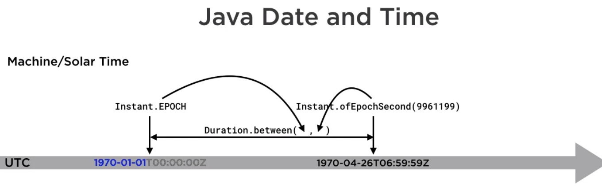
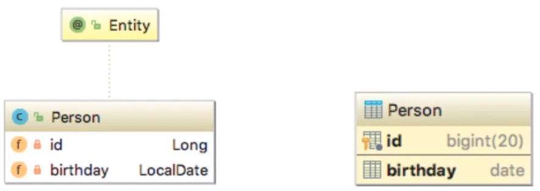
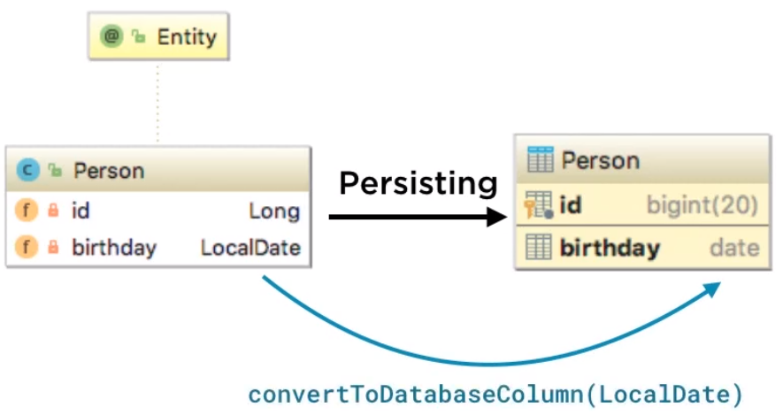
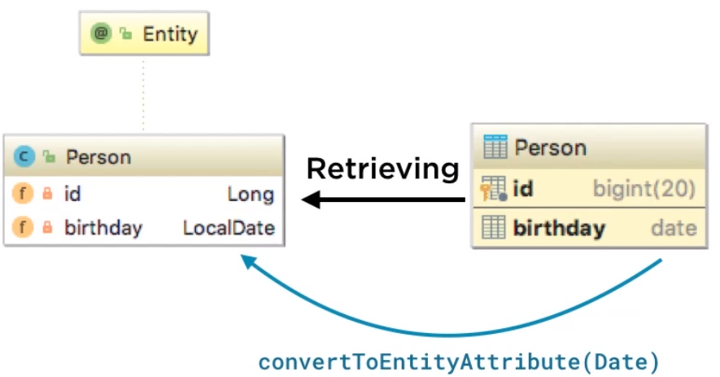

The old version of date time have many drawbacks, Java 8 provides java.time package to solve them clearly. So, in this article, we will learn how to use Dates and Times in Java 8, especially the way to communication between database and application.

Let's get started.

<br>

## Table of contents
- [Why we need java.time package in Java 8](#why-we-need-java.time-package-in-java-8)
- [Basic of the java.time APIs](#basic-of-the-java.time-apis)
- [APIs in java.time package](apis-in-java.time-package)
- [Benefits and Drawbacks](#benefits-and-drawbacks)
- [Java code sample](#java-code-sample)
- [Wrapping up](#wrapping-up)


<br>

## Why we need java.time package in Java 8
In order to understand why we need to use java.time package, we must be aware of consequences of the old version of date time.
- A long-standing bugbear of Java developers has been the inadequate support for the date and time use cases of ordinary developers.

    For example: the existing classes (such as ```java.util.Date``` and ```SimpleDateFormatter```) aren't thread-safe, leading to potential concurrency issues for users—not something the average developer would expect to deal with when writing date-handling code.

- Some of the date and time classes also exhibit quite poor API design.

    For example, years in ```java.util.Date``` start at 1900, months start at 1, and days start at 0—not very intuitive.

- These issues, and several others, have led to the popularity of third-party date and time libraries, such as Joda-Time.

In order to address these problems and provide better support in the JDK core, a new date and time API, which is free of these problems, has been designed for Java SE 8.

The project has been led jointly by the author of ```Joda-Time``` (```Stephen Colebourne```) and Oracle, under JSR 310, and will appear in the new Java SE 8 package ```java.time```.

<br>

## Basic of the java.time APIs



The continuous flow of time is modeled quite closely by the class ```java.time.Instant```, which contains a displacement in seconds and nanoseconds from the so-called UNIX EPOCH, midnight on the first of January 1970.

There are various ways of making a new instant. For example, if we want an instant that corresponds to a particular time in April 1970, we could construct it using the method ```Instant.ofEpochSecond()```.

Supplying a negative number of seconds or nanoseconds when constructing an instant signifies that much time before the EPOCH.

The length of the time between two instant is modeled by a duration like ```Duration.between()```.

A more human-friendly way of representing instants is provided by an atomic time scale called ```UTC```. The letters come from the initials for coordinated universal time. ```UTC``` is a common standard across the world. The international standard for representing dates and times, ISO 8601, denotes midnight on the first of January 1970, under date later that year.

Dates formatted with the ISO standard can be hard to read at first. First comes the year, month, day order, then a separator, then the time, a 24 hour notation, hours, minutes, and seconds. Finally, the Z shows that this is the UTC time. Standard time like UTC is useful for purpose like calculating satellite orbits. But everyday programs are more often concerned with dates and times of particular points on earth. For that, we need to qualify a date and time with a time zone.

ISO 8601 represents zoned date times like ```1969-12-31T19:00:00-05:00```, with a time zone offset replacing the single Z used for UTC.

Reading the ISO representation is helpful to a programmer using java.time, as each component of the ISO notation corresponds to a class java.time.

So an instance of java.time ```LocalDate``` is a date without time zone information - ```1969-12-31```. An instance of LocalTime is a time of day without time zone information - ```19:00:00```, and an instance of ```LocalDateTime``` combines the information in these two - ```1969-12-31T19:00:00```. The ```TimeZoneOffset``` is modeled by an instance of ```ZoneOffset``` - ```05:00```, and all this information can be combined in a single object of type ```ZoneDateTime```.

```ZoneOffset``` is only one kind of time zone identifier. It represents a fixed offset from UTC, but a fixed offset may not be enough to calculate the time at a particular place.

The last important ```java.time``` class is ```Period```, which encapsulates a fixed number of years, months, and days. A period refers entirely to human time and its duration can vary according to any ajustment being made to the human calendar.

<br>

## APIs in java.time package

|                 java.time              |                  Meaning                |                 Example                |
| -------------------------------------- | --------------------------------------- | -------------------------------------- |
| ``Instant``                            | instant of time                         | timestamp                              |
| ```ZonedDateTime```                    | date-time with time zone information    | start of a conference call             |
| ```LocalDate```                        | date without time zone information      | birthday                               |
| ```Duration```                         | time between two instants               | length of a conference call            |
| ```Period```                           | amount of time in years, months, and days | length of a prison sentence          |

- ```DateTimeFormatter```

    Programs that work with date times often require them to be represented in human readable form and to accept human-formatted strings as input. So, interconversion between Java time objects and strings is an important part of the library. It's mostly implemented by the class ```DateTimeFormatter```.

    ```java.time``` comes with a wide variety of predefined ```DateTimeFormatters```.
    - ```ISO_DATE_TIME``` instance, which converts ```java.time objects``` to and from the ISO format.

    Some methods of DateTimeFormatter:
    - ```parse()``` method - convert a string to a ```java.time object``` called a temporal.

    - ```format()``` method - convert a slightly wider range of objects, temporal accessors, into strings.

    - ```ofLocalizedTime(FormatStyle.SHORT)``` method - take a format style and create a DateTimeFormatter that will produce or parse local specific strings.

        Below is DateTimeFormatter factory methods:

        |                    Formatter               |                   Description                    |                    Example                    |
        | ------------------------------------------ | ------------------------------------------------ | --------------------------------------------- |
        | ofLocalizedDate(dateStyle)                 | Formatter with date style from the locale        | '2011-12-03'                                  |
        | ofLocalizedTime(timeStyle)                 | Formatter with time style from the locale        | '10:15:30'                                    |
        | ofLocalizedDateTime(dateTimeStyle)         | Formatter with a style for date and time from the locale | '3 Jun 2018 10:15:30'                 |
        | ofLocalizedDateTime(dateStyle, timeStyle)  | Formatter with date and time styles from the locale | '3 Jun 2018 10:15'                         |

        enum FormatStyle has fields:
        - FULL: Thursday, 1 January 1970
        - LONG: 1 January 1970
        - MEDIUM: 1 Jan 1970
        - SHORT: 01/01/1970

    - ```ofPattern()``` - A wide variety of customized date time formatters can be created using the factory method ```ofPattern()```.

        A few other pattern symbols:
        
        | Symbol |          Meaning           |
        | ------ | -------------------------- |
        | K      | hour of am/pm              |
        | a      | am/pm of day               |
        | E      | day of week                |
        | Z      | zone offset                |
        | [      | optional selection start   |
        | ]      | optional selection end     |

        For example:
        - ```ofPattern("E")``` - means output the day of week in short form, apply it to the same zone date time as before, it produces this output.

    - Properties

        The three most important properties of ```java.time.format.DateTimeFormatter``` are the ```zone```, the ```locale```, and the ```resolver``` style.
        - Zone used when a zone is required but not supplied by the parse string or date-time value.
        - Locale used for localization.
        - Resolver used only in parsing. It affects the way that certain kinds of malformed dates are handled, typically those produced by legacy application.

            ResolverStyle includes:
            - STRICT: a strict parser will accept only those string representation which could have been produced by a format operation.
            - LENIENT: a lenient parser will accept string representations containing fields whose values are outside the valid range.
            - SMART: smart resolution performs a so-called sensible default, meaning that we'll find what happens to be acceptable for the most part.

- ```java.time``` interoperation

    To compatible with new version of date times in ```java.time``` package, ```java.utils``` package provides some classes:
    - ```Date.from(Instant)```
    - ```date.toInstant()```
    - ```Calendar.toInstant()```
    - ```TimeZone.getTimeZone(ZoneId)```

    Database storage of ```java.time``` objects is too important, and that requires interoperation with Java SQL types. So, ```java.sql``` package has:
    - ```Date``` <---> ```LocalDate```
    - ```TimeStamp``` <---> ```LocalDateTime```
    - ```TimeStamp``` <---> ```Instant```

    If our program uses JPA for relational database persistentce, then because the current specification JPA 2.1 was published before Java 8 shipped, we will have to provide and adapter, an ```AttributeConverter``` to integrate ```java.time``` objects with JPA.

    The way to persist a java.time type to a relational database depends on the persistence technology we're using.
    - JPA 2.1 provides no support, so we have to write an attribute converter or use a third-party implementation which allow transparent interconversion between entity attribute and database column types.

        For example, suppose we have an entity person with a local property birthday. We would choose an SQL column of type date to represent that.

        

        To implement that persistent scheme, we would define a method for conversion in each direction. To persist a person object, the persistence technology would call our method convert to database column, and to retrieve a person object, it would call convert to an entity attribute.

        

        

        These methods are defined in the interface javax.persistence attribute converter.

        ```java
        interface AttributeConverter<X, Y> {
            Y convertToDatabaseColumn(X);

            X convertToEntityAttribute(Y);
        }
        ```

        Here is an implementation of ```AttributeConverter``` for a ```LocalDate``` field with implementation of the methods needed to convert from a LocalDate to an SQL date and vice versa.

        ```java
        @Converter(autoApply = true)
        public class LocalDateAttributeConverter implements AttributeConverter<LocalDate, Date> {

            @Override
            public Date convertToDatabaseColumn(LocalDate localDate) {
                return (localDate == null ? null : Date.valueOf(localDate));
            }

            @Override
            public LocalDate convertToEntityAttribute(Date sqlDate) {
                return (sqlDate == null ? null : sqlDate.toLocalDate());
            }
        }
        ```

        To have this AttributeConverter used automatically by the object relational technology, we only need to annotate it as ```@Converter```, and if we specify ```autoApply = true```, all fields and columns of the specified types will be automatically processed by the methods it defines. 
        
        We do not have to write all the possible ```AttributeConverter``` implementations we might need. There are several third-party libraries available that may support for conversions of different types from those suported by JPA 2.2 and JDBC 4.2.

        ```html
        https://github.com/perceptron8/datetime-jpa
        https://github.com/marschall/threeten-jpa
        https://bitbucket.org/montanajava/jpaattributeconverters
        ```

    - JPA 2.2 does support a limited set of a java.time types.

        Early 2018, JPA 2.2 is supported by DataNucleus, EclipseLink v2.7+, and Hibernate v5.3+. Only five java.time types are supported by the specification, as shown in the following table.

        |               Java type              |            JDBC type              |
        | ------------------------------------ | --------------------------------- |
        | java.time.LocalDate                  | DATE                              |
        | java.time.LocalTime                  | TIME                              |
        | java.time.LocalDateTime              | TIMESTAMP                         |
        | java.time.OffsetTime                 | TIME_WITH_TIMEZONE                |
        | java.time.OffsetDateTime             | TIMESTAMP_WITH_TIMEZONE           |

        The SQL type TIME_WITH_TIMEZONE should only be used with a fixed offset because in a geographic time zone with daylight saving time changes, a local time is ambiguous.

        The TIMESTAMP_WITH_TIMEZONE gives rise to difficulties mainly resulting from its misleading name. According to the SQL standard, a database that supports this type does not have to install the time zone, but instead uses the supplied time zone to calculate a UTC time, and that is then stored. Databases vary in their implementation of this type.

        For example, MySQL uses timestamp for this purpose, and for values of that type, it will always use the current time zone offset to calculate and store UTC date times. 
        
        On retrieval, it will return a LocalDateTime again using the current time zone offset by conversion. Obviously, it will lead to difficulties where the current time zone for the database server is altered, for example, because of a daylight saving time shift. Clearly, persisting time zone information is problematic. At worst, a ZonedDateTime value can be affected in its storage and retrieval conversions by a large number of time zone settings. That of the platforms, which can be multiple settings if our application is clustered, or the global and session database server and of the ORM layer.

        This complexity is the reason that best practice advice is usually to persist all date/time values as UTC, converting localized values to and from UTC in the application layer.

    - The hibernate implementation of JPA 2.2, from verion 5.3 onwards goes beyond the standard in supporting a wider range of types.

        It means that Hibernate also support additional persistence of Duration, Instant, and ZonedDateTime.

        |           Java type        |         JDBC type        |
        | -------------------------- | ------------------------ |
        | java.time.Duration         | BIGINT                   |
        | java.time.Instant          | TIMESTAMP                |
        | java.time.ZonedDateTime    | TIMESTAMP                |

        It also supports ZonedDateTime, but this conversion is like that term from java.sql, timestamp. Since the timestamp does not contain as time zone, a default one must be implicitly used. The best practice advice given above would suggest avoiding this interconversion.

- DateTimeFormatterBuilder

    DateTimeFormatterBuilder can be configured with the properties:
    - zone
    - locale 
    - resolver style

    or can append existing DateTimeFormatters.

    Once the builder is fully configured, we can call its method ```toFormatter()``` to create the ```DateTimeFormatter``` itself.

    DateTimeFormatter is all about string representations of ```TemporalAccessor``` objects.

<br>

## Benefits and Drawbacks
1. Benefits

    - Classes in ```java.time``` package are immutable, which means they can be used without precautions in multithread applications.
    - allows caching.
    - works well with Java 8 streams and lambdas.
    - Methods are designed to allow fluent programming so that statements using them read very naturally.
    - The API is type-safe, so that class cast exceptions are usually prevented by detection of type errors at compile time.
    - The library's extensible so that features that the designers didn't foresee or that didn't belong in the core API can be added.


<br>

## Java code sample

Below is the way to use java.time package's classes.

```java
Clock testClock = Clock.fixed(Instant.EPOCH, ZoneOffset.UTC);
LocalDate testDate = LocalDate.now(testClock);

// create a calendar
Calendar calendar = new Calendar();

// add some tasks to the calendar
calendar.addTask(1, 0, "Answer urgent email");
calendar.addTask(4, 0, "Write deployment report");
calendar.addTask(4, 0, "Plan security configuration");

// add some work periods to the calendar
calendar.addWorkPeriods(Utils.generateWorkPeriods(testDate, 3));

// add an event to the calendar, specifying its time zone
ZoneDateTime meetingTime = ZoneDateTime.of(testDate.atTime(8, 30),
                                            ZoneId.of("America/New_York"));

// create a working schedule
Schedule schedule = calendar.createSchedule(testClock);

// and print it out
System.out.println(schedule);
```

<br>

## Wrapping up

- Understanding why we use java.time package in Java 8.
- Some benefits of java.time classes.
- Below is the predefined DateTimeFormatters

    |               Formatter              |                  Description                   |                  Example                  |
    | ------------------------------------ | ---------------------------------------------- | ----------------------------------------- |
    | BASIC_ISO_DATE                       | Basic ISO date                                 | '20111203'                                |
    | ISO_LOCAL_DATE                       | ISO Local Date                                 | '2011-12-03'                              |
    | ISO_OFFSET_DATE                      | ISO Date with offset                           | '2011-12-03+01:00'                        |
    | ISO_DATE                             | ISO Date with or without offset                | '2011-12-03+01:00'; '2011-12-03'          |
    | ISO_LOCAL_TIME                       | Time without offset                            | '10:15:30'                                |
    | ISO_OFFSET_TIME                      | Time with offset                               | '10:15:30+01:00'                          |
    | ISO_TIME                             | Time with or without offset                    | '10:15:30+01:00'; '10:15:30'              |
    | ISO_LOCAL_DATE_TIME                  | ISO Local Date and Time                        | '2011-12-03T10:15:30'                     |
    | ISO_OFFSET_DATE_TIME                 | Date Time with offset                          | '2011-12-03T10:15:30+01:00'               |
    | ISO_ZONED_DATE_TIME                  | Zoned Date Time                                | '2011-12-03T10:15:30+01:00[Europe/Paris]' |
    | ISO_DATE_TIME                        | Date and Time with ZoneId                      | '2011-12-03T10:15:30+01:00[Europe/Paris]' |
    | ISO_ORDINAL_DATE                     | Year and day of year                           | '2012-337'                                |
    | ISO_WEEK_DATE                        | Year and Week                                  | '2012-W48-6'                              |
    | ISO_INSTANT                          | Date and Time of an Instant                    | '2011-12-03T10:15:30Z'                    |
    | RFC_1123_DATE_TIME                   | RFC 1123 / RFC 822                             | 'Tue, 3 Jun 2008 11:05:30 GMT'            |

- The class ```Duration``` 

    It provides some format methods
    - ```toString()``` - fixed format
    - ```parse(String)``` - fixed format

    In Java 8, the only accessors are:
    - ```getSeconds()```
    - ```getNano()```

    Java 9 provides new methods:
    - ```toNanosPart()```
    - ```toMillisPart()```
    - ```toSecondsPart()```
    - ```toMinutesPart()```
    - ```toHoursPart()```
    - ```toDaysPart()```

- Legacy Date/Time classes

    |            Legacy Type           |                  java.time Equavilent              |              Conversion methods               |
    | -------------------------------- | -------------------------------------------------- | --------------------------------------------- |
    | java.util.Date                   | Instant                                            | toInstant(); from(Instant)                    |
    | java.util.GregorianCalendar      | ZoneDateTime                                       | toInstant(), toZonedDateTime(); from(ZonedDateTime) |
    | java.util.TimeZone               | ZoneId                                             | toZoneId(); getTimeZone(ZoneId)               |
    | java.sql.Date                    | LocalDate                                          | toLocalDate(); valueOf(LocalDate)             |
    | java.sql.Time                    | LocalTime                                          | toLocalTime(); valueOf(LocalTime)             |
    | java.sql.Timestamp               | Instant                                            | toInstant(), toLocalDateTime(); from(Instant) |
    | java.nio.file.attribute.FileTime | Instant                                            | toInstant(); from(Instant)                    |

- The only pitfalls in the interconversion with instant are that in going from instant to date, the nanoseconds of instant are truncated to milliseconds, and another pitfall that some instants represent timeline points outside the range of date.

- ```java.nio.file.attribute.FileTime``` is quite modern, and that is reflected in its design. A FileTime object is created from a long value and an instance of java.util concurrent time unit to give meaning to that value. Time unit instances can represent anything from nanoseconds to days. In this case, it is the java.time Instant class may not have sufficient range to represent a very large FileTime value in days or hours. In this situation, the conversion to instant will return a ceiling or floor with a maximum or minimum value of instant.

<br>

Refer:

[Programming with Dates and Times in Java 8](https://app.pluralsight.com/library/courses/java8-dates-times-programming/table-of-contents)

[https://www.oracle.com/technical-resources/articles/java/jf14-date-time.html](https://www.oracle.com/technical-resources/articles/java/jf14-date-time.html)

[https://javarevisited.blogspot.com/2012/04/difference-between-javautildate-and.html#axzz68DGA6Lnd](https://javarevisited.blogspot.com/2012/04/difference-between-javautildate-and.html#axzz68DGA6Lnd)