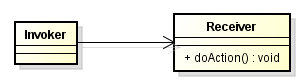
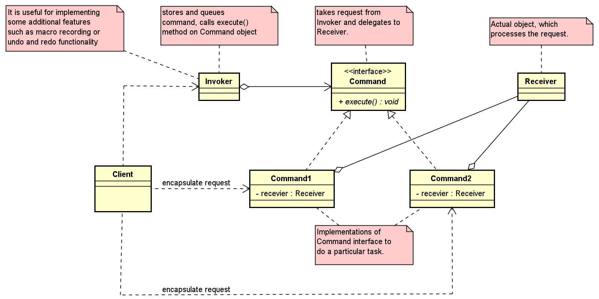

 In this article, we will learn how to use Command pattern. Let's get started.


<br>

# Table of Contents
- [Given Problem](#given-problem)
- [Solution with Command Pattern](#solution-with-command-pattern)
- [When to use](#when-to-use)
- [Benefits & Drawbacks](#benefits-&drawbacks)
- [Code C++/Javascript](#code-C++/Javascript)
- [Relations with other patterns](#relations-with-other-patterns)
- [Application & Examples](#application-&-examples)
- [Wrapping up](#wrapping-up)

<br>

# Given Problem

Assuming that we are working in GUI application, we have multiple menu items, context menus, or buttons in toolbars in our apps. Normally, we will do something like that:



We coped with about hard-wired request:
- The request ```receiver.doAction()``` is implemented (hard-wired) directly within the class - Invoker.

- This makes it impossible to specify a request at run-time.

- When designing reusable objects, the particular request is not known at compile-time and should be specified at run-time.

<br>

# Solution with Command Pattern

According to Gang of Four's definition, we have:

```
Encapsulate a request as an object, thereby letting you parameterize clients with different requests, queue or log requests, and support undoable operations.

```

Below is the class diagram of Command pattern:



Command pattern has primarily four components:
- Command

    It will store all information that is required for executing an action, including the method to call, the method arguments, and the object (consider as Receiver) that implements the method.

- Receiver

    This is actual object which do perform request when the command's ```execute()``` method is called.

- Invoker

    It stores all commands and call ```execute()``` method of Command object when necessary.

    It knows how to execute a given command but does not know how the command has been implemented. It only knows about the command's interface.

- Client

    It has functionalities such as encapsulating each request into Command object, controls the command execution process by specifying what commands to execute and at what stages of the process to execute them.

<br>

# When to use
- A history of requests is needed.
- We need callback functionality.
- Requests need to be handled at variant times or in variant orders.
- The invoker should be decoupled from the object handling the invocation.

<br>

# Benefits & Drawbacks
1. Benefits

    - It decouples the classes that invoke the operation from the object that knows how to execute the operation.

    - It allows us to create a sequence of commands by providing a queue system.

    - Extensions to add a new command is easy and can be done without changing the existing code.

    - We can also define a rollback system with the Command pattern.


2. Drawbacks

    - There are a high number of classes and objects working together to achieve a goal. Application developers need to be careful developing these classes correctly.

    - Every individual command is a ```ConcreteCommand``` class that increases the volumne of classes for implementation and maintaince.

<br>

# Code C++/Java

To refer this pattern's code, we can read this [link](https://github.com/DucManhPhan/Design-Pattern/tree/master/Behavioral-Pattern/command-pattern/src/Java).


<br>

## Relations with other patterns
- ```Command``` and ```Memento``` work together when implementing undo operations.

- ```Chain of Responsibility```, ```Command```, ```Mediator``` and ```Observer``` address various ways of connecting senders and receivers of requests:

    - ```Chain of Responsibility``` passes a request sequentially along a dynamic chain of potential receivers until one of them handles it.

    - ```Command``` establishes unidirectional connections between senders and receivers.

    - ```Mediator``` eliminates direct connections between senders and receivers, forcing them to communicate indirectly via a mediator object.

    - ```Observer``` lets receivers dynamically subscribe to and unsubscribe from receiving requests.

- Strategy and Command pattern

    - Strategy pattern provides a way to configure an object with an algorithm at run-time instead of committing to an algorithm at compile-time.

    - Command pattern provides a way to configure an object with a request at run-time instead of committing to a request at compile-time.

<br>

# Application & Examples
- Undo/redo operations: The command pattern allows us to store the command object in a queue. This way, we can implement undo and redo operations.

- Composite commands: Complex commands can be composed of simple commands using the composite pattern, and are run in a sequential order. In this way, we can build macros in an object-oriented-design manner.

- The asynchronous method invocation: The command pattern is used in multithreading applications. Command objects can be executed in the background in separate threads. The java.lang.Runnable is a command interface.

- Java 8 adds lambda expressions.

    So, we do not need an object wrapper. All we need is to pick a functional interface. ```Runnable``` is frequently a good choice.

- In Apache struts 2 framework

    Controllers are classes that extend ```Action```. ```Action``` has a single method called ```execute()```. Framework collected ```Action``` instances and invoked ```execute()``` method as needed.

<br>

## Wrapping up


<br>

Thanks for your reading.

<br>

Refer:

[https://dzone.com/articles/design-patterns-command](https://dzone.com/articles/design-patterns-command)

[https://www.baeldung.com/java-command-pattern](https://www.baeldung.com/java-command-pattern)

[Learn Python Design Patterns, Second Editor, By Chetan Giridhar](http://file.allitebooks.com/20160913/Learning%20Python%20Design%20Patterns,%202nd%20Edition.pdf)

[Design patterns and best practices in Java]()