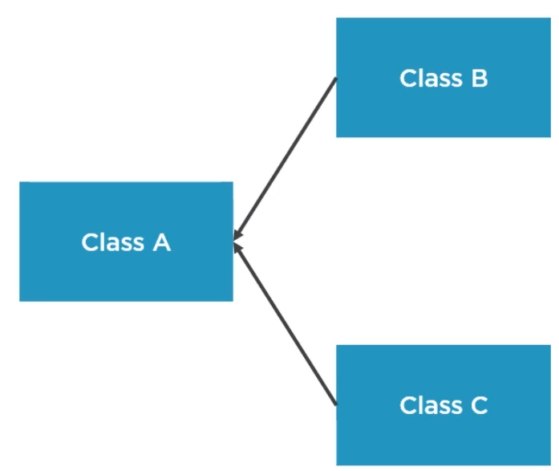
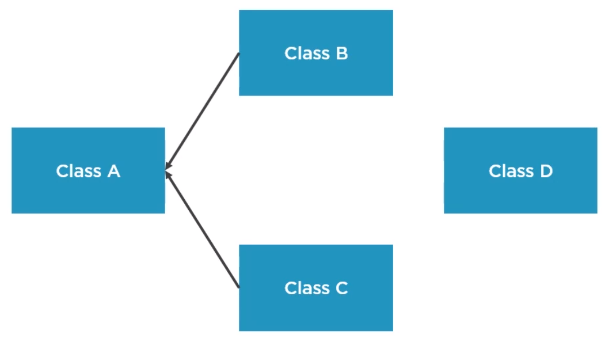

In this article, we will continously learn with the Open Closed Principle. Let's get started.

<br>

## Table of contents
- [Open Closed Principle](#open-closed-principle)
- [OCP Implementation Strategies](#ocp-implementation-strategies)
- [Appyling OCP for Frameworks and APIs](#applying-ocp-for-frameworks-and-apis)
- [Wrapping up](#wrapping-up)


<br>

## Open Closed Principle
The Open Closed Principle states that:

```
Classes, functions, and modules should be closed for modification, but open for extension.
```

But what does closed for modification and open for extension really mean?
- Well, a class is closed for modification if for each feature that we need to add, we do not touch an existing source code. The source code basically becomes immutable.

- At the same time, a component is open for extension if it allows us to make it behave in new ways by creating or writing new code. And the open closed principle tries to re-conciliate these two mantras.

Assume that we have a system with three classes, A, B and C.



We want to implement a new feature, and we go ahead and do that by modifying code in Class A. Do notice that Classes B and C depend upon Class A. When we modified Class A by mistake, we also broke Class B because Class B was dependent on it. That's the main problem with modifying existing source code. There is a high risk of breaking other components, and this is just a very simple example.

In a real application, the dependency graph is much more complex, and changes to particular components can have ripple effects in various parts of the system. Again, this is fragility. A better approach would have been to implement that change and put it in a new component. Let's call it as Class D.



If we do this, then we implement our feature, but we do not touch the existing system. Therefore, we have a very low risk of introducing regression bugs.

Why we should apply the OCP
- New features can be added easily and with minimal cost.

    Even in applications that are very tangled and old and complex, each time we need to make a change, the best way is to put that change in a separate component, write a unit test for it.

    So, we can use the OCP in every application.

- Minimizes the risk of regression bugs.

- Enforces decoupling by isolating changes in specific components, works along with the SRP.

<br>

## OCP Implementation Strategies

Modifying existing code is not the best approach when dealing with areas of an application that are very susceptible to change. There is a better way to implement changes without modifying existing code, and that is by extending its capabilities. There are two great ways to do that.

- Using inheritance

- Using strategy design pattern

For example, we have a BankAccount class, and it exposes a feature for transferring money internally in the same country. And now we have a new request to also handle international transfers. Now the worst approach to this would be to start modifying the existing transferMoney() method and put the logic for the international transfer.

```java
public class BankAccount {

    // ...

    void transferMoney(double amount) {
        // business logic for local transfer
    }

}
```

We are not going to do that. Instead, we are going to extend the capabilities of this class. The easiest way to do that is by using ```inheritance```.

```java
public class InternationalBankAccount extends BankAccount {
    // ...

    @Override
    void transferMoney(double amount) {
        // business logic for international transfer
    }

}
```

We can simply create a new class called ```InternationalBankAccount```, which extends the BankAccount class and simple overrides overrides the ```transferMoney()``` method with business logic for international transfer. We are basically creating a new component that can handle international money tranfers, but we're not touching the original BankAccount class. Iheritance is a good way to apply the Open Closed Principle. It does, however, have a small drawback. Inheritance produces coupling between the derived classes and the base class, especially when we are using a concrete class as the base class.

A better approach to applying the open closed principle is a design pattern called the strategy pattern. In the startegy pattern, we are not using inheritance, but we are using interfaces. So instead of creating new clases for each bank account transfer type, we are extracting that functionality into an interface.

```java
public interface MoneyTransferProc {
    public void transferMoney(double amount);
}

public class BankAccount implements MoneyTransferProc {
    public void transferMoney(double amount) { ... }
}

public class IntlBankAccount implements MoneyTransferProc {
    public void transferMoney(double amount) { ... }
}
```

We create classes BankAccount, IntlBankAccount that implement MoneyTransferProc interface, each of them can provide their own implementation for this method. However, BankAccount and IntlBankAccount are not linked in any other way. IntlBankAccount does not inherent from BankAccount. This means that these two classes can evolve independently. They have no coupling with each other.

```java
public class MoneyTransferProcessorFactory {
    public void MoneyTransferProc build(TransferType type) {
        if (type == TransferType.Local) {
            return new BankAccount();
        } else if (type == TransferType.Intl) {
            return new IntlBankAccount();
        }
    }
}

void processPayment(double amount, TransferType type) {
    // ...

    MoneyTransferProc mtp = factory.build(type);
    mtp.transferMoney(amount);
}
```

Afer we have out strategies, we need the factory that is capable to build them based on a particular property like a TransferType. The beaty of this is that every time we need to add new transfer capabilities, we do not need to modify this class. Nor do we need to modify existing strategies like BankAccount or IntlBankAccount. All we have to do is create a new component, implements the MoneyTransferProc interface, and provide that concrete implementation.

Which one should we choose?
- If we start small, in the beginning, We do not have to create new components to implement changes for the first time. Instead, make those changes inline, and then if there is a real need, extract them to different components.

    Also, don't apply the open closed principle for bug fixing. If we have a broken component, we should change that component and make it work as expected.
    
- If we have areas of our code that are likely to change over time, then we should probably consider one of the two alternatives for applying the OCP.

    Start with inheritance, if that does the trick.

- If we need something more powerful or more flexible, then we should consider design pattern like strategy.


<br>

## Appyling OCP for Frameworks and APIs

When we're working with many APIs, libraries or frameworks, sometimes we find that we want to modify the signature of methods to suitable our need. But we might use it in ways that we aren't aware of.

So, it's important to know how to apply the open closed principle when designing frameworks or SDKs.

For example, we create a framework that has a TaxCalculator class to calculate some taxes. We package our SDK into a JAR file, we put it on Maven, and then our clients can use it in their own applications.

```java
public class TaxCalculator {

    public double calculate(Employee e) {
        // business logic
    }

}
```

However, later on, we decide that we want to also include currency in the TaxCalculator, and we do that by violating the open closed principle. We basically modify the existing TaxCalculator, add we add the new parameter to the calculate() method.

```java
public class TaxCalculator {

    public double calculate(Employee e, String currency) {
        // business logic
    }
}
```

Although our code might work, when our clients get the updated version of the framework, their code will break. Changing existing functionality in publicly exposed frameworks can have devastating effects on the consumers.

How can we apply the open closed principle in this scenario?

We can make our library open for extension. For example, we could extract an interface called AbstractTaxCalculator. Then in our framework, we provide some implementations from default implementations for it. And when the customers are not satisfied with the default implementations, they can just create a new class, implement the AbstractTaxCalculator that we created, and provide their own logic. This is what an extesible framework looks like.

```java
public interface AbstractTaxCalculator {
    public double calculate(Employee e, String currency);
}

public CustomerUSACalc implements AbstractTaxCalculator {
    public double calculate(Employee e, String currency) {
        // business logic
    }
}
```

We provide our clients with interfaces that can act like extension points where they can hook up their custom logic with our framework.


Below is the best practices for changing APIs:
- Do not change existing public contracts: data classes, signatures.
- Expose abstractions to our customers and let them add new features on top of our framework.
- If a breaking change is inevitable, give our clients time to adapt.

<br>

## Wrapping up
- API is a contract / agreement between different software components on how they should work together.


Refer:

[SOLID Software Design Principles in Java](https://app.pluralsight.com/library/courses/solid-software-design-principles-java/table-of-contents)

[https://thinkinginobjects.com/2012/09/24/open-closed-principle/](https://thinkinginobjects.com/2012/09/24/open-closed-principle/)