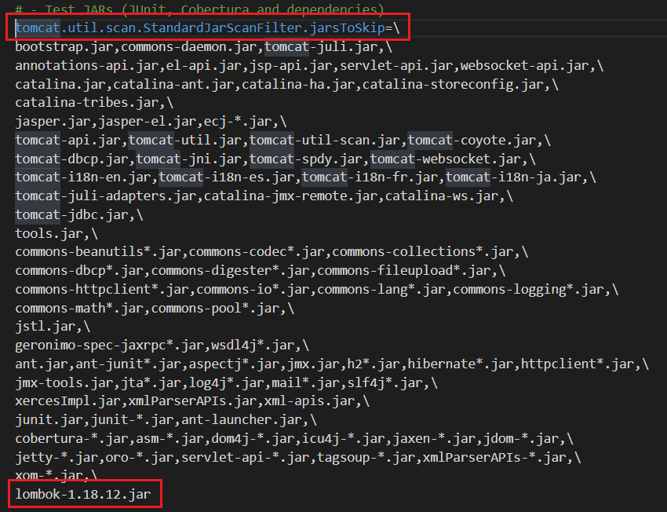

In this article, we will encounter some problems when we use Tomcat to deploy or debug our application. Belows are some solutions to fix them.

Let's get started.

<br>

## Table of contents
- [Error with module-info](#error-with-module-info)
- [Error about pointing main resource incorrectly](#error-about-pointing-main-resource-incorrectly)
- [How to deploy our project as context root](#how-to-deploy-our-project-as-context-root)
- [Wrapping up](#wrapping-up)


<br>

## Error with module-info

1. Problem

    When debugging our project with Tomcat's version such as 8.0.15, ..., we always encounter the below error:

    ```
    Unable to process Jar entry [module-info.class] from Jar [jar:file:/F:/tomcat/InstallationFiles/apache-tomcat-9.0.17/webapps/ROOT/WEB-INF/lib/lombok-1.18.8.jar!/] for annotations
    ```

2. Solution

    We will do the following steps to solve our problem:
    - Open ```catalina.properties``` file in our Tomcat installation folder.

    - In ```catalina.properties``` file, we will find the line with an bold text ```tomcat.util.scan.StandardJarScanFilter.jarsToSkip```.

        

    - Then, we will add our jar file that Tomcat makes errors such as lombok-1.18.8.jar, ... at the bottom line that is as same as the above figure.

<br>

## Error about pointing main resource incorrectly

1. Problem

    ```java
    java.lang.illegalargumentexception the main resource set specified [...] is not valid in Tomcat
    ```

2. Solution

    According to [https://github.com/rzwitserloot/lombok/issues/1801](https://github.com/rzwitserloot/lombok/issues/1801), we have module-info.class file is used to support Java 9.

    This error is relevant to an our resource folder that is not pointed incorrectly. Because Tomcat always search files in folder ```$TOMCAT_HOME/conf/Catalina/localhost```. Firstly, it read the ```ROOT.xml``` file to get the resouce path ```docBase``` property.

    Then, if ```docBase``` property do not exist, it will go to our ```our_context_path_name.xml``` to read it. Our context path here is the project's name.

    So, our solution is to remove the ```docBase``` property.


<br>

## How to deploy our project as context root

1. The simple way is that we only need to delete the ROOT folder in ```%CATALINA_HOME%/webapps```. Then, rename our war file to ```ROOT.war```, and deploy it.

2. Another way is that we need to create **ROOT.xml** context file in ```%CATALINA_HOME%/conf/Catalina/localhost```.

    The content of ROOT.xml file is:

    ```xml
    <Context docBase="../deploy/project-name.war" />
    ```

    This ROOT.xml will override the default settings for the root context of the Tomcat installation for the engine and host (**Catalina** and **localhost**).

    According to website of [tomcat.apache.org](https://tomcat.apache.org/tomcat-8.0-doc/config/context.html), we have the definition of **docBase** property.

    ```
    The Document Base (also known as the Context Root) directory for this web application, or the pathname to the web application archive file (if this web application is being executed directly from the WAR file). You may specify an absolute pathname for this directory or WAR file, or a pathname that is relative to the appBase directory of the owning Host.

    The value of this field must not be set unless the Context element is defined in server.xml or the docBase is not located under the Host's appBase.

    If a symbolic link is used for docBase then changes to the symbolic link will only be effective after a Tomcat restart or by undeploying and redeploying the context. A context reload is not sufficient.
    ```

    When configuring our project in ROOT.xml context file, there is one side effect, our application will be loaded twice. Once for **localhost:8080** and once for **localhost:8080/project-name**. To fix it, we can put our application outside **%CATALINA_HOME%/webapps**, and use a relative or absolute path in the ROOT.xml's **docBase** tag. 

    ```xml
    <Context 
        docBase="/opt/mywebapps/<yourApp>" 
        path="" 
        reloadable="true" 
    />
    ```

<br>

## Wrapping up


<br>

Refer:

[https://www.baeldung.com/tomcat-root-application](https://www.baeldung.com/tomcat-root-application)

[https://serverfault.com/questions/304853/tomcat-root-xml](https://serverfault.com/questions/304853/tomcat-root-xml)

[https://blog.csdn.net/lox_J2/article/details/80599097](https://blog.csdn.net/lox_J2/article/details/80599097)

[https://www.mulesoft.com/tcat/tomcat-servlet](https://www.mulesoft.com/tcat/tomcat-servlet)