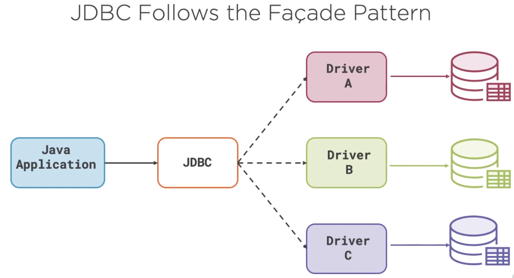
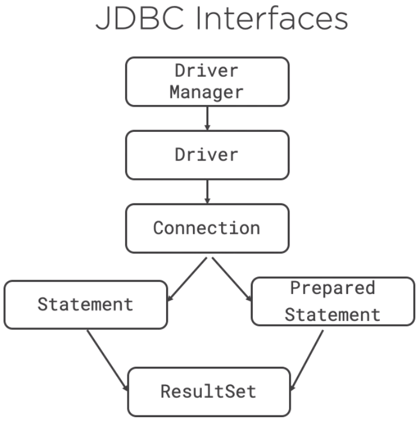
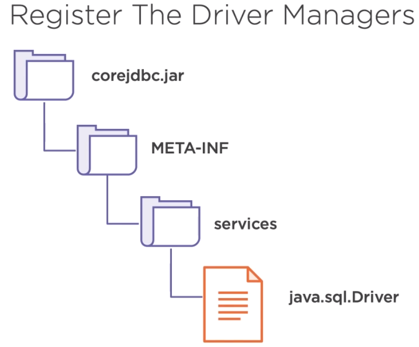
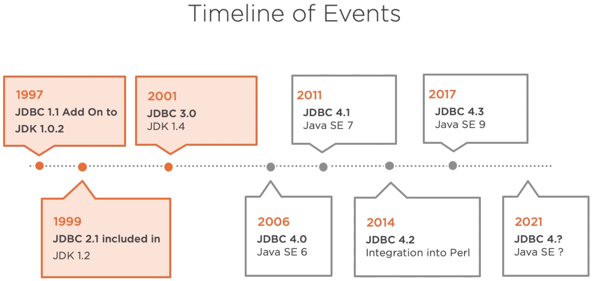
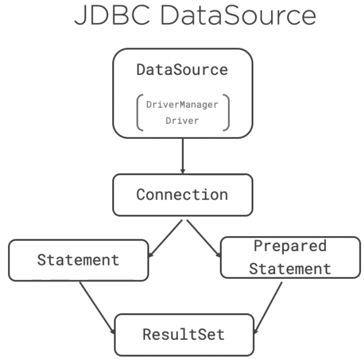

When working with Java applications, reading and writing data to a relational database is a must-have skill that we need to know. So, in this article, we will learn how to connect our java application to database based on JDBC.

Let's get started.

<br>

## Table of contents
- [How to connect a JDBC driver to the database](#how-to-connect-a-jdbc-driver-to-the-database)
- [Using DriverManager with Services](#using-drivermanager-with-services)
- [Using Class.forName() with DriverManager](#using-class.forname()-with-drivermanager)
- [Using DataSource](#using-datasource)
- [Wrapping up](#wrapping-up)

<br>

## How to connect a JDBC driver to the database



JDBC exemplifies the facade pattern in which the real workings of the specific implementation are hidden behind the standard JDBC API. The JDBC API is always backed by a vendor-specific code generally called by the driver.



There are several JDBC classes and interfaces that are used by most JDBC applications. These includes the ```DriverManager```, which maintains a registry of drivers, which are the vendor's implementation of JDBC, the ```Connection``` object which represents the actual connection to a relational database.

The Statement and PreparedStatement types which encapsulates the SQL command we want to execute, and the ResultSet which represents the data returned by our SQL command.

There are different ways to connect depending on the circumstances. In this section, we will cover some connection methods:
- ```DriverManager``` with ```Services```
- ```Class.forName()``` with ```DriverManager```
- ```DataSource```

    - ```JNDI```
    - ```Java``` / ```Jakarta EE```
    - ```CDI```

## Using DriverManager with Services

When we create a JDBC connection, we do so by giving JDBC a set of properties which consist of a URI identifying the specific driver needed, as well as username, password, and other vendor-specific properties. This operation is performed by the ```DriverManager``` when calling the ```getConnection()``` method. Since we're using the ```MySQL``` database, we will use the driver provided by MySQL, which is called ```Connector J```. We can tell JDBC to use the ```Connector J``` driver by passing in a URI specific to that driver like the following code.

```java
import java.sql.Connection;
import java.sql.DriverManager;

...

public class Component {

    public boolean tryConnection() throws Exception {
        Connection connection = DriverManager.getConnection("jdbc:mysql://localhost:3306/classicmodels?"
                    + "user=root&password=12345&serverTimezone=UTC");
        boolean isValid = connection.isValid(2);
        return isValid;
    }

}

```

The driver documentation will tell us what this URI should be, but in most cases it follows the pattern of the JDBC schema, which is:

```bash
jdbc:<driver>://<host>/<database-name>?user=<username>&password=<password>
```

If we want to use an Oracle database, the URI might look like:

```java
Connection connection = DriverManager.getConnection("jdbc:oracle:thin:@myhost:1512:orcl", "root", "12345");
```

If we use SQL Server, the URI might look like:

```java
Connection connection = DriverManager.getConnection("jdbc:sqlserver://localhost;"
            + "user=root;password=12345");
```

To test if the connection is valid, we simply call isValid() on the connection object itself. If it connected to the database, it returns true, otherwise, it returns false. It's important that we always close a database connection. If we do not close a database connection, our application may hold onto the database resources that it's not using and that can be expensive in terms of memory, network socket connections, and threads.

Each relational database vendor provides their own version of the JDBC driver, but all of them must conform with the interfaces and abstract classes defined by JDBC. At runtime, the JRE will load the vendor-specific driver, so that the JDBC API calls us make will be carried out by the underlying driver. The JRE will look at all of the registered JDBC drivers to determine which one matches the URI used to get the connection and we'll instantiate that driver and pass it any other properties specified in the URI.

The question we might be asking is how to we register the vendor's driver.



At runtime, the JRE will look into the jar files, META-INF services directory and look for a file name java.sql.Driver which lists the vendor-specific JDBC drivers that will be available at runtim.

## Using Class.forName() with DriverManager



Prior to the JDBC 4, which was introduced with Java SE6, there was an extra step that was required when creating a JDBC connection. The vendor's driver had to be explicitly loaded prior to being used. This was done using the Class.forName() method.

```java
public class Component {

    public boolean tryConnection() throws Exception {
        Class.forName("com.mysql.cj.jdbc.Driver").newInstance();
        Connection connection = DriverManager.getConnection("jdbc:mysql://localhost:3306/classicmodels?"
                    + "user=root&password=12345&serverTimezone=UTC");
        boolean isValid = connection.isValid(2);
        connection.close();

        return isValid;
    }
}
```

Until JDBC 4.0, we had to do this if we wanted to load a specific JDBC driver. When the Class.forName() method was executed, it would trigger the class loader to look for that driver and load it. In the process, a static code block in the Driver class was executed that registered the driver with the DriverManager. It was clunky, and when Java services were introduced in Java SE6, the Class.forName() was dropped in favor of listing the drivers and the java.sql.Driver file under the META-INF services directory.

So, if ```Class.forName()``` is only used with JDBC drivers predating 4.0. 

## Using DataSource

If we're doing development in Java EE, then we will probably be using the JDBC DataSource object instead of the DriverManager to get our connections. The DataSource type was introduced in JDBC 2.0 and first employed in the Java 2 Enterprise edition, the precursor to Java EE 6. The purpose of the DataSource object was to further abstract and encapsulate the process of obtaining a database connection.



1. J2EE JNDI

    Instead of setting the JDBC driver URI and properties directly in the application code, they were declared in J2EE XML configuration files. At runtime, the J2EE container would read the JDBC XML configuration file and load the drivers it declared configuring them with the URI and properties defined in the configuration file. The developer would then access the DataSource from a context object provided by the J2EE component using JNDI, a directory services API.

    ```java
    public class ProductsComponent_JNDI {
        public boolean getProductCount() throws Exception {
            InitialContext ctx = new InitialContext();
            DataSource dataSource = (DataSource) ctx.lookup("jdbc/mysql");
            Connection connection = dataSource.getConnection("genius", "12345");
            boolean isValid = connection.isValid(2);
            connection.close();

            return isValid;
        }
    }
    ```

    If we are working with a really old J2EE code base, we'll probably see like an above segment code. The DataSource object and the use of JNDI lookup solved a number of problems that were apparent with the use of the DriverManager class, namely it allowed the database connection to be created without having to say anything about the vendor or the database in the application code. That made the code more portable and a little easier to look at.

    If we're doing Enterprise Java development using Java 2 EE or any version of Java EE, we're going to encounter the use of the JNDI lookup or dependency injection of the JDBC DataSource.

2. ```Java``` / ```Jakarta EE``` @Resource annotation

    When Java EE 6 was released, it included dependency injection, which spelled the end of the use of the JNDI to obtain JDBC connections and replaced it with @Resource annotation. Using dependency injection made it very simple to access the JDBC DataSource object. It was simply there when it was needed.

    ```java
    public class ProductsComponent_JEE implements SessionBean {
        @Resource(name="jdbc/mySql")
        DataSource dataSource;

        public boolean getProductCount() throws Exception {
            Connection connection = dataSource.getConnection();
            boolean isValid = connection.isValid(2);
            connection.close();

            return isValid;
        }
    }

    // Define @MySqlDataSource annotation
    @Qualifier
    @Target({FIELD, TYPE, METHOD})
    @Retention(RUNTIME)
    public @interface MySqlDataSource {
    }

    public class DataSourceProducer {
        public MysqlDataSource mySqldataSource = null;

        @Produces
        @MySqlDataSource
        public DataSource produceDataSource() {
            // read properties from somewhere here

            if (mySqldataSource == null) {
                mySqldataSource = new MysqlDataSource();
                mySqldataSource.setPassword("pluralsight");
                mySqldataSource.setUser("root");
                mySqldataSource.setURL("jdbc:mysql://localhost:3306/classicmodels?serverTimezone=UTC");
            }
            return mySqldataSource;
        }
    }

    public static void main(String[] args) throws Exception {
        try {
            ProductsComponent_JEE component = new ProductsComponent_JEE();
            DataSourceProducer producer = new DataSourceProducer();
            component.dataSource = producer.produceDataSource();

            if (component.getProductCount()) {
                System.out.println("Demo m3c3: Try to Connect with JEE DataSource");
                System.out.println("SUCCESS");
            } else {
                System.out.println("Demo m3c3: Try to Connect with JEE DataSource");
                System.out.println("FAILED");
            }

        } catch (Exception exception) {
            util.ExceptionHandler.handleException(exception);
        }
    }
    ```

3. ```CDI``` @Inject annotation

    Dependency Injection of the DataSource is also used in non-JavaEE applications that employ the CDI, the context and dependency injection framework. CDI is a standard dependency injection framework that can be used in conjunction with or separate from Java EE 6 and up.

    In some cases, such as when developing microservices, we won't be using Java EE or Jakarta EE. The ```@Resource``` annotation in Java EE type will not be available. In these cases, we'll use the Java SE ```@Inject``` annotation, as well as our own annotations to indicate what is to be injected.

    ```java
    public class ProductsComponent_CDI{
        @Inject
        @MySqlDataSource
        DataSource dataSource;
        
        public boolean getProductCount() throws Exception{
            Connection connection = dataSource.getConnection();
            boolean isValid = connection.isValid(2);
            connection.close();
            
            return isValid;
        }
    }
    ```
    We also create a producer which creates the ```dataSource``` behind the sences, which is then injected by the CDI container into our component. In above code, take a look at this CDI being which is annotated with the type of JDBC driver and the standard Java SE inject annotation. In this case, the CDI container looks for a dataSource producer annotated with MySqlDataSource and automatically creates a new dataSource and inject it into the DataSource field.

    When using a CDI container, the use of the DataSource with our own custom annotations and a producer is not required, but it is considered good practice, especially when using JDBC connection pooling.


<br>

## Wrapping up
- Understanding about the the ways to connect with database using JDBC.


<br>

Thanks for your reading.

<br>

Refer:

[Java Core Libraries: JDBC](https://app.pluralsight.com/library/courses/java-core-libraries-jdbc/table-of-contents)

[https://www.javatpoint.com/java-jdbc](https://www.javatpoint.com/java-jdbc)