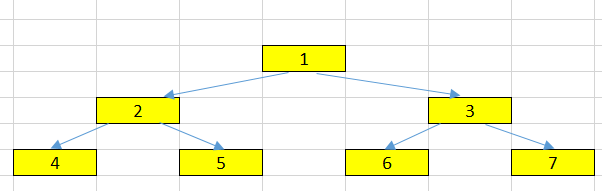
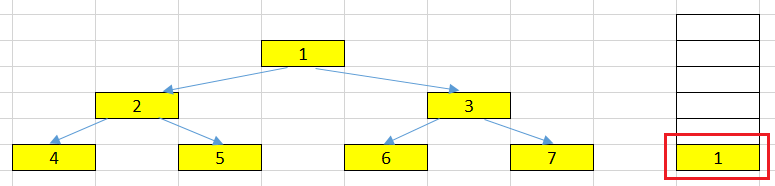
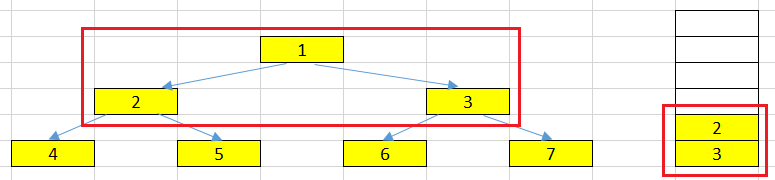
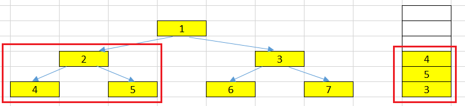
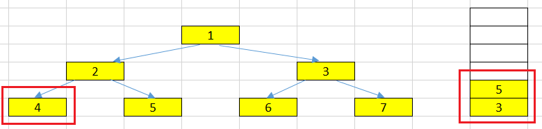
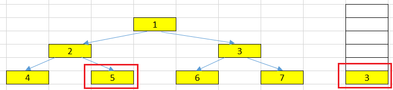
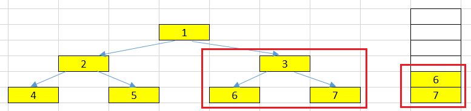

<br>

## Table of contents
- [Given problem](#given-problem)
- [Using recursive version](#using-recursive-version)
- [Using iterative version](#using-iterative-version)
- [Wrapping up](#wrapping-up)


<br>

## Given problem

Given a binary tree, return the preorder traversal of its nodes' values.



The output of the above binary tree is:

```
1 --> 2 --> 4 --> 5 --> 3 --> 6 --> 7
```

<br>

## Using recursive version

Some steps of this version:
- get the value of the current node.
- get all elements of the left side.
- after got the last node of left side, get the right node.


```java
public static void preOrderTraversalRecursive(TreeNode root, List<Integer> res) {
    if (root == null) {
        return;
    }

    res.add(root.val);
    preOrderTraversalRecursive(root.left, res);
    preOrderTraversalRecursive(root.right, res);
}
```

The benefits and drawbacks of this version:
- Benefits

    - easy to implement, and understand.

- Drawbacks

    - When our tree contains multiple nodes, our stack frame will overflow.

        To solve this problem, we can use iterative version.

<br>

## Using iterative version

Belows are some steps of the iterative version.
- Initialization time

    

    We will push root node in the stack. Then, in our loop, the condition to get out is the number of elements in the stack is less or equal than 0.

- At root node having the value = 1.

    Firstly, we will pop the top element from the stack and process it. In this problem, we will put the root node's value = 1 into our list. And We can easily find that the root node has left and right nodes.

    In preorder traversal, we need to process the left node first, next is the right node.

    So, in our stack, we will do inversely it by pushing the right node and then, the left node.

    

- At left node has the value = 2.

    In this loop, we will pop the top element that has value = 2. This node also has left and right nodes (4 and 5). It's similar the above action, we will put the right node first, and then the left node.

    


- At left node has the value = 4.

    We pop the top element that has value = 4. This node will have no left and right nodes. Then, we only push its value into our list.

    

- At right node has the value = 5.

    In this loop, we pop the top element that has value = 5. This node also has no left and right nodes. Then, we also push its value into our list.

    

- At right node has the value = 3.

    Now, in our stack, there is only the node with value = 3, pop it and process it. This node has left and right nodes. So, we will push right node, then, left node.

     

- Follow actions that are similar to the process of node 3, 5.

Below is the source code of all above steps:

```java
public List<Integer> preorderTraversalIterative(TreeNode root) {
    if (root == null) {
        return Collections.emptyList();
    }
    
    List<Integer> res = new ArrayList<>();
    Stack<TreeNode> stk = new Stack<>();
    stk.push(root);

    while (stk.size() > 0) {
        TreeNode tmp = stk.pop();
        res.add(tmp.val);

        if (tmp.right != null) {
            stk.push(tmp.right);
        }

        if (tmp.left != null) {
            stk.push(tmp.left);
        }
    }

    return res;
}
```


<br>

## Wrapping up

- Understanding how to use stack to traverse binary tree in the preorder - NLR.

