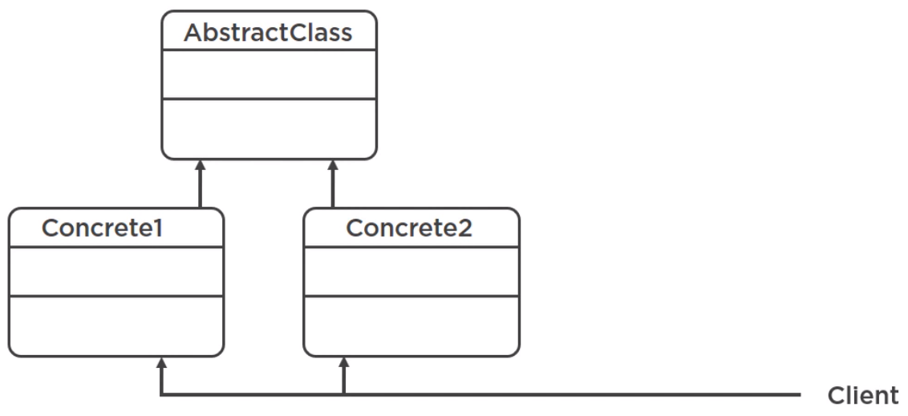

In this article, we will continue in refactoring series with couplers. Let's get started.

<br>

## Table of contents
- [Definition of couplers](#definition-of-couplers)
- [Feature Envy](#feature-envy)
- [Inappropriate intimacy](#inappropriate-intimacy)
- [Excessive exposure](#excessive-exposure)
- [Message chain](#message-chain)
- [Middle Man](#middle-man)
- [Wrapping up](#wrapping-up)

<br>

## Definition of couplers

Couplers are simply code smells that represent high coupling between classes or entire modules. In this article, we will concentrate on classes. Coupling refers to the degree to which different classes depend on each other, and low coupling suggests that they should be independent as much as possible.

Tightly coupled code means one change in one place causes a cascade of changes in other places. This is a bit different a solution sprawl code smell. With solution sprawl, we might compile our code and face an exception at runtime, but with couplers, frequently, we won't even be able to compile our code.

Things that contribute to low coupling are:
- good encapsulation.
- apply Single Responsibility Principle.
 
--> Couplers make our code fragile and cause a cascade of changes.


<br>

## Feature Envy

Feature envy means that a method of one class uses too much functionality of another class. This is what it may look like.


We have class A and class B, and one class that has a method that uses multiple methods from the other class. What's the problem with this?

Nothing, at least until we have to change methods in class B that might lead to changes in class A. So this represents high coupling. This is also a problem because the code seems misplaced. We would expect it one class, but actually find it in different class. So, if class A needs so much the functionality from another class, then there are two things we can do about it. Move methods from one class to another since the first class seems to need them so much, or, if that can't be done for whatever reason, make class B provide the functionality in a single encapsulated call.


For example:

```java
public class Customer {
    private Membership membership;
    private Address address;
    private Phone phone;
    private int age;

    public int getInternationalPhoneNumber() {
        return Integer.valueOf(phone.getInternationalPrefix() + phone.getPrefix() + phone.getNumber());
    }

    public int getSimplePhoneNumber() {
        return Integer.valueOf(phone.getAreaCode() + phone.getNumber());
    }
}

public class Phone {
    private final String fullNumber;

    public Phone(String number) {
        this.fullNumber = number;
    }

    public String getInternationalPrefix() {
        return "00"
    }

    public String getAreaCode() {
        return fullNumber.substring(0, 3);
    }

    public String getPrefix() {
        return fullNumber.substring(3, 6);
    }

    public String getNumber() {
        return fullNumber.substring(6, 10);
    }
}
```

We can see that Customer class makes multiple calls to the Phone class's methods. Since the Customer class needs them so much, we can just move them from Phone to Customer. That's option 1.

Option 1 doesn't sound good because these methods really do belong to the Phone class. So, instead, we'll go with option 2. Implement a new, well-encapsulated method on the Phone class and let the Customer class call that single method. So we are going to create this empty public method in the Phone class and then use the good old move method technique.

```java
public class Customer {
    // ...

    public int getInternationalPhoneNumber() {
        return Integer.valueOf(phone.getInternationalFormat());
    }

}

public class Phone {
    // ...

    public String getInternationalFormat() {
        return this.getInternationalPrefix() + this.getPrefix() + this.getNumber();
    }
}
```

Move some code from one place to another. And now we want the Customer class use it. This is better because before, the Customer depended on multiple methods from another class. Now, the dependency, or couplings, still exists, but there is only one link instead of several. Also, if we make breaking changes to these methods, then we will have to make updates within the same class. Our changes would not propagate to the Customer class. So that's feature envy.

<br>

## Inappropriate intimacy

Inappropriate intimacy happens when two or several classes are interlinked with each other too much. This may manifest in several ways.

For example, this may happen when our classes reach inside the internals of some other class because it has public fields or methods that are supposed to be private. 


The general rule of thumb is to make everything private and then gradually relax restrictions when we have to and when it makes sense.

For example:

```java
public class Voucher {
    public String code;

    private LocalDate startDate;
    private LocalDate expiryDate;

    public Voucher() {}

    public Voucher(String code) {
        this.code = code;
    }

    public String getCode() {return code;}

    public void setCode(String code) {
        this.code = code;
    }
}

// in client code
String voucher1 = new Voucher().code = "CHEAPER_PLEASE";
String voucher2 = new Voucher().code = "CHEAPER_!@@#$";
String voucher3 = new Voucher().code = "CHEAPER_$%$#^";
```

Let's take a look at Voucher class, and the Voucher class has code field is currently public. This means that we can set this field to whatever we want in our client code.

But no characters should be allowed. This means we now have to implement a verification for this in all of these places, which is a lot of effort and a lot of duplication. Instead, we should make this field private, then create a setter for it, and this is also the process of encapsulation. And inside, we add the validation. Now, every other class is forced to use th public method, and this setter method is the only place where this validation happens. If we want to change this validation, we will change it in a single place without forcing other classes to change.

```java
public class Voucher {
    private String code;

    // ...

    public void setCode(String code) {
        assertTrue(Pattern.compile("^[a-zA-Z0-9]+$").matcher(code).matches());
        this.code = code;
    }
}
```

Now, we have all our fields private and only the necessary methods public. And if we have two classes that have on or two links to each other, meaning they call each other's methods, that's fine.


However, if we have 5 such links or 10 links, then these classes are almost like stiched together.


And so changes to one are likely to lead to changes in another, even if they are communicating via public methods only. Essentially, they are like a couple. They always come together and we have to deal with them together. In a certain way, this code smell can look like a feature envy, but in both directions.

For example:


Our Order and Customer classes are coupled because a customer, or at least a customer ID, must be present on an order. But also, a customer may have one or multiple orders. With time, this may lead to stronger and stronger bidirectional coupling and we would have to be careful about how that evolves. Ideally, we'd want as few links as possible, and if necessary, perhaps introduce an extra class that would act as a middle layer between two.


<br>

## Excessive exposure

Excessive exposure, also called indecent exposure, happens when a class or a module exposes too many internal details about itself. And we might be telling ourself, that sounds really similar to inappropriate intimacy code smell, so what's the difference?

|               Inappropriate Intimacy              |                     Excessive Exposure                 |
| ------------------------------------------------- | ------------------------------------------------------ |
| When we have public fields instead of getters and setters, when they should be private, and there are too many links (E.g. method calls) between any two classes. | When a class forces us to care and think about a lot of low level details. |
| " You are with each other too much " | "You make me care too much" |

For example, if we're working with the old Java Calendar API, then we can very easily get a calendar instance in a single line. It's easy because the authors of the Java language have made a lot of effort to hide the low-level details that we need to know in order to work with time.

```java
// good example of encapsulation and minimum exposure
Calendar call = Calendar.getInstance();
System.out.println(call.getTime());
```

If we did not do the above thing, they would be a DIY nightmare. In order to construct a calendar object, we would need provide a lot of details related to time zones, locales, daylight savings time, and other things.

```java
Calendar cal2 = new GregorianCalendar(new TimeZone() {
    @Override
    public int getOffset(int era, int year, int month, int day, int dayOfWeek, int milliseconds) {
        return 0;
    }

    @Override
    public void setRawOffset(int offsetMillis) {
    }

    @Override
    public int getRawOffset() {
        return 0;
    }

    @Override
    public boolean useDaylightTime() {
        return false;
    }
})
```

In the book Refactoring to Patterns, Joshua Kerievsky gives another example of this code smell, and how to solve it. 



Instead of allowing client code access methods directly from several classes, he hides those classes by making the package private and behind the common abstract class or an interface and forcing the client to go through this abstract class.


As we can see, the problem and the solution are different from what we have seen, but the general idea is still there. Don't force the client class know too much, and make them go through some interface or a well-encapsulated public method.

<br>

## Message chain

A message chain is a chain of method calls that eventually takes us to the data that we ultimately need.

For example, 

```java
customer.getAddress().getCountry().toString();
```

The above code is a message chain. We start with an object, call a method, then another method, an so on and so forth until we get to the piece of data we want.

A lot of interconnected classes is not a bad thing in itself. That's just what happens in big and complex software.


But this kind of code has two problems.
- First, if we want to get a piece of data, we are forced to know the entire chain, so it forces us to learn and remember the entire class organization.
- Second, if we have this chain in 10 different places, and then we decide to somehow change the relationship between these classes, we will break this chain and then we have to go and fix it in all the places.

```java
if (!customer.getAddress().getCountry().toString().equalsIgnoreCase("US")) {
    System.out.println("Hard-coded in EUR: " + converter.convert(total));
    // ...
}
```

We can find that we have a simple if statement, and inside we produce a long message chain, from customer, to address, to country, and then on top of that calling the toString() method. This works, but it's fragile. To fix this, we simply have to do what we have been doing throughout this module - encapsulated.

```java
public class Customer {
    private Membership membership;

    private Adress address;

    private int age;

    public String getCountry() {
        return this.getAddress().getCountry().toString();
    }
}

public static void main(String[] args) {
    // ...

    if (!customer.getCountry().equalsIgnoreCase("US")) {
        // ...
    }
}
```

With the refactored code, we just moved this chain to a different place and the problem of fragility remains. This chain will still break if we change the composition of our classes, but it's encapsulated in a single spot, so, we would fix it in this one place. Whereas before, we would need to work through the entire code base and change all the places where it occurs.

<br>

## Middle Man

The middle man code smell happens when we have a class that seems to do some work, but in reality, the only thing it does is delegating actual work to other classes.

For example,

```java
class SomeClass {
    OtherClass c;

    void doThing() {
        c.doTheThing();
    }

    void doAnotherThing() {
        // implementation
    }
}
```

SomeClass class has some methods, and in some cases it delegates. And in other cases, it has its own functionality. So this is a mix, and that's fine, but in the case of this ```SomeClass``` class, all of its method delegate to other classes. It has no unique functionality. If that's the case, then why does it exist at all?

```java
public class CheckoutHandler {

    private DiscountManager discountManager;

    private DeliveryManager deliveryManager;

    public double calculateTotal(Order order) {
        double baseTotal = sumItemPrices(order.getItems());
        baseTotal = discountManager.applyVoucher(order.getVoucher(), baseTotal);
        basetotal = deliveryManager.addDeliveryFee(order.getCustomer(), baseTotal);

        return baseTotal;
    }

    // own functionality
    public double sumItemPrices(List<Item> items) {
        double sum = 0;
        for (Item item : items) {
            sum += item.price();
        }

        return sum;
    }
}
```

In the above code, we don't have a middle man. We have a CheckoutHandler class that delegates some things to other classes. We refactor this in order to adhere to the single responsibility principle. But it also has itw own functionality.

```java
public class OrderManager {
    private DiscountManager discountManager;

    private DeliveryManager deliveryManager;

    public double applyVoucher(String voucher, double price) {
        return discountManager.applyVoucher(voucher, price);
    }

    public double addDeliveryFee(Customer customer, double total) {
        return deliveryManager.addDeliveryFee(customer, toatal);
    }
}
```

However, one day, an ```OrderManager``` class could appear, and the only thing it could do is delegate validattions and calculations to other classes.

Middle man issues:
- Every class has a cost, we need to know about it and how it fits in the overall structure. So if a class doesn't do anything useful by itself, then that's a cost for which we get no value. So to fix the middle man code smell, we simply remove it. We make client code invoke the real classes with actual functionality directly and we delete the middle man class.

Middle man patterns:
- Note that purely delegating classes can exist with a purpose, and this is the case with several patterns, such as the facade, proxy, or adapter patterns.

    

    Simplifying the interface, controlling access to things, or making it possible to connect two incompatible modules, these are all the things that we might need to do. And that's when we might want to actually use a middle man. Buf if this is not the case and no one on our team knows why on earth some delegating-only class exist at all, then consider removing that class. It can be argued that the middle man code smell actually belongs to another group.

    

    If a class turns out to be useless and we just delete it, then it can also be categorized as a dispensable. And that is the last group of code smells.

<br>

## Wrapping up


<br>

Refer:

[Java Refactoring: Best Practices](https://app.pluralsight.com/library/courses/java-refactoring-best-practices/table-of-contents)