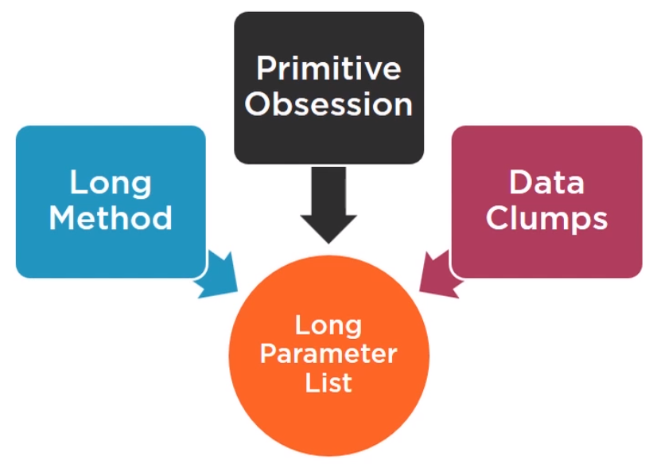

In this article, we will refactor code with splitting bloaters. Let's get started.

<br>

## Table of contents
- [Introduction to bloaters](#introduction-to-bloaters)
- [Long parameter list](#long-parameter-list)
- [Long method](#long-method)
- [Contrived Complexity](#contrived-complexity)
- [Primitive Obsession - Preserve whole object](#primitive-obsession-preserve-whole-object)
- [Primitive Obsession - Introduce Object](#primitive-obsession-introduce-object)
- [Data clumps](#data-clumps)
- [Combine Entities](#combine-entities)
- [Large class](#large-class)
- [Wrapping up](#wrapping-up)


<br>

## Introduction to bloaters

Bloaters are very large methods and classes that are hard to work with. Bloaters usually accumulate over time as software evolves.

1. Method bloaters

    For methods, it's quite simple, we just count lines of code. As a general rule, try and keep them up to 10 lines. That's not a hard limit, so going beyond 10 lines is still OK. However when we reach 20 lines, definitely consider refactoring our method.

2. Class bloaters

    For classes, don't count lines of code because it all depends on the application and context, so it's impossible to set even a rough guideline. Instead, we count responsibilities. This is simple and difficult at the same time.

    It's simple because a single class should have a single responsibility, that's the SRP rule. Each class should have one responsibility or one reason to change.

    And it's difficult because defining what makes a single responsibility is often opinion based.

Consider this example.


This black circle is our method or our class. It started out with a reasonable size, but then a new feature needs to be implemented and we make a small change and then another change, all in one place. Not bad, there is more code, but it's still understandable. But our software keeps growing, another feature is added, and we keep adding more lines of code to that one single place.

Notice how these circles overlap. That shows how our code overlaps, it becomes tangled like spaghetti. And it becomes harder and harder to understand it and change it. Our changes will affect other code and break it.

Now consider this alternative scenario where we add a few changes to our method or our class and we think to ourself, let's split these bits out into a separate place. Then we make more changes, and after a while we extract those into a separate place as well.


Notice two things:
- First, this looks much more orderly than the previous example. It's much easier to work with ordered encapsulated code.

- Second, these circles still overlap, and that's normal. Code must be put together to work as a whole, but the overlap is minimal.

The most common  bloaters are as follows: long parameter list, long method, contrived complexity, primitive obsession, data clumps, and large class.

<br>

## Long parameter list

Long parameter list happens when our method has 4 or more parameters. The general advice is to have as few as possible, one or two is typically fine, three parameters or arguments should make us think if we can simplify our method somehow, and four parameters are already quite a lot.

1. Long parameter list issues

    - hard to understand.

    - difficult to remember the position of each argument.

        For example:

        ```java
        calculate(10, false, "US", new Order());
        ```

        If we read the above code and we have no idea what the magic number and the magic boolean do, neither how the string and the order object is used. We have to go inside the method and read through the implementation to understand what the method does.

    - Acts like a magnet for event more arguments and code

So how do we resolve this smell code?

As a general rule, long parameter list smell indicates the presence of other smells, most typically long method, primitive obsession, and data clumps.



Instead of tackling the long list as a separate issue, we're going to fix the other smells. We should aim for small methods, up to 10 lines, sometimes a bit more.

<br>

## Long method

Long method means a method contains too many lines of code.

1. Long method issues

    - difficult to maintain.

    - easy to break.

    - attracts even more code.

2. How to fix long method

    

    - The most typical refactoring to fix this is called extract method, which simply means splitting.

        For example:

        ```java
        public double calculateTotal(List<Item> items, String voucher, String membership, String address) {
            double baseTotal = 0;

            // sumup the prices
            List<Double> prices = new ArrayList<>();
            for (Item item : items) {
                prices.add(item.price());
            }

            for (double price : prices) {
                baseTotal = baseTotal + price;
            }

            // check if voucher is valid
            if (voucher.equals("GIMME_DISCOUNT") || voucher.equals("CHEAPER_PLEASE")) {
                baseTotal = BigDecimal.valueOf(baseTotal * 0.95).setScale(2, RoundingMode.HALF_EVEN).doubleValue();
            } else {
                System.out.println("Voucher invalid");
            }

            // handle delivery fee
            if (memebership.equalsIgnoreCase("GOLD")) {
                // do nothing
            } else {
                if (Pattern.matches(".*US.*", address)) {
                    System.out.println("Adding flat delivery fee of 5 USD");
                    baseTotal = baseTotal + 5;
                } else {
                    System.out.println("Adding flat global delivery fee of 10 USD");
                    baseTotal = baseTotal + 10;                
                }
            }
        }
        ```

        We will identify that the calculateTotal() method that is a long method. So we need to refactoring it.

        ```java
        private double sumItemPrices(List<Item> items) {
            double baseTotal = 0;

            // sumup the prices
            List<Double> prices = new ArrayList<>();
            for (Item item : items) {
                prices.add(item.price());
            }

            for (double price : prices) {
                baseTotal = baseTotal + price;
            }

            return baseTotal;
        }

        private double applyVoucher(String voucher, double price) {
            // check if voucher is valid
            if (voucher.equals("GIMME_DISCOUNT") || voucher.equals("CHEAPER_PLEASE")) {
                baseTotal = BigDecimal.valueOf(baseTotal * 0.95).setScale(2, RoundingMode.HALF_EVEN).doubleValue();
            } else {
                System.out.println("Voucher invalid");
            }

            return price;
        }

        private double addDeliveryFee(String membership, String address, double total) {
            // handle delivery fee
            if (memebership.equalsIgnoreCase("GOLD")) {
                // do nothing
            } else {
                if (Pattern.matches(".*US.*", address)) {
                    System.out.println("Adding flat delivery fee of 5 USD");
                    baseTotal = baseTotal + 5;
                } else {
                    System.out.println("Adding flat global delivery fee of 10 USD");
                    baseTotal = baseTotal + 10;                
                }
            }
        }

        public double calculateTotal(List<Item> items, String voucher, String membership, String address) {
            double baseTotal = sumItemPrices(items);
            baseTotal = applyVoucher(voucher, baseTotal);
            baseTotal = addDeliveryFee(membership, address, baseTotal);

            return baseTotal;
        }
        ```

        So we have:

        

    - There is a second common refactoring technique, and it's called decompose conditional, quite similar to the extract method technique, but it's focused on if-else or switch conditions. These conditions are pretty complex, and if they do, we should extract them into separate methods with descriptive names as well.

        For example:

        ```java
        private double applyVoucher(String voucher, double price) {
            // check if voucher is valid
            if (voucher.equals("GIMME_DISCOUNT") || voucher.equals("CHEAPER_PLEASE")) {
                price = BigDecimal.valueOf(baseTotal * 0.95).setScale(2, RoundingMode.HALF_EVEN).doubleValue();
            } else {
                System.out.println("Voucher invalid");
            }

            return price;
        }

        private double addDeliveryFee(String membership, String address, double total) {
            // handle delivery fee
            if (memebership.equalsIgnoreCase("GOLD")) {
                // do nothing
            } else {
                if (Pattern.matches(".*US.*", address)) {
                    System.out.println("Adding flat delivery fee of 5 USD");
                    baseTotal = baseTotal + 5;
                } else {
                    System.out.println("Adding flat global delivery fee of 10 USD");
                    baseTotal = baseTotal + 10;                
                }
            }
        }
        ```

        We can refactor the check condition of voucher into other method.

        ```java
        private boolean isValidVoucher(String voucher) {
            return voucher.equals("GIMME_DISCOUNT") || voucher.equals("CHEAPER_PLEASE");
        }

        private boolean isEligibleForFreeDelivery(String membership) {
            return memebership.equalsIgnoreCase("GOLD");
        }

        private boolean isUsAddress(String address) {
            return Pattern.matches(".*US.*", address);
        }

        private double applyVoucher(String voucher, double price) {
            if (isValidVoucher(voucher)) {
                price = BigDecimal.valueOf(baseTotal * 0.95).setScale(2, RoundingMode.HALF_EVEN).doubleValue();
            } else {
                System.out.println("Voucher invalid");
            }

            return price;
        }

        private double addDeliveryFee(String membership, String address, double total) {
            if (isEligibleForFreeDelivery(membership)) {
                // do nothing
            } else {
                if (isUsAddress(address)) {
                    System.out.println("Adding flat delivery fee of 5 USD");
                    total = total + 5;
                } else {
                    System.out.println("Adding flat global delivery fee of 10 USD");
                    total = total + 10;                
                }
            }

            return total;
        }
        ```

3. Benefits Archieved when resolving long method

    - Shorter and easier to understand.

    - More reusable code

<br>

## Contrived Complexity

The contrived complexity means that there is code that achieves an objective but is too complex. An easier, shorter or more elegant way exists to achieve the same goal. So, essentially code that does the job, but there is an easier way to do the same thing.

1. Contrived complexity issues

    - Hard to understand.

    - Higher chance of breaking when changing.

2. How to fix contrived complexity

    To fix it, we just have to replace one algorithm with the other.

    

    For example:

    ```java
    private double sumItemPrices(List<Item> items) {
        double baseTotal = 0;

        // sumup the prices
        List<Double> prices = new ArrayList<>();
        for (Item item : items) {
            prices.add(item.price());
        }

        for (double price : prices) {
            baseTotal = baseTotal + price;
        }

        return baseTotal;
    }

    private boolean isUsAddress(String address) {
        return Pattern.matches(".*US.*", address);
    }
    ```

    So, we refactor this code smell to the simpler version.

    ```java
    private double sumItemPrices(List<Item> items) {
        double sum = 0;
        for (Item item : items) {
            sum = sum + item.price();
        }

        return sum;
    }

    private boolean isUsAddress(String address) {
        return address.contains("US");
    }
    ```

3. Benefits archieved

    - Shorter and easier to understand.

<br>

## Primitive Obsession - Preserve whole object

Primitive Obsession simply means we are using primitive types (int, String, ...) way too much instead of objects. It's fine to pass a string or an integer, but often we should be using custom objects.

1. Primitive Obsession issues

    - Major cause of long parameter lists.

    - Causes code duplication.

    - Not type safe and prone to errors.

        For example: we want to get VAT for a specific country and we mistyped the name France.

        ```java
        getCountryVat("Fance");
        ```

2. How to fix primitive obsession

    One refactoring technique is called preserve whole object, in which we pass in the entire object as a parameter instead of its parts.

    

    This might sound a little vague, so let's take another look at our method signature.

    ```java
    private double addDeliveryFee(String membership, String address, double total) {
        if (isEligibleForFreeDelivery(membership)) {
            // do nothing
        } else {
            if (isUsAddress(address)) {
                System.out.println("Adding flat delivery fee of 5 USD");
                total = total + 5;
            } else {
                System.out.println("Adding flat global delivery fee of 10 USD");
                total = total + 10;                
            }
        }

        return total;
    }

    public double calculateTotal(List<Item> items, String voucher, String membership, String address) {
        double baseTotal = sumItemPrices(items);
        baseTotal = applyVoucher(voucher, baseTotal);
        baseTotal = addDeliveryFee(membership, address, baseTotal);

        return baseTotal;
    }
    ```

    Because ```membership``` and ```address``` are fields of ```Customer``` class, so we only pass ```Customer``` object to ```addDeliveryFee()``` and ```calculateTotal()``` methods.

    ```java
    public class Customer {
        private String membership;
        private String address;
    }

    private double addDeliveryFee(Customer customer, double total) {
        if (isEligibleForFreeDelivery(customer.getMembership())) {
            // do nothing
        } else {
            if (isUsAddress(customer.getAddress())) {
                System.out.println("Adding flat delivery fee of 5 USD");
                baseTotal = baseTotal + 5;
            } else {
                System.out.println("Adding flat global delivery fee of 10 USD");
                baseTotal = baseTotal + 10;                
            }
        }
    }

    public double calculateTotal(List<Item> items, String voucher, Customer customer) {
        double baseTotal = sumItemPrices(items);
        baseTotal = applyVoucher(voucher, baseTotal);
        baseTotal = addDeliveryFee(customer, baseTotal);

        return baseTotal;
    }
    ```

<br>

## Primitive Obsession - Introduce Object

There is one more common refactoring technique, and it's called Introduce parameter object.


In this case, we create an object, we move our primitives there, and then pass it in as a single object. If we go back to our method signature, we can see that we pass in a list, which is not a primitive, and a plain voucher string. Can these be combine together somehow? They could be part of a single order object, but we don't have an Order class, we have the Customer class.


So, we just create the Order class.

```java
@Data
public class Order {
    private List<Item> items;
    private String voucher;

    public Order() { items = new ArrayList<>(); }

    public Order(List<Item> items, String voucher) {
        this.items = items;
        this.voucher = voucher;
    }
}

public double calculateTotal(Order order, Customer customer) {
    double baseTotal = sumItemPrices(order.getItems());
    baseTotal = applyVoucher(order.getVoucher(), baseTotal);
    baseTotal = addDeliveryFee(customer, baseTotal);

    return baseTotal;
}
```

<br>

## Data clumps

Data clumps are a group of variables which are passed around together (in a clump) throughout various parts of the program. The key point is that they always go together, or they have to.

For example, when we have to fill in an email template and we have to provide the title, name, and surname, or start and end time of a booking, the date and time for a return flight, or a time window for a delivery to our house.

```java
sender.sendEmailTo("Mr.", "John", "Doe");
system.bookRoom(startTime, endTime);
system.bookReturnFlight(there, back);
manager.setDeliveryTimeWindow(from, to);
```

1. Data clumps issues

    - Major cause of long parameter lists.

    - Causes code duplication because we have to repeatedly get the variables and only then pass them in.

    In a way, data clumps are quite similar to primitive obsession. These two code smells Data Clumps and Primitive Obsession often suggest a specific problem, missing domain objects, meaning we have a bunch of strings and a bunch of integers, and we should really encapsulate those into a class. We are going to take a break from ```calculateTotal()``` method for a bit and look at ```setDeliveryTimeWindow()``` method that sets a time window for deliveries of a customer order.

    ```java
    public class CheckoutHandler {
        private LocalDate deliveryWindowStart;
        private LocalDate deliveryWindowEnd;

        public void setDeliveryTimeWindow(LocalDate deliveryStart, LocalDate deliveryEnd) {
            this.deliveryWindowStart = deliveryStart;
            this.deliveryWindowEnd = deliveryEnd;

            System.out.println(format("Order will delivered some time between %s and %s", this.deliveryWindowStart, this.deliveryWindowEnd));
        }
    }

    // Client code
    LocalDate start = now().plusDays(1);
    LocalDate end = now().plusDays(2);

    checkout.setDeliveryTimeWindow(start, end);
    ```

    As we can see, our CheckoutHandler object can also set the time window, and there is no real implementation, it just prints a confirmation of the time that we set for our things to be delivered. And the client code looks like the above code. We want to order to be delivered between tomorrow and the day after tomorrow, and we pass these two values to the method. It's not terrible, but we could still improve the code by encapsulating this couple into a single logical unit and also reduce the number of parameters by one.

2. How to fix Data Clumps

    With the above example, we create a class and call it ```DeliveryTimeWindow```.

    ```java
    @Data
    public class DeliveryTimeWindow {
        private LocalDate start;
        private LocalDate end;

        public DeliveryTimeWindow(LocalDate start, LocalDate end) {
            this.start = start;
            this.end = end;
        }
    }
    ```

    So, we will refactor ```CheckoutHandler``` class.

    ```java
    public class CheckoutHandler {
        // ...

        public void setDeliveryTimeWindow(DeliveryTimeWindow window) {
            System.out.println(format("Order will delivered some time between %s and %s", window.getDeliveryWindowStart(), window.getDeliveryWindowEnd()));
        }
    }
    ```

3. Benefits achieved

    - Safer code (typos won't compile).

    - Reduced number of parameters

    - Better encapsulation.

<br>

## Combine Entities

In the previous section, we have the segment code:

```java
CheckoutHandler checkout = new CheckoutHandler();
Customer customer = new Customer("GOLD", "MyStreet, 123, US");

// List<Item> shopping cart
List<Item> shoppingList = asList(new Chocolate(), new Chocollate, new Cheese());
Order order = new Order(shoppingList, "DummyVoucher");

double total = checkout.calculateTotal(order, customer);
System.out.println(total);
```

We can find that we always have to pass in an order and a customer, they have to come together. This means that they are a data clumps as well. They're not made of primitives, but are own custom objects. Also, we could accidentally pass in a customer for the wrong order, and this will result in very unhappy customers who were built for the wrong shopping list.

To fix this, we can simply combine the order and customer objects, an order has a customer. So we can add the customer to our Order class, getter/setter methods.

```java
@Data
public class Order {
    private Customer customer;
    private List<Item> items;
    private String voucher;

     // ...
}

public double calculateTotal(Order order) {
    double baseTotal = sumItemPrices(order.getItems());
    baseTotal = applyVoucher(order.getVoucher(), baseTotal);
    baseTotal = addDeliveryFee(order.getCustomer(), baseTotal);

    return baseTotal;
}
```


<br>

## Large class

A large class is a class that does many things (many responsibilities). A **God Object** is a class that does almost everything.

1. Large class issues

    - Very difficult and slow to maintain.

    - Violates the Single Responsibility Principle.

2. How to fix Large class

    To fix the large class, we simply split it just like a large method. Not always, but frequently, refactoring is just that, spliting and moving, and then more spliting and more moving. This is how we keep a large software project flexible and maintainable.

    Remember how we identified three different jobs in our large methods and split those into separate methods? We can now use the same grouping logic and move some of the code to separate classes.

    ```java
    public class DisountManager {

        private boolean isValidVoucher(String voucher) {
            return voucher.equals("GIMME_DISCOUNT") || voucher.equals("CHEAPER_PLEASE");
        }

        private double applyVoucher(String voucher, double price) {
            if (isValidVoucher(voucher)) {
                price = BigDecimal.valueOf(baseTotal * 0.95).setScale(2, RoundingMode.HALF_EVEN).doubleValue();
            } else {
                System.out.println("Voucher invalid");
            }

            return price;
        }
    }
    ```

    Voucher handling is a separate responsibility, so this method could go to a newly created but empty VoucherManager class, or a more general DiscountManager if our online shop handles various kinds of discounts.

    ```java
    public class DeliveryManager {
        public double addDeliveryFee(String membership, String address, double total) {
            if (isEligibleForFreeDelivery(membership)) {
                // do nothing
            } else {
                if (isUsAddress(address)) {
                    System.out.println("Adding flat delivery fee of 5 USD");
                    total = total + 5;
                } else {
                    System.out.println("Adding flat global delivery fee of 10 USD");
                    total = total + 10;                
                }
            }

            return total;
        }

        private boolean isEligibleForFreeDelivery(String membership) {
            return memebership.equalsIgnoreCase("GOLD");
        }

        private boolean isUsAddress(String address) {
            return Pattern.matches(".*US.*", address);
        }
    }
    ```

    Handling delivery and transportation is not a trivial matter, so we move that to a new DeliveryManager class.

    Now we have different classes, and each has a well defined responsibility. Whenever the CheckoutHandler needs some functionality, it delegates it to other classes. Some people might argue that something manager is not a good name for a class because it is too broad, but for our simple online shop and our purpose, it is good enough.

    ```java
    public class CheckoutHandler {
        private LocalDate deliveryWindowStart;
        private LocalDate deliveryWindowEnd;

        private DiscountManager discountManager = new DiscountManager();
        private DeliveryManager deliveryManager = new DeliveryManager();

        public double calculateTotal(Order order) {
            double baseTotal = sumItemPrices(order.getItems());
            baseTotal = discountManager.applyVoucher(order.getVoucher(), baseTotal);
            baseTotal = deliveryManager.addDeliveryFee(order.getCustomer(), baseTotal);

            return baseTotal;
        }

        // ...
    }
    ```

<br>

## Wrapping up
- Methods and Classes can and should be split.

- Strive for the most simplest and elegant solution.

- Too many primitives indicates we should introduce new classes.

<br>

Refer:

[Java Refactoring: Best Practices](https://app.pluralsight.com/library/courses/java-refactoring-best-practices/table-of-contents)