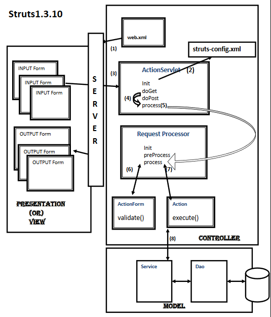
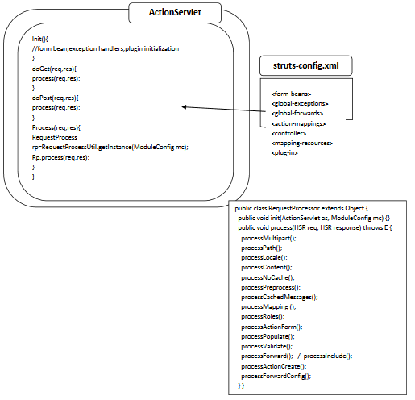

<br>

## Table of contents
- [Introduction to Struts 1 framework](#introduction-to-struts-1-framework)
- [How Struts 1 works]()
- [Core componenets in Struts 1 framework]()
- [Wrapping up](#wrapping-up)


<br>

## Introduction to Struts 1 framework
Struts is an application development framework that is designed for and used with the popular J2EE platform. It cuts time out of the development process and makes developers more productive by providing them a series of tools and components to build applications. Struts is maintained as a part of Apache Jakarta project and is open source. 

Struts 1 was first release of MVC based framework by the Apache Software foundation in May 2000.

<br>

## How Struts 1 works
To describe the way Struts 1 work, we will seee the below image:



- At deployment time or at the first user request, container will create **ActionServlet** instance, and it will call ```init``` method. (In ```web.xml``` file, we have to configure it with ```*.do``` URL pattern).

- ```init``` method read ```struts-config.xml``` and it will store that information into ```ModuleConfig config``` reference and when user sends a request, ```protected void initModuleFormBeans(ModuleConfig config)``` will create form bean instance and it will keep it in scope (request or session).

- When user sends a request, container will send that request to ```void doGet(HttpServletRequest request, HttpServletResponse response)``` and ```  void doPost(HttpServletRequest request, HttpServletResponse response)``` methods. After that, ```doGet()``` and ```doPost()``` methods will delegate to ```void process(HttpServletRequest request, HttpServletResponse response)``` method of **ActionServlet**.
 
- ```process()``` method of **ActionServlet** will create one Singleton instance of a ```RequestProcessor``` and call ```void init(ActionServlet servlet, ModuleConfig moduleConfig)``` method of ```RequestProcessor```. Note that for each and every module **ActionServlet** will create one **RequestProcessor** object.

- Then, ```process()``` method of **ActionServlet** will delegate request to ```process()``` method of **RequestProcessor**. ```process()``` method of **RequestProcessor** will call ```boolean 	processPreprocess(HttpServletRequest request, HttpServletResponse response)``` method of the same class. If ```processPreprocess()``` method returns true, then only ```process()``` method will do remain process. Otherwise, it will not process the request to next level. By default, ```processPreprocess()``` method's implementation will return true.

- ```process()``` method of ```RequestProcessor``` will populate read user input form data and populates that form data into **ActionForm** instance by calling setter methods.

- Then, it will call the ```  ActionErrors validate(ActionMapping mapping, javax.servlet.http.HttpServletRequest request)``` method for validation. It will return **ActionErrors** object which is the subclass of **ActionMessage**.

- In **ActionMessage** class, ```isEmpty()``` method will check error messages what we added in our conditions:

    ```java
    if (name.equals("")) {
        ae.add("name", new ActionMessage("mgs"));
    }
    ```

- If count is zero, then ```process()``` method will redirect input page to the User for populating error messages.

- If error count is not equals to zero, the ```process()``` method will create **ActionClass** object. In single factor (for first user request), it will call execute method of our **Controller** class.

- For that ```execute()``` method, it pass (ActionMapping, ActionForm, HttpServletRequest, HttpServletResponse) as execute method parameters.

- By using request or ActionForm parameter, we can read form data to process next **Model** layer classes.

- From ```execute()``` method, ```process()``` method of **RequestProcessor** will expect one **ActionForward** that is return type. In that **ActionForward**, we can configure the required page redirection configuration.

- Based on that configuration, ```process()``` method will forward required configured page what we have configured under ```<forward>``` tag in ```struts-config.xml``` file.

<br>

## Core componenets in Struts 1 framework

Belows are some main components that we need to understand:
- **ActionServlet** is a front controller Servlet in Struts, and the only Servlet exists in Struts framework. Every request comming to Struts must first come to **ActionServlet** clss instance. When **ActionServlet** class call ```init()``` method, **ActionServlet** reads ```struts-config.xml``` file to get data and stores it into one **ModuleConfig** object. 

    **ModuleConfig** object contains all 8 ```struts-config.xml``` file elements. Once after ```moduleConfig``` object is created that object is passed into one new instance of **RequestProcessor** constructor.

    ```java
    RequestProcessor reqProcessor = new RequestProcessor(this, moduleConfig);
    ```

    **this** is current **ActionServlet** class instance, and **moduleConfig** is ModuleConfig object.



In the ```process()``` method, **ActionServlet** invokes ```process()``` method of **RequestProcessor**. 

- ModuleConfig

    ModuleConfig contains the content of ```struts-config.xml``` file. It contains all ```ActionForm```, ```Action```, ```ActionForward```, ```ActionMapping``` class names.

    Whenever client request comes, ```ActionServlet``` sends request to ```RequestProcessor```, ```RequestProcessor``` uses ```ModuleConfig``` object to find out the ```ActionForm``` and ```Action``` class names of the requested action path uri.


<br>

## Wrapping up

- Understanding about the flows between components in Struts 1 helps us in coding, debugging.

Refer:

[https://studylib.net/doc/9379291/struts-config.xml-file](https://studylib.net/doc/9379291/struts-config.xml-file)

[http://tool.oschina.net/uploads/apidocs/struts-1.3.10/org/apache/struts/action/ActionServlet.html](http://tool.oschina.net/uploads/apidocs/struts-1.3.10/org/apache/struts/action/ActionServlet.html)