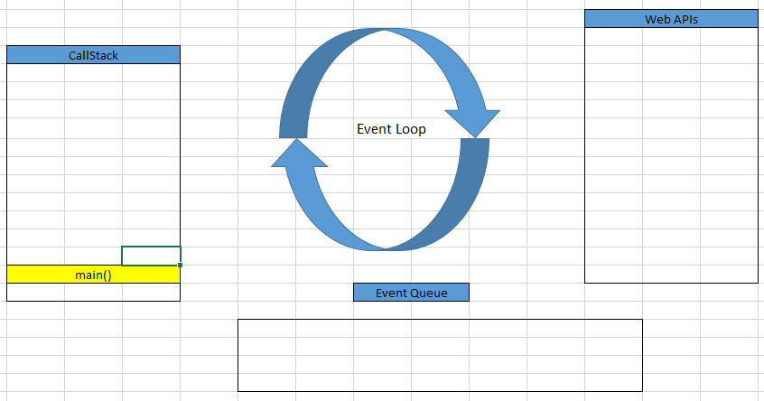
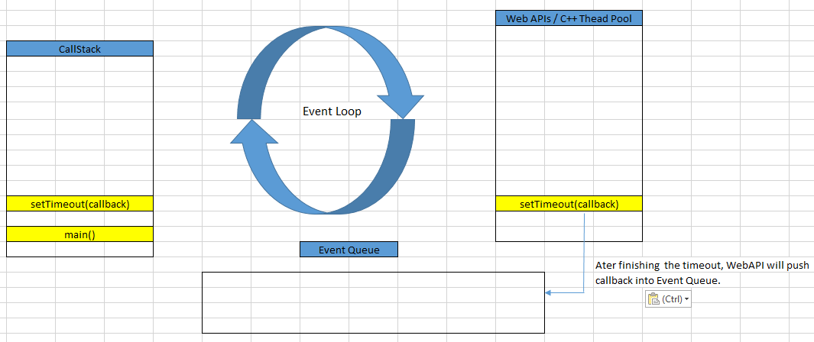
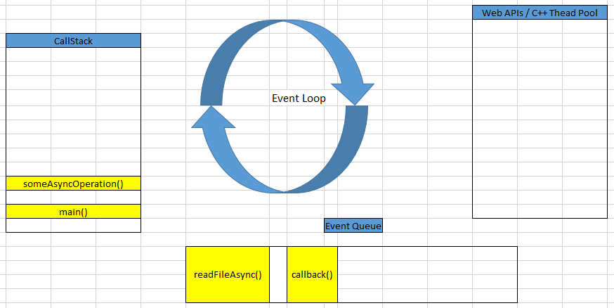
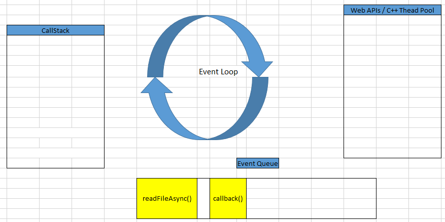
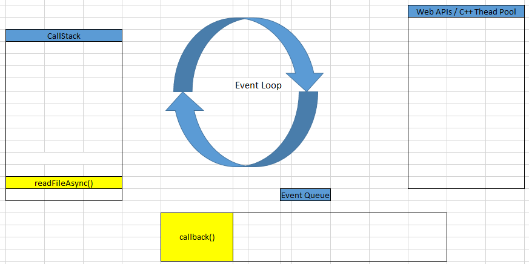
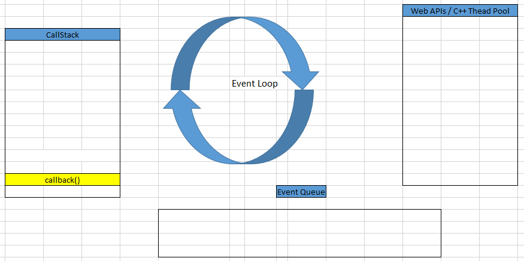

In this article, we will learn about Event Loop in Node.js, how it works and some components that are relevant to it. Based on the knowledge of Event Loop in Node.js, we will also understand the architecture of Vert.x toolkit.

Let's get started.

<br>

## Table of contents
- [Given problem](#given-problem)
- [Solution of Event Loop](#solution-of-event-loop)
- [How Event Loop works in Node.js](#how-event-loop-works-in-node.js)
- [Some other concepts in Event Loop](#some-other-concepts-in-event-loop)
- [When to use](#when-to-use)
- [Benefits and Drawbacks](#benefits-and-drawbacks)
- [Applications and Examples](#applications-and-examples)
- [Wrapping up](#wrapping-up)


<br>

## Given problem

Normally, in our web server, with each request we will create one threads to handle its action, especially in Spring MVC, ... But this way has some drawbacks that we need to know:

- Creating multiple threads to handle requests at the same time makes our computer have multi-cores, RAMs, but verticle scaling has limit point. And the context-switching between requests consumes time and cost.

    Each threads can consumes 2 - 3 MB RAM.

- The bottleneck in our system is database. Because the time of query statement in the best condition is 10 - 20 ms, and the time in the worst condition is 100ms. Then, when multiple threads access database can select, update on a row or table, they will be lock to satisify ACID properties. It can makes database will implement queries that takes so long time.


<br>

## Solution of Event Loop

Instead of handling multiple requests at the same time by creating many threads, Node.js utilizes one single-thread to deal with it. It is as same as the stuff that we go to the restaurant. First, we will order some dishes with the waiters, abide by the rule: first come, first serve. Next, the waiter will continue taking notes the other people's orders without serving only anyone finish eating.

In that sparse time, we can do another thing such as chatting online, playing game, ... When our dishes is completely cooked, the waiter will bring them to us.

So, with one waiter, we can serve multiple consumers at the same time.

To implement Event Loop, Node.js uses Libuv library. It's written completely in C/C++. Beside event loop, libuv also maintains a thread pool, file system, DNS functionalities, etc.

<br>

## How Event Loop works in Node.js

In order to understand about Event Loop, we will go straight forward to a specific example.

```javascript
const fs = require('fs');

function someAsyncOperation(callback) {
  const startCallback = Date.now();
  // assuming that reading file takes 95ms
  fs.readFile('/path/to/file', callback);
}

const timeoutScheduled = Date.now();

function main() {
    setTimeout(function logInfo() => {
        const delay = Date.now() - timeoutScheduled;
        console.log(`${delay}ms have passed since I was scheduled`);
    }, 100);


    // waiting 10ms
    someAsyncOperation(function readFileAsync() => {
        while (Date.now() - startCallback < 10) {
            // nothing to do
        }
    });
}

main();
```

Belows are some steps that is implemented in Node.js.

1. **main()** function will be called. It will be loaded in **CallStack**.

    After the **now()** method of Date class is called, **main()** method will be called.

    

2. Then, **setTimeout()** method will be called, and is pushed into **CallStack**.

    Because **setTimeout()** method is provided by the Browser's Web API, then Timer will be run in another thread to count the time. It means that the **setTimeout()**'s callback will be added to the Web API. Web API will manage this callback.

    

    It means that after running over that time - 100ms, Web API will push that callback into Event Queue.

3. After **setTimeout()** method finished, **someAsyncOperation()** method will be pushed into **CallStack**.

    In **someAsyncOperation()** method, after calculating the value for **startCallback** variable, we cope with **fs.readFile()** method is asynchronous function with its callback that is the callback of **someAsyncOperation()** method that we passed into.

    When **fs.readFile()** method is called, Libuv will create a worker thread to handle the reading file. Then its callback will be push into Event Queue.

    
    
    But we have some questions in this case.
    - How does Node.js handle the reading file to finish?

        We attach listeners to events, so whenever an event is fired the callback attached to the event is executed.
    
    - How data from the asynchronous function **fs.readFile()** will be passed into callback function?
    
    After that, **someAsyncOperation()** method will be pop off the CallStack.

    Due to the time of finishing the reading file takes 95 ms, and the timeout takes 100ms, so the **readFileAsync()** method will be pushed into Event Queue before the callback of **setTimeout()** method.
    

4. After **someAsyncOperation()** method, and **main()** method are got out of Call Stack, the Call Stack is empty.

    

    The Event Loop is a constantly running thread that checks if the call stack is empty then, proceeds to execute all the callbacks enqueued in the Event queue.

    ```java
    while (eventLoop.waitForTask()) {
        eventLoop.processNextTask()
    }
    ```

    Based on it, we can find that **readFileAsync()** callback method will be push into Call Stack. This callback will wait for 10 ms before finishing.
    
    
    
    Then, the callback of **setTimeout()** method will be pushed into Call Stack to continuously proceed.

    

    Finally, the callback of **setTimeout()** method will be poped out of call stack.

<br>

## Some other concepts in Event Loop

- Job Queue

    Job Queue was introduced in ES6. It's a layer on top of the Event Loop queue.

- Microtask and Macrotask

    We can refer an article about [Microtask and Macrotask: A Hands-on Approach](https://blog.bitsrc.io/microtask-and-macrotask-a-hands-on-approach-5d77050e2168).

- Some phases of Event Loop

    We can refer an article about [Phases of the Node JS Event Loop](https://medium.com/@kunaltandon.kt/process-nexttick-vs-setimmediate-vs-settimeout-explained-wrt-different-event-loop-phases-c0506b12921d).

<br>

## When to use

- When you need to do heavy computation, which is not required to run sequentially, means next statement can be executed without it. In that case you would not want to block the main thread because of that computation.

- When you want to execute your code in the end, after all the other statement/functions are done executing.

## Benefits and Drawbacks

1. Benefits

    - With asynchronous programming, it's free from deadlock. Because we use only single-thread, and I/O operations will be pushed to worker threads that are handled by libuv library, the main thread will not blocked.

    - Memory efficient.

    - Since there is no blocking of processes, it's easy to develop scalable systems.
    
    - Do not use thread pool to manage.

2. Drawbacks

    - If one of functions takes so much times, the remaining functions will not be implemented.

    - Takes time to understand it deeply because if we do not take care of the way how Node.js manage memory, we can make memory leak.

<br>

## Applications and Examples

- Using event loop is applied in Vert.x, Spring Webflux.


<br>

## Wrapping up

- The Event Loop has one simple job — to monitor the Call Stack and the Callback Queue. If the Call Stack is empty, it will take the first event from the queue and will push it to the Call Stack, which effectively runs it.

- If the call stack is empty, so if all previously invoked functions have returned their values and have been popped off the stack, the first item in the queue gets added to the call stack.

<br>

Refer:

[https://webapplog.com/node-patterns-from-callbacks-to-observer/](https://webapplog.com/node-patterns-from-callbacks-to-observer/)

[An overview of the engine, the runtime, and the call stack](https://blog.sessionstack.com/how-does-javascript-actually-work-part-1-b0bacc073cf)

[Inside Google’s V8 engine + 5 tips on how to write optimized code](https://blog.sessionstack.com/how-javascript-works-inside-the-v8-engine-5-tips-on-how-to-write-optimized-code-ac089e62b12e)

[Memory management + how to handle 4 common memory leaks](https://blog.sessionstack.com/how-javascript-works-memory-management-how-to-handle-4-common-memory-leaks-3f28b94cfbec)

[https://www.studytonight.com/post/what-is-nodejs](https://www.studytonight.com/post/what-is-nodejs)

[https://stackoverflow.com/questions/12335222/settimeout-and-v8](https://stackoverflow.com/questions/12335222/settimeout-and-v8)

[https://nodejs.org/fa/docs/guides/event-loop-timers-and-nexttick/](https://nodejs.org/fa/docs/guides/event-loop-timers-and-nexttick/)

[https://jakearchibald.com/2015/tasks-microtasks-queues-and-schedules/](https://jakearchibald.com/2015/tasks-microtasks-queues-and-schedules/)

[https://medium.com/@Rahulx1/understanding-event-loop-call-stack-event-job-queue-in-javascript-63dcd2c71ecd](https://medium.com/@Rahulx1/understanding-event-loop-call-stack-event-job-queue-in-javascript-63dcd2c71ecd)

[https://dev.to/lydiahallie/javascript-visualized-event-loop-3dif](https://dev.to/lydiahallie/javascript-visualized-event-loop-3dif)

[https://dev.to/khaosdoctor/node-js-under-the-hood-3-deep-dive-into-the-event-loop-135d](https://dev.to/khaosdoctor/node-js-under-the-hood-3-deep-dive-into-the-event-loop-135d)

[https://hostpresto.com/my/aff.php?aff=964&url=/nodejs-hosting/](https://hostpresto.com/my/aff.php?aff=964&url=/nodejs-hosting/)
