In this article, we will learn how to use CDI in JavaEE. Let's get started.

<br>

## Table of contents
- [Understanding Context and Dependency Injection](#understanding-context-and-dependency-injection)
- [Injection with CDI](#injection-with-cdi)
- [Bringing the Web Tier and Service Tier together](#bringing-the-web-tier-and-service-tier-together)
- [Integration CDI with EJB](#integration-CDI-with-EJB)
- [Information about CDI's version](#information-about-cdi's-version)
- [Benefits and Drawbacks](#benefits-and-drawbacks)
- [Wrapping up](#wrapping-up)

<br>

## Understanding Context and Dependency Injection
1. What is Dependency Injection

    Simply put, instead of having our objects creating their own dependencies, someone else does. Objects could delegate these tasks to factories, or we could pass the needed dependencies to constructors or via property setters. All-in-all, this task of setting the dependencies involves a lot of programming and can actually be quite complex if an object has an entire graph of dependencies. Instead, these tasks can be delegated to a dependency injector, also called container or provider.

    A container is a runtime environment that manages components and provides them with certain services. These services could be life-cycle management, dependency injection, interception, concurrency, security, and so on. So here we have the container providing these services. The component does not have to create these services. It just uses them. This is the concept of inversion of control meaning that the container takes control of our business code and provides technical services. A container is a managed environment where components or beans are managed. So, basically, a managed bean is just a bean that is managed by a container.
    
    In Java SE, we already deal with this concept because our objects are executed inside a JVM. The JVM can be seen as a container, which gives certain services to this object, such as class loading, garbage collection, exception handling, and so on. Managed beans are executed inside higher-level containers that give other services. For example, Java EE has servlets, which are a type of managed bean executed in a servlet container. This servlet container supplies some services such as HTTP handling, pooling, security, transaction, and so on. Java EE has other types of managed beans such as servlet filters, REST web services, JPA entities, or enterprise java beans.

2. What is Context and Dependency Injection

    CDI also has a runtime environment called a Bean Manager. The Bean Manager manages what's called CDI Beans or Beans for short.

    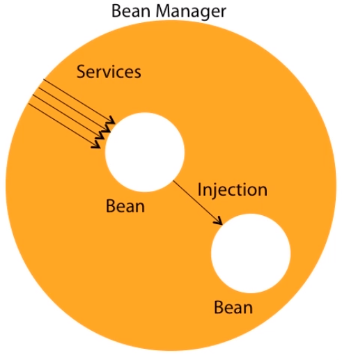

    In terms of code, a CDI Bean is just a Java class with optional annotations. This container brings a certain set of services, one of them being dependency injection. CDI is built on the concept of loose coupling and strong typing, meaning that beans are loose coupled, but in a strongly typed way. The container's job is to inject references into these loosely coupled beans. Decoupling goes further by bringing interceptors, decorators, events and context management to these beans.

    It is also important to understand what CDI is not. CDI is not a full Java EE container. This means that we cannot run servlets or REST web services inside a CDI container, for example. Each container brings a certain set of services. A servlet container brings some services and CDI other services. For example, a CDI does not bring any HTTP support or transactional management. The good news is that CDI has an extension API. It's a way to extend the container capabilities in a portable way.

    - A brief of history of CDI

        In fact, depedency injection solutons have been around for a long time, even before Java. There were all sorts of commercial and open source products in the Java ecosystem such as Spring, JBoss Seam, Guice. All these frameworks where successful, but were never standardized. In 2009, CDI 1.0 (Java EE 6) was born with a very strongly typed approached and adopted many JBoss Seam design principles. It was bundled in Java EE 6. Since then CDI has been updated to 1.1 to be included in Java EE 7 and had a maintaince release in 2014. Today, the specification of CDI 2.0 has just started and will be bundled into Java EE 8.

        But what is CDI?
        - First of all, it's a specification. It means that it went through the Java Community Process to be standardized. It's what we call a Java specification request, a document that specifies what CDI is and how it should work. In the case of CDI 1.1, it's the JSR 346, and it can be found on the JCP website. But of course CDI can not just be a specification in an API. It needs a runtime, which implements the specifications, so we can actually use it in our applications. 
        
        - Now, CDI has three implementations, Weld, also called the reference implementation, Apache OpenWebBeans, and CanDI. The three implement the specification and are interchangeable. We can use one or the other. That's one good thing with standards. There is no vendor locking. At this point, it's worth mentioning DeltaSpike. DeltaSpike is not an implementation of CDI. It's an open source project from Apache that enriches the CDI ecosystem with a number of portable extensions. With this toolbox, we get extra services such as security, configuration, scheduling, declarative queries for JPA and so on. All these build on top of CDI.

    Coming back to CDI and its API, all these classes, interfaces, and annotations leaving several packages.

    |              Package            |                    Description                 |
    | ------------------------------- | ---------------------------------------------- |
    | javax.inject                    | Core dependency injection API                  |
    | javax.enterprise.inject         | Core CDI API                                   |
    | javax.enterprise.context        | Scopes and contextual APIs                     |
    | javax.enterprise.event          | Events and observers APIs                      |
    | javax.interceptor               | Interceptor APIs                               |
    | javax.decorator                 | Decorator APIs                                 |
    | javax.enterprise.util           | CDI utility package                            |

    It's important to say that these implementations and APIs can be used in both Java SE and Java EE.

3. Managing Injection with CDI

    When we talk about a CDI bean, we just mean a Java class that follows certain patterns and this managed by a CDI container. A CDI bean must be a concrete class and must have a default constructor. It can, but does not need to implement any specific interface, extends a specific class, or be annotated.
    
    A CDI bean can have optional:
    - qualifiers
    - scopes
    - expression language name
    - interceptor bindings

    In fact, with a few exceptions, potentially every Java class that has a default constructor is a CDI bean. For example, this ```IsbnGenerator``` class does not extend anything, is not annotated, but is a CDI bean when the CDI container manages it. Then, we can add optional CDI annotations to bring a type-safe dependency injection, interception, decoration, or to use a CDI bean in expression language. CDI beans have another particularity, their lifecycle. The lifecycle of a POJO is pretty simple. As Java developers, we create an instance of a class using the new keyword and wait for the garbage collector to get rid of it and free some memory. It is slightly different with CDI beans though. CDI beans run inside a container and are managed by this container. The container is the one creating the instance with a ```new``` keyword, not us. It also gets rid of this instance. 

    The container manages the lifecycle of the CDI bean and gives us a handle after constructing an instance and before destroying it.

    - Lifecycle of a CDI bean

        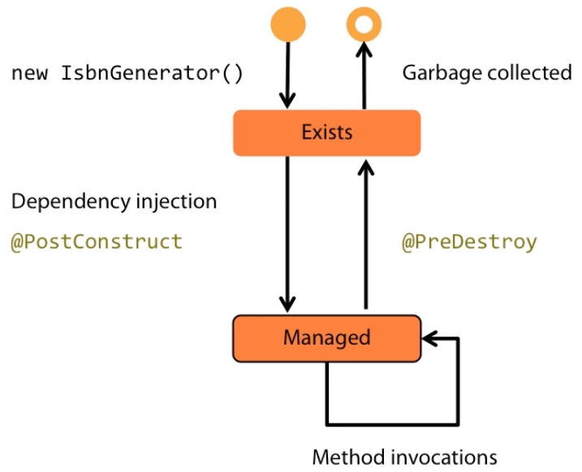

        The state diagram shows the life cycle of a CDI bean. When we invoke a method, the container creates a new instance of the bean. It then exists in memory, but we can't use it yet, and the method is not invoked yet. If the newly created instance uses dependency injection, the container injects all the needed resources. If the instance has a method annotated with ```@PostConstruct```, the container invokes this annotated method. That's where we can add initializing code, if needed. Finally, the bean instance processes the method invocation. When the container does not need the instance anymore, it invokes the method annotated with ```@PreDestroy```, if any, and ends the lifecycle of the bean instance. These annotations are called Callback annotations.

    - Callback annotations

        CDI beans may use the ```@PostConstruct``` and ```@PreDestroy``` annotations to identify methods to be called back by the container at the appropriate points in the bean's lifecycle. These annotations can be added to public, private, protected, or package-level access method, but must not be static or final. If something goes wrong while executing the business logic, these methods can throw unchecked exceptions, but not checked exceptions.

        ```java
        public class IsbnGenerator {

            private int postfix;

            @PostConstruct
            private void init() {
                this.postfix = Math.abs(new Random().nextInt());
            }

            public String generateNumber() {
                return "13-84356-" + postfix++;
            }

        }
        ```

        With above code, we have ```init()``` method is annotated with ```@PostConstruct```, it means that the ```init()``` method will get called just after the container has constructed a bean and before the ```generateNumber()``` method is invoked.

        Now that we have a CDI bean, how do we inject it into another one? That's pretty easy. Take any other CDI bean, like a ```BookService```, whose job is to create a book. ```BookService``` needs an implemenation of a ```NumberGenerator``` interface to generate a number. Because both classes are treated as CDI beans, we can just use the annotation ```@Inject``` to inject a reference of ```NumberGenerator```. The attribute annotated with ```@Inject``` becomes an injection point. The CDI runtime will then do all the plumbing of dependency injection, but the ```NumberGenerator``` is just an interface. To inject a reference of IsbnGenerator, we might think that ```@Inject``` would take a string to differentiate between the ```ISBN``` or ```ISSN``` implementations. This is not the case. Instead of using strings, CDI prefers a more type-safe approach using annotations, also called qualifiers.
        
        ```java
        @Qualifier
        @Retention(RUNTIME)
        @Target({ FIELD, TYPE, METHOD, PARAMETER })
        public @interface ThirteenDigits {
        }

        public class BookService {
            @Inject
            @ThirteenDigits
            private NumberGenerator generator;

            public Book createBook(String title) {
                return new Book(title, generator.generateNumber());
            }
        }

        @Inject
        BookService bookService;
        ```

        Nearly every Java EE specification has an optional XML deployment descriptor. It usually describes how a component module or application should be configured. With CDI, the deployment descriptor is called beans.xml and is also optional. It can be used to configure certain functionalities, such as alternatives, decorators, or interceptors.

    - Bean discovery

        When an application is started, the CDI container performs Bean Discovery. This is the moment where the container searches for beans in all bean archives in the application classpath. During bean discovery, the container detects definition errors and deployment problems. If any exception is raised, the deployment is cancelled, and the application is unavailable. If no problem is found, all the injection points are referenced and the application is up  and running.
        
        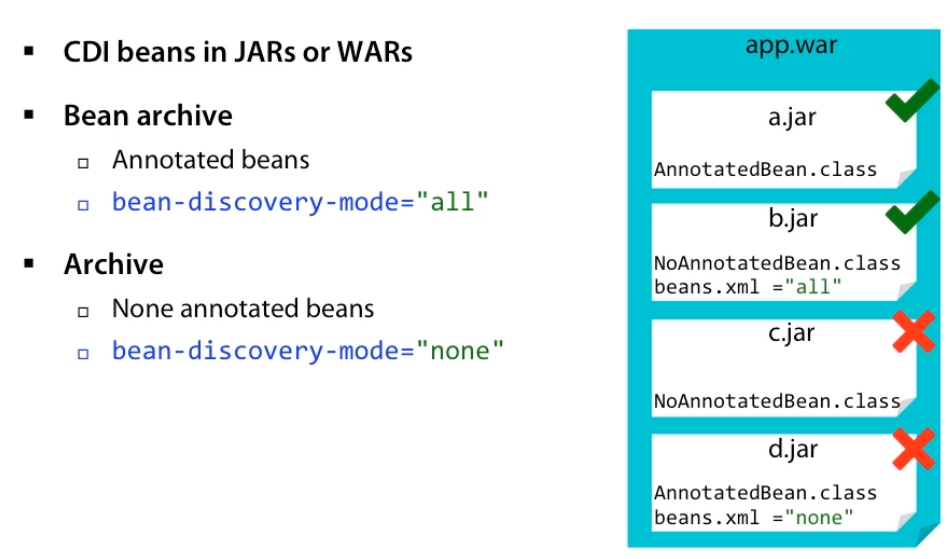

        There is another important concept to understand here. It's that bean discovery is only made in bean archives. CDI does not define any special deployment archive. We can package CDI beans in JARs or WARs, however, CDI discovers beans that are packaged following certain rules. We call that a bean archive. A bean archive is any archive that packages Java classes annotated with CDI annotations. For example, if a.jar packages a class that contains a CDI annotations, this class is said to be an annotated bean. Therefore, a.jar is said to be a bean archive. The another case is when we have a bean XML deployment descriptor with the bean discovery-mode set to all.

        Here b.jar packages a non-annotated bean, but because there is a beans XML file, b.jar is said to be a bean archive. On the other hand, any other packaging is said to be an archive. The common case is when the archive does not contain any annotated beans and has no beans XML descriptor. Here c.jar does not contain any of those. It is not a bean archive. The last scenario is when the bean-discover-mode is set to none, meaning that we tell CDI is no to discover any beans in this archive.

        Here d.jar can package CDI beans, but if we explicitly set the discovery-mode to none, then d.jar would not be considered archive.

4. Where can we use CDI

    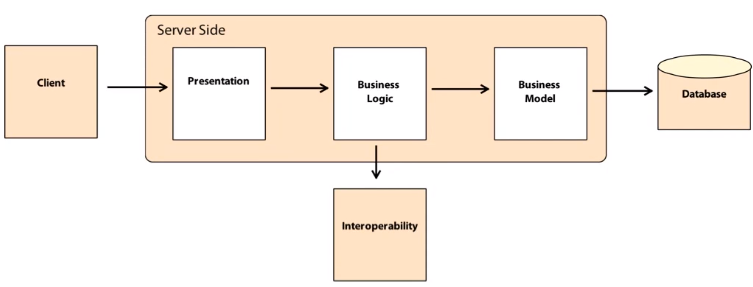

    An above image is used to describe a typical tiered application.

    - In the business model layer, it's usually where we find our persistence object, for example, ```Book```.

        ```java
        @Entity
        @EntityListener(Validation.class)
        public class Book {
            
            @Id
            @GeneratedValue
            private Long id;

            private String title;
        }
        ```

        This is where our JPA entities leave and get mapped to a relations database. Because JPA entities cannot be treated as CDI beans, entities are the only place in our architecture where CDI cannot be directly applied. But an entity can have a set of entity listeners, and these listeners are considered CDI beans and therefore can use all the CDI APIs. Same with bean validation constraints that can use CDI. 
        
    - The Business Logic layer orchestrates the calls to our internal and external services and also to our domain model, so the Business Logic layer is the typical place where CDI will be used for injection, interception, decoration, event handling, and so on.

        ```java
        public class BookService {
            @Inject NumberGenerator generator;

            public Book createBook(String title) { ... }
        }
        ```

    - In Java EE, the presentation layer would typically be deadlocked with JSF, Java Server Faces. JSF is a backend technology that binds these graphical components to backend beans and renders HTML pages. JSF backend beans will be bound to JSF pages using the CDI-named annotation and a CDI scope.

        ```java
        @Named
        @SessionScoped
        public class BookBean {
            private BookService bookService;

            private String createBook(String title) { ... }
        }
        ```

        Then inside this backend bean dependency injection can be used like any other bean. CDI can not be used in web browsers because they run HTML, Javascript, and not Java. That's why JSF is needed to invoke a Java backend and render HTML. But if our application uses a Java client, such as Swing or Native Android Application, then CDI and CDI runtime can be used to inject objects.
        
        ```java
        public class BookComponent {
            @Inject
            private BookService service;

            public void displayBook() { ... }
        }
        ```
        
        Often, enterprise applications need to exchange data with external partners and external systems. These business-to-business applications receive data, process them, store them, and send them back to their partner often in XML or JSON format. That's where we'll find SOAP web services or REST web services. Both we can use CDI APIs and dependency injection.

        ```java
        @Path("/book")
        public class BookEndpoint {

            @Inject
            private BookService service;

            @GET
            public List<Book> getAllBook() { ... }
        }
        ```

    So, as a recap, in an n-tier application CDI is used in the Business Model tier, in EntityListeners, and bean validation constraints. The Business Logic tier manipulates a CDI extensively, as well as a JSF backend beans and web services.

    In fact, context and dependency injection is becoming a common ground for several specifications in Java EE. It gives more coercion to the platform, kneads together the web tier and transactional tier, brings dependency injection to every component.

<br>

## Injection with CDI
1. Basic Dependency Injection

    CDI gives us the ability to inject objects into an application in a type-safe way bringing loose-coupling and strong typing. Let's see the below example.

    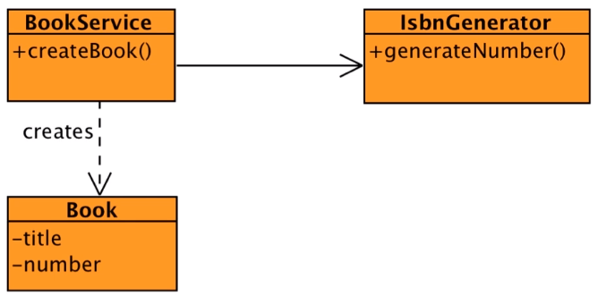

    ```java
    public class BookService {

        // field injecion point
        @Inject
        private IsbnGenerator generator;

        // constructor injection point
        @Inject
        public BookService(IsbnGenerator generator) {
            this.generator = generator;
        }

        // setter property injection point
        @Inject
        public void setGenerator(IsbnGenerator generator) {
            this.generator = generator;
        }
    }
    ```

    The ```@Inject``` annotation defines an injection point that is injected during bean instantiation. Injection can occur via three different mechanisms, property, setter, and constructor.

    With injection for field, CDI can access and injected field directly, event if it's private. With constructor, the rule is that we can only have one constructor injection point. 

    Remember that in a managed environment like CDI, the container is the one doing all the injections work. It just needs the right injection points.

    And for injection to work, there is still a piece of information missing, a deployment descriptor. For those of you know Java EE, you are aware of each specification has an optional XML deployment descriptor. It usually describes how a component, module, or application should be configured. With CDI, the deployment descriptor is called ```beans.xml``` and is also optional. It can be used to configure alternatives, interceptors, decorators.

    ```xml
    <?xml version="1.0" encoding="UTF-8"?>
    <beans xmlns="http://xmlns.jcp.org/xml/ns/javaee"
        xmlns:xsi="http://www.w3.org/2001/XMLSchema-instance"
        xsi:schemaLocation="http://xmlns.jcp.org/xml/ns/javaee 
                            http://xmlns.jcp.org/xml/ns/javaee/beans_1_1.xsd"
        version="1.1" bean-discovery-mode="all">
        ...
    </beans>
    ```

    Bean discovery is basically CDI looking for all the beans it needs to manage. If the ```bean-discovery-mode```'s value is ```all```, CDI will turn all the POJO it finds into CDI beans. If the value is ```none```, then no bean will be found and, therefore, will not be injectable. The default ```bean-discovery-mode``` for bean archive is ```annotated```. This means that any POJO annotated with the CDI annotation is a CDI bean.

    We can refer to this [link](https://docs.oracle.com/javaee/7/tutorial/cdi-adv001.htm) to understand more about how to configure CDI beans by deployment descriptor.

    If we are using interface and one implementation, like that:

    ```java
    public interface NumberGenerator {
        String generateNumber();
    }

    public class IsbnGenerator implements NumberGenerator {
        public String generateNumber() {
            return "13-84356-" + Math.abs(new Random().nextInt());
        }
    }

    public class BookService {

        @Inject
        private NumberGenerator generator;

        public Book createBook(String title) {
            return new Book(title, generator.generateNumber());
        }

    }
    ```

    Now, we find that BookService class depends on the interface NumberGenerator, not the implementation. A simple @Inject will inject the right dependency. CDI quite clever as it needs to find out which implementation it should inject instead of the interface.

2. Qualifiers

    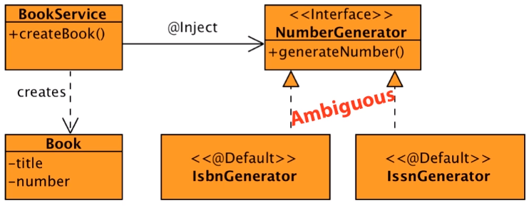

    In the previous sections, we have the NumberGenerator interface that has two implementations, IsbnGenerator that generates a 13-digit ISBN number and IssnGenerator that generates an 8-digit ISSN number. So, which implementation will the BookService get injected?  None, actually. CDI will consider this injection as ambiguous, will not deploy the application, and will throw an exception.

    At system initialization, the CDI runtime must validate that exactly one bean satisfies each injection point meaning that if two implementation of NumberGenerator were valuable the container would inform of an unsatisfied dependency and will not deploy the application. The only way to solve this problem is by using qualifiers.

    - Default qualifier

        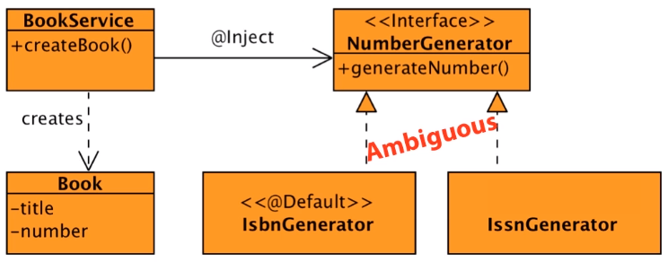

        Whenever bean or injection point does not explicitly declare a qualifier, CDI assumes that qualifier default. In fact, this class diagram is similar as having the ```IsbnGenerator``` implementation annotated with ```@Default```, the IssnGenerator as well, as well as the injection point. Default is a built-in qualifier that informs CDI to inject the default bean implementation. If we define a bean with no qualifier, the bean automatically has the qualifier default.

        In the above diagram, both implementations has the same qualifier @Default. That's why the dependency is ambiguous. So how could the BookService choose between these two implementations? Most injection frameworks heavily rely on external XML configuration to declare and inject beans, but not CDI.

        To solve this ambiguous dependency, the idea is to have different qualifiers, a different one on each implementation. That's when we need to create our own qualifier and give them a specific name that suits our business. In this case, we've chosen to create a qualifier called ```@ThirteenDigits``` to qualify the IsbnGenerator implementation and ```@EightDigits``` for IsbnGenerator. Then, if we need to inject the IsbnGenerator, we qualify the injection point. 

        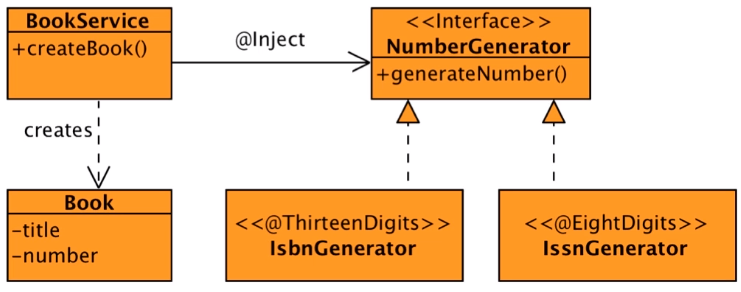

        A CDI qualifier is basically a Java annotation. This annotation defines a ```Target``` - ```METHOD```, ```FIELD```, ```PARAMETER```, and ```TYPE```, and ```Retention``` that needs to be ```RUNTIME```.

        The only difference between an annotation and a CDI qualifier is the extra Qualifier annotation. A qualifier represents some semantics associated with a type that is satisfied by some implementation of that type. It is a user-defined annotation and can be called whatever we want. We could introduce a qualifier to represent a ThirteenDigits generator or EightDigits generator.

        ```java
        @Target({ TYPE, METHOD, PARAMETER, FIELD })
        @Retention(RUNTIME)
        @Qualifier
        public @interface ThirteenDigits {
        }

        @Target({ TYPE, METHOD, PARAMETER, FIELD })
        @Retention(RUNTIME)
        @Qualifier
        public @interface EightDigits {
        }
        ```

        The idea is that we can create as many qualifiers as our application needs. Once we have defined the needed qualifiers, they must be applied on the appropriate implementation and injection point.

        ```java
        public interface NumberGenerator {
        String generateNumber();
        }

        @ThirteenDigits
        public class IsbnGenerator implements NumberGenerator {
            public String generateNumber() {
                return "13-84356-" + Math.abs(new Random().nextInt());
            }
        }

        @EightDigits
        public class IssnGenerator implements NumberGenerator {
            public String generateNumber() {
                return "8-" + Math.abs(new Random().nextInt());
            }
        }
        ```

        We use qualifiers to provide various implementation over particular bean type. Then these qualifiers are applied to injection points to distinguish which implementation is required by the client.

        ```java
        public class BookService {

            @Inject
            @ThirteenDigits
            private NumberGenerator generator;

            public Book createBook(String title) {
                return new Book(title, generator.generateNumber());
            }

        }
        ```

        For this to work, we do not need any external configuration or XML. That's why CDI is said to be strongly typed. CDI never relies on string-based identifiers to determine how objects fit together. Instead, CDI uses qualifiers or strongly typed annotation to wire beans together. That's strong typing. 

3. Advanced qualifiers

    In this section, we will assume that we have many implementations of NumberGenerator interface.

    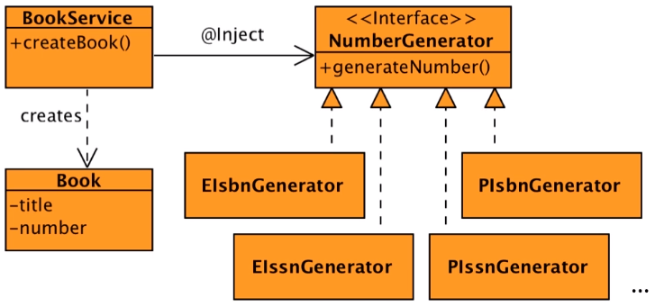

    From an above image, we could just create as many different qualifiers as we have implementations. But if we start creating a qualifier each time we need to inject something, our application will end up being with very verbose with lots of empty qualifiers. That's when qualifiers with members can help us. A qualifier is an annotation, so it can have as many members of any type as needed.

    We will get rid of the ```@ThirteenDigits``` and ```@EightDigits``` qualifiers and replace them with a more generic one called ```@Generator```.

    ```java
    @Target({ FIELD, TYPE, METHOD})
    @Retention(RUNTIME)
    @Qualifier
    public @interface Generator {

        NumberOfDigits numberOfDigits();

        boolean printed();

        public enum NumberOfDigits {
            EIGHT,
            THIRTEEN
        }

    }
    ```

    This ```@Generator``` qualifier has a first member of type ```NumberOfDigits``` that is an enumeration. This allows us to differentiate beans that generate THIRTEEN, or EIGHT digits. The second member is called printed of type boolean. It is set to true to represent a number of printed documents, set to false for electronic ones.

    ```java
    @Generator(numberOfDigits = THIRTEEN, printed = false)
    public class EIsbnGenerator implements NumberGenerator {
        ...
    }

    @Generator(numberOfDigits = EIGHT, printed = false)
    public class EIssnGenerator implements NumberGenerator {
        ...
    }

    @Generator(numberOfDigits = THIRTEEN, printed = true)
    public class PIsbnGenerator implements NumberGenerator {
        ...
    }

    @Generator(numberOfDigits = EIGHT, printed = true)
    public class PIssnGenerator implements NumberGenerator {
        ...
    }
    ```

    Each implementation is uniquely defined to the values of the qualifer. The way we use qualifiers with members on injection points does not change. The injection point will qualify the needed implementation by setting the annotation members.

    ```java
    public class BookService {
        @Inject
        @Generator(numberOfDigits = EIGHT, printed = true)
        private NumberGenerator generator;

        public Book createBook(String title) {
            return new Book(title, generator.generateNumber());
        }
    }
    ```

    Another way of qualifying a bean and an injection point when there are many implementations is to specify multiple qualifiers. So we could keep ```ThirteenDigits``` to qualify a 13-digits NumberGenerator and ```EightDigits```, but because this is ambiguous we could create other qualifiers for electronic and printed documents. Again, the idea is that each implementation is uniquely identified so CDI can wire dependencies.

    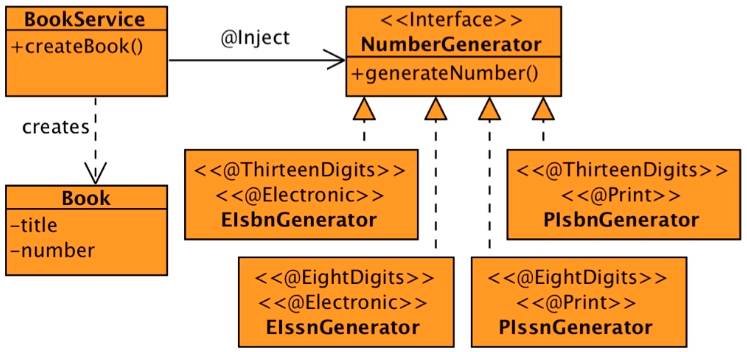


    So, we can look at the following code:

    ```java
    @Target({ TYPE, METHOD, PARAMETER, FIELD })
    @Retention(RUNTIME)
    @Qualifier
    public @interface ThirteenDigits {
    }

    @Target({ TYPE, METHOD, PARAMETER, FIELD })
    @Retention(RUNTIME)
    @Qualifier
    public @interface EightDigits {
    }

    @Target({ TYPE, METHOD, PARAMETER, FIELD })
    @Retention(RUNTIME)
    @Qualifier
    public @interface Electronic {
    }

    @Target({ TYPE, METHOD, PARAMETER, FIELD })
    @Retention(RUNTIME)
    @Qualifier
    public @interface Print {
    }
    ```

    Remember that qualifiers should be meaningful. Having the right names and granularity of qualifiers is important for the understanding of an application. As for our four implementations, they all get annotated with a pair of qualifiers. Then only a bean that has both qualifiers annotations will be eligible for injection.

    ```java
    @ThirteenDigits
    @Electronic
    public class EIsbnGenerator implements NumberGenerator {
        ...
    }

    @EightDigits
    @Electronic
    public class EIssnGenerator implements NumberGenerator {
        ...
    }

    @ThirteenDigits
    @Electronic
    public class PIsbnGenerator implements NumberGenerator {
        ...
    }

    @EightDigits
    @Electronic
    public class PIssnGenerator implements NumberGenerator {
        ...
    }
    ```

    So, in BookService class, we will use ```@Inject``` annotation and some qualifiers to identify exactly our bean.

    ```java
    public class BookService {
        @Inject
        @ThirteenDigits
        @Electronic
        private NumberGenerator generator;

        public Book createBook(String title) {
            return new Book(title, generator.generateNumber());
        }
    }
    ```


4. Veto

    Depending on the beans.xml deployment descriptor, CDI processes:
    - all the annotated beans with ```beans-discovery-mode="annotated"```
    - all the beans with ```beans-discovery-mode="all"```
    - none of them with ```beans-discovery-mode="none"```

    This all or none policy is fine, but sometimes we need a finer grain of tuning. From CDI 1.1, we can now veto a bean on entire package.

    With a simple ```@Vetoed``` annotation, we can prevent the processing of a single class or the classes in a package. Now to understand how we use veto, we go back to the previous example of ambiguous dependency.

    The IsbnGenerator and IssnGenerator have no specific qualifers, so they are both annotated with a qualifier ```@Default```. CDI doesn't know which implementation to inject. The dependency is ambiguous. CDI does not even deploy the code. That's because in the beans.xml, we asked CDI to discover all the beans. 
    
    ```java
    beans-discovery-mode="all"
    ```

    It introspects our bean archive, discovers both IsbnGenerator and IssnGenerator, and find it's ambiguous. But what if CDI could only discover one bean? That's the role of veto.

    It we take one implementation, let's say IsbnGenerator, and mark it with ```@Vetoed```, then CDI doesn't discover it. There's no more ambiguous dependency because there is only one implementation that can be injected now, IssnGenerator.

    ```java
    @Vetoed
    public class IsbnGenerator implements NumberGenerator {
        public String generateNumber() { ... }
    }

    public class IssnGenerator implements NumberGenerator {
        public String generateNumber() { ... }
    }
    ```

    So, in BookService class, we does not specify any qualifier.

    If we want to hide an entire package, we use the special Java package-info class. Here it's in our package, jut by adding ```@Vetoed``` to this class, CDI will not try to discover the beans under this package.

    ```java
    @Vetoed
    package com.manhpd.demo;

    import javax.enterprise.inject.Vetoed;
    ```

5. Alternatives

    In the previous section, we've learn about qualifier that let us choose between multiple implementations of an interface at deployment time in a type-safe manner, but sometimes we want to inject an implementation depending on a particular deployment scenario. For example, we may want to use a mock NumberGenerator, but only in a testing environment. That's when we can use alternatives.

    Alternatives are bean annotated with a special qualifier ```@Alternative```, which are by default disabled. We need to enable alternatives in the beans.xml descriptor to make them invaluable for instantiation and injection.

    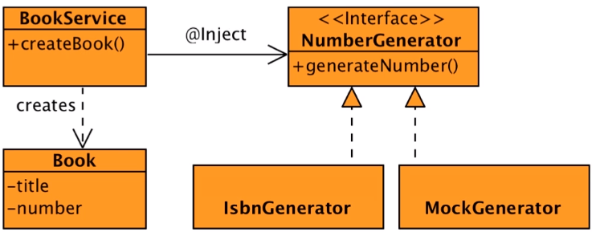

    In this diagram, the NumberGenerator interface only has one implementation, the IsbnGenerator. A simple ```@Inject``` with no qualifier will inject a reference of the IsbnGenerator into the BookService. If we add a MockGenerator implementation, this dependency would be ambiguous as both implementations use the implicit ```@Default``` qualifier. But what we really want is to use IsbnGenerator and only in testing environment use the MockGenerator.

    For that we just annotate MockGenerator with ```@Alternative``` and enable it in the beans.xml file.

    In terms of code, we still have our NumberGenerator interface, the IsbnGenerator implemenation, and the new MockGenerator implemenation. They both implement the same interface, so nothing new here. In face, we now know that this code is similar to having the ```@Default``` qualifier on both implementations, so we can get rid of it. The novelty is that MockGenerator is annotated with the ```@Alternative``` qualifier meaning that CDI treats it as the default alternative of the NumberGenerator.

    ```java
    public interface NumberGenerator {
        String generateNumber();
    }

    public class IsbnGenerator implements NumberGenerator {
        public String generateNumber() { ... }
    }

    @Alternative
    public class MockGenerator implements NumberGenerator {
        public String generateNumber() { ... }
    }
    ```

    In terms of injection point, nothing changes. Our BookService is not impacted at all. This code injects the default implementation of a NumberGenerator, which is IsbnGenerator because alternatives are disabled by default, so until this point CDI would not inject the Mock implementation.
    
    To enable the Alternative, we need to add it to the beans.xml deployment descriptor.

    It's just a matter of adding the fully-qualified class name of the MockGenerator inside an ```alternatives``` element. We can have several beans.xml files declaring several alternatives depending on our environment, for example, one beans.xml for testing with all the mock alternatives, one for production without any mocks and so on.

    ```xml
    <?xml version="1.0" encoding="UTF-8"?>
    <beans xmlns="http://xmlns.jcp.org/xml/ns/javaee"
        xmlns:xsi="http://www.w3.org/2001/XMLSchema-instance"
        xsi:schemaLocation="http://xmlns.jcp.org/xml/ns/javaee 
                            http://xmlns.jcp.org/xml/ns/javaee/beans_1_1.xsd"
        version="1.1" bean-discovery-mode="all">
        
        <alternatives>
            <class>com.manhpd.injection.MockGenerator</class>
        <salternatives>
    </beans>
    ```

<br>

## Bringing the Web Tier and Service Tier together
1. Java EE Tiered architecture

    Java EE bundles several technologies allowing us to create any kind of architecture from web application, REST interfaces, batch processing, asynchronous messaging, persistence, and so on. All these applications can be organized in several tiers, Presentation, Business Logic, Business Model are interoperating with external services.
    
    
    
    Depending on our needs, any kind of architecture is possible from stateful to stateless, from flat-layering to multi-tier except that the web-tier and service-tier are their own paradigm, their own language. That's why CDI is important to bring them together. Except for the HTML on the web client and the database definition language for the database, most of Java EE uses Java as its primary language, and therefore, we find Java in most application tiers.
    
    JPA entities in the business model are a simple bean on the Business Logic tier.
    
    We even use Java as part of our Presentation tier. JSF backing beans are written in Java.

    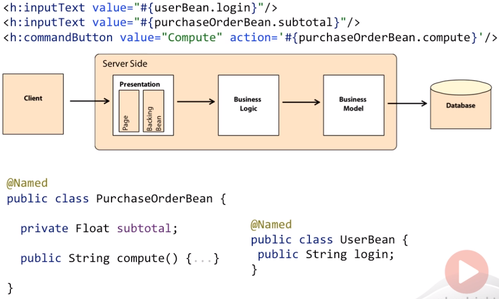

    Java is the primary language it's because JSF pages are written using Facelets, an Expression Language. Expression Language, also referred to as EL, provides an important mechanism for enabling the presentation layer to communicate with the application logic. It is used by both JavaServer Faces and JavaServer Pages. Its syntax uses the hash symbol. Expression Language uses simple expressions to dynamically access data from components.  

    To bind both, Java and Expression Language, CDI comes to the rescue with a ```@Named``` annotation. It basically gives a name to a CDI bean so it can be bound in Expression Language. Binding is the minimum required for the Presentation tier to access the service tier. CDI goes further by managing the state of a bean for us.

    On the top right corner of our web application, we need to display the login of the user. We want this information to remain until the session of the user ends. For that, CDI uses scopes. We just annotate UserBean with ```@SessionScoped``` and CDI will manage the state by destroying the bean only when the session ends.

    ```java
    @SessionScoped
    @Named
    public class UserBean {
        public String login;
    }

    @RequestScoped
    @Named
    public class PurchaseOrderBean {
        private Float subTotal;

        public void compute() { ... }
    }
    ```

    On the other hand, computing and displaying the total of a purchase order should be done each time the page is refreshed, so the scope of the PurchaseOrderBean must be shorter than the session. We can annotate it with ```@RequestScoped```. CDI will maintain the state of the bean only on a per request basis meaning that the bean is stateless.

    With just a few annotations, CDI unifies the web tier and service tier eliminating glue code and letting the developer think about the business problem. CDI defines a uniform model to all our tiers, bringing well-defined context, which is preserved across multiple requests in a user interaction.

2. Binding

    The basic service to bring the web tier and the service tier together is binding. If we want to reference a bean in non-Java code that supports Expression Language such as a JSF page, we must assign the bean an EL name. The EL name is specified using the ```@Named``` built-in qualifier. Then we can easily use the bean in any JSF page through an EL expression.
    
    Expression Language was originally inspired by both ECMAScript and XPath Expression Languages. It was introduced in Java EE to make it easy for web page developers to access and manipulate Java in the backend without having to use Javascript. Expression Language has a very simple syntax. It uses the hash symbol and curly brackets. This evaluates an expression. This expression can be more or less complex, use arrhymthmic operators, lambda expression, and so on.

    ```javascript
    #{expression}

    // Value Expression
    #{purchaseOrderBean.subTotal}
    #{purchaseOrderBean.customer.name}

    // Array Expression
    #{purchaseOrderBean.orders[2]}

    // Method Expression
    #{purchaseOrderBean.compute}

    // Parameterized Method calls
    #{purchaseOrderBean.compute('5')}
    ```

    Without using ```@Named``` annotation, the bean would not have an EL name and, therefore, would not be able to be bound to the page. The ```@Named``` annotation makes it possible to reference the bean from the Expression Language, and its attributes, methods.

    We can let CDI choose a name for us by leaving off the value of the ```@Named``` annotation. The name defaults to the unqualified name decapitalized. But we can specify an argument to the ```@Named``` qualifier to use a non-default name.

    ```java
    @Named("order")
    @ViewScoped
    public class PurchaseOrderBean {
        private Float subTotal = 0F;

        private Float vatRate = 5.5F;

        public String compute() { ... }
    }

    <h:inputText value="#{order.subTotal}" />
    <h:inputText value="#{order.vatRate}" />
    <h:commandLink action="#{order.compute}" />
    ```

3. Producers and Alternatives

    In the previous section, the ```@Named``` annotation allows the binding between an expression and a bean, but coupled with a producer anything can then be referenced in EL.

    For example, we produce an integer, we name it. It can then be referenced in an expression.

    ```@Alternative``` can also be used to switch implementation, not only in Java, but also in Expression Language.

    ```java
    public class NumberProducer {

        @Produces @Vat @Named("vat")
        private Float vatRate = 5.5F;

        @Produces @Vat @Named("vat") @Alternative
        private Float vatRateAlt = 19.6F;

        @Produces @Discount @Named("discount")
        private Float discountRate = 2.25F;

        @Produces @Discount @Named("discount") @Alternative
        private Float discountRateAlt = 4.75F;
    }

    <!-- <h:inputText value="#{vatRate} /> -->
    <h:inputText value="#{vat} />
    <!-- <h:inputText value="#{discountRate} /> -->
    <h:inputText value="#{discount} />
    ```

    If we want to access the vatRate and discountRate bean in EL, we annotate them with ```@Named``` annotation. Be default the EL name is vatRate, so the JSF page just references the vatRate directly without having to prefix the name of the bean.

    Remember that ```@Named``` uses a default name that we can override.

    Now let's say we have a different use case. vatRate and discountRate need to change depending on external configuration. For example, the vatRate is 5.5 in certain countries and 19.6 in others, or the discountRate is usually 2.25 but for Christmas it is said to fall 75%. This is typical use case where alternatives can be used. So, in the above example, we annotate vatRateAlt, discountRateAlt with ```@Alternative``` annotation.

4. State manangement

    We're all used to the concept of HttpSession or HttpRequests. These are two examples of a broader problem of managing state that is associated with a particular context. This has to ensure that all the needed cleanup occurs when the context ends meaning that when the HttpSession ends it needs to be cleaned up.

    Traditionally, the state management is implemented manually by getting and setting servlet session and request attributes. CDI takes the concepts of state management much further as it applies it to the entire application, not just to the HTTP layer. Plus, it does this in a declarative way. A single annotation and the state of the bean is managed by the container. No more memory leaks when the application fails to clean up. The CDI container does it automatically. CDI extends the context modelling defined by the server specification, application, session, request, conversation. It then applies it to the entire business logic, not just the web tier.

    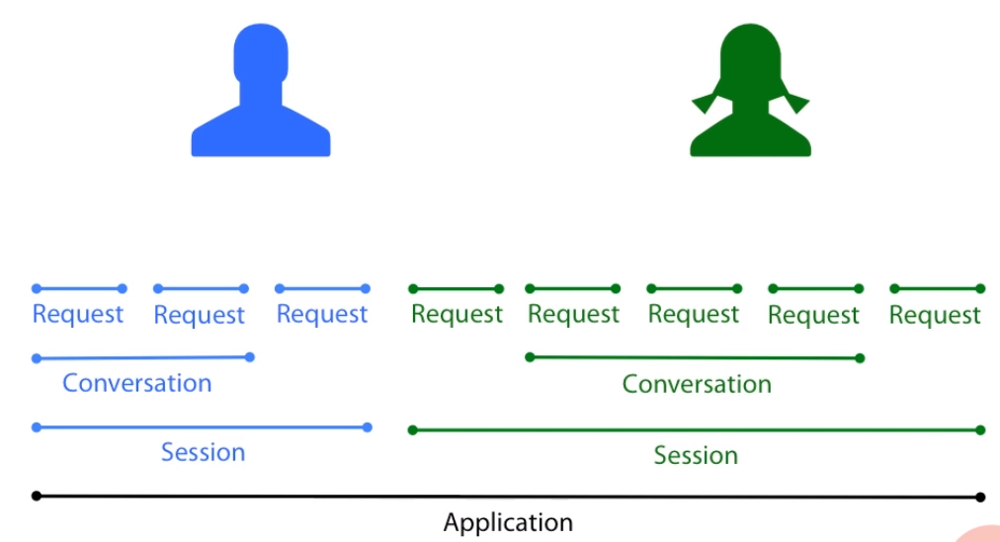

    For example, let's say we have an application, which life spans for several months. We boot the server, leave it up and running for a few months before we shut it down. In this case, the application scope lasts for a very long time. One user logs on and remains logged in a few minutes. The session scopes spans for the moment it logs in until the moment he logs out.
     
    A second user logs in, but her session stays active for a bit longer. Each session is independent, belongs to a single user, and the lifespan can be totally different. In the meantime, both users click at their own pace. Each click creates requests that is handled on the server. The last scope is the Conversation, and it's slightly different because it can span for as long as needed. It's just a matter of beginning a conversation, which can span several requests and end it. Each user will have his own conversation.
    
    - ```@ApplicationScoped```
        
        Each of those scopes is represented by an annotation. When a bean scope is defined as ```@ApplicationScoped```, this means that only one instance of the bean will exists in the entire application. After bean initialization, every time a client requests an instance of this bean, the container will always provide the same bean instance.

        ```java
        @ApplicationScoped
        public class Cache implements Serializable {

            private Map<Object, Object> cache = new HashMap<>();

            public void addToCache(Object key, Object value) { ... }

            public Object getFromCache(Object key) { ... }

            public void removeFromCache(Object key) { ... }

        }
        ```

        We want this cache to be shared across all users interaction within the application. For that, we just annotate the bean with ```@ApplicationScoped```. This cache will be automatically created by the CDI container when it is needed and automatically destroyed when the context in which it was created ends, that is when the server is shutdown. And if we want this cache to be referenced directly from a JSF page, we just add the ```@Named``` annotation.

        So, ```@ApplicationScoped``` beans live the time of the application and are shared to all users.
    
    - ```@SessionScoped```
        
        When a bean is configured as SessionScoped, this means that an instance of this bean will exist per HttpSession and belong only to the current user. This scope is useful, for example, for modelling a ShoppingCart. Each user has his own list of items, and while he's logged on can add items to the shopping cart and check it out at the end. This instance of ShoppingCart will be automatically created the first time the session is created and automatically destroyed when the session ends. This instance is bound to the user session and is shared by all requests that execute in the context of that session.

        ```java
        @SessionScoped
        public class ShoppingCart implements Serializable {

            private List<Item> cartItems = new ArrayList<>();

            public String addItemToCart() { ... }

            public String checkout() { ... }

        }
        ```

    - ```@RequestScoped```

        When a bean is configured as RequestScoped, this means that an instance of this bean will exist per HttpRequest. These beans usually model services of controllers that have no states and a set of stateless methods. For example, creating a book, retrieving all the book cover images, or the list of books, ... Usually they have a ```@Named``` annotation because they are invoked when pressing a button or a link on a page.
        
        ```java
        @Named
        @RequestScoped
        public class BookService {
            public Book persist(Book book) { ... }

            public List<String> findAllImages() { ... }

            public List<Book> findByCategory(long categoryId) { ... }
        } 
        ```
        
        An object, which is defined as RequestScoped, is created once for every request and do not have to be serializable.

    - ```@ConversationScoped```

        As the name states, ConversationScoped beans are used to represent a conversation between the client and the server. They are used to keep state between multiple requests. CDI beans that are able to live for longer periods of time, such as ```@SessionScoped``` and ```@ConversationScoped```, must implement the ```Serializable``` interface. This is because the container may need to free resources, and it may decide to persist a bean into physical storage.

        Unlike the SessionScoped, the ConversationScoped is demarked explictly by the application.

        For example, let's say we have several web pages that create a wizard to allow a customer to create his profile. For controlling a lifecycle of a conversation, CDI gives us a Conversation API that may be obtained by injection. So when the user starts to create his profile, the conversation is started by calling the begin() method. The user can then go from page to page, go back to the previous page, go to the next page until the conversation ends.
        
        ```java
        @Named
        @ConversationScoped
        public class CustomerWizard implements Serializable {

            @Inject
            private Conversation conversation;

            private Customer customer = new Customer();

            public void initProfile() {
                conversation.begin();
                // ...
            }

            public void endProfile() {
                // ...
                conversation.end();
            }
        }
        ```

        ConversationScoped is the only one that need explictly demarcation. All the other scoped beans are cleaned up by the CDI container. Conversations need to be explictly started and ended or their time out.
        
    - ```@Dependent```

        All the scopes we've just seen are contextual scopes. This means their lifecycle is managed by a container, and any injected reference to the beans are also contextually aware. The CDI container ensures that the objects are created and injected at the correct time. The Dependent scope is not a contextual scope an is actually called a Pseudo scope. Dependent scope is the default CDI bean scope. If a bean does not declare a specific scope, it will be injected as a Dependent scope. This means that it will have the same scope as the bean where it's being injected.

        CDI also provides an additional sort of scope, Dependent. Dependent beans can be annotated with dependent or have no annotation at all, as it's the default. In fact, all the beans that we've seen so far are all dependent because they do not explicitly define a scope. Dependent scope beans will be assigned the same scope as the bean they are being injected into.

        For example, if a Dependent scoped bean is injected into a SessionScoped bean, the injected bean will also be configured as SessionScoped.

        Or if a RequestScoped service injects this IsbnGenerator, then the injected IsbnGenerator will be of RequestScoped. An instance of a dependent bean is strictly dependent on some other object. IsbnGenerator is instantiated when BookService is created and destroyed when BookService is destroyed. We can always use the ```@Dependent``` annotation, but we do not have to as it's the default scope.

        ```java
        @Named  // Use for EL
        @Dependent
        public class IsbnGenerator {
            public String generateNumber() { ... }
        }

        @RequestScoped
        public class BookService {

            @Inject
            private IsbnGenerator generator;
        }
        ```

<br>

## Integration CDI with EJB
EJB - Enterprise Java Beans are server-side components that are mostly used to process business logic in a multi-threaded, transactional, and secure manner. They mostly define methods that are used by other layers.

EJB's can either be:
- stateless

    - Request scope

- stateful

    - Choose from application, session, conversation scope.

EJB's and CDI beans's programming model is very closed. We can use most of the CDI services inside an EJB and just inject an EJB with ```@Inject``` like any other CDI bean.

A stateless EJB is just a Java class with a ```@Stateless``` annotation. Being transactional, this EJB can get an entity manager and use it in the createBook() method to persist a book into a relational database.

```java
@Stateless
@SessionScoped
public class BookService {

    @PersistenceContext(unitName = "myPU")
    private EntityManager em;

    @Inject @Paper(SECOND_HAND)
    private Event<Book> bookEvent;

    @PostConstruct
    private void init() { .. }

    public Book createBook(Book book) {
        bookEvent.fire(book);
        em.persist(book);
        return book;
    }
}
```

Like a CDI bean, an EJB can use lifecycle callback's annotation to process any logic after construction or before destruction. It can also use interception, decoration, or even event handling. As for EntityManager, it's just a matter of producing it, so it can be injected with ```@Inject``` instead of persistence context.

A stateful EJB is also treated like a CDI bean. The difference is that it can hold state. Because of that, stateful EJB's can have a scope. 

- @Transactional

    EJB's are transactional by default, and they used to be the only transactional component in Java EE. But since Java EE 7, transaction management has been implemented using a CDI interceptor binding. So this means that technically the transactional annotation is a CDI interceptor that belongs to the JTA specification. The Java Transaction API is developed under the JSR 907, and we can find more information about it on the jcp.org website. This annotation can be added on a class or on a method, and it provides the application with the ability to control transaction boundaries. And this can be done on any Java EE managed bean meaning a CDI bean, a REST endpoint, a JSF backing bean, or Servlet.

    ```java
    @Transactional
    public class BookService {

        @PersistenceContext(unitName = "myPU")
        private EntityManager em;

        @Inject @Paper(SECOND_HAND)
        private Event<Book> bookEvent;

        public Book createBook(Book book) {
            bookEvent.fire(book);
            em.persist(book);
            return book;
        }
    }
    ```

    If we get rid of Stateless and change it to Transactional, then we get the same behavior. We just lose the extra EJB services.

- Transactional REST Endpoint

    To design RESTful webservice in Java EE, we use the JAX-RS specification, and we just need to add a ```@Path``` annotation to the class. Then, to insert a book into the database, we need a ```@POST``` annotation on the ```createBook()``` method and choose which MIME pipe will be consumed.

    ```java
    @Transactional
    @Path("book")
    public class BookService {

        @PersistenceContext(unitName = "myPU")
        private EntityManager em;

        @Inject @Paper(SECOND_HAND)
        private Event<Book> bookEvent;

        @POST
        @Consumes(MediaType.APPLICATION_XML)
        public Book createBook(Book book) {
            bookEvent.fire(book);
            em.persist(book);
            return book;
        }
    }
    ```

- Transactional Servlet

    As for a transactional servlet, the class needs to extend HttpServlet and be annotated with WebServlet.

    ```java
    @Transactional
    @WebServlet(urlPatterns = {"/TxServlet"})
    public class BookService extends HttpServlet {

        @PersistenceContext(unitName = "myPU")
        private EntityManager em;

        @Inject @Paper(SECOND_HAND)
        private Event<Book> bookEvent;

        @POST
        @Consumes(MediaType.APPLICATION_XML)
        public Book createBook(Book book) {
            bookEvent.fire(book);
            em.persist(book);
            return book;
        }
    }
    ```

    Transaction management is a technical crosscutting concern that has been isolated into a separate interceptor binding. It can now be applied in most of the Java EE components. 

<br>

## Information about CDI's version
1. History of CDI

    - CDI 1.0 in 2009 (Java EE 6)
    - CDI 1.1 in 2013 (Java EE 7)
    - CDI 1.2 in 2014
    - CDI 2.0 in Java EE 8

        CDI brings several additions to the existing 1.1 version. The most relevant are:
        - Providing Asynchronous event execution and Observer ordering
        - Possibility to configure or veto observer methods
        - Alignment on Java 8 features (streams, lambdas, repeating qualifiers)
        - A standard API to boot CDI in a standard Java SE application
        - Ability to apply interceptors on @Producers through a InterceptionFactory
        - Built-in annotation literals addition

        CDI 2.0 will enable also the usage of Java 8 features such ash the ```CompletionStage``` API. The CompletionStage is an interface which abstracts units or blocks of computation which may or may not be asynchronous. In our example, callers of Event.fireAsync (...) will receive a Java 8 ```CompletionStage``` which allows you to react to errors and concatenate multiple calls (future chaining).

2. Interesting information about CDI

    CDI is only specification, not have implementation, like JPA. So, when we use library such as ```javaee-api``` or ```cdi-api``` in maven such as:

    ```xml
    <dependency>
        <groupId>javax</groupId>
        <artifactId>javaee-api</artifactId>
        <version>8.0</version>
        <scope>provided</scope>
    </dependency>

    <!-- OR -->
    <dependency>
        <groupId>javax.enterprise</groupId>
        <artifactId>cdi-api</artifactId>
        <version>2.0</version>
        <scope>provided</scope>
    </dependency>
    ```

    Then, we have to consider about implementations of CDI in Application servers that they can support.
    - CDI is a foundational aspect of Java EE 6. It is or will be shortly supported by Caucho's Resin, IBM's WebSphere, Oracle's Glassfish, Red Hat's JBoss and many more application servers. CDI is similar to core Spring and Guice frameworks. 

    - ```JBoss Weld``` and Apache OpenWebBeans (OWB) are two widely used CDI implementations.

        - ```JBoss Weld``` is integrated in Java EE application servers including ```WildFly```, ```JBoss Enterprise Application Platform```, ```GlassFish```, ```IBM WebSphere Application Server``` (8.5.5 and up), ```Oracle WebLogic``` and others.

            JBoss Weld can also be used in plain servlet containers (```Tomcat```, ```Jetty```) or ```Java SE```.

            Refer to this [link](https://weld.cdi-spec.org/) to understand how to choose WildFly that corresponde with JBoss Weld.

        - ```Apache OpenWebBeans``` (OWB) is integrated in Java EE containers including ```Apache TomEE```, ```Apache Geronimo```, ```IBM WebSphere Application Server```, and ```SiwPas```.

    - CDI implementations are not distributed with Java EE5 application servers or Servlet-only environments such as ```Apache TomCat``` and ```Eclipse Jetty```. You can use CDI in these environments by embedding a standalone CDI implementation. Both ```JBoss Weld``` and ```Apache OpenWebBeans``` can be used for this task; for more information, see the corresponding CDI implementation documentation.

    - ```TomEE``` supports ```Java EE 6```/```CDI 1.0```.

        ```javax.enterprise.inject.spi.CDI``` was introduced in ```Java EE 7```/```CDI 1.1```.

        We can't simply upgrade the spec APIs when the container is based on an older version.

<br>

## Benefits and Drawbacks
1. Benefits
- CDI dependecy injection is the ability to inject classes into others in a type-safe way using annotations, also called qualifiers.
- Managed environment.
- Do not construct depedencies by hand, but can leave the container to inject a reference for us.
- No boiler plate code.
- A simple @Inject annotation on the property informs the container that it has to inject a reference.
- CDI is very powerful.
- More features.


<br>

## Wrapping up
- In fact, CDI can be used anywhere we need to inject classes into other other classes. From single data types to more complex components, CDI can be used in Java SE, Java EE, in the Cloud if we past provider runs Java, or Android.

- Some design patterns that use in CDI
    
    - Dependency Injection
    - Bridge (with alternatives)
    - Factory (with producers)
    - Interceptor
    - Decorator
    - Observer/observable (with events) 

- References

    - CDI 1.1 specification

        - JSR 346
        - [http://jcp.org/en/jsr/detail?id=346](http://jcp.org/en/jsr/detail?id=346)

    - Java EE 7 specification

        - JSR 342
        - [http://jcp.org/en/jsr/detail?id=342](http://jcp.org/en/jsr/detail?id=342)

<br>

Refer:

[Context and Dependency Injection (CDI 1.1)](https://app.pluralsight.com/library/courses/context-dependency-injection-1-1/table-of-contents)

<br>

**CDI Specification and Implementations**

[https://www.jetbrains.com/help/idea/context-and-dependency-injection-cdi.html](https://www.jetbrains.com/help/idea/context-and-dependency-injection-cdi.html)

[https://weld.cdi-spec.org/](https://weld.cdi-spec.org/)

[http://www.mastertheboss.com/jboss-frameworks/cdi/introduction-to-cdi-2-0-api](http://www.mastertheboss.com/jboss-frameworks/cdi/introduction-to-cdi-2-0-api)

[https://deltaspike.apache.org/documentation/cdiimp.html](https://deltaspike.apache.org/documentation/cdiimp.html)

[https://docs.jboss.org/weld/reference/3.0.4.Final/en-US/html_single/#_a_note_about_naming_and_nomenclature](https://docs.jboss.org/weld/reference/3.0.4.Final/en-US/html_single/#_a_note_about_naming_and_nomenclature)