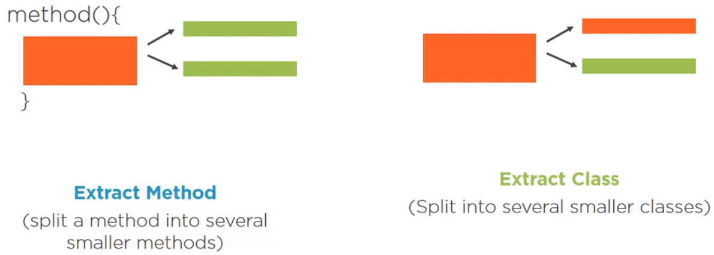
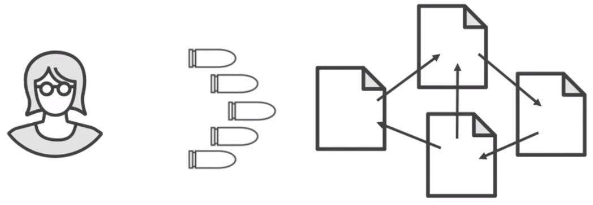
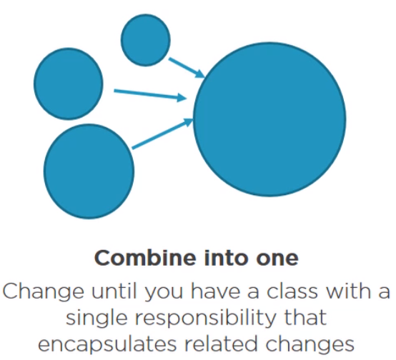
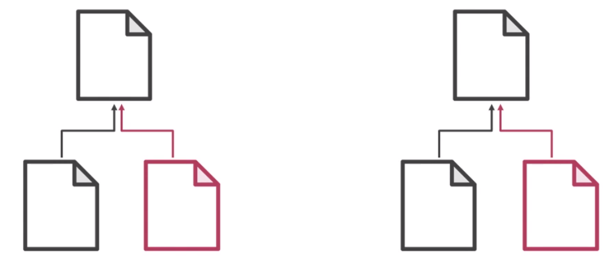
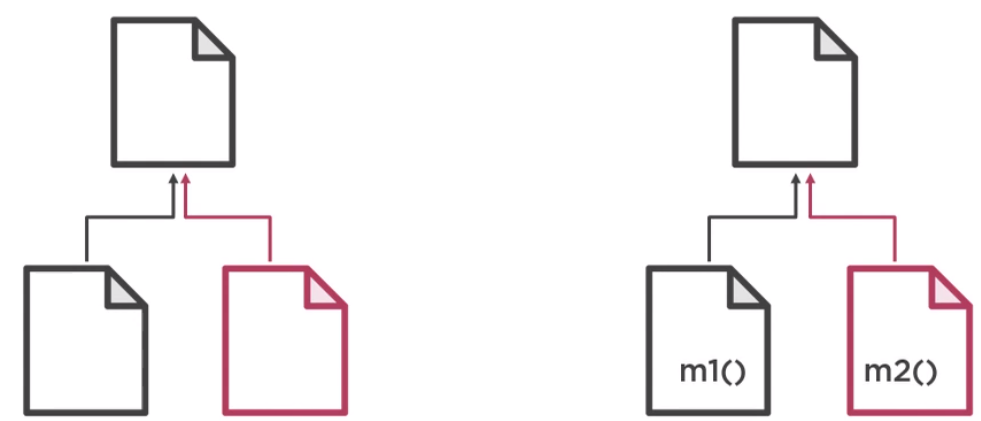
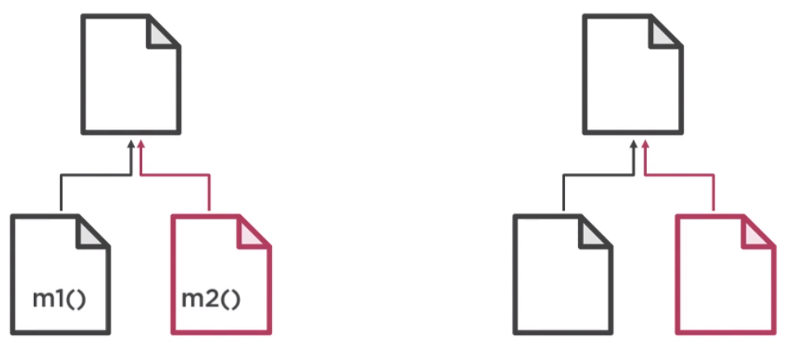
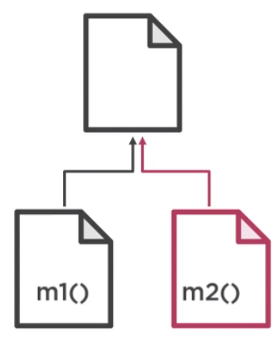
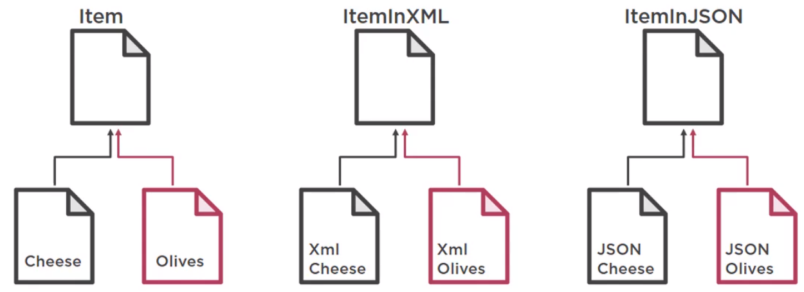

In this article, we will learn how to deal with change preventers. All information of this artice is the content of the course [Java Refactoring: Best Practices](https://app.pluralsight.com/library/courses/java-refactoring-best-practices/table-of-contents).

Let's get started.

<br>

## Table of contents
- [Defining Change Preventers](#defining-change-preventers)
- [Changes to the Project](#changes-to-the-projects)
- [Divergent Change](#divergent-change)
- [Solution sprawl and Shotgun surgery](#solution-sprawl-and-shotgun-surgery)
- [Parallel Inheritance Hierarchies](#parallel-inheritance-hierarchies)
- [Wrapping up](#wrapping-up)

<br>

## Defining Change Preventers

Change Preventers means when code change in one place forces we to change code in many other places. Refactoring is difficult, adding a new feature is also difficult, and we don't want that for obvious reasons. So, this is the list of change preventers that we need to know:
- Divergent change
- Solution sprawl and shotgun survey
- parallel inheritance hierarchies


<br>

## Changes to the Project

For example:

```java
public class SimpleCurrencyConverter {
    private String currencyTo;

    public SimpleCurrencyConverter() {}

    public SimpleCurrencyConverter(String currencyTo) {
        this.currencyTo = currencyTo;
    }

    public double convert(double price) {
        if (currencyTo.equalsIgnoreCase("EUR")) {
            return price * 0.9;
        } else if (currencyTo.equalsIgnoreCase("CAD")) {
            return price * 1.35;
        } else {
            throw new IllegalArgumentException("Unrecognized currency: " + currencyTo);
        }
    }
}
```

We can realize that currency rates change over time and having hard-coded values in our conversion method isn't a very good idea. So our colleagues made some changes and we now pull up to date exchange rates from a web service. So, we have:

```java
public class SimpleCurrencyConverter {

    public double convert(double price) {
        String rates = getCurrencyRate("USD");
        if (currencyTo.equalsIgnoreCase("EUR")) {
            return price * getRate(rates, "EUR");
        } else if (currencyTo.equalsIgnoreCase("CAD")) {
            return price * getRate(rates, "CAD");
        } else {
            throw new IllegalArgumentException("Unrecognized currency: " + currencyTo);
        }
    }

    private double getRate(String rates, String currencyTo) {
        return Double.valueOf(rates.substring(rates.lastIndexOf(currencyTo)).substring(5, 9));
    }

    public String getCurrencyRate(String baseCurrency) {
        HttpClient httpClient = new Builder().build();
        HttpRequest request = HttpRequest.newBuilder()
                                         .uri(URI.create("https://api.exchangeratesapi.io/latest?base=" + baseCurrency))
                                         .build();

        HttpResponse<String> response = null;
        try {
            response = httpClient.send(request, HttpResponse.BodyHandlers.ofString());
        } catch(IOException | InterruptedException e) {
            e.printStackTrace();
        }

        return response.body();
    }
}
```


<br>

## Divergent Change

Divergent change means we have to make several changes in the same class for different reasons. So, we have one class, one thing we want to change or add, but we end up changing code in multiple places.

1. Divergent change issues

    - Requires more typing.

    - Requires additional knowledge of what to change where.

2. How to fix Divergent change

    Typical ways to fix this are extract method or extract class.

    

3. Benefits that we archieved for solving divergent change

    - Reduces code duplication.

    - Simplifies maintaince.

4. Example about divergent change

    Now, we have a new requirement about displaying the currency rates in a side UI widget. But our methods doesn't do printing, it does the conversion and returns the value, and that's used at checkout.

    ```java
    public class SimpleCurrencyConverter {

        private String currencyTo;

        public SimpleCurrencyConverter() {}

        public SimpleCurrencyConverter(String currencyTo) { this.currencyTo = currencyTo; }

        public double converter(double price) {
            if (currencyTo.equalsIgnoreCase("EUR")) {
                return price * 0.9;
            } else if (currencyTo.equalsIgnoreCase("CAD")) {
                return price * 1.35;
            } else {
                throw new IllegalArgumentException("Unrecognized currency: " + currencyTo);
            }
        }

        public double convertWithWebService(double price) {
            String rates = getCurrencyRate("USD");

            if (currencyTo.equalsIgnoreCase("EUR")) {
                return price * getRate(rates, "EUR");
            } else if (currencyTo.equalsIgnoreCase("CAD")) {
                return price * getRate(rates, "CAD");
            } else {
                throw new IllegalArgumentException("Unrecognized currency: " + currencyTo);
            }
        }

        // ...
    }
    ```

    But we want to display rates all the time, so here's an entirely possible scenario. Somebody will copy this entire method, changes the return type to void, and slightly changes the implementation, so that it prints the rates.

    ```java
    public class Converter {

        // ...
        
        public void printUsdRateFor(double price) {
            String rates = getCurrencyRate("USD");

            if (currencyTo.equalsIgnoreCase("EUR")) {
                System.out.println(getRate(rates, "EUR"));
            } else if (currencyTo.equalsIgnoreCase("CAD")) {
                System.out.println(getRate(rates, "CAD"));
            } else {
                throw new IllegalArgumentException("Unrecognized currency: " + currencyTo);
            }
        }
    }
    ```

    The problem is that when we need to add a new currency, we now have to update two places. If we have to support British pounds, we now need to remember to update two places. Otherwise, we'll get an exception. We could try and place this if-else logic into a single method that returns a value, and then call this method from both of these methods. That's one option, but in our case things can be even simpler. This was very careless copy-pasting, so we can simply remove this entire conditional logic and print the rate by using the ```getRate()``` method.

    ```java
    public class Converter {

        // ...
        
        public void printUsdRateFor(String currencyTo) {
            String rates = getCurrencyRate("USD");
            System.out.println(getRate(rates, currencyTo));
        }

        private double getRate(String rates, String currencyTo) {
            return Double.valueOf(rates.substring(rates.lastIndexOf(currencyTo)).substring(5, 9));
        }

        public String getCurrencyRate(String baseCurrency) {
            HttpClient httpClient = newBuilder().build();
            HttpRequest request = HttpRequest.newBuilder()
                                            .uri(URI.create("https://api.exchangerateapi.io/latest?base=" + baseCurrency))
                                            .build();

            HttpResponse<String> response = null;
            try {
                response = httpClient.send(request, HttpResponse.BodyHandlers.ofString());
            } catch(IOException | InterruptException e) {
                e.printStackTrace();
            }

            return response.body();
        }
    }
    ```

    This ```Converter``` class not only does the conversion, it's also an expert in making HTTP calls. That's a lot of responsiblity to bear, especially if we change the web service or we need HTTP functionality elsewhere. So we're going to apply Extract class.

    So, we take all the HTTP code and move it to a dedicated class. Now we have a class that knows how to talk over HTTP.  

    ```java
    public class HttpHelper {

        public String getCurrencyRate(String baseCurrency) {
            HttpClient httpClient = newBuilder().build();
            HttpRequest request = HttpRequest.newBuilder()
                                            .uri(URI.create("https://api.exchangerateapi.io/latest?base=" + baseCurrency))
                                            .build();

            HttpResponse<String> response = null;
            try {
                response = httpClient.send(request, HttpResponse.BodyHandlers.ofString());
            } catch(IOException | InterruptException e) {
                e.printStackTrace();
            }

            return response.body();
        }
    }
    ```

    Then, in ```Converter``` class, we create ```HttpHelper``` object to invoke the ```getCurrencyRate()``` method.

    ```java
    public class Converter {

        // ...

        private HttpHelper httpHelper;

        // ...

        public void printUsdRateFor(String currencyTo) {
            String rates = this.httpHelper.getCurrencyRate("USD");
            System.out.println(getRate(rates, currencyTo));
        }

    }
    ```

<br>

## Solution sprawl and Shotgun surgery
1. Solution sprawl

    Solution sprawl is observed when we see code that is responsible for a single feature is spread across multiple classes. It means a solution is broken into multiple classes or places.

    It is bad because the below is what happens when we have a solution sprawl.

    

    We make a change to a class and we think we're done, so we compile and run, and suddenly we get a NullPointerException or some other exceptions. We debug and find out that the code we changed is coupled in a non-obvious way with code in another class. Both must always be modified together in order to work. So we do that, compile and run again, and we still hit an exception. And the scenario repeats until we find all the places that need to be updated. This process of performing multiple changes in many places to update a single thing is called shotgun surgery.

2. Shotgun surgery

    Unlike with divergent change where changes happen in a single class, shotgun surgery happens when we have to update something and we have to do it in multiple classes or multiple modules.

    Solution sprawl and shotgun surgery address the same problem. The only difference is that we become aware of a solution sprawl by observing it while we become aware of a shotgun surgery by doing it. In other words, a solution sprawl leads to shotgun surgery.

    For our purposes, we're going to use these two terms interchangeably.

    Shotgun surgery issues:
    - Difficult to remember all the interconnected places --> difficult to maintaince, especially if we are new the project and unaware of a lot of things.

    - New team members are likely to make a mistake by forgetting to update one of the places --> causes a lot of bugs.

    How to fix solution sprawl
    - Consolidate the responsibility in a single class. It might be as simple as moving the responsibility and functionality to an existing class, but that may not make sense.

        

        So in that case, create a new class and move all code from different classes to that one place.

    Benefits archieved:
    - Reduced posibility of mistakes (and bugs).

<br>

## Parallel Inheritance Hierarchies

When we have to create a subclass for a class which makes we create another subclass somewhere else, then that is the parallel inheritance hierarchy's code.

This is what it looks like. We have two tree hierarchies. We add a subclass in one tree, but then we need to add another subclass to the second tree. This does not sound too bad if we have just a few subclasses, but this starts to hurt as the number of our child classes grows.



It can be said that this code smell is a special case of shotgun surgery. One change that affects multiple places and forces us to do maintaince all over the place. And thus, the issue with this code smell is very similar as well.
- Making changes becomes harder as the hierarchies grow --> difficult and slow maintaince.

One way to deal with this is to merge class hierarchies.



We move the functionality of one hierarchy into another, essentially apply the move method refactoring.



Then deleting the empty classes.



This is likely to result in another code smell, the large class. So our classes would have several responsibilities, so that's too bad. But if there's no other way, that is the lesser evil, and sometimes that's what we have to do in programming. Not choosing the best way, but choosing the least evil way.

Depending on what or how our parallel trees are structured and coupled, it may be possible to refactor them by applying either the visitor pattern or the bridge pattern, but 

To give us a better feeling of what this could look like in our code, we could have a lot more information in each of our products. For example, their calorie count or country of origin, and because our imaginary online shop has grown substantially, it needs to have JSON and XML representation of each product that it could send over the wire somewhere for some reasons.



And with every new product, we would get two new classes for JSON and XML representation. So this is what kind of maintaince hell we would be looking at with this code smell.

<br>

## Wrapping up
- Classes should be highly coherent to avoid diverent change.

- Solutions should be consolidated to avoid Solution Sprawls.

- Avoid parallel inheritance.

<br>

Refer:

[Java Refactoring: Best Practices](https://app.pluralsight.com/library/courses/java-refactoring-best-practices/table-of-contents)

[https://aboullaite.me/cdi-20-java-se/](https://aboullaite.me/cdi-20-java-se/)

[https://docs.jboss.org/weld/reference/latest/en-US/html/environments.html#weld-se](https://docs.jboss.org/weld/reference/latest/en-US/html/environments.html#weld-se)

[http://www.mastertheboss.com/jboss-frameworks/cdi/building-a-cdi-2-standalone-java-application](http://www.mastertheboss.com/jboss-frameworks/cdi/building-a-cdi-2-standalone-java-application)