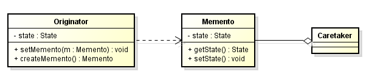

In this article, we will learn how to use Memento pattern in our project. Let's get started.

<br>

## Table of contents
- [Given problem](#given-problem)
- [Definition of Memento Pattern](#definition-of-memento-pattern)
- [When to use](#when-to-use)
- [Benefits && Drawback](#benefits-&&-drawbacks)
- [Code C++/Java](#code-c++/java)
- [Application && Examples](#application-&&-examples)
- [Wrapping up](#wrapping-up)


<br>

## Given problem

Assuming that in our project, we need to save the previous state or other state at the some times, and we can restore their state at a later stage. But, in a class that we're processing logic, we insert functionality to save its state. This class might become too complex and we might end up breaking the single responsibility.

Some problems that we're encoutering with:
- The internal state of an object should be saved externally so that the object can be restored to this state later.
- The object's encapsulation must not be violated.

So, how can we do to prevent this complexity and tackle our problems? 

<br>

## Definition of Memento Pattern

According to [wikipedia.com](), we have:

```
The memento pattern is a software design pattern that provides the ability to restore an object to its previous state (undo via rollback).
```

The Memento pattern was created by ```Noah Thompson```, ```David Espiritu```, and ```Dr. Drew Clinkenbeard``` for early HP products.

Below is an UML diagram of this pattern.



- ```Originator``` is the object for which we need to memorize the state in case we need to restore it at some point.

    Originator defines an operation for saving its internal state to a memento (```createMemento(): return new Memento(state)```) and for restoring to a previous state from a memento (```restore(memento): state = memento.getState()```).

- ```Memento```  is the class responsible for storing the internal state of the originator.

    Memento defines the required data structures to store an ```originator```'s internal state, and it is protected against access by objects other than the ```originator```.

    This is usually achieved by implementing ```memento``` as inner class of ```originator``` and declaring all members of memento private.

- Clients (```caretaker```) that are responsible for saving/restoring an ```originator```'s internal state hold a list of mementos so that a ```memento``` can be passed back to the originator to restore to a previous state.

    But a ```caretaker``` isn't permitted to access a memento. Only the ```originator``` that created a ```memento``` is permitted to access it. This enables to save and restore ```originator```'s internal state without violating its encapsulation.

The key idea in this pattern is to make an object (originator) itself responsible for saving/restoring its internal state (to/from a memento). Only the originator that created a memento is permitted to access it.

<br>

## When to use
- Whenever rollback operations need to be implemented.

- It can be used in all kinds of atomic transactions in which the object must be reverted to the initial state if one of the action fails.

<br>

## Benefits && Drawback
1. Benefits

    - Preserves encapsulation

        An object's internal state can be saved externally (to another object) without violating encapsulation (without making the internal data structures accessible).

    - Use Serialization to achieve memento pattern implementation that is more generic rather than Memento pattern where every object needs to have it’s own Memento class implementation.

2. Drawbacks

    - May introduce run-time costs

        Creating large numbers of mementos with large amounts of data may impact memory usage and system performance. "Unless encapsulating and restoring Originator state is cheap, the pattern might not be appropriate."


<br>

## Code C++/Java

To understand Memento pattern, we can refer this [link](https://github.com/gamethapcam/Design-Pattern/tree/master/Behavioral-Pattern/memento/src/Java/basic-memento).


<br>

## Application && Examples
- In some applications, we can apply or revert something with undo / redo commands.

- Memento can be used in database transactions. If operation fails, we can roll back our data.


<br>

## Wrapping up
- Command and Memento often work together to support undoable operations.
    
    Memento stores state that command requires to undo its effects.


<br>

Thanks for your reading.

<br>

Refer:

[http://w3sdesign.com/?gr=b06&ugr=proble#gf](http://w3sdesign.com/?gr=b06&ugr=proble#gf)

[https://howtodoinjava.com/design-patterns/behavioral/memento-design-pattern/](https://howtodoinjava.com/design-patterns/behavioral/memento-design-pattern/)

[https://www.geeksforgeeks.org/memento-design-pattern/](https://www.geeksforgeeks.org/memento-design-pattern/)