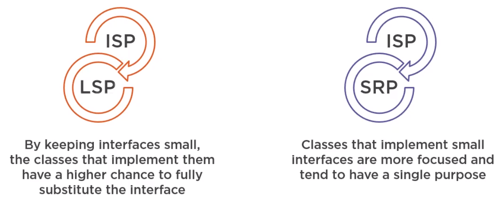

In this article, we will introduce about the Liskov Substitution Principle.

Let's get started.

<br>

## Table of contents
- [Interface Segregation Principle](#interface-segregation-principle)
- [Identifying fat interfaces](#identifying-fat-interfaces)
- [Refactoring code that depends on large interfaces](#refactoring-code-that-depends-on-large-interfaces)
- [Benefits](#benefits)
- [Wrapping up](#wrapping-up)


<br>

## Interface Segregation Principle

The Interface Segregation Principle states that:

```
Clients should not be forced to depend on methods (inherit from or implement) that they do not use.
```

We have to split interfaces that are very large into smaller, more focused interfaces so that clients that use them will not be forced to depend on things that they do not need. In the interface segregation principle, the word **interface** does not necessarily mean a Java interface. Most of the time, this is the case. However, the interface segregation principle also applies for abstract classes or, in fact, any public method that our own class depends upon.

The nice thing about the interface segregation principle is that it reinforces other SOLID principles.



<br>

## Identifying fat interfaces
1. Interfaces with many methods

    Let's take a look at an example.

    ```java
    public interface LoginService {
        void signIn();
        void signOut();
        void updateRememberMeCookie();
        User getUserDetails();
        void setSessionExpiration(int seconds);
        void validateToken(Jwt token);
        // ...
    }
    ```

    Each time we see an interface that has a lot of methods, it might be a good indicator that we might need to break it down into smaller interfaces.

    Assume that we want to create a class called GoogleLoginService which implements the LoginService interface.

    ```java
    public class GoogleLoginService implements LoginService {
        // ...

        public void updateRememberMeCookie() {
            throw new UnsupportedOperationException();
        }

        public void setSessionExpiration(int seconds) {
            throw new UnsupportedOperationException();
        }
    }
    ```

    However, because the authentication is handled by Google, we might need to implement just signIn() and signOut() methods. Methods like updateRememberMeCookie() or setSessionExpiration() are not valid in the context of a Google authentication. Therefore, we throw a UnsupportedOperationException and not implement them.

    This is a problem because the GoogleLoginService class violates the interface segregation principle and also the Liskov Substitution principle. So pay attention when we have large interfaces. They might force us to create classes that do not fully support them.

2. Interfaces with low cohesion

    Cohesion refers to the purpose of a particular component. When all the methods are aligned with the overall purpose of that component, then we say that those methods are cohesive. 

    ```java
    public interface ShoppingCart {
        void addItem(Item item);
        void removeItem(Item item);
        void processPayment();
        bool checkItemInStock(Item item);
    }
    ```

    With above example, we find that processPayment() and checkItemInStock() do not conceptually belong to a shopping cart. They probably belong to a payment processor or a stock verify service. So, this interface and the methods within it are not cohesive.

    We do not have unnecessarily a lot of methods. Just four methods is not a large number. But the methods are not cohesive with the overall purpose of the interface. And when we try to implement it, we create a class called ShoppingCartImpl, and we are forced to implements those two methods. And for processPayment(), we're not going to throw an exception. We're actually going to implement it, so we need to bring a lot of dependencies such as PaymentService, UserService, EmailService, ... We effectively increased coupling a lot because we are forced to provide an implementation for the processPayment() method when all we wanted was a ShoppingCartImpl.

    ```java
    public class ShoppingCartImpl implements ShoppingCart {
        public void processPayment {
            PaymentService ps = new PaymentService();
            ps.pay(this.totalAmount);
            User user = UserService.getUserForTransaction();
            EmailService emailService = new EmailService();
            emailService.notify(user);
        }
    }
    ```

    Although this class does not violate the ISP because if fully implements that interface, it does, however, violate the single responsibility principle because now ShoppingCart has more responsibilities that it has to.

    Cohesion was also affected because ShoppingCart is now responsible for doing other things besides its main focus, keeping track of items added to the basket.

3. Not just about interfaces

    We can have the same problems with abstract classes.

    ```java
    public abstract class Account {
        abstract double getBalance();
        abstract void processLocalPayment(double amnt);
        abstract void processInternationalPayment(double amnt);
    }
    ```

    Take a look at Account class. Then we try to extend this abstract class.

    ```java
    public class SchoolAccount extends Account {
        // ...

        public void processInternationalPayment(doule amnt) {
            // do nothing.
        }
    }
    ```

    SchoolAccount does not allow international payments, so when we override this method, we have to provide the behavior. And in this case, we're not going to throw an exception, we're not going to do nothing because we think it's better than throwing an error.

<br>

## Refactoring code that depends on large interfaces

If we own the code, breaking interfaces is pretty easy and safe due to the posibility to implement as many interfaces as we want. Instead of having one interface with three methods, we can have three interfaces, each with one method. And then the class can implement all of them to achieve the same result. So that's pretty straightforward and pretty safe.

On the other hand, if we're working with external legacy code and we don't control the interfaces that we have to implement, then we cannot break them down. So, we need something else. Design pattern can help us with this. The Adapter pattern is particularly useful for dealing with this kind of situation because it translates, it adapts interfaces that we can't control to another interface that we can use in our own code.

1. From a fat interface

    The cause of why we need to refactor Account interface, we can see in the previous section.

    ```java
    public interface class Account {
        abstract double getBalance();
        abstract void processLocalPayment(double amnt);
        abstract void processInternationalPayment(double amnt);
    }
    ```

    What we would do is split this interface into three lean interfaces.

    ```java
    interface BaseAccount {
        double getBalance();
    }

    interface LocalMoneyTransferCapability {
        void processLocalPayment(double amnt);
    }

    interface IntlMoneyTransferCapability {
        void processInternationalPayment(double amnt);
    }
    ```

    So, with the SchoolAccount, we will do:

    ```java
    public class SchoolAccount implements Account, LocalMoneyTransferCapability {
        // ...
    }
    ```

    Our class only overrides the methods it needs. This also leads to interface reuse.

<br>

## Benefits

- Lean interfaces minimize depedencies on unused members and reduce code coupling.

- Code becomes more cohesive and focused.

- It reinforces the use of the SRP and LSP.


## Wrapping up


<br>

Thanks for your reading.

<br>

Refer:

[SOLID Software Design Principles in Java](https://app.pluralsight.com/library/courses/solid-software-design-principles-java/table-of-contents)