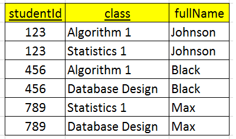

In this article, we will learn how to use Normalization to design Database efficiently. Let's get started.

<br>

## Table of contents
- [Introduction to Normalization](#introduction-to-normalization)
- [First Normal Form - 1NF](#first-normal-form---1nf)
- [Second Normal Form - 2NF](#second-normal-form)
- [Third Normal Form - 3NF](#third-normal-form---3nf)
- [Benefits and Drawbacks](#benefits-and-drawbacks)
- [Wrapping up](#wrapping-up)


<br>

## Introduction to Normalization

According to [the definition of Database Normalization on wikipedia.com](https://en.wikipedia.org/wiki/Database_normalization), we have:

```
Database normalization is the process of structuring a relational database[clarification needed] in accordance with a series of so-called normal forms in order to reduce data redundancy and improve data integrity. It was first proposed by Edgar F. Codd as part of his relational model.
```

So, database normalization is utilized to **reduce data redundancy** and **improve data integrity**.

Database Normalization will contains some normal forms:
- First Normal Form
- Second Normal Form
- Third Normal Form
- Elementary Key Normal Form
- Boyce–Codd Normal Form
- Forth Normal Form
- Fifth Normal Form
- Domain Key Normal Form

But in this article, we will focus on three normal form, these are 1NF, 2NF, 3NF.

<br>

## First Normal Form - 1NF

Some steps for 1NF:
1. Identify the repeating group.

2. Split these repeating group into another table.

3. In that table, defines the foreign key and this foreign key is the primary key in the original table.

    So, it is the 1-n relationship.

For example, assuming that we have a table Order that is described in a below image.


We can easily find that the repeating group - (item_name, item_number, item_price) is repeated in 10 times.

To apply the 1NF, we have:


**So, the 1NF satisfies when our table does not have the repeating groups.**

<br>

## Second Normal Form - 2NF

This 2NF will be applied into a composite primary key that has multiple fields.

Some steps of 2NF:
1. Identify the primary key that contains multiple properties.
2. Identify the partial dependencies with the definition:

    A partial dependency exists when a field is fully dependent on a part of a composite primary key.

    It means that if we have the relationship: R{A, B, C, D} and a composite primary key: {A, B}. But it exists a partial dependency that is A and C.

3. Split these field that are in a partial dependency into the another relationship.

    It means that we will split A and C to a new relationship, then we have two relationship: R1{A, C}, R2{A, B, D}

    Finally, we have 1 - n relationship between two table.

For example, assuming that we have a table Student.



Based on an above image, we can find that:
- fullName is dependent on the studentId --> a partial dependency.
- studentId is of the composite primary key - {studentId, class}.

--> violate the 2NF.

To apply this 2NF, we have:


So, the 2NF satisfies when:
- our table satisfies the 1NF.
- All non-key values must bu fully functionality dependent on the primary key. No partial dependencies are allowed.

<br>

## Third Normal Form - 3NF

Some steps of the 3NF:
- Identify the dependency between the fields are not primary key.

- Split these fields into a new relationship. The primary key of this new relationship is a field that defines that dependency.

- In the original table, we will have the remained fields and the primary key of a new table.

For example, we have R{A, B, C, D} that has primary key is {A, B}. There is a dependency between two non-key - {C, D}. Then, use 2NF, we have: R1{C, D}, R2{A, B, C}.

Then, we have an image:


It has a dependency: author --> born.

To apply 3NF, we have:


So, the 3NF satisfies when:
- It satisfies the 2NF.
- Do not exist the dependency between the fields that are not primary key.

    Eliminate transitive dependencies, meaning that a field is indirectly determined by the primary key. This is because the field is functionally dependent on another field, whereas the other field is dependent on the primary key.

<br>

## Benefits and Drawbacks

1. Benefits

    - reduce the repeated data.

    - extract data easily.

2. Drawbacks

    - Applying beyond 3NF will makes our database has many table. Then the generation of too many table and the resulting complex SQL code joins, with resulting terrible database response times.

        In a relational database the more normalization that is used then the greater the number of tables. The greater the number of tables, the larger SQL query joins become. The larger joins become the poorer database performance.

    -  The biggest problems with going beyond 3NF are complexity and performance issues. Too much granularity actually introduces complexity, especially in
a relational database.

<br>

## Wrapping up

- B depends on A (with symbol: A --> B) when each value of A, we can determine the only one value of B.

- 1NF - Removes repeating fields by creating a new table where the original
and new table are linked together with a master-detail, one-to-many relationship. For example,
a master table could contain parent records representing all the ships owned by a cruise line. A
detail table would contain detail records, such as all the passengers on a cruise to the Caribbean.
Create primary keys on both tables where the detail table will have a composite primary key
containing the master table primary key field as the prefix field of its primary key. That prefix
field is also a foreign key back to the master table.

- 2NF - Performs a seemingly similar function to that of 1NF, but creates a
table where repeating values (rather than repeating fields as for 1NF) are removed to a new
table. The result is a many-to-one relationship rather than a one-to-many relationship, created
between the original and the new tables. The new table gets a primary key consisting of a single
field. The master table contains a foreign key pointing back to the primary key of the new table.
That foreign key is not part of the primary key in the original table.

- 3NF - Elimination of a transitive dependency implies creation of a new table for
something indirectly dependent on the primary key in an existing table. There are a multitude of
ways in which 3NF can be interpreted.

- Beyond 3NF - Many modern relational database models do not extend beyond 3NF. Sometimes
3NF is not used at all. The reason why is because of the generation of too many tables and the
resulting complex SQL code joins, with resulting terrible database response times. One common
case that bears mentioning is removal of potentially NULL valued fields into new tables, creating
a one-to-one relationship. In modern high-end relational database engines with variable record
lengths, this is largely irrelevant. Disk space is cheap and, as already stated, increased numbers
of tables leads to bigger SQL joins and poorer performance.

<br>

Refer:

[The definitive guide to MySQL 5, Third edition]()

[Beginning Database Design]()