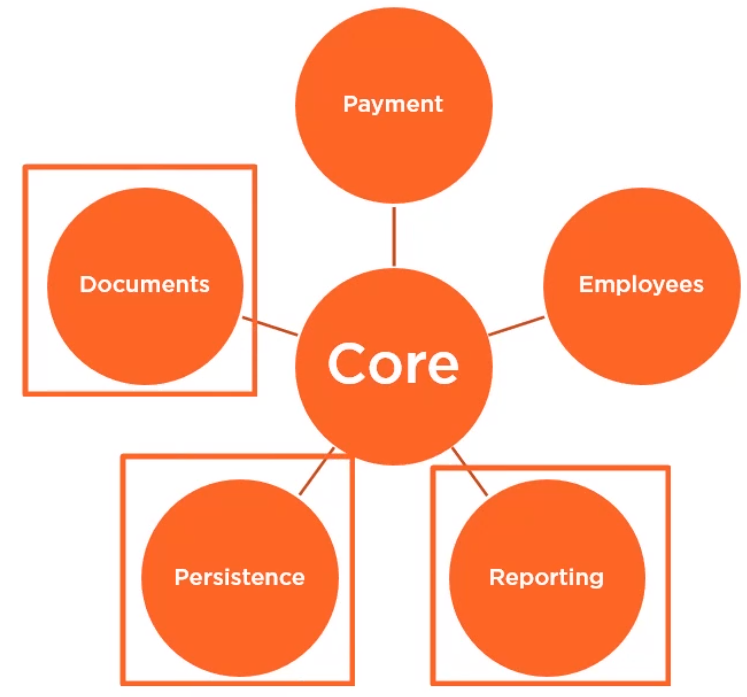

In this article, we will learn what is Single Responsibility Principle, how to apply it in our projects, the benefits when using SRP and drawbacks when not using SRP.

Let's get started.

<br>

## Table of contents
- [Problems that appear when SOLID principles are not used](#problems-that-appear-when-SOLID-principles-are-not-used)
- [Single Responsibility Priciple](#single-responsibility-principle)
- [Identify multiple reasons to change](#identify-multiple-reasons-to-change)
- [Benefits and Drawbacks when not using SRP](#benefits-and-drawbacks-when-not-using-SRP)
- [Example about Single Responsibility Principle](#example-about-single-responsibility-principle)
- [Wrapping up](#wrapping-up)

<br>

## Problems that appear when SOLID principles are not used

Let's assume that we have this application with the following submodules.


We have a new change request. We need to add a new payment method. So we, as developers, go ahead and implement the change. We go to the Payment module, we make the change, we then deploy our application. And after deployment, we notice that we have bugs in other subsystems. This is called code fragility.


According to Robert C.Martin, we have the definition of Code Fragility:

```
Fragility is the tendency of the software to break in many places every time it is changed.
```

Now, we need to update the reports with new information. So, again, we go to the reporting module and we start to implement the change. But, unfortunately, we cannot finish it because in order to modify the reporting module, we also have to modify other parts of the system. This is another symptom of code that is not robust, and it is called code rigidity.



According to Robert C.Martin, we have the definition of Code Rigidity:

```
Rigidity is the tendency of software to be difficult to change, even in simple ways. Every change causes a cascade of subsequent changes in dependent modules.
```

--> Code fragility and rigidity are symptoms of high technical debt. If we encounter this in our own projects, then we most likely did not use SOLID principles when designing and architecting our application.

<br>

## Single Responsibility Priciple
Definition of SRP will talk about:

```
Every function, class or module should have one and only one reason to change.
```

But we can wonder a question **What is a reason to change?**.

So, in this context, a reason to change is a synonym for responsibility. We setup a class which has a single responsibility, also has a single reason to change. So, we can use these terms interchangeably.

One important habit that we need to develop as a software developer is the ability to identify the reasons to change that our components have and reduce them to a single one.

<br>

## Identify multiple reasons to change
This section will help us identify multiple reasons to change in our own classes and methods. And we'll do that by looking at a couple of examples.

1. If statements

    ```java
    if (employee.getMonthlyIncome() > 2000) {
        // some logic here
    } else {
        // some other logic here
    }
    ```

    If statements are a clear sign that the method has multiple reasons to change. We have one reason to change on the if branch and a different reason to change on the else branch. Clearly, this piece of code violate SRP. What we could do here based on the complexity of the logic is that we could extract the logic for the if branch to a separate method or class and the logic for the else branch to a different method or class.

2. Switch statements

    ```java
    switch (employee.getNbHoursPerWork()) {
        case 40: {
            // logic for full name
        }

        case 20: {
            // logic for part time
        }
    }
    ```

    Similar with if statements, we have switch statements. Each case represents one responsibility. Again, we can extract them to different method or classes and make this piece of code more easy to read, maintain and understand.

3. Monster method

    ```java
    Income getIncome(Employee e) {
        Income income = employeeRepository.getIncome(e.id);
        StateAuthorityApi.send(income, e.fullName);
        Payslip payslip = PayslipGenerator.get(income);
        JsonObject payslipJson = convertToJson(payslip);
        EmailService.send(e.email, payslipJson);
        ...

        return income;
    }
    ```

    With the above method, we can identify it quickly because it has a large number of lines of code, and also the kind of mixed levels of abstraction within the implementation.

    The above method is called ```getIncome()```. So by reading the method name, we would expect this method return an employee income. But when we look at this method, we see that it does a whole lot of things. Indeed, it gets the income from the employeeRepository. But then it sends that income to the StateAuthority via an API. It generates a payslip. It converts it to JSON. And then he uses that JSON and sends it via email.

    Obviously, this method does not do one thing. It has many responsibilities, many reasons to change, and it's very, very fragile.

    Notice that many dependencies that this method has. In order to do its job, it need to know about the StateAuthorityApi, the Payslip, about JSON format, about the EmailService. This large number of dependencies is also a clear indicator that a method or a component does more than one thing.
    
    So, each time we see a monster method, we need to identify the reponsibilities and then split it into multiple methods or even classes that are more manageable and that do just one thing. We saw a couple of methods that have many reasons to change and that violate the single responsibility principle.

4. God class

    ```java
    class Utils {
        void saveToDb(Object o) { ... }
        void convertToJson(Object o) { ... }
        byte[] serialize(Object o) { ... }
        void log(String msg) { ... }
        String toFriendlyDate(LocalDateTime date) { ... }
        int roundDoubleToInt(double val) { ... }
    }
    ```

    Do we have projects where we keep helper methods, clases called Utils, Helpers, Shared, or something like this? Well, those are classes that clearly do more then they should. A typical Utils class will look like this.
    
    We have methods to save objects to a database - saveToDb(), serialize(). We have logging method - log(). We have some friendly date helpers - toFriendlyDate(). And each time we write a piece of code that needs a place to live but it's not important enough to have its own class, we would probably put it in the one of these classes.

    Instead, prefer having specialized classes that handle pretty clear use cases. For example, we can have a utility class that just handles dates. We can give it a very meaningful name. Then we can have classes that deal only with serialization, classes that deal only with logging, classes that deal only with persistence. Do not put everything in a single class just because it's easier or because others have done it.

5. People

    ```java
    Report generate() {
        // method used by HR and Management actors
        // each one will want different features at some point
        // in time
    }
    ```

    People are also actors of change in software applications. This method, for example, generates a report that is used by both HR and management. The report is pretty similar to both parties. But at some point in time, HR will want a specific set of features and management will want a different set of features. Because of those needs, it's far better to separate the report and make a specific report for HR and a different one for management. This way both reports will have a single reason for change.

<br>

## Benefits and Drawbacks when not using SRP
1. Benefits

    - It makes code easier to understand, fix, and maintain.

        We spend 90% of our time as software developer reading code, so it's pretty important to be able to understand it and reason about it very fast. And the SRP has a huge impact on readability.

    - Classes are less coupled and more resilient to change.

        When we are using SRP, we keep fragility and rigidity to very minimal levels.

    - More testable design.

2. Drawbacks when not using SRP

    - Code is more difficult to read and reason about.
    
    - Decreased quality due to testing difficulty.

    - Side effects

        Side effects are basically lies. When a function declares, it does a particular thing but also does other things internally, side effects happen. And they are dangerous because most of the time, they are hidden if we have to dig in the internals of an implementation to spot them.

    - High coupling

        Coupling is the level of inter-dependency between various software components. Components that have many reasons to change are usually tightly coupled. Coupling with concrete components is especially dangerous because it exposes to the internal implementation of a particular class.

        For example:

        ```java
        Income getIncome(Employee e) {
            RepositoryImpl repo = new RepositoryImpl(srv, port, db);
            Income income = repo.getIncome(e.id);

            return income;
        }
        ```

        We have a ```getIncome()``` method that receives an employee and, return employee's income. In order to achieve this function, this class has a dependency on the repository implementation - ```RepositoryImpl```, a concrete class. We also declare this repository internally and we construct it here.

        But what happens, for example, when the ```RepositoryImpl``` constructor changes? Well, of course, this piece of code will break. This introduces fragility and rigidity in our system. A better solution would have been to create an abstraction for the ```RepositoryImpl``` and pass it as a parameter.

        ```java
        Income getIncome(Employee e, Repository repo) {
            Income income = repo.getIncome(e.id);

            return income;
        }
        ```

        In this scenario, the ```getIncome()``` method is no longer aware of the internals of the Repository class and can do its job to get the income for a particular employee.

        --> If Module A knows too much about Module B, changes to the internals of Module B may break functionality in Module A.


<br>

## Example about Single Responsibility Principle

We will look at an example, and then analyze it to refactor code based on SRP.

```java
public class EmployeeRepository {

    public void save(Employee employee) {
        try {
            StringBuilder sb = new StringBuilder();
            sb.append("### EMPLOYEE RECORD ###");
            sb.append(System.lineSeparator());
            sb.append(" NAME: ");
            sb.append(employee.getFullName());
            sb.append(System.lineSeparator());
            sb.append("POSITION: ");
            sb.append(employee.getClass().getTypeName());
            sb.append(System.lineSeparator());
            sb.append("EMAIL: ");
            sb.append(employee.getEmail());
            sb.append(System.lineSeparator());
            sb.append("MONTHLY WAGE: ");
            sb.append(employee.getMonthlyIncome());
            sb.append(System.lineSeparator());

            Path path = Paths.get(employee.getFullName().replace(" ", "_") + ".rec");
            Files.write(path, sb.toString().getBytes());

            System.out.println("Saved employee " + employee.toString());
        } catch (IOException e) {
            System.out.println("ERROR: Could not save employee. " + e);
        }
    }
}
```

This method has multiple responsibilities. We can recognize some responsibilities that we need to know:
- serialization in the first segment of this method.

    We will separate the serialization's segment into a new class such as ```EmployeeFileSerializer```.

    ```java
    public class EmployeeFileSerializer {

        public String serialize(Employee employee) {
            StringBuilder sb = new StringBuilder();
            sb.append("### EMPLOYEE RECORD ###");
            sb.append(System.lineSeparator());
            sb.append(" NAME: ");
            sb.append(employee.getFullName());
            sb.append(System.lineSeparator());
            sb.append("POSITION: ");
            sb.append(employee.getClass().getTypeName());
            sb.append(System.lineSeparator());
            sb.append("EMAIL: ");
            sb.append(employee.getEmail());
            sb.append(System.lineSeparator());
            sb.append("MONTHLY WAGE: ");
            sb.append(employee.getMonthlyIncome());
            sb.append(System.lineSeparator());

            return sb.toString();
        }
    }
    ```

- Continuously, we will extract logger part out of this method.

    It's not good idea to keep exception handling and logging in the ```save()``` method.

    ```java
    public class ConsoleLogger {

        public void writeInfo(String msg) {
            System.out.println("Info: " + msg);
        }

        public void writeError(String msg, Exception e) {
            System.err.println("Error: " + msg + ";" + e);
        }
    }
    ```

    The ```save()``` method is only concerned with saving that employee to the file system. The exception handling will be handled by caller.

So, after using SRP, we can have result.

```java
public class EmployeeRepository {
    private EmployeeFileSerializer serializer;

    public EmployeeRepository(EmployeeFileSerializer serializer) {
        this.serializer = serializer;
    }

    public void save(Employee employee) throws IOException {
        String serializedString = this.serializer.serialize(employee);

        Path path = Paths.get(employee.getFullName().replace(" ", "_") + ".rec");
        Files.write(path, serializedString.toString().getBytes());
    }
}

public static void main(String[] args) {
    ConsoleLogger logger = new ConsoleLogger();
    EmployeeFileSerializer serializer = new EmployeeFileSerializer();
    EmployeeRepository repo = new EmployeeRepository(serializer);
    List<Employee> employees = repo.findAll();

    // Save all
    for (Employee e : employees) {
        try {
            repo.save(e);
            logger.writeInfo("Saved employee " + e.toString());
        } catch(IOException ex) {
            logger.writeErr("ERROR: Could not save employee. ", e);
        }
    }
}
```

<br>

## Wrapping up
- Understanding the concept of SRP.
- How to identify multiple reasons to change in modules, classes, and methods.

<br>

Thanks for your reading.

<br>

Refer:

[SOLID Software Design Principles in Java](https://app.pluralsight.com/library/courses/solid-software-design-principles-java/table-of-contents)

[https://gravitymodel.net/core-software-principles/](https://gravitymodel.net/core-software-principles/)

[https://dzone.com/articles/oo-design-is-more-about-doing-than-being-1?fromrel=true](https://dzone.com/articles/oo-design-is-more-about-doing-than-being-1?fromrel=true)