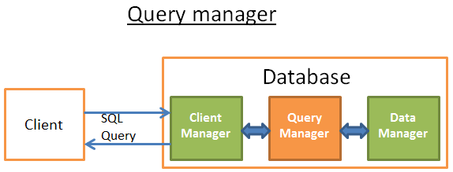
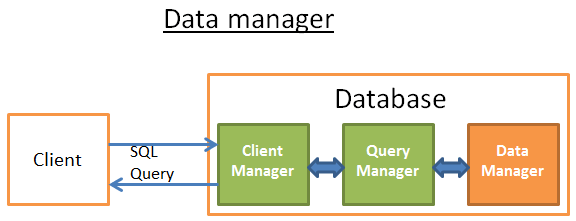
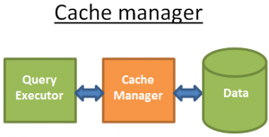
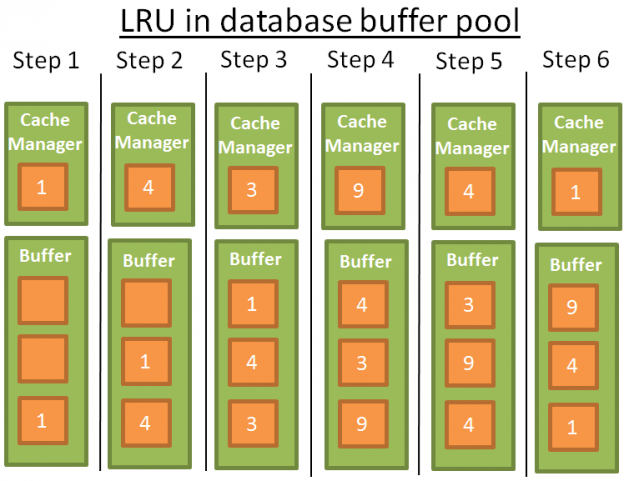

When we are working with websites, or some applications that need to save data, it means that we need to use Relational Database Management or usually called as RDBMS. Normally, we only need to understand how to use Structure Query Language SQL or to communicate with Database management system.

But in order to write sql efficiently, we have to understand how relational database works, and some steps that we must know.

Let's get started.

<br>

## Table of contents
- [The problem that was born Relational Database](#the-problem-that-was-born-relational-database)
- [Introduction to RDBMS](#introduction-to-rdbms)
- [How relational database works](#how-relational-database-works)
- [Benefits and Drawbacks](#benefits-and-drawbacks)
- [Wrapping up](#wrapping-up)

<br>

## The problem that was born Relational Database
Originally, databases were flat. It means that the information was stored in one long text file, called a tab delimited file. Each entry in the tab delimited file is separated by a special character, such as a vertical bar (```|```).

Assuming that we want to save all information about customers such as name, customer number, address, ZIP Code , all things that they purchased.

For example:

```
Name, Customer Number, Address, Goods's name|Smith, 1, London, T-Shirt|Doe, 2, Arkansas, Shampoo|Brown, 3, New York, Radio
```

Each entry contains multiple pieces of information (fields) about a particular object or person grouped together as a record. The text file makes it difficult to search for specific information or to create reports that include only certain fields from each record.

And we have to search sequentially through the entire file to gather related information, such as age or salary. But when those who customer bought three times, all information would be duplicated. Data elements such as name, customer number, address and ZIP Code would be identical in all three records. Thus, the flat file would store the same information three times. From a storage standpoint, this is inefficient.

Therefore, relational database created to solve problems about inefficient storage, inefficient and slow processing.

<br>

## Introduction to RDBMS
According to wikipedia, we have the definition of Relational database:

```
A relational database is a digital database based on the relational model of data, as proposed by E.F.Codd in 1970. A software system used to maintain relational databases is a relational database management system (RDBMS). Virtually all relational database systems uses SQL for querying and maintaining the database.
```

<br>

## How relational database works

This section is referred from the website [http://coding-geek.com/how-databases-work/](http://coding-geek.com/how-databases-work/).

A database is a software that manages our data efficiently. Internally, it contains some components:


The core components:

- The process manager: Many databases have a pool of processes/threads that needs to be managed. Moreover, in order to gain nanoseconds, some modern databases use their own threads instead of the Operating System threads.

- The network manager: Network I/O is a big issue, especially for distributed databases. That's why some databases have their own manager.

- File system manager: Disk I/O is the first bottleneck of a database. Having a manager that will perfectly handle the Operating System file system or even replace it is important.

- The memory manager: To avoid the disk I/O penalty a large quantity of ram is required. But if you handle a large amount of memory, you need an efficient memory manager. Especially when you have many queries using memory at the same time.

- Security Manager: for managing the authentication and the authorizations of the users

- Client manager: for managing the client connections

- ...

The tools:
- Backup manager: for saving and restoring a database.

- Recovery manager: for restarting the database in a coherent state after a crash

- Monitor manager: for logging the activity of the database and providing tools to monitor a database

- Administration manager: for storing metadata (like the names and the structures of the tables) and providing tools to manage databases, schemas, tablespaces, ...

- ... 

The query Manager:
- Query parser: to check if a query is valid
- Query rewriter: to pre-optimize a query
- Query optimizer: to optimize a query
- Query executor: to compile and execute a query

The data manager:
- Transaction manager: to handle transactions
- Cache manager: to put data in memory before using them and put data in memory before writing them on disk
- Data access manager: to access data on disk

Now, we will continue look at the interaction between common components such as the Client Manager, the Query Manager, the Data Manager.

- Client Manager

    

    The client manager is the part that handles the communications with the client. The client can be a (web) server or an end-user/end-application. The client manager provides different ways to access the database through a set of well-known APIs: JDBC, ODBC, OLE-DB ...

    It can also provide proprietary database access APIs.

    When you connect to a database:

    - The manager first checks your authentication (your login and password) and then checks if you have the authorizations to use the database. These access rights are set by your DBA.

    - Then, it checks if there is a process (or a thread) available to manage your query.

    - It also checks if the database if not under heavy load.

    - It can wait a moment to get the required resources. If this wait reaches a timeout, it closes the connection and gives a readable error message.

    - Then it sends your query to the query manager and your query is processed.

    - Since the query processing is not an “all or nothing” thing, as soon as it gets data from the query manager, it stores the partial results in a buffer and start sending them to you.

    - In case of problem, it stops the connection, gives you a readable explanation and releases the resources.

- Query Manager

    

    This part is where the power of a database lies. During this part, an ill-written query is transformed into a fast executable code. The code is then executed and the results are returned to the client manager. It's a multiple-step operation:
    - The query is first parsed to see if it's valid
    - It's then rewritten to remove useless operations and add some pre-optimizations
    - It's then optimized to improve the performances and transformed into an execution and data access plan.
    - Then the plan is compiled.
    - At last, it's executed.

    Continuously, we will find something out about:
    - Query parser

        Each SQL statement is sent to the parser where it is checked for correct syntax. If you made a mistake in your query the parser will reject the query. For example, if you wrote "SLECT ..." instead of "SELECT ...",  the story ends here.

        But this goes deeper. It also checks that the keywords are used in the right order. For example a WHERE before a SELECT will be rejected.

        Then, the tables and the fields inside the query are analyzed. The parser uses the metadata of the database to check:
        - If the tables exist
        - If the fields of the tables exist
        - If the operations for the types of the fields are possible (for example you can't compare an integer with a string, you can't use a **substring()** function on an integer)

        Then it checks if you have the authorizations to read (or write) the tables in the query. Again, these access rights on tables are set by your DBA.

        During this parsing, the SQL query is transformed into an internal representation (often a tree).

        If everything is ok then the internal representation is sent to the query rewriter.

    - Query rewriter

        At this step, we have an internal representation of a query. The aim of the rewriter is:
        - to pre-optimize the query.
        - to avoid unnecessary operations.
        - to help the optimizer to find the best possible solution.

        The rewriter executes a list of known rules on the query. If the query fits a pattern of a rule, the rule is applied and the query is rewritten.  Here is a non-exhaustive list of (optional) rules:
        - View merging: If you’re using a view in your query, the view is transformed with the SQL code of the view.

        - Subquery flattening: Having subqueries is very difficult to optimize so the rewriter will try to modify a query with a subquery to remove the subquery.

            For example

            ```sql
            SELECT PERSON.*
            FROM PERSON
            WHERE PERSON.person_key IN
            (SELECT MAILS.person_key
            FROM MAILS
            WHERE MAILS.mail LIKE 'christophe%');
            Will be replaced by

            SELECT PERSON.*
            FROM PERSON, MAILS
            WHERE PERSON.person_key = MAILS.person_key
            and MAILS.mail LIKE 'christophe%';
            ```

        - Removal of unnecessary operators: For example if you use a **DISTINCT** whereas you have a **UNIQUE** constraint that prevents the data from being non-unique, the **DISTINCT** keyword is removed.

        - Redundant join elimination: If you have twice the same join condition because one join condition is hidden in a view or if by transitivity there is a useless join, it's removed.

        - Constant arithmetic evaluation: If you write something that requires a calculus, then it's computed once during the rewriting. For example, **WHERE AGE > 10+2** is transformed into **WHERE AGE > 12** and **TODATE("some date")** is transformed into the date in the datetime format

        - (Advanced) Partition Pruning: If you're using a partitioned table, the rewriter is able to find what partitions to use.
        
        - (Advanced) Materialized view rewrite: If you have a materialized view that matches a subset of the predicates in your query, the rewriter checks if the view is up to date and modifies the query to use the materialized view instead of the raw tables.

        - (Advanced) Custom rules: If you have custom rules to modify a query (like Oracle policies), then the rewriter executes these rules.

        - (Advanced) Olap transformations: analytical/windowing functions, star joins, rollup … are also transformed (but I'm not sure if it’s done by the rewriter or the optimizer, since both processes are very close it must depends on the database).

        This rewritten query is then sent to the query optimizer where the fun begins!

    - Statistics

        When you ask a database to gather statistics, it computes values like:
        - The number of rows/pages in a table
        - For each column in a table:
            - distinct data values
            - the length of data values (min, max, average)
            - data range information (min, max, average)
        - Information on the indexes of the table.

        These statistics will help the optimizer to estimate the disk I/O, CPU and memory usages of the query.

        The statistics for each column are very important. For example if a table PERSON needs to be joined on 2 columns: **LAST_NAME**, **FIRST_NAME**. With the statistics, the database knows that there are only **1 000** different values on **FIRST_NAME** and **1 000 000** different values on **LAST_NAME**. Therefore, the database will join the data on **LAST_NAME**, **FIRST_NAME** instead of **FIRST_NAME**,**LAST_NAME** because it produces way less comparisons since the **LAST_NAME** are unlikely to be the same so most of the time a comparison on the 2 (or 3) first characters of the **LAST_NAME** is enough.

        These extra statistics will help the database to find an even better query plan. Especially for equality predicate (ex: **WHERE AGE = 18**) or range predicates (ex: **WHERE  AGE > 10 and AGE <40**) because the database will have a better idea of the number rows concerned by these predicates (note: the technical word for this concept is selectivity).

        The statistics are stored in the metadata of the database. For example you can see the statistics for the (non-partitioned) tables:
        - In **USER/ALL/DBA_TABLES** and **USER/ALL/DBA_TAB_COLUMNS** for **Oracle**
        - In **SYSCAT.TABLES** and **SYSCAT.COLUMNS** for **DB2**.

    - Query optimizer

        All modern databases are using a Cost Based Optimization (or CBO) to optimize queries. The idea is to put a cost an every operation and find the best way to reduce the cost of the query by using the cheapest chain of operations to get the result.

        To understand how a cost optimizer works I think it’s good to have an example to "feel" the complexity behind this task. In this part I'll present you the 3 common ways to join 2 tables and we will quickly see that even a simple join query is a nightmare to optimize. After that, we'll see how real optimizers do this job.

        For these joins, I'll focus on their time complexity but a database optimizer computes their CPU cost, disk I/O cost and memory requirement. The difference between time complexity and CPU cost is that time cost is very approximate (it’s for lazy guys like me). For the CPU cost, I should count every operation like an addition, an **if statement**, a multiplication, an iteration, ... Moreover:

        - Each high level code operation has a specific number of low level CPU operations.
        - The cost of a CPU operation is not the same (in terms of CPU cycles) whether you’re using an Intel Core i7, an Intel Pentium 4, an AMD Opteron…. In other words it depends on the CPU architecture.
        
        Using the time complexity is easier (at least for me) and with it we can still get the concept of CBO. I'll sometimes speak about disk I/O since it's an important concept. Keep in mind that the bottleneck is most of the time the disk I/O and not the CPU usage.

    - Query executor

        At this stage we have an optimized execution plan. This plan is compiled to become an executable code. Then, if there are enough resources (memory, CPU) it is executed by the query executor. The operators in the plan (JOIN, SORT BY, ...) can be executed in a sequential or parallel way; it's up to the executor. To get and write its data, the query executor interacts with the data manager, which is the next part of the article.

- Data Manager

    

    At this step, the query manager is executing the query and needs the data from the tables and indexes. It asks the data manager to get the data, but there are 2 problems:

    - Relational databases use a transactional model. So, you can’t get any data at any time because someone else might be using/modifying the data at the same time.
    
    - Data retrieval is the slowest operation in a database, therefore the data manager needs to be smart enough to get and keep data in memory buffers.

    In this part, we'll see how relational databases handle these 2 problems. I won’t talk about the way the data manager gets its data because it's not the most important.

    Below are common components of Data Manager:
    - Cache manager

        As I already said, the main bottleneck of databases is disk I/O. To improve performance, modern databases use a cache manager.

        

        Instead of directly getting the data from the file system, the query executor asks for the data to the cache manager. The cache manager has an in-memory cache called buffer pool. Getting data from memory dramatically speeds up a database. It’s difficult to give an order of magnitude because it depends on the operation you need to do:

        - sequential access (ex: full scan) vs random access (ex: access by row id),
        - read vs write

        and the type of disks used by the database:

        - 7.2k/10k/15k rpm HDD
        - SSD
        - RAID 1/5/ ...

        but I'd say memory is 100 to 100k times faster than disk.

        But, this leads to another problem (as always with databases ...). The cache manager needs to get the data in memory BEFORE the query executor uses them; otherwise the query manager has to wait for the data from the slow disks.

    - Prefetching

        This problem is called prefetching. A query executor knows the data it'll need because it knows the full flow of the query and has knowledge of the data on disk with the statistics. Here is the idea:

        - When the query executor is processing its first bunch of data
        - It asks the cache manager to pre-load the second bunch of data
        - When it starts processing the second bunch of data
        - It asks the CM to pre-load the third bunch and informs the CM that the first bunch can be purged from cache.
        - ...

        The CM stores all these data in its buffer pool. In order to know if a data is still needed, the cache manager adds an extra-information about the cached data (called a latch).

        Sometimes the query executor doesn't know what data it'll need and some databases don't provide this functionality. Instead, they use a speculative prefetching (for example: if the query executor asked for data 1,3,5 it'll likely ask for 7,9,11 in a near future) or a sequential prefetching (in this case the CM simply loads from disks the next contiguous data after the ones asked).

        To monitor how well the prefetching is working, modern databases provide a metric called buffer/cache hit ratio. The hit ratio shows how often a requested data has been found in the buffer cache without requiring disk access.

        Note: a poor cache hit ratio doesn't always mean that the cache is ill-working. For more information, you can read the [Oracle documentation](https://docs.oracle.com/database/121/TGDBA/tune_buffer_cache.htm).

        But, a buffer is a limited amount of memory. Therefore, it needs to remove some data to be able to load new ones. Loading and purging the cache has a cost in terms of disk and network I/O. If you have a query that is often executed, it wouldn’t be efficient to always load then purge the data used by this query. To handle this problem, modern databases use a buffer replacement strategy.

    - Buffer-Replacement strategies

        Most modern databases (at least SQL Server, MySQL, Oracle and DB2) use an LRU algorithm.

        - LRU

            LRU stands for Least Recently Used. The idea behind this algorithm is to keep in the cache the data that have been recently used and, therefore, are more likely to be used again.

            Here is a visual example:

            

            For the sake of comprehension, I’ll assume that the data in the buffer are not locked by latches (and therefore can be removed). In this simple example the buffer can store 3 elements:

            - 1: the cache manager uses the data 1 and puts the data into the empty buffer

            - 2: the CM uses the data 4 and puts the data into the half-loaded buffer
            
            - 3: the CM uses the data 3 and puts the data into the half-loaded buffer
            
            - 4: the CM uses the data 9. The buffer is full so data 1 is removed since it’s the last recently used data. Data 9 is added into the buffer
            
            - 5: the CM uses the data 4. Data 4 is already in the buffer therefore it becomes the first recently used data again.

            - 6: the CM uses the data 1. The buffer is full so data 9 is removed since it’s the last recently used data. Data 1 is added into the buffer

            - ...

            This algorithm works well but there are some limitations. What if there is a full scan on a large table? In other words, what happens when the size of the table/index is above the size of the buffer? Using this algorithm will remove all the previous values in the cache whereas the data from the full scan are likely to be used only once.

            - Improvement

                To prevent this to happen, some databases add specific rules. For example according to [Oracle documentation](https://docs.oracle.com/database/121/CNCPT/memory.htm#i10221):

                ```
                For very large tables, the database typically uses a direct path read, which loads blocks directly […], to avoid populating the buffer cache. For medium size tables, the database may use a direct read or a cache read. If it decides to use a cache read, then the database places the blocks at the end of the LRU list to prevent the scan from effectively cleaning out the buffer cache.
                ```

                There are other possibilities like using an advanced version of LRU called LRU-K. For example SQL Server uses LRU-K for K =2.

                This idea behind this algorithm is to take into account more history. With the simple LRU (which is also LRU-K for K=1), the algorithm only takes into account the last time the data was used. With the LRU-K:

                - It takes into account the K last times the data was used.
                - A weight is put on the number of times the data was used
                - If a bunch of new data is loaded into the cache, the old but often used data are not removed (because their weights are higher).
                - But the algorithm can't keep old data in the cache if they aren't used anymore.
                - So the weights decrease over time if the data is not used.

                The computation of the weight is costly and this is why SQL Server only uses K=2. This value performs well for an acceptable overhead.

                For a more in-depth knowledge of LRU-K, you can read the original research paper (1993): [The LRU-K page replacement algorithm for database disk buffering](https://www.cs.cmu.edu/~christos/courses/721-resources/p297-o_neil.pdf).

            - Other algorithms

                Of course there are other algorithms to manage cache like:
                - 2Q (a LRU-K like algorithm)
                - CLOCK (a LRU-K like algorithm)
                - MRU (most recently used, uses the same logic than LRU but with another rule)
                - LRFU (Least Recently and Frequently Used)
                - ...

                Some databases let the possibility to use another algorithm than the default one.

        - Write buffer

            I only talked about read buffers that load data before using them. But in a database you also have write buffers that store data and flush them on disk by bunches instead of writing data one by one and producing many single disk accesses.

            Keep in mind that buffers store pages (the smallest unit of data) and not rows (which is a logical/human way to see data). A page in a buffer pool is dirty if the page has been modified and not written on disk. There are multiple algorithms to decide the best time to write the dirty pages on disk but it’s highly linked to the notion of transaction, which is the next part of the article.

    - Transaction manager

        Last but not least, this part is about the transaction manager. We'll see how this process ensures that each query is executed in its own transaction. But before that, we need to understand the concept of ACID transactions.

        An ACID transaction is a unit of work that ensures 4 things:
        - Atomicity: the transaction is “all or nothing”, even if it lasts 10 hours. If the transaction crashes, the state goes back to before the transaction (the transaction is rolled back).

        - Isolation: if 2 transactions A and B run at the same time, the result of transactions A and B must be the same whether A finishes before/after/during transaction B.

        - Durability: once the transaction is committed (i.e. ends successfully), the data stay in the database no matter what happens (crash or error).

        - Consistency: only valid data (in terms of relational constraints and functional constraints) are written to the database. The consistency is related to atomicity and isolation.

        During the same transaction, you can run multiple SQL queries to read, create, update and delete data. The mess begins when two transactions are using the same data. The classic example is a money transfer from an account A to an account B.  Imagine you have 2 transactions:

        - Transaction 1 that takes ```100$``` from account A and gives them to account B.
        - Transaction 2 that takes ```50$``` from account A and gives them to account B.

        If we go back to the ACID properties:
        - Atomicity ensures that no matter what happens during T1 (a server crash, a network failure ...), you can't end up in a situation where the ```100$``` are withdrawn from A and not given to B (this case is an inconsistent state).

        - Isolation ensures that if T1 and T2 happen at the same time, in the end A will be taken ```150$``` and B given ```150$``` and not, for example, A taken ```150$``` and B given just ```$50``` because T2 has partially erased the actions of T1 (this case is also an inconsistent state).

        - Durability ensures that T1 won’t disappear into thin air if the database crashes just after T1 is committed.

        - Consistency ensures that no money is created or destroyed in the system.

        Many modern databases don’t use a pure isolation as a default behavior because it comes with a huge performance overhead. The SQL norm defines 4 levels of isolation:

        - Serializable (default behaviour in SQLite): The highest level of isolation. Two transactions happening at the same time are 100% isolated. Each transaction has its own "world".

        - Repeatable read (default behavior in MySQL): Each transaction has its own "world" except in one situation. If a transaction ends up successfully and adds new data, these data will be visible in the other and still running transactions. But if A modifies a data and ends up successfully, the modification won’t be visible in the still running transactions. So, this break of isolation between transactions is only about new data, not the existing ones.

            For example,  if a transaction A does a **SELECT count(1) from TABLE_X** and then a new data is added and committed in **TABLE_X** by Transaction B, if transaction A does again a count(1) the value won’t be the same.

            This is called a phantom read.

        - Read committed (default behavior in Oracle, PostgreSQL and SQL Server): It's a repeatable read + a new break of isolation. If a transaction A reads a data D and then this data is modified (or deleted) and committed by a transaction B, if A reads data D again it will see the modification (or deletion) made by B on the data.

            This is called a non-repeatable read.

        - Read uncommitted: the lowest level of isolation. It’s a read committed + a new break of isolation. If a transaction A reads a data D and then this data D is modified by a transaction B (that is not committed and still running), if A reads data D again it will see the modified value. If transaction B is rolled back, then data D read by A the second time doesn’t make no sense since it has been modified by a transaction B that never happened (since it was rolled back).

            This is called a dirty read.

        Most databases add their own custom levels of isolation (like the snapshot isolation used by PostgreSQL, Oracle and SQL Server). Moreover, most databases don’t implement all the levels of the SQL norm (especially the read uncommitted level).

        The default level of isolation can be overridden by the user/developer at the beginning of the connection (it's a very simple line of code to add).
<br>

## Benefits and Drawbacks
1. Benefits

    - easy to use and understand, because information is stored in tables, organized in rows and columns, much as same as a spreadsheet.

    - join table query.

    - avoid data duplication.

    - avoid inconsistent records.

    - better security. Tables can be made accessible only to those who need specific information.

    - cater for future requirements.

    - ACID properties

    - familiarity

2. Drawbacks

    - encounter difficulity when you want to insert some filed to tables.

    - Limit the length of data fields, it means when you input more information into a field than it can accommodate, the information can be lost.

    - Performance problems associated with reassembling simple data structures into their more complicated real world representations.

    - SQL is limited when accessing complex data.

    - Knowledge of the database structure is required to create ad hoc queries.

    - Lack of support for complex base types such as drawing, ...

    - Locking mechanism defined by RDBMSs do not allow design transactions to be supported.

<br>

## Some common questions about database
1. How does data save in database?


<br>

## Wrapping up

- Understanding about how relational database works will help us confidence when optimizing database.

<br>

Refer: 

[http://coding-geek.com/how-databases-work/](http://coding-geek.com/how-databases-work/)

[https://en.wikipedia.org/wiki/B%2B_tree](https://en.wikipedia.org/wiki/B%2B_tree)

[https://blog.jcole.us/2013/01/07/the-physical-structure-of-innodb-index-pages/](https://blog.jcole.us/2013/01/07/the-physical-structure-of-innodb-index-pages/)

[https://blog.jcole.us/2013/01/10/btree-index-structures-in-innodb/](https://blog.jcole.us/2013/01/10/btree-index-structures-in-innodb/)

[https://vladmihalcea.com/how-does-a-relational-database-work/](https://vladmihalcea.com/how-does-a-relational-database-work/)

[https://www.quora.com/How-does-a-relational-DBMS-internally-store-its-data-In-what-type-of-data-structure-How-does-it-offer-the-rapid-retrieval-without-loading-the-entire-database-into-the-main-memory-I-have-heard-many-DBMS-use-B-trees](https://www.quora.com/How-does-a-relational-DBMS-internally-store-its-data-In-what-type-of-data-structure-How-does-it-offer-the-rapid-retrieval-without-loading-the-entire-database-into-the-main-memory-I-have-heard-many-DBMS-use-B-trees)

[http://www.agiledata.org/essays/relationalDatabases.html](http://www.agiledata.org/essays/relationalDatabases.html)

[https://en.wikipedia.org/wiki/Database_storage_structures](https://en.wikipedia.org/wiki/Database_storage_structures)

[https://dev.to/lmolivera/everything-you-need-to-know-about-relational-databases-3ejl](https://dev.to/lmolivera/everything-you-need-to-know-about-relational-databases-3ejl)

[https://www.dmnews.com/data/news/13095668/how-relational-databases-work](https://www.dmnews.com/data/news/13095668/how-relational-databases-work)

[https://vladmihalcea.com/relational-database-sql-prepared-statements/](https://vladmihalcea.com/relational-database-sql-prepared-statements/)

[https://www.youtube.com/watch?v=wDXjOAwO5Es](https://www.youtube.com/watch?v=wDXjOAwO5Es)

<br>

**Pros and Cons of RDBMS**

[https://it.toolbox.com/blogs/craigborysowich/some-pros-cons-of-relational-databases-050108](https://it.toolbox.com/blogs/craigborysowich/some-pros-cons-of-relational-databases-050108)

[https://www.techwalla.com/articles/disadvantages-of-a-relational-database](https://www.techwalla.com/articles/disadvantages-of-a-relational-database)

[https://smallbusiness.chron.com/limitations-relational-databases-business-applications-24159.html](https://smallbusiness.chron.com/limitations-relational-databases-business-applications-24159.html)

[https://mangolassi.it/topic/4545/when-to-use-sql-or-nosql/3](https://mangolassi.it/topic/4545/when-to-use-sql-or-nosql/3)