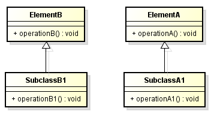
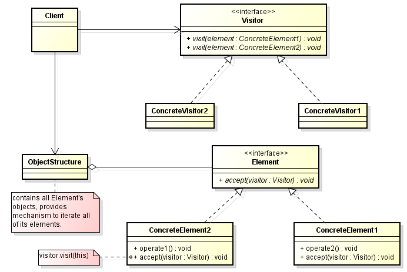

In this article, we will learn how to use Visitor pattern.

Let's get started.

<br>

## Table of contents
- [Given problem](#given-problem)
- [Solution of Visitor Pattern](#solution-of-visitor-pattern)
- [When to use](#when-to-use)
- [Benefits && Drawback](#benefits-&&-drawbacks)
- [Code C++/Java](#code-c++/java)
- [Relationships with other patterns](#relationships-with-other-patterns)
- [Application && Examples](#application-&&-examples)
- [Wrapping up](#wrapping-up)


<br>

## Given problem



Assuming that we have the object structure that contains two class such as ElementA and ElementB classes.

When we want to add new operations for each classes of the object structure, according to the Open/Close Principle, we need to inherit ElementB or ElementA class, so we have SubClassB1, or SubclassA1 class.

But it has an disadvantage is that we are changing classes of object structure once we need to add new operations.

So, when new operations are needed frequently and the object structure consists of many unrelated classes, it's inflexible to add new subclasses each time a new operation is required because distributing all these operations across the various node classes leads to a system that's hard to understand, maintain, and change.

Problem: How can new operations be defined for the classes of an object structure without changing the classes?

<br>

## Solution of Visitor Pattern

The Visitor pattern states that:

```
Represent an operation to be performed on elements of an object structure. Visitor lets you define a new operation without changing the classes of the elements on which it operates.
```

The nature of the Visitor makes it an ideal pattern to plug into public APIs thus allowing its clients to perform operations on a class using a "visiting" class without having to modify the source.

Below is an UML diagram of Visitor pattern.



- ```Element```: This represents the base class for the object structure. All the classes in the structure are derived from it and they must implement the ```accept()``` method.

- ```ConcreteElement1``` and ```ConcreteElement2```: These are concrete classes to which we want to add external operations implemented in the ```Visitor``` class.

- ```Visitor```: This is the base ```Visitor``` class, which declares a method corresponding to each ```ConcreteElement1```. The name of the method is the same, but each method is differentiated with the same name and different signatures. But if needed, we can declare methods with different names.

- ```ConcreteVisitor1```: This is the implementation of the ``Visitor``. When we need a separate set of operations, we simply create another visitor.

So, the Visitor pattern describe:
- Define a separate (visitor) object that implements an operation to be performed on elements of an object structure.

- Clients traverse the object structure and call a dispatching operation accept(visitor) on an element — that "dispatches" (delegates) the request to the "accepted visitor object". The visitor object then performs the operation on the element ("visits the element").

This makes it possible to create new operations independently from the classes of an object structure by adding new visitor objects.

<br>

## When to use
- Similar operations have to be performed on objects of different types grouped in a structure (a collection or a more complex structure).

- There are many distinct and unrelated operations needed to be performed. Visitor pattern allows us to create a separate visitor concrete class for each type of operation and to separate this operation implementation from the object structure.

- The object structure is not likely to be changed but is very probable to have new operations which have to be added. Since the pattern separates the visitor (representing operations, algorithms, behaviors) from the object structure it's very easy to add new visitors as long as the structure remains unchanged.

<br>

## Benefits && Drawback
1. Benefits

    - Makes adding new operations easy

        Because we create a new operation by adding a new subclass to the visitor class hierarchy.

    - Enables visiting elements of different types across inheritance hierarchies

        Visitor can visit elements that do not have a common interface, i.e, it can visit different types of elements (ConcreteElement1, ConcreteElement2, ...) that do not have to be related through inheritance.

    - Makes accumulating state easy

        - Visitor makes it easy to accumulate state while traversing an object structure.

        - It eliminates the need to pass the state to operations that perform the accumulation. The state is accumulated and stored in the visitor object.


2. Drawbacks

    - Requires extending the visitor interface to support new element classes.

        The visitor interface must be extended to support new element classes in the object structure. Therefore, the Visitor pattern should be used only when the object structure is stable and new element classes aren't added frequently.

        In such cases, it's probably easier just to define operations on the classes that make up the structure. If the Element class hierarchy is stable, but you are continually adding operations or changing algorithms, then the visitor pattern will help you manage the changes.

    - May require extending the element interfaces

        The element interfaces may have to be extended to let all visitors do their work and access the needed data and functionality.

    - Introduces additional levels of indirection

        The pattern achieves flexibility by introducing separate visitor objects and a double-dispatch mechanism, which can complicate a design.

    - Languages that support double or multiple dispatch lessen the need for the visitor pattern.

<br>

## Code C++/Java

To refer this pattern's code, we can read this [Visitor pattern on Github](https://github.com/DucManhPhan/Design-Pattern/tree/master/Behavioral-Pattern/visitor-pattern/src/Java).


<br>

## Relationships with other patterns
- Composite provides a way to represent a part-whole hierarchy as a tree (composite) object structure.
- Builder provides a way to create the elements of an object structure.
- Iterator pattern provides a way to traverse the elements of an object structure.
- Intepreter represents a sentence in a simple language as a tree (composite) object structure (abstract syntax tree).


<br>

## Application && Examples
- In practice, the visitor pattern is often used in compilers. Here, the syntax of a program is usually represented through a tree data structure, where each element in the tree may have a different type. Different parts of the compiler do widely different stuff with this tree: one part pretty-prints the code. One part optimizes the code. Another part compiles the code to another languages, and a further visitor could be an interpreter.

- **java.nio.file.FileVisitor** interface has an implementation class of **SimpleFileVisitor** which is an example of a visitor. The interface is defined as a visitor of files. An implementation of this interface is provided to the Files.**walkFileTree** methods to visit each file in a file tree.

- **javax.lang.model.element.Element** interface represents a program element such as a package, class, or method. To implement operations based on the class of an Element object not known at compile an implementation of the **javax.lang.model.element.ElementVisitor** interface is required.

<br>

## Wrapping up
- An object structure represents the components of a technical requirement.

- The key idea of this pattern is to define a double-dispatch operation ```accept(visitor)``` for each Element class. The operation that gets executed depends on both the type of Visitor and the type of Element it visit.

- Visitor provides a way to define new operations for the elements of an object structure.

Thanks for your reading.

<br>

Refer:

[https://www.javacodegeeks.com/2019/03/new-life-old-visitor-design-pattern.html](https://www.javacodegeeks.com/2019/03/new-life-old-visitor-design-pattern.html)

[https://softwareengineering.stackexchange.com/questions/333692/understanding-the-need-of-visitor-pattern](https://softwareengineering.stackexchange.com/questions/333692/understanding-the-need-of-visitor-pattern)

[https://en.wikipedia.org/wiki/Visitor_pattern](https://en.wikipedia.org/wiki/Visitor_pattern)

[https://blogs.oracle.com/javamagazine/the-visitor-design-pattern-in-depth](https://blogs.oracle.com/javamagazine/the-visitor-design-pattern-in-depth)

[https://en.wikibooks.org/wiki/Computer_Science_Design_Patterns/Visitor](https://en.wikibooks.org/wiki/Computer_Science_Design_Patterns/Visitor)

[https://www.oodesign.com/visitor-pattern.html](https://www.oodesign.com/visitor-pattern.html)

[https://www.javacodegeeks.com/2019/03/new-life-old-visitor-design-pattern.html](https://www.javacodegeeks.com/2019/03/new-life-old-visitor-design-pattern.html)