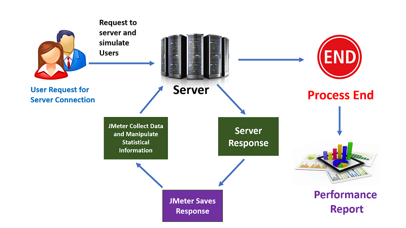
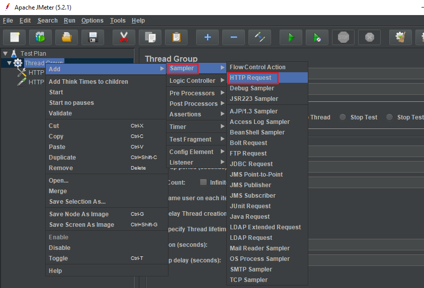

In this article, we will learn how to use JMeter to perform testing in our project. Let's get started.

<br>

## Table of contents
- [Introduction to JMeter](#introduction-to-jmeter)
- [Install and start JMeter](#install-and-start-jmeter)
- [Common elements in JMeter](#common-elements-in-jmeter)
- [Common steps in JMeter](#common-steps-in-jmeter)
- [Some steps to test Rest API](#some-steps-to-test-rest-api)
- [Some steps to test SOAP API](#some-steps-to-test-soap-api)
- [Version of JMeter](#version-of-jmeter)
- [Wrapping up](#wrapping-up)


<br>

## Introduction to JMeter


The Apache JMeter is pure Java open source software, which was first developed by **Stefano Mazzocchi** of the Apache Software Foundation, designed to load test functional behavior and measure performance. JMeter originally is used for testing Web Application or FTP application. Nowadays, it is used for a functional test, database server test etc.

- Some testing types

    1. Load testing

        It's the process of putting the load through (HTTP, HTTPS, WebSocket etc) calls on any software system to determine its behavior under normal and high load conditions.

        Benefits:
        - helps identify maximum requests a software system can handle.
        - helps determine the point of a bottleneck due to which application starts degrading performance. Load testing is effective when we simulate real user scenario.

    2. Stress testing

        When we generate load on the system beyond normal usage (high load) to understand application/system behavior, we call it stress testing.

        Benefits:
        - Stress testing is done to know the limits of an overall system, understand kind of errors thrown during such load and how the end user is affected.
        - helps in planning for events when a much higher load is expected by provisioning more infrastructure or optimizing applications. 

- How JMeter works

    

<br>

## Install and start JMeter
1. Download Apache JMeter at [Apache JMeter](https://jmeter.apache.org/download_jmeter.cgi) with Binaries version.

2. Install JDK to run Apache JMeter.

3. Unzip Apache JMeter rar file. At **bin** folder of **apache-jmeter-5.2.1**, double click in ```ApacheJMeter.jar``` file.


    

    Then, we have result:

    

<br>

## Common elements in JMeter
1. Thread Groups

    This element helps us to fake the number of users the we need to send request, the finished time of the test case - duration, or the delay time between users - ram-up period.

2. Config Element

    This element makes us easily to create Http request, FTP request, Database connection, also support to embbeded java code in it.
    
    Below is some smaller elements that we need to consider:
    - The HTTP will contains some functionalities:

        - HTTP Header Manager
        - HTTP Cookie Manager
        - HTTP Cache Manager
        - HTTP Request Defaults
        - HTTP Authorization Manager
        - Java Request Defaults
        - DNS Cache Manager
        - Login Config Element
        - Simple Config Element

    - The Database connection will include:

        - JDBC Connection Configuration

    - Customize java code

        - Random variable
        - User Defined Variables
        - Counter

3. Listeners

    This element helps us to have the background about the ability of system when utilizing load testing, stress testing. All data of test case will be combine to visualize in Tree, Table or Graph. The result can be saved in file.

    It will contain some features that we need to remember:
    - View Result Tree
    - View Results in Table
    - Response Time Graph
    - Graph Results
    - Bean Shell Listener
    - Generate Summary Results
    - Save Responses to a file

4. Logic Controllers

    If in a test plan, our request is defined that based on some logic flows, we need to use Logic Controllers. It contains some statements that we need:
    - If Controller
    - Loop Controller
    - While Controller
    - ForEach Controller
    - Switch Controller
    - Random Controller
    - Random Order Controller
    - Once Only Controller
    - Throughput Controller

5. Assertions

    It helps us to check whether responses that we received in the limited time or not.

6. Processors

    This elements contains ```PreProcessors``` and ```PostProcessors```. It is used to intercept the request after or before sending it.

    Normally, we will use **BeanShell PreProcessors** or **BeanShell PostProcessors**.

<br>

## Common steps in JMeter
1. Add thread groups

    

    Then, we have:

    

    - Number of Threads (users): the number of concurrent users that will be run on each node.
    - Ram-up period (seconds): This is the amount of time (in seconds) that we would like the concurrent users to be injected. This is the overall time taken to get from 0 to **the number of users**.

        If we have 100 users and the Ram-up period is 100 seconds, the delay time between users is 1 second (100 seconds / 100 users).

    - Duration (seconds): the number (in seconds) we would like run the test for.
    - Loop count: the amount of time to test

    Below is the difference between Thread count and loop count.

    


2. Add Http Header

    

    Then, we have a screen of the Http Header Manager:

    

    In HTTP Header Manager, we can have some notices:
    - Header Stored in the Header Manager: the List view will contain all key-values of header such as token, content-type, ...

    - Add button: To insert a row in the List View of **Header Stored in the Header Manager**, we will click Add button.

    - Save button: We will save our this test case into our disk.


3. Add Http Request or Http Request Default

    

    Then, we have:

    

    In the screen of Http Request, we need to remember some weird things:
    - In Web Server

        - Protocol [http]: That is the protocol that we use to test such as http, https, ftp, ...
        - Server Name or IP
        - Port number
    
    - Http Request

        - Method: It contains some http request methods such as GET, POST, PATCH, PUT, DELETE, HEAD, OPTIONS, TRACE, PROPFIND, PROPPATCH, MKCOL, COPY, MOVE, LOCK, UNLOCK, REPORT, SEARCH, MKCALENDAR.

        - Path: This is URI of URL. For example: if we have address of google: **https://google.com/search/jmeter**. So, the Path for this case is **/search/jmeter**.

        - Content encoding: the encoding for our data like UTF-8, UTF-16, ...

        - Parameters
        - Body Data: With POST, PATCH request, we need to pass an object, then we need to fill that object into Body Data text box.
        - File Upload

4. Add some **Listeners** to view the results

    

    - Use **View Results in Table**

        Choose **View Results in Table** in **Listener**. Then, we have:

        

        The columns that you are probably most interest in are the Sample Time (ms) and Latency (not displayed in example) columns.
        - **Latency**: The number of milliseconds that elapsed between when JMeter sent the request and when an initial response was received.

        - **Sample Time**: The number of milliseconds that the server took to fully serve the request (response + latency).

        Assuming that we have data of **View Results in Table** like the below image:

        

        Based on data from the above table, we can find that the range of Sample Time was 128-164 ms. This is a reasonable response time for a basic homepage (which was about 55 KB). If our web application server is not struggling for resources, as demonstrated in the example, our Sample Time will be influenced primarily by geographical distance (which generally increases latency) and the size of the requested item (which increases transfer time).

        So, our server survived our simulation of 50 users accessing our 55 KB WordPress homepage over 10 seconds (5 every second), with an acceptable response.

    - Use **Summary Report**

        If we want to have a report about this testing, we can choose functionality **Summary Report** of **Listener**.

        

        This ```Summary Report``` will contains some specific notices:
        - Label: the name of request
        - Sample: the number of requests
        - Average: the average time to process request.
        - Min: the minimum time to process request.
        - Max: the maximum time to process request.
        - Std. Dev: the standard deviation of requests.
        - Throughput: the number of request per seconds of Average.
        - bytes: The average bytes of requests.
        - responseKB/sec = (avg.bytes*thoughput)/1024

<br>

## Some steps to test Rest API

In order to test Restfule API, we will use some steps in the [Common steps in JMeter](#common-steps-in-jmeter) section.

Testing a REST Webservice is very similar as you only need to modify in HTTP Request.
- Method: to select the one you want to test
- Body Data: which can be JSON, XML or any custom text

We may also need to modify **HTTP Header Manager** to select the correct **Content-Type**.

<br>

## Some steps to test SOAP API
1. Create SOAP request test plan

    In Apache JMeter's screen, we will choose File --> Templates.

    

    Then, we have a Templates dialog.

    

    After choosing **Building SOAP Web Service Test Plan**, click **Create** Button, then we have result is:

    

2. Fill information of SOAP request

    

    In **HTTP Request Defaults**, we have to change some features:
    - Protocol [http]: use protocol that we use to test such as http, https, ftp, ...
    - Server Name or IP
    - Port Number
    - Path: with this feature, we also modify as same as in the Path of section [Common steps in JMeter](#common-steps-in-jmeter)

    After that, we will fill SOAP Message into **Body Data** text area.

    


3. Add **HTTP Header Manager** into SOAP request

    Right click Test Plan, then choose Add -> Config Element --> HTTP Header Manager.

    

    Then, we have:

    

    Next, we will update values for this HTTP Header Manager. Some webservices may not use SOAPAction in this case remove it.

    


<br>

## Version of JMeter

|       Version       |            JDK's version             |
| ------------------- | ------------------------------------ |
| 1                   | first official release               |
| 2.13                | JDK 6+                               |
| 3                   |	Java 7+                              |
| 3.1                 | Java 7+                              |
| 3.2                 | Java 8+                              |
| 3.3                 | Java 8                               |
| 4                   | Java 8 / 9                           |


<br>

## Wrapping up
- JMeter is compatible with Java 8 or higher.

- By default JMeter runs with a heap of 1 GB, this might not be enough for your test and depends on your test plan and number of threads you want to run.

- In this testing, we should remember that:

    - Throughput: It is the most important index that we need to care about. It represents the process ability of server under the load testing. The higher the index, the better the performance of system.

    - Deviation: It is used to compare with the average index. The lower the index, the better the performance of system.

- In order to utilize the maximum of JMeter, we should combine with checking the working of CPU and RAM.

- Following are the list of protocols supported by JMeter:

    - Web – HTTP, HTTPS sites ‘web 1.0’ web 2.0 (ajax, flex and flex-ws-amf).
    - Web Services – SOAP / XML-RPC
    - Database via JDBC drivers
    - Directory – LDAP
    - Messaging Oriented service via JMS
    - Service – POP3, IMAP, SMTP
    - FTP Service

<br>

Refer:

[https://itnext.io/load-testing-using-apache-jmeter-af189dd6f805](https://itnext.io/load-Testing-using-apache-jmeter-af189dd6f805)

[https://viblo.asia/p/cach-su-dung-jmeter-cho-performance-va-load-testing-1VgZvpx95Aw](https://viblo.asia/p/cach-su-dung-jmeter-cho-performance-va-load-Testing-1VgZvpx95Aw)

[https://www.edureka.co/blog/load-testing-using-jmeter/](https://www.edureka.co/blog/load-testing-using-jmeter/)

[https://www.bravebits.co/load-testing-su-dung-tool-jmeter/](https://www.bravebits.co/load-testing-su-dung-tool-jmeter/)

[https://www.digitalocean.com/community/tutorials/how-to-use-apache-jmeter-to-perform-load-testing-on-a-web-server](https://www.digitalocean.com/community/tutorials/how-to-use-apache-jmeter-to-perform-load-testing-on-a-web-server)

[https://flood.io/blog/jmeter-tutorial-how-to-use-jmeter-functions/](https://flood.io/blog/jmeter-tutorial-how-to-use-jmeter-functions/)

<br>

**Introduce the basic elements of JMeter**

[https://www.guru99.com/jmeter-element-reference.html](https://www.guru99.com/jmeter-element-reference.html)

<br>

**SOAP with JMeter**

[https://jmeter.apache.org/usermanual/build-ws-test-plan.html](https://jmeter.apache.org/usermanual/build-ws-test-plan.html)

[https://jmetervietnam.wordpress.com/2019/04/14/bai-5-config-api-web-service-tren-jmeter-soap/](https://jmetervietnam.wordpress.com/2019/04/14/bai-5-config-api-web-service-tren-jmeter-soap/)

<br>

**Create test script Web application by using Recording in JMeter**

[https://jmetervietnam.wordpress.com/2019/07/02/bai-7-huong-dan-tao-test-script-web-application-bang-cach-recording-tren-jmeter/](https://jmetervietnam.wordpress.com/2019/07/02/bai-7-huong-dan-tao-test-script-web-application-bang-cach-recording-tren-jmeter/)