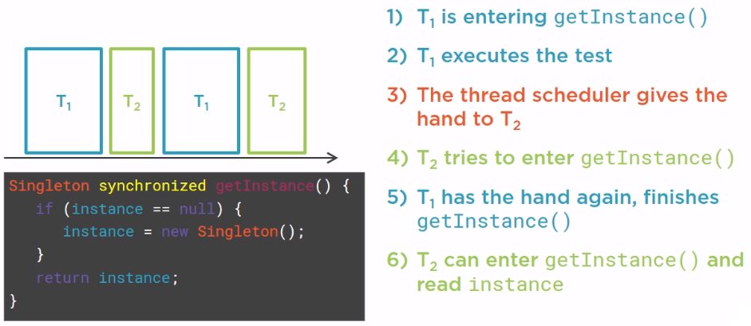
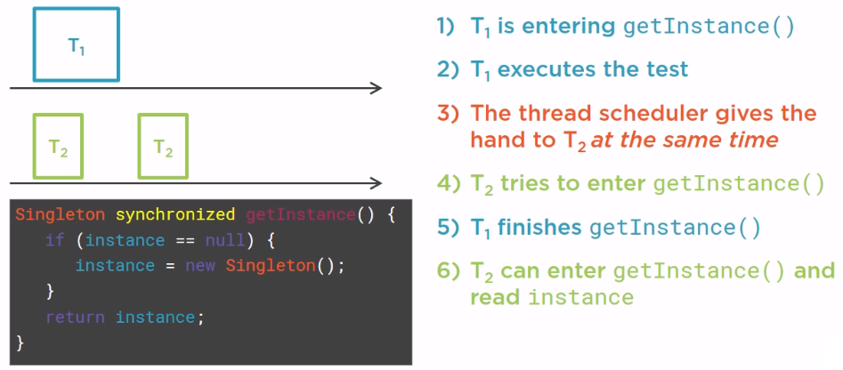
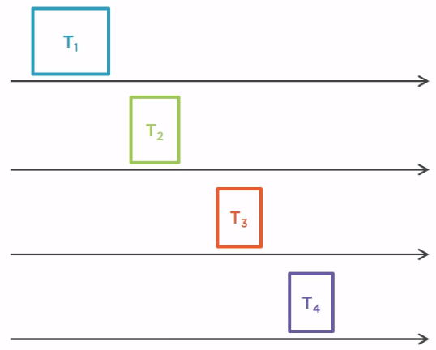
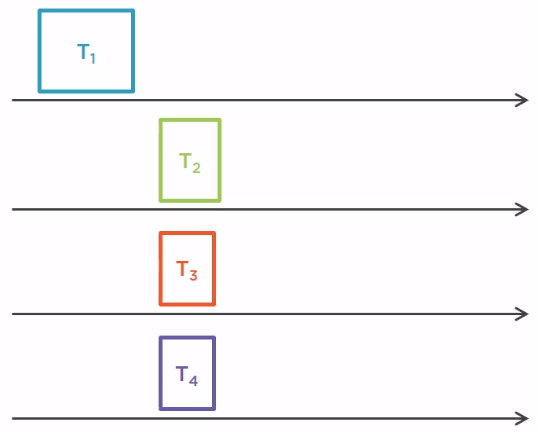
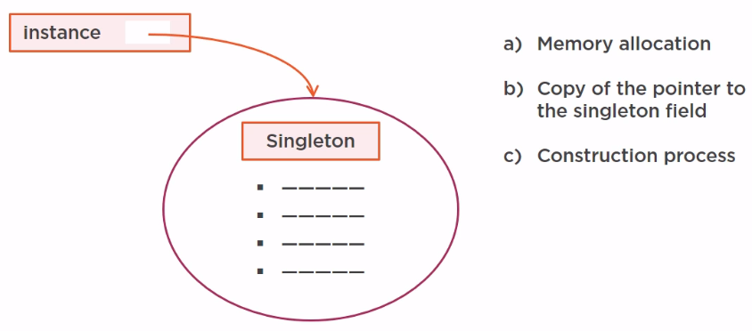
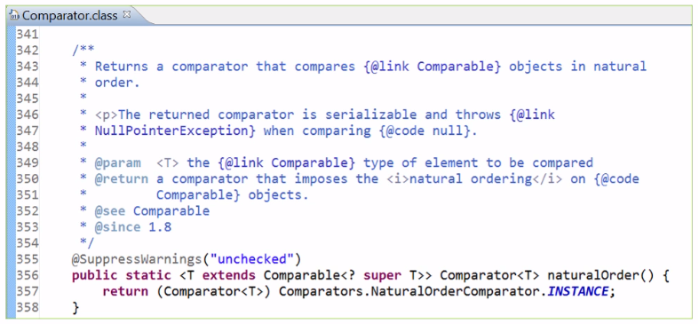

In this article, we will find something out about ways to create Singleton class in Java. Before understanding it, we should read up on this [Singleton class](https://ducmanhphan.github.io/2019-10-28-Singleton-Pattern/).

Let's get started.

<br>

## Table of contents
- [Eager Initialization Singleton class](#Eager-Initialization-Singleton-class)
- [Lazy Initialization Singleton class](#Lazy-Initialization-Singleton-class)
- [Thread-safe Singleton class](#Thread-safe-Singleton-class)
- [Double-checking Singleton class](#Double-checking-Singleton-class)
- [Bill Pugh Singleton class](#Bill-Pugh-Singleton-class)
- [Enum Singleton class](#Enum-Singleton-class)
- [Wrapping up](#wrapping-up)

<br>

## Eager Initialization Singleton class

1. Implementation

    - With public final field

        ```java
        public class Singleton {
            public static Singleton instance = new Singleton();

            private Singleton() {}

            // do other things
            // ...
        }
        ```

    - With static factory

        ```java
        public class Singleton {
            private static Singleton instance = new Singleton();

            private Singleton() {}

            public static Singleton getInstance() {
                return instance;
            }

            // do other things
            // ...
        }
        ```

    These versions have the same performance because modern JVM implementations are almost certain to inline the call to the static factory method and the public final field.

2. Benefits and Drawbacks

    - Benefits

        - With public final field

            - The declarations make it clear that the class is a singleton: the public static field is final, so it will always contains the same object reference.

            - The public final field version is simpler than the static factory version.

        - With static factory

            - It gives us the flexibility to change the our mind about whether the class should be a singleton without changing its API.

            - Applying with generic types.            

    - Drawbacks

        - They only work in single-threaded environment.

        - It takes memory because static fields are initialized at class loading time, so an ```instance``` variable is created when our application still do not use it.

        - We still do create many instances of ```Singleton``` class because we can invoke the private constructor reflectively with the aid of the ```AccessibleObject.setAccessible()``` method.

            ```java
            Constructor[] constructors = Singleton.class.getDeclaredConstructors();
            Constructor constructor = constructors[0];
            constructor.setAccessible(true);
            Singleton tmpSingleton = (Singleton) constructor.newInstance(new Object[0]);
            ```

            To solve this problem, we need to modify the constructor of ```Singleton with public final field```'s version or the static method - ```getInstance()``` of ```Singleton with static factory```'s version to make it throw an exception if it's asked to create a second instance.

            ```java
            public class Singleton {
                private static boolean isCreatedInstance = false;

                private static final Singleton instance = new Singleton();

                private Singleton() {
                    if (isCreatedInstance) {
                        throw new IllegalStateException();
                    } else {
                        isCreatedInstance = true;
                    }
                }

                public static Singleton getInstance() {
                    return instance;
                }

                // do other things
                // ...
            }
            ```

<br>

## Lazy Initialization Singleton class

1. Implementation

    ```java
    public class Singleton {

        private static final Singleton instance = null;

        private Singleton() {}

        public static Singleton getInstance() {
            if (Objects.isNull(instance)) {     // Use Objects with Java 7 or later version
                singleton = new Singleton();
            }

            return singleton;
        }

    }
    ```

2. Benefits and Drawbacks

    - Benefits

        - This way prevents the problem about using singleton with static final field when we do not want to create singleton class's instance at class loading time.

        - Exception handling will be used in the method.

    - Drawbacks

        - Only use in single-threaded environment.

        - Reflection attacks.

<br>

## Thread-safe Singleton class

1. Implementation

    ```java
    public class Singleton {

        private static final Singleton instance = null;

        private Singleton() {}

        public static synchronized Singleton getInstance() {
            if (Objects.isNull(instance)) {     // Use Objects with Java 7 or later version
                singleton = new Singleton();
            }

            return singleton;
        }

    }
    ```

    This way will improve the ```Lazy Initialization Singleton class```'s version when it can use in multi-threaded environment.

    Let's have a closer look at Singleton pattern on single core and two cores CPU.
    - Singleton on a Single core CPU

        

    - Singleton on a two cores CPU

        

    - Singleton on a multiple cores CPU

        Let's suppose we have four cores.

        

        T1 thread is running first, then T2 needs to wait for T1 to leave the synchronized method to be able to read instance. And if on our two other cores, we have two other threads, T3 and T4, who also want to read our instance variable, well those threads will have to wait for T2 to leave the getInstance() method.
        
        

        At this point, instance has been created, so all the reads could happen at the same time, but since our getInstance() method is synchronized, no more than one thread can enter it at a given time. So no more than one thread can read instance at the same time, and this is really a performance hit because the more cores we have, the more time we're going to lose since the reads cannot be made in parallel. Of course, all the reads could be made in parallel in a correct way, but the synchronization of the method does not allow that.

2. Benefits and Drawbacks

    - Benefits

        - Use in multithread environment.

        - It still has the benefits of ```Lazy Initialization Singleton class```'s version.

    - Drawbacks

        - ```getInstance()``` method is synchronized so it causes slow performance as multiple threads can't access it simultaneously.

<br>

## Double-checking Singleton class

1. Implementation

    ```java
    public class Singleton {

        private volatile static final Singleton instance;

        private Singleton() {}

        public static Singleton getInstance() {
            if (Objects.isNull(instance)) {     // Use Objects with Java 7 or later version
                synchronized (Singleton.class) {
                    if (Objects.isNull(instance)) {
                        instance = new Singleton();
                    }
                }
            }

            return instance;
        }
    }
    ```

    When we see about this code, we can find that we still have encountered the performance overhead at the first time, only one thread will be entered into the synchronized block of static class, the remained threads will be waited for some times.

    After the first moment, the performance for using Singleton class do not affected by the first null checked condition.

    Note that using ```volatile``` keyword for ```instance``` variable, it will tell the compiler that always to read / write from the main memory, not use CPU cache or local thread stack.

    - Some possible issues with Double-Checking Singleton

        - Singleton on a Multiple Cores CPU

            

            In our Singleton class, we have a private static field called **instance** of type Singleton. It is just a pointer that will point to our only instance of the Singleton class. But the creation of this object is, in fact, a two step process.
            - Memory Allocation     (a)
            - The copy of the pointer that points to the newly allocated memory into the Singleton field, which is called **instance**.     (b)
            - The construction process of the Singleton object. This allocated memory belongs to the Singleton class, it has a certain number of fields, certain number of methods, ...     (c)

            Between the **b** step and the **c** step, we do not know which one is going to be executed first. If the construction process is executed first, then the copy of the pointer, everything will be fine because we cannot observe a non null instance pointer that points to a non fully built piece of memory.
            
            But if the copy of the pointer occurs first, and that we read this instance field in another thread, then we will have visibility on a portion of memory that has been allocated but is not fully initialized yet, and this weird case could happen in the double-check locking. We do not have the guarantee that this second case will not happen, and if it does then very bad things can happen to our applications because basically what we can do is call methods on an object that is not fully built, that is completely corrupted at this step.

2. Benefits and Drawbacks

    - Benefits

        - Performance overhead gets reduced, so it can be use in high performance multithread environment.

        - Having benefits of ```Thread-safe Singleton class```'s version.

    - Drawbacks

        - At the first time, it can affect performance.

        - It does not have happens-before link when we do forget to use **volatile** keyword with **instance** variable.

            ```java
            private static final Singleton instance;
            public static Singleton getInstance() {
                if (Objects.isNull(instance)) {     // Use Objects with Java 7 or later version
                    synchronized (Singleton.class) {
                        if (Objects.isNull(instance)) {
                            instance = new Singleton();
                        }
                    }
                }

                return instance;
            }
            ```

            Based on the above our code, we will consider some cases:
            - If **instance** is not null, we read it and return it.

                Here we have the read operation on the **instance** field of the Singleton class. Is it a synchronized or volatile read?

                It is no, because **instance** is not a volatile variable, and this test is not a synchronized block. We have written it outside of the synchronized block on purpose, so it is not inside this synchronized block, then it is not a synchronized read neither.

            - If **instance** is null, we create it and return it.

                Obviously there is a write operation. Is it a synchronized or volatile write?

                It is not a volatile write because **instance** is not a volatile variable, but it takes place in a synchronized block, so it is a synchronized write.

            So we have a non synchronized read that is supposed to return the value set by a synchronized write. Do we have the guarantee that the read will get the value set by the write? For that we need a **happens-before** link.

            For that to have this guarantee, we have a **happens-before** link between read and write operation. The read operation is outside of the synchronized block, and the fact is we do not have this **happens-before** link because **happens-before** link are created between synchronized or volatile writes and synchronized or volatile reads.
            
            So this code is buggy because there is no **happens-before** link between the read returning the value and the write that sets it.

            This is very subtle bug indeed, it is not very obvious to see this bug.

<br>

## Bill Pugh Singleton class

1. Implementation

    ```java
    public class Singleton {
        private Singleton() {}

        public static Singleton getInstance() {
            return BillPughSingleton.instance;
        }

        private static class BillPughSingleton {
            private static final Singleton instance = new Singleton();
        }
    }
    ```

2. Benefits and Drawbacks

    - Benefits

        - Thread safe but does not using synchronized keyword.

        - Lazy initialization.

        - Simple and easy understand.

    - Drawbacks

        - Reflection attacks.

<br>

## Enum Singleton class

1. Implementation

    ```java
    public enum Singleton {
        INSTANCE;

        // other methods
    }
    ```

    According to the [Java Language Specifications](https://docs.oracle.com/javase/specs/jls/se7/html/jls-8.html#jls-8.9), we have:

    ```
    The final clone method in Enum ensures that enum constants can never be cloned, and the special treatment by the serialization mechanism ensures that duplicate instances are never created as a result of deserialization. Reflective instantiation of enum types is prohibited. Together, these four things ensure that no instances of an enum type exist beyond those defined by the enum constants.
    ```

    So, we allegedly get protection against serialization, clone and reflection attacks for free.

2. Benefits and Drawbacks

    - Benefits

        - It is really concise.
        - prevent serialization or reflection attacks.

    - Drawbacks

        - Do not have lazy initialization.
        - Do not inherit from another base class, because enums can not extends another class. If we want to mimic inheritance, we might want to consider the interface mixin pattern in this [New Java 8 "Object Support Mixin Pattern" for overriding Object.equals(), hashCode(), toString() and compareTo()](http://minborgsjavapot.blogspot.com/2014/10/new-java-8-object-support-mixin-pattern.html).

3. Examples

    - Comparator interface

        

<br>

## Wrapping up


<br>

Refer:

[https://stackoverflow.com/questions/44171031/why-java-singleton-needs-to-prevent-the-reflection-attack](https://stackoverflow.com/questions/44171031/why-java-singleton-needs-to-prevent-the-reflection-attack)

[http://minborgsjavapot.blogspot.com/2015/01/enforcing-java-singletons-is-very-hard.html](http://minborgsjavapot.blogspot.com/2015/01/enforcing-java-singletons-is-very-hard.html)

[https://technonstop.com/java-singleton-reflection-and-lazy-initialization](https://technonstop.com/java-singleton-reflection-and-lazy-initialization)

[https://dzone.com/articles/singleton-bill-pugh-solution-or-enum](https://dzone.com/articles/singleton-bill-pugh-solution-or-enum)

[https://codepumpkin.com/breaking-singleton-using-reflection-and-enum-singleton/](https://codepumpkin.com/breaking-singleton-using-reflection-and-enum-singleton/)

[https://medium.com/@sinethneranjana/5-ways-to-write-a-singleton-and-why-you-shouldnt-1cf078562376](https://medium.com/@sinethneranjana/5-ways-to-write-a-singleton-and-why-you-shouldnt-1cf078562376)

[http://www.tellmehow.co/concept-singleton-class-java-detailed/#how-to-make-singleton-class](http://www.tellmehow.co/concept-singleton-class-java-detailed/#how-to-make-singleton-class)

[https://www.geeksforgeeks.org/java-singleton-design-pattern-practices-examples/](https://www.geeksforgeeks.org/java-singleton-design-pattern-practices-examples/)

<br>

**Concurrency Singleton pattern**

[https://stackoverflow.com/questions/12878012/concurrent-calls-of-singleton-class-methods](https://stackoverflow.com/questions/12878012/concurrent-calls-of-singleton-class-methods)

[https://crunchify.com/thread-safe-and-a-fast-singleton-implementation-in-java/](https://crunchify.com/thread-safe-and-a-fast-singleton-implementation-in-java/)

[https://dzone.com/articles/singleton-patterns-20-years-later](https://dzone.com/articles/singleton-patterns-20-years-later)

[https://www.journaldev.com/171/thread-safety-in-java-singleton-classes-with-example-code](https://www.journaldev.com/171/thread-safety-in-java-singleton-classes-with-example-code)

<br>

**Double checked locking**

[https://javarevisited.blogspot.com/2014/05/double-checked-locking-on-singleton-in-java.html](https://javarevisited.blogspot.com/2014/05/double-checked-locking-on-singleton-in-java.html)

[http://www.cs.umd.edu/~pugh/java/memoryModel/DoubleCheckedLocking.html](http://www.cs.umd.edu/~pugh/java/memoryModel/DoubleCheckedLocking.html)