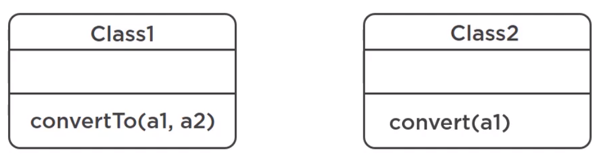

In this article, we will learn how to fix object oriented abusers. Let's get started.

<br>

## Table of contents
- [Introduction to Object oriented Abusers](#introduction-to-object-oriented-abusers)
- [Conditional complexity](#conditional-complexity)
- [Refused request](#refused-request)
- [Temporary field](#temporary-field)
- [Alternative classes with different interfaces](#alternative-classes-with-different-interfaces)
- [Wrapping up](#wrapping-up)


<br>

## Introduction to Object oriented Abusers

Object-oriented abusers means that code that doesn't follow object-oriented programming principles.

<br>

## Conditional complexity

Conditional complexity simply means a complex switch operator or a sequence of if-else statements. So, how bad can an if statement get?

For example, we have conditional complexity.

```java
class SomeClass {
    String doSomething() {
        if(someCondition) {
            if(otherCondition) {
            } else if(){
            }
        } else if() {
        } else {
        }
    }
}
```

1. Complex conditionals ofet mean

    - Missing domain objects.
    - Not using polymorphism.
    - Not using inheritance.

2. Conditional Complexity issues

    - Starts simple, but gradually harder to understand as logic is added.
    - high likelihood of breaking.
    - Breaks the Open/Closed principle.

    For example, the online shop continues getting orders, and as we can see, we are adding wine and cheese to an order.

    ```java
    public static void main(String[] args) {
        Order order = new Order(getUsCustomer());
        order.add(new Wine());
        order.add(new Cheese());

        System.out.println("Items added for US customers: " + order.getItems());
    }
    ```

    As we all know, wine is an age restricted item, we can't just sell it to anyone. We must comply with the law, so we have to check the age of the customer.

    ```java
    poublic class Order {

        private Customer customer;
        private List<Item> items;
        private String voucher;

        public Order(Customer customer) {
            this.items = new ArrayList<>();
            this.customer = customer;
        }

        public Order(List<Item> items, String voucher) {
            this.items = items;
            this.voucher = voucher;
        }

        public boolean add(Item item) {
            if (item.isAgeRestrictedBeverage()) {
                if (customer.getAge() < 21) {
                    System.out.println("Cannot add age restricted item to order");
                    return false;
                }
            }

            return items.add(item);
        }
    }
    ```

    With above add() method of Order class, we are only selling to US customers. The online shop has started to sell broad, this is why we created the Address and Country classes.

    If we look at age restriction in other countries, we will see that it's not simle.

    |          Country          |      Age     |
    | ------------------------- | ------------ |
    | US                        | 21           |
    | EU countries              | 18           |
    | Canada                    | 18 or 19     |

    The legal limit in European countries is 18, and in Canada this depends on the provice, some have the limit of 18, some 19. Now, we will provide some check part for add() method.

    ```java
    public class Order {

        // ...

        public boolean addWithCheck(Item item) {
            Objects.requireNonNull(customer);
            Country country = customer.getAddress().getCountry();

            if (item.isAgeRestrictedBeverage()) {
                int age = customer.getAge();

                if (age < 21 && country.toString().equals("US")) {
                    System.out.println("Cannot add age restricted item to order");
                    return false;
                }

                if (customer.getAge() < 18 && country.toString().equals("France") ||
                    customer.getAge() < 18 && country.toString().equals("Spain")) {
                    System.out.println("Cannot add age restricted item to order");
                    return false;
                }

                if (country.toString().equals("Canada")) {
                    String province = customer.getAddress().getProvince();

                    if (age >= 18 && "Quebec".equalsIgnoreCase(province) || "Alberta".equalsIgnoreCase(province)) {
                        return items.add(item);
                    } else if (age >= 19) {
                        return items.add(item);
                    } else {
                        System.out.println("Sorry, you're under age");
                        return false;
                    }
                }
            }

            return items.add(item);
        }
    }
    ```

    So, when we read the above code, we find that it's really complex. This isn't looking nice, and is going to get quite cumbersome to maintain as we add more and more countries.

3. How to fix Conditional Complexity

    One way is to replace conditionals with polymorphism, and that's what we're going to do.

    

    Instead of writing if-else logic, we are going to let Java find the concrete country for us and execute the necessary codes. Refactoring this can get a little messy, and we find it useful when we have two implementation versions next to each other so we can compare.

    ```java
    public class Order {
        // ...

        public boolean addWithCheck2(Item item) {
            if (item.isAgeRestrictedBeverage()) {
                if (this.customer.getAge() < getLegalAgeFor(this.customer))
            }

            return items.add(item);
        }

        private int getLegalAgeFor(Customer customer) {
            Country country = customer.getAddress().getCountry();
            if (country instanceof Canada) {
                Canada canada = (Canada) country;
                return canada.getLegalDrinkingAge(customer.getAddress().getProvince());
            }

            return country.getMinimumLegalDrinkingAge();
        }

    }

    public class Spain extends Country {
        @Override
        public int getMinimumLegalDrinkingAge() {
            return 18;
        }
    }

    public class France extends Country {
        @Override
        public int getMinimumLegalDrinkingAge() {
            return 18;
        }
    }

    public class US extends Country {
        @Override
        public int getMinimumLegalDrinkingAge() {
            return 21;
        }
    }

    public class Canada extends Country {
        @Override
        public int getMinimumLegalDrinkingAge() {
            return 18;
        }

        public int getLegalDrinkingAge(String province) {
            if (liberalProvince(province)) {
                return getMinimumLegalDrinkingAge();
            }

            return 19;
        }

        private static boolean liberalProvince(String province) {
            return "Quebec".equalsIgnoreCase(province) ||
                   "Alberta".equalsIgnoreCase(province);
        }
    }
    ```

    And there are many, many more ways to refactor conditional complexity. So, we only provide the specific way - replace with delegation, which is simply implementing the strategy pattern.

    


4. Benefits achieved

    - Each piece of logic encapsulated.

    - Much lower chance of breaking existing code when adding more related logic.


<br>

## Refused bequest
Bequest means the act of giving or leaving personal property by a will. So if we have two persons, one might say, have my stuff, have my car and my property. This is a bequest. But if the other person doesn't want to inherit it, then he or she may refuse that bequest.


So, in the world of object oriented programming, a refused bequest happens when a subclass inherits fields and methods that it doesn't need.


For example, imagine we make a ```Cat``` clas extends the ```Dog``` class because we want to inherit and reuse the ```getPetName()``` method or something else, but we also happen to inherit the ```bark()``` method, and that doesn't make sense.

Another example could be our order. We could have extended the ```ArrayList``` class, which is part of Java, and we would inherit the ```add()``` method and the ```remove()``` methods, which makes sense on an order. But we would also inherit ```lastIndexOf()``` method and a whole bunch of methods that make no sense whatsoever on an order.

1. Refused bequest issues

    - Objects inherit behavior that doesn't belong to them - makes coding confusing.

    - Leads to unexpected behavior.

2. How to fix Refused Bequest

    

    The simplest possible solution that may be suitable is to simply rename the methods to be abstract enough to fit all scenarios.

    For example, we have an ```Item``` class that have abstract method ```isAgeRestrictedBeverage()```, which means that all subclasses are forced to implement it.
    
    ```java
    public abstract class Item {
        public abstract double price();
        public abstract boolean isAgeRestrictedBeverage();

        @Override
        public String toString() {
            return this.getClass().getSimpleName();
        }
    }
    ```
    
    And which classes implement this? All concrete items, and this method makes sense on milk and wine because they are beverages, but not so much on cheese and chocolate. Checking if cheese is an age-restricted drink makes no sense, so we can simply rename this method to ```isAgeRestrictedItem()```, and now this makes sense for all items, including those that aren't food.

    ```java
    public abstract class Item {
        // ...
        public abstract boolean isAgeRestrictedItem();
    }
    ```

    We are lucky to get away with such a simple fix, but we don't always get that lucky. If renaming can't be applied, then we need to push a method or a field down, either push down to existing class, or we would first create a new class, or abstract class, make it part of our inheritance tree, and then move it down.

    

    In our case, we probably create a Beverage class and move the alcoholicBeverage() method down to that class. Just be careful and do not create really large inheritance trees.

    Some automated code quality systems recommend a limit of levels max = 7, but it depends on the application.

    Note that we should favor composition over inheritance. Our code will be much more flexible and maintainable. We might remember that code smells indicate deeper problems. If we see refused bequest in our inheritance tree, we could fix it with renaming or pushing methods down, but we should definitely think if our inheritance tree is well designed at all and perhaps we could completely restructure it. 

<br>

## Temporary field

The temporary field code smell occurs when we have one or more variables, or rather class fields, that are null most of the time and contain values only under certain circumstances.

For example, we have some algorithm methods that require a lot of inputs and we find no way around it.

```java
class SomeClass {
    // ...

    double doSomething(arg1, arg2, arg3, arg4);
}
```

We want to avoid the long parameter list code smell, so what we could do is move these parameters out and make them class fields.

```java
class SomeClass {
    arg1
    arg2
    arg3
    arg4

    double doSomething();

}
```

So now these fields belong to the entire class and we initialize them in one way or another, but only one method uses them. The rest of the class implementation doesn't care about them. If we are the one who implemented this, we might remember what and why, but other maintainers are likely to be confused - **Why is this field null half of the time?**. They could expect these fields to contain data, but they're empty most of the time. This code smell indicates low cohesion of a class.

In the context of programming, cohesion refers to the degree to which the elements inside a class or a module belong together. To achieve high cohesion inside a class, we should keep related things, fields, and methods together.

1. How to fix Temporary field

    

    We can fix temporary field in several ways, but the two most common ways are extract class, we take those fields and that one method and move them to a dedicated class, and the second way is actually very similar, it's called replace method with method object. The only difference is that with the first one, our new class might have more responsibilities, and the second one means essentially creating a dedicated class just for our algorithm. So it's an algorithm object.

    For example, if we had an additional method in our Order class that required too many parameters and there was no easy way to untangle them, we could replace the entire implementation with the creation of a separate object and call the method on that. Then, we could create that class and place all the logic in that class.
    
    
    
    Note that we still have our variables as class fields, but because this class is solely dedicated to one responsibility, computing our algorithm, these fields should contain data all the time or most of the time. So the issue of mostly empty fields is now gone.

2. Benefits archieved

    - better code clarity.

<br>

## Alternative classes with different interfaces

The alternative classes with different interfaces code smell occurs when two classes are similar on the inside, but are different on the outside, meaning the code is similar or almost identical, but the method name or the method signature is a bit different.

For example, we have two classes, each has a method that achieves the same thing, but on the outside, meaning their signature, may be slightly different.



1. Different interfaces issues

    - Not DRY - code is duplicated with just minor variations.

        The author Mantyla, M. V. and Lassennius, C. has stated that:

        ```
        [Alternative classes with different interfaces] code smell exposes a lack of a common interface for closely related classes, so it can also be considered a certain type of inheritance misuse.
        ```
    
2. How to fix it

    Because the two classes lack a common interface, thus one solution is to create an abstract class or an interface, and let these classes extend or implement it.
    
    

    The method in the parent class can be abstract, thus forcing a full implementation by child classes, or it may be a normal method and have a default implementation. The point is to group and link related classes so they're not entirely disconnected.
    
    But we can't always bring two different implementations under one roof. Sometimes it doesn't make sense to bring these classes together. In that case, just remove one and keep the other.

    

    For example, we have a new requirement about displaying the price in dollars and in the customer's local currency if they are not based in the US. And we have our old code:

    ```java
    public class CheckoutHanlder {
        // ...

        public double convertToCurrency(double price, String currencyTo) {
            if (currencyTo.equalsIgnoreCase("EUR")) {
                return price * 0.9;
            } else if (currencyTo.equalsIgnoreCase("CAD")) {
                return price * 1.35;
            } else {
                throw new IllegalArgumentException("Unrecognized currency: " + currencyTo);
            }
        }
    }

    public class SimpleCurrencyConverter {
        private String currencyTo;

        public SimpleCurrencyConverter(String currencyTo) {
            this.currencyTo = currencyTo;
        }

        public double convert(double price) {
            if (currencyTo.equalsIgnoreCase("EUR")) {
                return price * 0.9;
            } else if (currencyTo.equalsIgnoreCase("CAD")) {
                return price * 1.35;
            } else {
                throw new IllegalArgumentException("Unrecognized currency: " + currencyTo);
            }
        }
    }
    ```

    So we can easily two classes - SimpleCurrencyConverter and CheckoutHanlder have the same implementation about converting currency. In this case, we will not use common abstract class or interface for two classes because they're not really related, so it would not make sense for both CheckoutHanlder and SimpleCurrencyConverter classes.

    So, we'll go for option two - Combine into one. If we consider the ```Single Responsibility Principle```, one class that has one reason to change. So we're going to keep our dedicated ```SimpleCurrencyConverter``` class, and remove the method from our ```CheckoutHanlder``` class. Then, we need to replace that method with the only implementation remaining.

3. Benefits achieved

    - DRY code.

    - Single point of change.

4. When to ignore

    - When classes with different interfaces are in separate libraries we can't modify.

<br>

## Wrapping up
- Conditional complexity should be replaced with polymorphism or delegation and the strategy pattern.

- Subclasses should inherit only what we need.

- Avoid temporary fields --> indicates low cohesion and may lead to confusion.

    To solve this, we can move them and the related method to a dedicated class where they would be initialized all the time, so they would have data all the time.

- Keep a single solution for one task.

<br>

Refer:

[Java Refactoring: Best Practices](https://app.pluralsight.com/library/courses/java-refactoring-best-practices/table-of-contents)