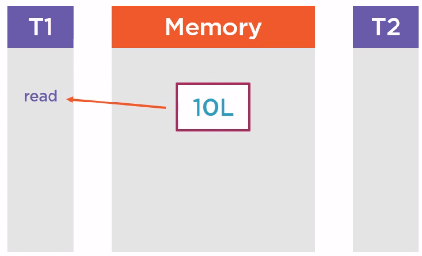
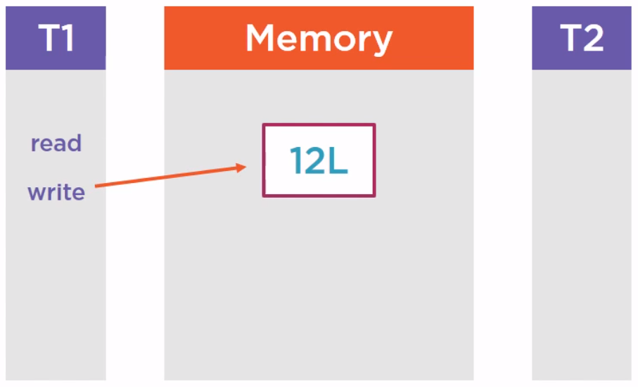
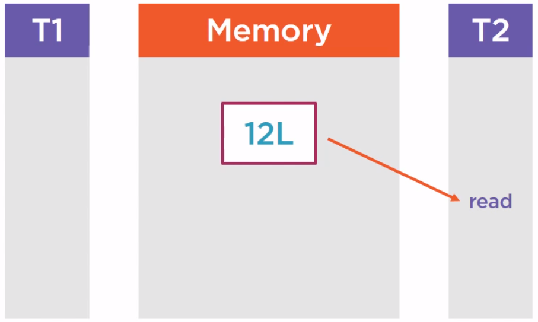
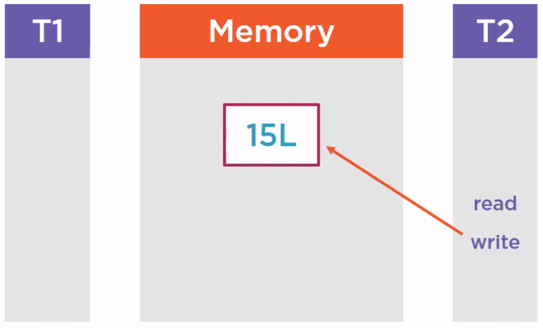

<br>

## Table of contents
- [Understanding about CASing](#understanding-about-casing)
- [Some types of Atomic variable in Java](#some-types-of-atomic-variable-in-java)
- [Understanding Adders and Accumulators](#understanding-adders-and-accumulators)
- [Wrapping up](#wrapping-up)

<br>

## Understanding about CASing

1. Introduction to CASing

    CASing means compare and swap, it is a notion that comes from the CPU, from the assembly language and that is available in the JDK.

    The starting point is a set of assembly instructions that is very low level functionalities given by the CPU. Those low level functionalities have been exposed at the API level in the JDK on the many other languages so that we can leverage them in our applications.

    - Given problem

        The problem it addresses is a classical concurrent programming problem. It is the concurrent access to shared memory. It means that several threads are trying to read and write, so read and modify the same variables of the same objects.

        Normally, we have some tools for this problem are synchronization tools, whether it is the classical synchronized block or the use of the lock interface. It works very well. It prevents several threads from modifying the same portion of memory at the same time. But in certain cases, we have more tools that would prove some efficient. In fact, synchronization has a cost and we can ask how ourselves the question, is it really always essential to use it. In fact, we use it to be sure that our code is correct. But if we didn't use it, are we really use that our code would fail. In fact, there are many cases where people forget to synchronize the modification of memory and  the code still works. What it means is that, in fact, there are many cases where real concurrency is rare.

        Below is a real problem of a portion memory which access has been synchronized. We have a first thread T1 that reads a variable, suppose it is long data type, value is 10.

        

        and we'll modify it.

        

        Then another thread is going to read it after that.

        

        Then, we also modify it.

        

        The purple rectangle on an above image is a shared portion of memory. Since we want to be sure that this memory is correct, we have synchronized its success. But in fact, when our application is running, the thread T1 and T2 are not accessing this portion of memory at exactly at the same time. They are accessing it one after another. So we know that we need to write correct code, we have used a synchronized block to protect this memory. This protection by lock is essential because if we do not do that and the two threads are writing and reading the code at exactly the same time, we will have concurrency issues race conditions.

        But in fact, when our application is running, there is no real concurrency at runtime because in that case, the thread T1 are not accessing this portion of memory at exactly the same time. And this is exactly the case where CASing precisely can be used.

    - Solution with CASing

        Compare and Swap works with three parameters:
        - The first is a location in memory, so basically, an address.
        - The second is the existing value at that location.
        - The third is a new value to replace this existing value.

        If the current value at that address is the expected value, then it is replaced by the new value and returns true. It means that between the last time we read this address and now, no other thread has modified this location. If it is not the case, it means that between the last time we read this location and read the expected value and now, some of the thread has modified this location, so we are observing real concurrency. Since the expected value is not the value at that location, we do not do any modification and we return false. And all this comparison and modification are made uninterruptible, are made in a single atomic assembly instruction.

        So during this time, we are sure that no other thread can interrupt our process. This is essential for the CASing to work.

2. Benefits of CASing

    - CASing is more efficient than synchronization if there is no real concurrency.

3. When to use

    - CASing works well when concurrency is not too high.

        In fact, if the concurrency is high, then the update operation of the memory will be tried again and again until it is accepted by all the thread, and at one given point of time, only one thread will win. All the other ones will be retrying again and again.

        The behavior of CASing system is very different from the behavior of a synchronized system. If we synchronize a portion of memory, it means that all our threads between are going to wait to access this memory. In this case of CASing, all the threads at the same time are going to access this memory, but only one will be the winner.

        So if CASing is not used in the right use case, it may create a very heavy load both on the memory and on the CPU.

<br>

## Some types of Atomic variable in Java

1. AtomicLong class

    AtomicLong is a wrapper on a long. It can be used to create counters.

    ```java
    // Create an atomic long
    AtomicLong counter = new AtomicLong(10L);

    // Safely increment the value
    long newValue = counter.incrementAndGet();
    ```

    Belows are some steps that describe how the above code works.
    - The Java API tries to apply the incrementation.
    - The CASing implementation will tell the calling code if the incrementation failed or not. It just fail if another thread modified the counter in the meantime. If the incrementation fails, then the API is going to try again until this incrementation is accepted by the CASing mechanism.

        So, if we have several threads incrementing the same counter, CASing ensures that no incrementation is lost. If we have 4 threads incrementing a counter 25 times, this counter will hold 100 as a value at the end of the day. The counter part is that more than 100 incrementations will be attempted most probably. Some of them will not be taken into account due to concurrency.

    

2. AtomicBoolean class

    Some methods of this class:
    - **get()**, **set()** methods.
    - **getAndSet(value)** method returns the current value and update this value to the past value.
    - **compareAndSet(expected, value)** method that is basically CASing method with an expected value and the new value to be set if the expected value is matched.

3. AtomicInteger class

    Some methods of this class.
    - **get()**, **set()** methods.
    - **getAndSet(value)** method.
    - **compareAndSet(expected, value)** method.
    - **getAndUpdate(unaryOp)**, **updateAndGet(unaryOp)** methods.

        **getAndUpdate()** method will return the current value and do the update.

        **updateAndGet()** will do the contrary, first update, then get a new value.

        A unary operator may be implemented using the lambda expression and it is just an operation on the current value that will compute the new value.

    - **getAndIncrement()**, **getAndDecrement()** methods

    - **getAndAdd(value)**, **addAndGet(value)** methods

        **addAndGet(value)** method will increment the current value with the past value, returns the updated value.

        **getAndAdd(value)** method returns the existing value, increment the current value.

    - **getAndAccumulate(value, binOp)**, **accumulateAndGet(value, binOp)** methods

        They takes a binary operator. This binary operator will operate and the current value at that location and the past value as a parameter to compute the new value to be set in this AtomicInteger or AtomicLong.

    - **incrementAndGet()** method

4. AtomicReference<V> class

    AtomicReference is a wrapper on the reference that is on a pointer.

    Belows are the set of methods of AtomicReference class.
    - get(), set() methods
    - getAndSet(value) method
    - getAndUpdate(unaryOp), updateAndGet(unaryOp) methods
    - getAndAccumulate(value, binOp), accumulateAndGet(value, binOp) methods
    - compareAndSet(expected, value) method

5. When to use

    Atomic variables are based on CASing. CASing is another tool to handle concurrent read and write operations on memory. This tool works in a very different way than synchronization.

    It can lead to better performances. But it should be used with care because in the case where the concurrency is very high, it will generate heavy load on both CPU and memory.

<br>

## Understanding Adders and Accumulators

1. Introduction to Adders and Accumulators

    Adders and accumulators are an introduction of Java 8. These classes are not available in Java 7 and before.

    The starting point is a fact that all the methods are built on the **modify and get** or **get and modify** concept, and the fact is that sometimes we do not need the **get** part at each modification.

    Suppose we are just creating a counter and we just want to count a certain number of events, we want to make it in a thread-safe way, so we are using an AtomicLong, for instance. Each time we increment this AtomicLong, we also get the current value of this AtomicLong, but the fact is we do not need this value at this time. All we need is the value once our process is done at the end of it.

    This is precisely the role of the LongAdder and the LongAccumulator classes introduced in Java 8. The LongAdder can be seen as an AtomicLong that does not expose the get functionality at each modification and that can optimize things.

2. How they works

    LongAdder and LongAccumulator work the same as an AtomicLong.

    The difference is that it does not return the updated value at each modification, so it can distribute the update on different cells, if they are really many threads tring to do the modifications. And at the end of the day, when we call the get() method, all the results from those different cells can be merged on that call.

    Those classes have been created to handle very high concurrency, a huge number of threads, it is quite useless to use them if it is not case.

3. Some methods of LongAdder and LongAccumulator

    For the LongAdder class:
    - **increment()**, decrement() methods

        They do not return anything.

    - **add(long)** method that takes long as a parameter.

    - **sum()**, **longValue()**, **intValue()** methods that's going to return the content of this LongAdder.

    - **sumThenReset()** method that will return the content of this LongAdder and reset the value to 0.

    For the LongAccumulator class:
    - It's built on a binary operator since this is an accumulator.
    - **accumulate(long)** method
    - **get()** method returns the value computed in this accumulator.
    - **intValue()**, **longValue()**, **floatValue()**, **doubleValue()** methods converts this accumulated value in int, long, float, double.
    - **getThenReset()** method will reset this accumulator while getting its value 

4. Source code

    ```java
    private static int counter = 0;
    
    public static void main(String[] args) {
        Runnable increThread = () -> {
            LongStream.range(0, 1_000).forEach(cnt -> counter++);
        };

        Runnable decreThread = () -> {
            LongStream.range(0, 1_000).forEach(cnt -> counter--);
        };

        ExecutorService executorService = Executors.newFixedThreadPool(8);
        List<Future<?>> futures = new ArrayList<>();

        try {
            IntStream.range(0, 4).forEach(cnt -> futures.add(executorService.submit(increThread)));
            IntStream.range(0, 4).forEach(cnt -> futures.add(executorService.submit(decreThread)));

            futures.forEach(future -> {
                try {
                    future.get();
                } catch (InterruptedException | ExecutionException ex) {
                    System.out.println(ex);
                }
            });

            System.out.println("counter = " + counter);
        } finally {
            executorService.shutdown();
        }
    }
    ```

    After running the above code, we can find that the counter variable has multiple values. So use Atomic variables, we can fix some places:\

    ```java
    private static AtomicInteger counter = new AtomicInteger(0);

    public static void main(String[] args) {
        Runnable increThread = () -> {
            LongStream.range(0, 1_000).forEach(cnt -> counter.incrementAndGet());
        };

        Runnable decreThread = () -> {
            LongStream.range(0, 1_000).forEach(cnt -> counter.decrementAndGet());
        };

        // do something
        // ...
    }
    ```

<br>

## Wrapping up

- When we need to update values or references in memory, CASing may be a better solution than locking. CASing is based on very efficient assembly instruction down to the CPU and it is, in some cases, more efficient than synchronization.

- Atomic variables are used in a case that if our threads are updating location in memory at the same time.

<br>

Refer:

[Advanced Java Concurrent Patterns by Jose Paumard](https://app.pluralsight.com/library/courses/java-concurrent-patterns-advanced/table-of-contents)

[https://www.softwaretestingclass.com/uses-of-processor-in-jmeter-tutorials-series-day-9/](https://www.softwaretestingclass.com/uses-of-processor-in-jmeter-tutorials-series-day-9/)

[https://www.guru99.com/processor-in-jmeter.html](https://www.guru99.com/processor-in-jmeter.html)