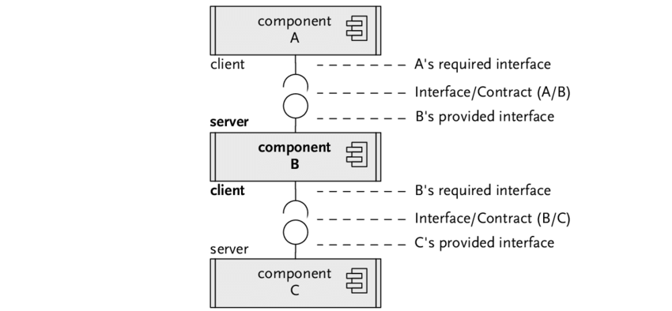
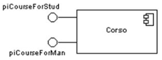
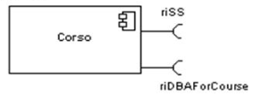
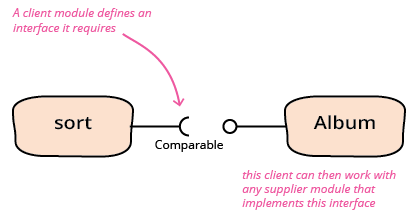
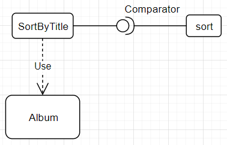
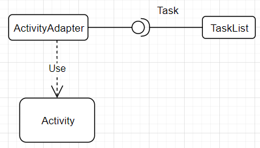
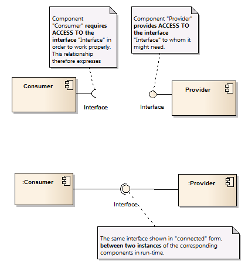

In this article, we will find something out about some types of interfaces in UML diagram. We still use these types in some architecture pattern such as Hexagonal architecture, ...

<br>

## Table of contents
- [Definition of interface in diagram](#definition-of-interface-in-diagram)
- [Provided interface](#provided-interface)
- [Required interface](#required-interface)
- [Example about interfaces](#example-about-interfaces)
- [Wrapping up](#wrapping-up)


<br>

## Definition of interface in diagram
According to [ibm.com](https://www.ibm.com/support/knowledgecenter/SS8PJ7_9.6.1/com.ibm.xtools.modeler.doc/topics/cinterfc.html) website, we have:

```
In UML modeling, interfaces are model elements that define sets of operations that other model elements, such as classes, or components must implement. An implementing model element realizes an interface by overriding each of the operations that the interface declares.
```

We can use interfaces in ```class diagrams``` and ```component diagrams``` to specify a contract between the interface and the classifier that realizes the interface. Each interface specifies a well-defined set of operations that have public visibility. The operation signatures tell the implementing classifiers what kind of behavior to invoke, but not how they should invoke that behavior. Many classifiers can implement a single interface, each one providing a unique implementation.

Interfaces support the hiding of information and protect client code by publicly declaring certain behavior or services. Classes or components that realize the interfaces by implementing this behavior simplify the development of applications because developers who write client code need to know only about the interfaces, not about the details of the implementation. If we replace classes, or components that implement interfaces, in our model, we do not need to redesign our application if the new model elements implement the same interfaces.

We can specify the following types of interfaces:
- Provided interface
- Required interface



<br>

## Provided interface

They are these interfaces describe the services that instances of a classifier (supplier) offer to their clients.
- Characterize services that the component offers to its environment.
- Is modeled using a ball (lollipop) symbol, labelled with the name, attached by a solid line to the component.



To easily understand the concept of provided interface, Martin Fowler talks about it with the [definition](https://martinfowler.com/bliki/BallAndSocket.html).

<br>

## Required interface

They are these interfaces specify the services that a classifier needs to perform its functions and to fulfill its own obligations to its clients.
- Characterize services that the component expects from its environment.
- Is modeled using a socket symbol, labelled with the name, attached by a solid line to the component.



To easily understand the concept of required interface, Martin Fowler talks about it with the [definition](https://martinfowler.com/bliki/RequiredInterface.html):

```
A required interface is an interface that is defined by the client of an interaction that specifies what a supplier component needs to do so that it can be used in that interaction.
```

<br>

## Example about interfaces

1. Sort something

    Assuming that we have a set of albums, we want to sort them by title. In Java, we have two ways to sort a set of albums.
    - Each album or element of the list of items have to implement ```Comparable``` interface.

        

        ```java
        public class Album implements Comparable<Album> {
            private String title;

            public Album(String title) {
                this.title = title;
            }

            public String getTitle() {
                return title;
            }

            @Override
            public int compareTo(Album o) {
                return this.sortKey().compareTo(o.sortKey());
            }
        }
        ```

    - If we want to change sort functions dynamically, we can use ```Comparator``` interface.

        

        ```java
        public class Album {
            // ...
        }

        public class SortByTitle implements Comparator<Album> {

            @Override
            public int compare(Album a1, Album a2) {
                return a1.getTitle().compareTo(a2.getTitle());
            }
        }

        public static void main(String[] args) {
            String[] prefixes = {"an", "a", "the"};
            Arrays.sort(prefixes, new SortByTitle());
        }
        ```
2. A common problem comes up if we want to plug together two modules that have been independently.

    Assuming that in component 1, we have:

    ```java
    public class TaskList {
        private List<Task> tasks;
        private LocalDate deadline;

        public LocalDate latestStart() {
            return deadline.minusDay(tasks.stream().mapToInt(t -> t.shortestLength()).sum());
        }
    }

    public interface Task {
        int shortestLength();
    }
    ```

    In component 2, we have class ```Activity``` with the signature of ```shortestLength()``` method that as same as in ```Task``` interface.

    ```java
    public class Activity {
        public int shortestLength() {
            // ...
        }

        // ...
    }
    ```

    Our problem is that we want to integrate Activity class into a set of Task in TaskList class. Eventhough the activity has a method whose signature happens to match the required interface's, we can't create a task list of activities because the type definitions do not match.

    So, our solution is to use Adapter pattern to solve it.

    

    ```java
    public class ActivityAdapter implements Task {
        private Activity activity;

        public ActivityAdapter(Activity activity) {
            this.activity = activity;
        }

        @Override
        public int shortestLength() {
            return activity.shortestLength();
        }
    }
    ```

<br>

## Wrapping up
- Summary about provided interface and required interface, we have:

    

    On the implementation level, a ```provided interface``` is the interface implemented by a class (in the most common sense, e.g. a class B implements the interface I). ```Required interface``` would be any use of an interface by a component (e.g. if a class A defines a method that has the interface I as a parameter, this means that class A has a required interface I).


<br>

Refer:

[https://stackoverflow.com/questions/23456112/what-is-the-difference-between-required-and-provided-interfaces](https://stackoverflow.com/questions/23456112/what-is-the-difference-between-required-and-provided-interfaces)

[https://www.uml-diagrams.org/component-diagrams.html](https://www.uml-diagrams.org/component-diagrams.html)

[https://www.ibm.com/support/knowledgecenter/SS8PJ7_9.6.1/com.ibm.xtools.modeler.doc/topics/cinterfc.html](https://www.ibm.com/support/knowledgecenter/SS8PJ7_9.6.1/com.ibm.xtools.modeler.doc/topics/cinterfc.html)

[https://martinfowler.com/bliki/RequiredInterface.html](https://martinfowler.com/bliki/RequiredInterface.html)

[http://etutorials.org/Programming/UML/Chapter+6.+Class+Diagrams+Advanced+Concepts/Interfaces+and+Abstract+Classes/](http://etutorials.org/Programming/UML/Chapter+6.+Class+Diagrams+Advanced+Concepts/Interfaces+and+Abstract+Classes/)

[https://martinfowler.com/bliki/RoleInterface.html](https://martinfowler.com/bliki/RoleInterface.html)

[https://martinfowler.com/bliki/HeaderInterface.html](https://martinfowler.com/bliki/HeaderInterface.html)