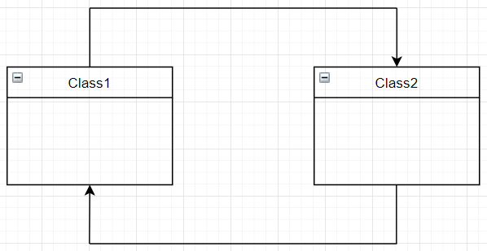

In this article, we will find something out about mediator pattern and some application of its pattern.

Let's get started.

<br>

## Table of contents
- [Given Problem](#given-problem)
- [Solution of Mediator Pattern](#solution-of-mediator-pattern)
- [When to use](#when-to-use)
- [Benefits & Drawback](#benefits-&-drawback)
- [Code C++ /Java / Javascript](#code-c++-java-javascript)
- [Application & Examples](#application-&-examples)
- [Wrapping up](#wrapping-up)


<br>

## Given Problem 



Assuming that we have two classes such as Class1 and Class2. When each class want to communicate together, it has a reference to the other classes. So, it will call other classes directly.

Then, we have some problems:
- It makes our objects to tightly couple each other.
- It makes impossible to change the interaction independently from (without having to change) the objects, and it stops the objects from being reusable and makes them hard to test.
- When each object want to communicate with many other objects, it needs to hold the reference of all objects. It makes our code to become difficult to control, and it takes resource so much.

    For example, with chat application in mobile phone, to communicate between users, each user needt to hold the connections between them, so it does not make sense because it makes reduces the usage time of mobile phone, and it makes mobile phone's CPU work permanently.

Finally, we will have some question about these problems?
- How can tight coupling between a set of interacting objects be avoided?
- How can the interaction between a set of objects be changed independently?

<br>

## Solution of Mediator Pattern

Our problems is that the tightly couples between objects. To get rid of them, we need to create a central object and its responsibility is to manage the communication between the objects.

So, Mediator pattern was born. Its intent is to define an object that encapsulates how a set of objects interacts, reducing their dependency on one another.


The implementation of Mediator pattern will do the following steps:
- We need to know exactly what the concrete objects that communicates together. Then, we create a separate Mediator object that encapsulates how a set of objects interact.

- Objects interact with a Mediator object instead of interacting with each other directly.

    This makes objects loosely coupled because they only refer to to and know about their mediator, have no explicit knowledge about each other.

<br>

## When to use
- When there are lots of entities interacting in a similar manner and those entities should be decoupled.


<br>

## Benefits & Drawback
1. Benefits

    - Decouples objects.

    - Centralizes interaction behavior.

    - Makes changing the interaction behavior easy.

2. Drawbacks

    - When the number of meditors will grow, then it will become hard to maintain them.


<br>

## Code C++ /Java / Javascript

To refer this pattern's code, we can read the [source code of Mediator pattern on Github](https://github.com/DucManhPhan/Design-Pattern/tree/master/Behavioral-Pattern/mediator-pattern/src/Java).

<br>

## Application & Examples
- The mediator pattern is used in Java libraries to implement ```java.util.Timer```. The ```Timer``` class can be used to schedule threads to run one time or repeatedly at regular intervals. The thread objects correspond to the ConcreteColleague class. The ```Timer``` class implements methods to manage the execution of background tasks.

- Java Concurrency Executor ```execute()``` method.

- ```java.lang.reflect.Method``` ```invoke()``` method.

- Java Message Service (JMS) uses Mediator pattern along with Observer pattern to allow applications to subscribe and publish data to other applications.

<br>

## Wrapping up
- The key idea in this pattern is to let objects interact with each other indirectly through a common
Mediator object that controls and coordinates the interaction.


<br>

Thanks for your reading.

<br>

Refer: 

[Design Patterns and Best Practices in Java]()